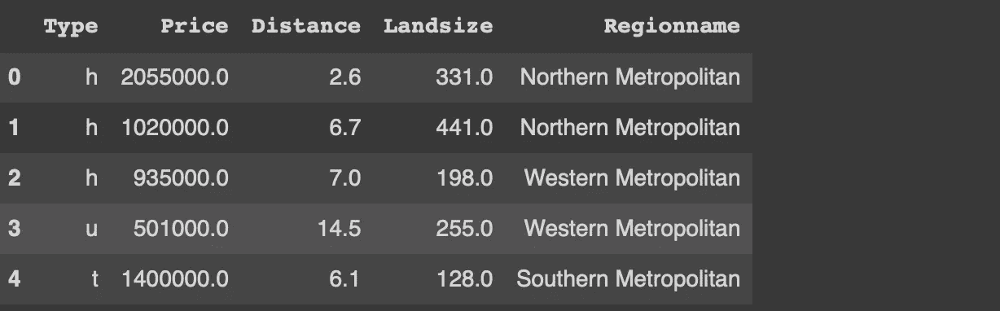

# 用 Python Altair 制作交互式可视化

> 原文：<https://towardsdatascience.com/making-interactive-visualizations-with-python-altair-7880ab5cf894?source=collection_archive---------11----------------------->

## 综合实践指南


米卡·鲍梅斯特在 [Unsplash](https://unsplash.com/s/photos/interactive?utm_source=unsplash&utm_medium=referral&utm_content=creditCopyText) 上的照片

数据可视化是数据科学的基础。如果用于探索性数据分析，数据可视化在揭示数据集内的底层结构或发现变量之间的关系方面非常有效。

数据可视化的另一个常见用例是交付结果或发现。它们比简单的数字承载了更多的信息。因此，我们经常在讲故事中使用数据可视化，这是数据科学管道的一个关键部分。

我们可以通过增加交互性来增强数据可视化的能力。Python 的 Altair 库在创建交互式可视化方面效率很高。

在本文中，我们将介绍 Altair 中交互性的基本组件。我们还将举例说明如何将这些组件付诸实施。让我们从导入库开始。

```
import numpy as np
import pandas as pd
import altair as alt
```

我们还需要一个数据集的例子。我们将使用 Kaggle 上的墨尔本房屋[数据集](https://www.kaggle.com/dansbecker/melbourne-housing-snapshot)中的一个小样本。

```
df = pd.read_csv("/content/melb_data.csv", usecols = ['Price','Landsize','Distance','Type', 'Regionname'])df = df[(df.Price < 3_000_000) & (df.Landsize < 1200)].sample(n=1000).reset_index(drop=True)df.head()
```



(图片由作者提供)

我只看过原始[数据集](https://www.kaggle.com/dansbecker/melbourne-housing-snapshot)的一小部分。read_csv 函数的 usecols 参数允许只读取 csv 文件的给定列。我还过滤了价格和土地面积方面的异常值。最后，使用 sample 函数选择 1000 个观察值(即行)的随机样本。

在数据转换和创建交互式图形方面，Altair 是一个强大的库。交互性有三个组成部分。

*   选择:捕获来自用户的交互。换句话说，它选择了可视化的一部分。
*   条件:根据选择更改或自定义元素。为了看到一个动作，我们需要将一个选择附加到一个条件上。
*   Bind:它是选择的一个属性，在选择和输入之间创建一个双向绑定。

当我们通过例子时，这些概念将变得更加清楚。

让我们首先创建一个静态散点图，然后我们将添加交互式功能。

```
alt.Chart(df).mark_circle(size=50).encode(
   x='Price',
   y='Distance',
   color='Type'
).properties(
   height=350, width=500
)
```


(图片由作者提供)

在开始交互情节之前，最好先简要介绍一下 Altair 语法的基本结构。我们首先将数据传递给一个顶级图表对象。数据可以是 Pandas 数据帧或指向 json 或 csv 文件的 URL 字符串的形式。

然后，我们描述可视化的类型(例如，标记圆、标记线等)。encode 函数指定在给定的数据帧中绘制什么。因此，我们在编码函数中写的任何东西都必须链接到数据帧。最后，我们使用 properties 函数指定绘图的某些属性。

就点而言，情节的某些部分似乎过于重叠。如果我们还可以查看属于特定类型的数据点，效果会更好。

我们可以分两步实现这一目标。第一步是添加一个带有 type 列的选择，并将其绑定到图例。

```
selection = alt.selection_multi(fields=['Type'], bind='legend')
```

仅仅添加一个选择是不够的。我们应该在选择的基础上更新剧情。例如，我们可以通过使用带有不透明度参数的 condition 属性，根据所选类别调整数据点的不透明度。

```
alt.Chart(df).mark_circle(size=50).encode(
   x='Price',
   y='Distance',
   color='Type',
   opacity=alt.condition(selection, alt.value(1), alt.value(0.1))
).properties(
   height=350, width=500
).add_selection(
   selection
)
```


(作者 GIF)

对于第二个示例，我们将创建距离和地块大小列的散点图以及价格列的直方图。直方图将根据散点图上的选定区域进行更新。

因为我们想在图上选择一个区域，所以我们需要在散点图上添加一个选择区间。

```
selection = alt.selection_interval()
```

此选择将作为选择属性添加到散点图中。对于直方图，我们将使用选择作为转换过滤器。

```
chart1 = alt.Chart(df).mark_circle(size=50).encode(
  x='Landsize',
  y='Distance',
  color='Type'
).properties(
  height=350, width=500
).add_selection(
  selection
)chart2 = alt.Chart(df).mark_bar().encode(
  alt.X('Price:Q', bin=True), alt.Y('count()')
).transform_filter(
  selection
)
```

chart1 和 chart2 变量分别包含散点图和直方图。我们现在可以组合并显示它们。Altair 在组合多个剧情或支线剧情方面相当灵活。我们甚至可以使用逻辑运算符。

```
chart1 | chart2
```


(图片由作者提供)

正如我们所看到的，直方图是根据散点图上所选的数据点进行更新的。因此，我们能够看到所选子集的价格分布。

为了更好地理解选择和条件的概念，让我们交换散点图和直方图上的角色。我们将选择添加到直方图，并使用它作为散点图的转换过滤器。

```
selection = alt.selection_interval()chart1 = alt.Chart(df).mark_circle(size=50).encode(
   x='Landsize',
   y='Distance',
   color='Type'
).properties(
   height=350, width=500
).transform_filter(
   selection
)chart2 = alt.Chart(df).mark_bar().encode(
   alt.X('Price:Q', bin=True), alt.Y('count()')
).add_selection(
   selection
)chart1 | chart2
```


(图片由作者提供)

*你可以成为* [*媒介会员*](https://sonery.medium.com/membership) *解锁我的全部写作权限，外加其余媒介。如果你已经是了，别忘了订阅*<https://sonery.medium.com/subscribe>**如果你想在我发表新文章时收到电子邮件。**

## *结论*

*天空才是极限！我们可以创造许多不同的互动情节。Altair 在向可视化添加交互式组件方面也非常灵活。*

*一旦你对交互性的元素有了全面的理解，你就可以丰富你的可视化。这些元素是选择、条件和绑定。*

*如同任何其他科目一样，熟能生巧。起初，语法可能看起来有点混乱。然而，一旦你理解了我们提到的元素之间的逻辑和联系，创建交互式的情节将变得相当容易。*

*感谢您的阅读。如果您有任何反馈，请告诉我。*