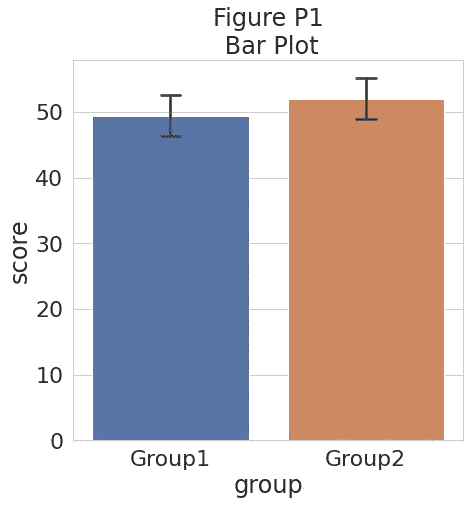
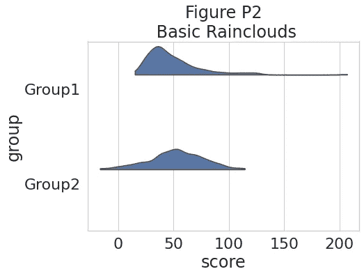
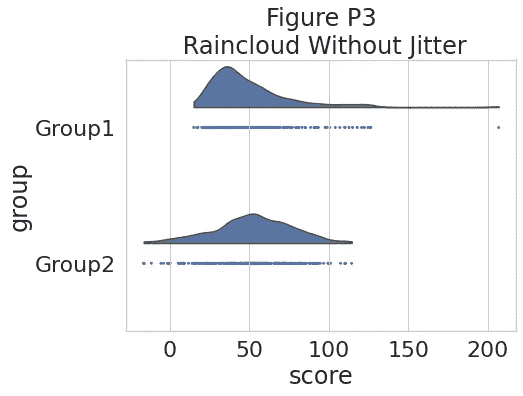
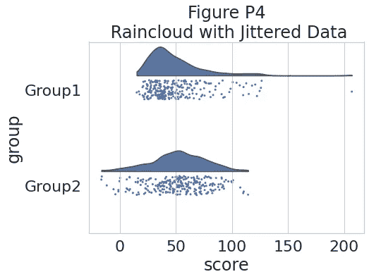
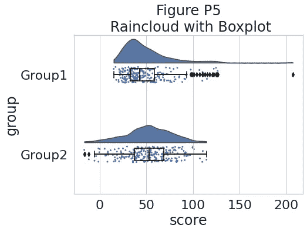
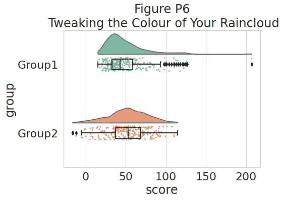

# 用雨云图让它下雨

> 原文：<https://towardsdatascience.com/making-it-rain-with-raincloud-plots-496c39a2756f?source=collection_archive---------6----------------------->

## 用 python 实现 ptitprince 库以创建健壮的数据可视化


# **什么是雨云图**

雨云图是一种直观、可靠和透明的数据可视化形式。它本质上是一个 violin + boxplot + jittered dataset 组合，通过中位数和置信区间很好地提供了原始数据、概率分布和统计推断的概览。这可以为用户提供个人观察和一般模式的信息。

要了解更多关于雨云地块的细节和背景，请阅读原文:

<https://wellcomeopenresearch.org/articles/4-63/v2>  

# 下雨了

要开始创建 raincloud 地块，必须首先导入必要的库。这个例子是从 [ptitprince 库](https://github.com/pog87/PtitPrince)构建的，这个库是由 [David Pogialli](https://github.com/pog87) 创建的。它是 raincloud plots 的 python 实现，基于 Micah Allen 的原始 R + ggplot 代码。

```
import pandas as pd
import seaborn as sns
import os
import matplotlib.pyplot as plt
#sns.set(style="darkgrid")
#sns.set(style="whitegrid")
#sns.set_style("white")
sns.set(style="whitegrid",font_scale=2)
import matplotlib.collections as cltimport ptitprince as pt
```

**加载数据**

对于这个笔记本，我们使用了 ptitprince 存储库提供的样本数据。这里有一个 google drive [链接](https://drive.google.com/file/d/1RG1gQaUlVzH3GfBlfojPZ_ztuFKF2Sm7/view?usp=sharing)用于下载个人使用的数据。

```
df = pd.read_csv ("simdat.csv", sep= ",")
df.head()
```


数据帧的头部

**探索数据**

在绘制雨云图之前，我们用一个简单的条形图来观察每个测量值的分布。

```
sns.barplot(x = "group", y = "score", data = df, capsize= .1)
plt.title("Figure P1\n Bar Plot")if savefigs:
    plt.savefig('../figs/tutorial_python/figureP01.png', bbox_inches='tight')
```



简单的条形图

**绘制云彩**

“云”是直方图的平滑版本，它将让我们了解数据集的分布情况。

```
# plotting the clouds
f, ax = plt.subplots(figsize=(7, 5))
dy="group"; dx="score"; ort="h"; pal = sns.color_palette(n_colors=1)ax=pt.half_violinplot( x = dx, y = dy, data = df, palette = pal, bw = .2, cut = 0.,
                      scale = "area", width = .6, inner = None, orient = ort)plt.title("Figure P2\n Basic Rainclouds")
if savefigs:
    plt.savefig('../figs/tutorial_python/figureP02.png', bbox_inches='tight')
```



看看我们的云

**加雨**

为了查看特定的数据点并识别潜在的异常值或其他模式，我们添加了“rain”。

*无抖动*

```
# adding the rainf, ax = plt.subplots(figsize=(7, 5))ax=pt.half_violinplot( x = dx, y = dy, data = df, palette = pal, bw = .2, cut = 0.,scale = "area", width = .6, inner = None, orient = ort)ax=sns.stripplot( x = dx, y = dy, data = df, palette = pal, edgecolor = "white",size = 3, jitter = 0, zorder = 0, orient = ort)plt.title("Figure P3\n Raincloud Without Jitter")if savefigs:plt.savefig('../figs/tutorial_python/figureP03.png', bbox_inches='tight')
```



数据点的简单一维表示

*带抖动*

```
# adding jitter to the rainf, ax = plt.subplots(figsize=(7, 5))ax=pt.half_violinplot( x = dx, y = dy, data = df, palette = pal, bw = .2, cut = 0.,scale = "area", width = .6, inner = None, orient = ort)ax=sns.stripplot( x = dx, y = dy, data = df, palette = pal, edgecolor = "white",size = 3, jitter = 1, zorder = 0, orient = ort)plt.title("Figure P4\n Raincloud with Jittered Data")if savefigs:plt.savefig('../figs/tutorial_python/figureP04.png', bbox_inches='tight')
```



添加抖动点

**添加箱线图**

为了更好地理解数据的中位数、四分位数和异常值，我们添加了一个空的箱线图。

```
#adding the boxplot with quartilesf, ax = plt.subplots(figsize=(7, 5))ax=pt.half_violinplot( x = dx, y = dy, data = df, palette = pal, bw = .2, cut = 0.,scale = "area", width = .6, inner = None, orient = ort)ax=sns.stripplot( x = dx, y = dy, data = df, palette = pal, edgecolor = "white",size = 3, jitter = 1, zorder = 0, orient = ort)ax=sns.boxplot( x = dx, y = dy, data = df, color = "black", width = .15, zorder = 10,\showcaps = True, boxprops = {'facecolor':'none', "zorder":10},\showfliers=True, whiskerprops = {'linewidth':2, "zorder":10},\saturation = 1, orient = ort)plt.title("Figure P5\n Raincloud with Boxplot")if savefigs:plt.savefig('../figs/tutorial_python/figureP05.png', bbox_inches='tight')
```



添加箱线图，覆盖抖动的数据点

**添加颜色**

我们可以设置调色板来表征这两个组。

```
#adding colorpal = "Set2"f, ax = plt.subplots(figsize=(7, 5))ax=pt.half_violinplot( x = dx, y = dy, data = df, palette = pal, bw = .2, cut = 0.,scale = "area", width = .6, inner = None, orient = ort)ax=sns.stripplot( x = dx, y = dy, data = df, palette = pal, edgecolor = "white",size = 3, jitter = 1, zorder = 0, orient = ort)ax=sns.boxplot( x = dx, y = dy, data = df, color = "black", width = .15, zorder = 10,\showcaps = True, boxprops = {'facecolor':'none', "zorder":10},\showfliers=True, whiskerprops = {'linewidth':2, "zorder":10},\saturation = 1, orient = ort)plt.title("Figure P6\n Tweaking the Colour of Your Raincloud")if savefigs:plt.savefig('../figs/tutorial_python/figureP06.png', bbox_inches='tight')
```



添加颜色

**结论**

本文概述了如何使用 python 和 ptitprince 库来创建雨云图。要更深入地使用 ptitprince 库，请查看 github 存储库:

<https://github.com/pog87/PtitPrince>  

或者查看我的存储库和 google colab 实现的链接:

<https://github.com/chags1313/raincloud_colab>  <https://colab.research.google.com/drive/10UObYNGsepQgaCswi6l1cOy0CxQdr3Ki?usp=sharing>  

感谢您的阅读！