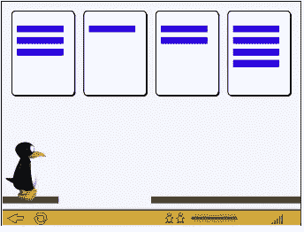

# 用柠檬做柠檬水:仔细观察一个产品的特征，了解它的有效性

> 原文：<https://towardsdatascience.com/making-lemonade-from-lemons-taking-a-closer-look-at-a-products-features-to-understand-its-6227b4eca168?source=collection_archive---------36----------------------->

照片由[南茜薇](https://unsplash.com/@eowyn1202?utm_source=unsplash&utm_medium=referral&utm_content=creditCopyText)在 [Unsplash](/s/photos/lemonade?utm_source=unsplash&utm_medium=referral&utm_content=creditCopyText) 上拍摄

## 评估基于游戏的数学程序的成功

**背景:** ST Math 是一个基于游戏的数字数学项目，面向学前班到八年级的学生。开发者和教育工作者投入了 4 年时间和 300 万美元来评估一学年中每周 50 分钟的参与会如何影响玩家的数学技能。一个学术研究小组查看了玩家的标准化考试成绩，比较了治疗组和对照组在测试前和测试后的数学水平——结果发现差距很大。你可以在这里阅读更多相关信息[。](https://escholarship.org/content/qt8p87p4cf/qt8p87p4cf.pdf)

没有统计学意义的结果是不好看的。但对于一家试图向学校出售其软件的公司来说，这种结果可能是一记丧钟。

此外，这种结果是不明确的，就像一个黑盒或一个沉默的狮身人面像。显然，我们没有得到“正确的”但是我们是否部分正确呢？走上正轨？如果有的话，什么需要优化？大修？一个人留下？一个普遍的“空”不提供任何线索。我们需要打开黑匣子的锁，欺骗斯芬克斯——梳理出更多的数据，以便我们能够理解为什么我们没有找到预期的结果，并决定如何前进。

**挑战:**发现玩家的 ST 数学经历中发生了什么。

幸运的是，我们有额外的信息！

Sebastian Herrmann 在 [Unsplash](/s/photos/frustration?utm_source=unsplash&utm_medium=referral&utm_content=creditCopyText) 上拍摄的照片

**当创意遇到数据…**

其他研究人员寻找对整体标准化数学成绩的影响(没有发现)。总分是学生所有数学评估的平均值，或者说是“报告组”每个报告组都有自己的分数，报告组的类型和数量因年级而异。这些报告群集描述了特定的数学技能，如数字感觉、代数与函数、测量与几何、统计、数据分析与概率。

**找到了！时刻**

如果我们更深入地研究总体得分并分析每个报告组，会怎么样？也许 ST Math 的影响局限于一个或几个集群，这些重要的结果被其他集群的分数“淹没”…

可能是玩家在测量和几何技能上提高了很多，但在其他报告集群上没有任何提高。当您对所有这些进行平均时，您可能仍然会得到一个总体为空的结果。就像在一个大水桶里加入几滴水一样，你可能不会察觉到桶里水的总量有任何差异。

我们比较了每个报告集群的治疗组和对照组的前后得分，我们是对的！之后，治疗组玩家的数字感觉分数明显高于之前。

[粘土银行](https://unsplash.com/@claybanks?utm_source=unsplash&utm_medium=referral&utm_content=creditCopyText)在 [Unsplash](/s/photos/happy-dance?utm_source=unsplash&utm_medium=referral&utm_content=creditCopyText) 拍摄的照片

**现在怎么办？**

我们的下一个任务是找出原因。为什么玩家的数字感分数会暴涨？为什么学生的分数在其他报告集群中没有增加？

数字感是一种建构——一组允许个人与数字打交道的技能。这个结构中的技能包括(但不限于):理解概念，比如多理解*多理解*少理解*多理解*；理解表示数量的符号；按顺序排列数字；等等。数字感通常被描述为数学学习的基础

如果我们观察 ST 数学程序中的每一个游戏，确定它们引入了哪些技能，以及它们如何支撑玩家的掌握，会怎么样？也许我们可以理解 ST Math 是如何支持数字感的。那么我们可以建议开发人员复制有效的方法。这将减少未来游戏开发中花费在旋转轮子上的时间。

我们评估的旧 ST 数学版本的屏幕截图

**奥运会的定性编码**

四个研究员(还有很多咖啡！)按技能编码 ST Math 的 1000+级课程。例如，当一个游戏使用数字作为对象时，我们选中了“数字感”框，因为这支持玩家理解符号代表数量。当一个游戏提供了数字线时，我们选中了“数字感”框，因为它支持玩家按顺序排列数字的能力。或者，当一个游戏包含作为对象的数字表示时，我们选中“数字感”框(如上图所示)。

最后，我们发现程序中的每个游戏，包括旨在支持其他报告集群的游戏，都培养了数字感觉技能。这就是 ST Math 如何支持数感——通过将它整合到程序的每个方面。

**还有结果！**

通过深入挖掘我们客户的数据和产品，我们能够发现可行的见解，并重新构建最初令人沮丧的零功效叙事。

事实上，我们的项目是如此成功，以至于教育科学研究所在他们[资助复制研究](https://blog.mindresearch.org/blog/st-math-ies-investigation)的声明中提到了我们。这个第三方的建议给 ST Math 带来了很大的可见度，更重要的是，它赋予了之前的评估结果所否认的东西:合法性。

观察游戏中的特定设计元素可以告诉你很多关于你的产品是如何工作的，以及你的产品可能会有什么预期效果。将这些多种方法结合起来可以节省你大量的时间和头痛

前进！

[*卡特琳娜·申克博士。*](https://katerinaschenke.com/) *是*[*Katalyst Methods*](https://www.katalystmethods.com/)*的创始人和负责人，也是*[*ed tech Recharge*](http://edtechrecharge.com/)*的联合创始人，在那里她与教育媒体公司合作设计和评估游戏、软件和评估。她还与关注学习的组织合作，如脸书、互联学习实验室和联合国儿童基金会，开展研究项目，帮助他们改善教育政策和实践。了解更多请点击【katalystmethods.com】*