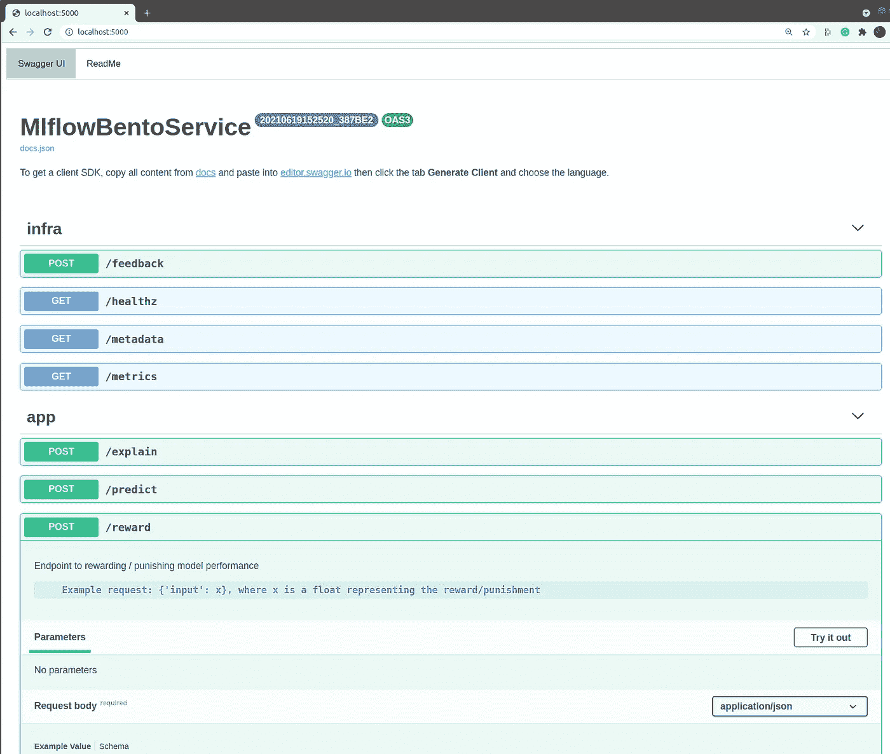
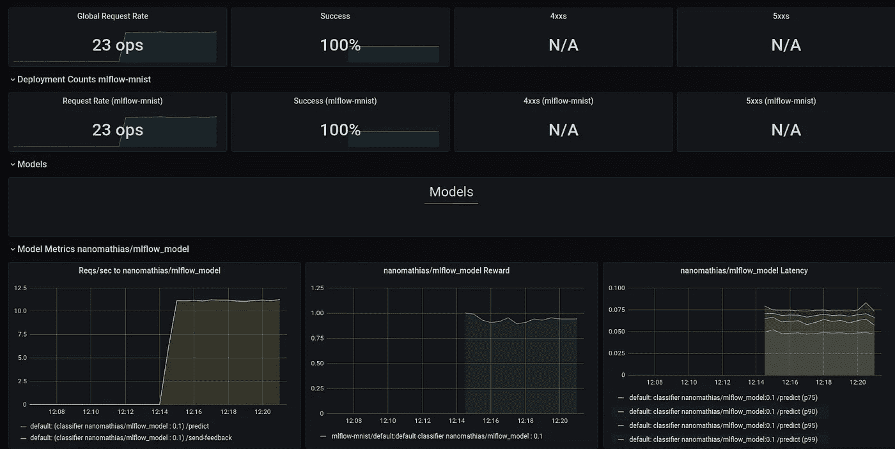

# 让最终用户轻松使用 MLOps

> 原文：<https://towardsdatascience.com/making-mlops-easy-for-end-users-a3c22491e5e0?source=collection_archive---------20----------------------->

## 使用开源工具简化 MLOps 的教程

由 pch.vector & pikisuperstar 创建的人物向量—[www.freepik.com](https://www.freepik.com/free-photos-vectors/people)

当人们说“MLOps”时，很难弄清楚 T2 指的是什么。即使对于一个技术人员来说，弄清楚如何正确地*做* MLOps，可能更加困难。那么，对于一个对 web 技术、Kubernetes、监控、云基础设施等一无所知的公民数据科学家来说，做 MLOps 会有多难呢？？在这里，我将继续探索如何为此目的建立一个开源的 MLOps 框架:具体来说，我将概述并展示 Databricks、mlflow 和 BentoML 的组合如何为最终用户提供一个引人注目、可扩展且易于使用的 MLOps 工作流。

我之前已经讨论过 MLOps 框架必须包含电池并支持广泛的功能列表；模型生命周期管理和治理、监控、A/B 测试、可解释性、漂移/异常值检测，等等。但是，作为最终用户:

> 我只想定义一个给定的 python 接口，按下一个大的绿色按钮，并获得一个 REST 端点 URL，在那里我可以与我部署的模型进行交互。

在这一系列博客文章的第一部分中，我探讨了 Databricks 如何与 Seldon-core 相结合来检查我所看到的部署和运行 MLOps 的大部分需求；然而，Seldon-core 的开源产品对最终用户来说相当麻烦，而且不符合简单性的愿景；写一个 python 类，按下按钮，得到 REST 端点。这篇文章是我上一篇文章的延伸，所以我推荐看看:

</get-started-with-mlops-fd7062cab018>  

## 我们在看什么工具

Databricks 涵盖了 ML 模型生命周期管理的从实验、跟踪、版本化、注册和治理的所有内容，同时是按需付费的，没有前期成本，对普通数据科学家来说入门的障碍最小。在这篇文章中，我们将关注 BentoML 将帮助我们部署任何注册到 mlflow 模型注册表中的 REST 端点的下一步——我们将不得不做一些黑客工作来让这些工具很好地配合使用😏。再次检查[第一部分](/get-started-with-mlops-fd7062cab018)，了解数据块中 MLOps 的详细信息。

# 步骤 1:最终用户看到的内容

从第一篇博文开始，我们可以说我们已经训练了:

*   MNIST 分类的标准 Keras 模式
*   一种检测输入数据中特征漂移的算法
*   一种检测输入数据中异常值的算法
*   解释我们预测的综合梯度算法。

大多数数据科学家至少会熟悉以上几点中的一点。让我们将所有这些模型保存到本地磁盘的`artifacts/mnist-keras`文件夹中:

我们希望将所有这些模型放入一个简单的 python 类中，并将其注册到 mlflow 模型注册表中。本质上我们希望这个类做所有的事情；返回预测、返回解释、定义要监控的指标等。因此，我们告诉最终用户将模型放入如下界面:

这里有几点需要注意:

*   该类继承自`mlflow.pyfunc.PythonModel`，因此可以登录到 mlflow 模型注册中心，在那里我们可以控制治理，拥有多个版本，将版本转换到不同的阶段，等等。
*   `predict`、`explain`和`reward`方法用 BentoML 端点定义修饰，以表明这些是我们希望公开的 API 端点。当然，可以添加额外的端点。注意 mlflow 不知道这些 BentoML 装饰器是做什么的。
*   方法`prepare_input`定义了如何处理输入数据；这是必要的，因为 BentoML 支持微批处理；也就是说，如果一百万个单独的请求同时到来，那么为了提高效率，它会创建批处理来同时通过模型。
*   每次调用`predict`时，该方法都会自动计算并记录这些样本的漂移和异常值结果到 [Prometheus metrics](https://github.com/prometheus/client_python) 中——当然，如果我们可以异步计算并记录这些结果，那将是理想的，但是在大多数用例中，这些计算并不昂贵，并且我们通过将它们保留在`predict`方法中，赢得了很多简单性。

既然我们已经定义了模型，我们希望将它记录到 mlflow 模型注册表中，与保存所有模型的本地目录(`artifacts/mnist-keras`)和描述 python 环境&包的字典放在一起。mlflow UI 可以帮助完成部分工作，但我们也可以完全用代码来完成:

就这样，现在我们已经将与 MNIST 模型相关的所有内容(预测器、解释器、漂移和异常值检测器)放入一个 mlflow 模型中，并将该模型注册到我们的注册表中，并将其过渡到“生产”阶段。

但是还没有部署任何东西。因此，在下一节中，我们将看看是否可以使用 BentoML 在 mlflow 的“生产”阶段自动部署所有内容的一些代码原型。

# 第二步:幕后

在幕后，我们希望运行一个服务，该服务不断检查新模型是否已经进入模型注册中心的“生产”阶段，并确保所有这些模型都被实际部署。为了执行部署，我们将使用 BentoML，它允许我们包装 mlflow 模型对象，并将它们封装到 docker 映像中。因此，本节中的所有内容应该是完全通用的，并且发生在后端，没有任何用户交互。

## 步骤 2.1:用 BentoML 包装 mlflow

首先，我们必须为 BentoML 定义一个“工件”,在本例中，这个工件就是我们的 mlflow 模型。假设我们已经从 mlflow 模型注册中心下载了一个模型，我们可以创建一个工件，让 BentoML 将本地目录的内容复制到 BentoML 容器中(`save`)，并指示 BentoML 如何加载模型(`load`):

用于加载 mlflow 模型工件的 BentoML 工件。作者代码。

现在我们有了一个工件，接下来，我们需要定义一个 BentoML“服务”，它将我们在 mlflow 模型上公开的所有端点也在 BentoML 上公开。为此，我们侵入`_config_artifacts`方法，该方法在 BentoML 服务的每个实例化时被调用，然后在 BentoML 服务上动态添加来自 mlflow 模型的任何 API 方法。

用于将 mlflow 端点公开为 BentoML 端点的 BentoML 服务。作者代码。

本课程的注意事项:

*   它有一个装饰器，详细说明了它如何依赖于一个`MlflowArtifact`
*   它也依靠一个`environment.yml`来描述康达环境
*   它调用`_config_inference_apis`将 mlflow 方法添加到 API 中

这样，我们现在可以创建一个简单的函数，该函数获取模型注册中心中的任何 mlflow 模型，下载它，并将其打包到 BentoML 服务中，即类似于以下内容的东西:

从模型注册表下载 mlflow 模型

这将在本地保存一个`MlflowBentoService:latest` BentoML 服务。然后，我们可以运行以下命令，将 BentoML 服务放入 docker 映像中:

将 BentoML 服务放入 docker 映像的 Bash 命令。作者代码。

我们现在有了一个`bentoml-mlflow-mnist-keras` docker 映像，它包含了我们的模型，并准备好进行部署。我们可以通过在本地运行 docker 映像来测试它是否工作正常:

用于本地测试 BentoML docker 映像的 Bash 命令。

转到`localhost:5000`,我们现在应该会看到一个 swagger API，它暴露了我们所有的端点，准备好接受请求。目前为止一切正常。

## 步骤 2.2:自动部署

下一步是将注册中心中注册的任何 mlflow 模型自动部署到一些云基础设施中。BentoML 允许您部署在许多不同的基础设施上，但是我们将假设我们已经建立了一个 Kubernetes 集群；参见[第一篇博文](/get-started-with-mlops-fd7062cab018)中的例子。

本质上，我们需要一个服务来保持 mlflow 模型注册与部署到 Kubernetes 的同步。我们可以把它想象成:

*   每隔 *X* 分钟运行一次 API 请求以在 mlflow 注册表中列出模型并部署它们的服务。
*   使用 Databricks 模型注册中心(目前为私有预览版)中的 CI/CD webhooks，在注册模型后立即部署模型。

一旦在注册表中找到一个新模型，就需要进行以下操作:

*   下载 mlflow 模型，并将其打包成一个 BentoML docker 映像，类似于上一节所示。
*   将 docker 映像推送到存储库(例如，DockerHub、ACR 等)。)
*   创建一个 Kubernetes 部署`yaml`并应用

这种实现的细节取决于我们将部署到的特定基础设施。尽管如此，我们仍然可以快速编写一个过于简化的 python 函数示例，该函数获取 Kubernetes 部署的模板，填写模型细节，然后应用部署。

用于读取 Kubernetes 模板文件的过于简化的 python 方法&应用它。作者代码。

用于部署 BentoML 映像的过于简化的 Kubernetes 模板。作者代码

适当的实现还可以添加一个特定的入口路由，这样模型就可以在给定的自定义域路由(例如`www.myexample.com/model-name/`)上提供 Swagger UI API

## 结果

[BentoML 文档](https://docs.bentoml.org/en/latest/guides/monitoring.html)展示了我们如何将 Prometheus 安装到我们的集群中，并为我们所有部署的模型自动抓取`metrics/`端点。基于此，如果我们还在集群上安装了 Grafana，我们可以让我们的自动部署创建如下所示的控制面板:

Grafana dashboard，最终用户可以对其进行定制，以包含我们记录的任何指标。作者截图

## 最后的想法

在这篇文章中，我们使用 mlflow 和 BentoML 拼凑了一个简单的 python 类。该类提供了实现定制模型的充分灵活性，定制模型具有要监控的漂移和异常值的定制度量，以及用于解释或奖励模型预测的定制端点。这个类的美妙之处在于，不管模型细节如何，我们都可以将它注册到 mlflow 模型注册表中，然后创建一个服务，自动将其部署到生产中。

概述的解决方案很容易扩展到包括附加功能。例如，我们可以在 mlflow 模型上创建额外的“配置”选项，这些选项将确定使用哪个基础 docker 映像进行部署、在哪个基础架构上进行部署(在多个集群的情况下)、向数据块发送重新训练请求(例如，当漂移或回报降低到阈值以下时)，或者甚至如何部署 A/B 测试。

这个设置中必须实现的一个重要组件是从 mlflow 到 Kubernetes 集群的权限同步。也就是说，只有对 mlflow 注册表中的模型具有读取权限的用户(可以通过 UI 来控制)才应该具有调用最终端点的权限。

像这样的框架是引人注目的。它允许数据科学家专注于模型开发，然后通过监控、治理等快速将模型投入生产。，在此过程中无需咨询数据/云工程师。