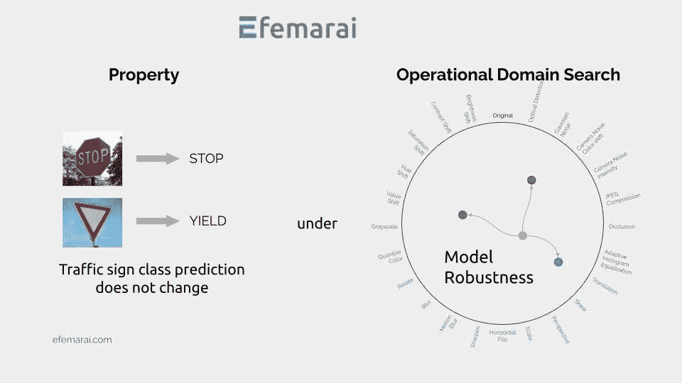
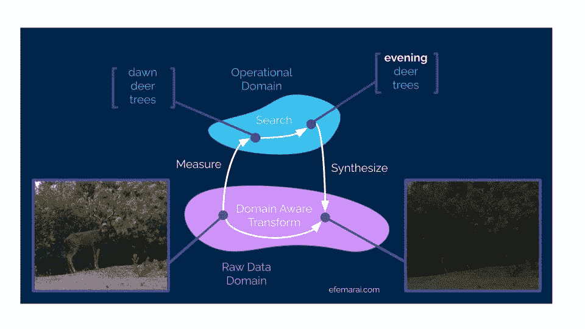
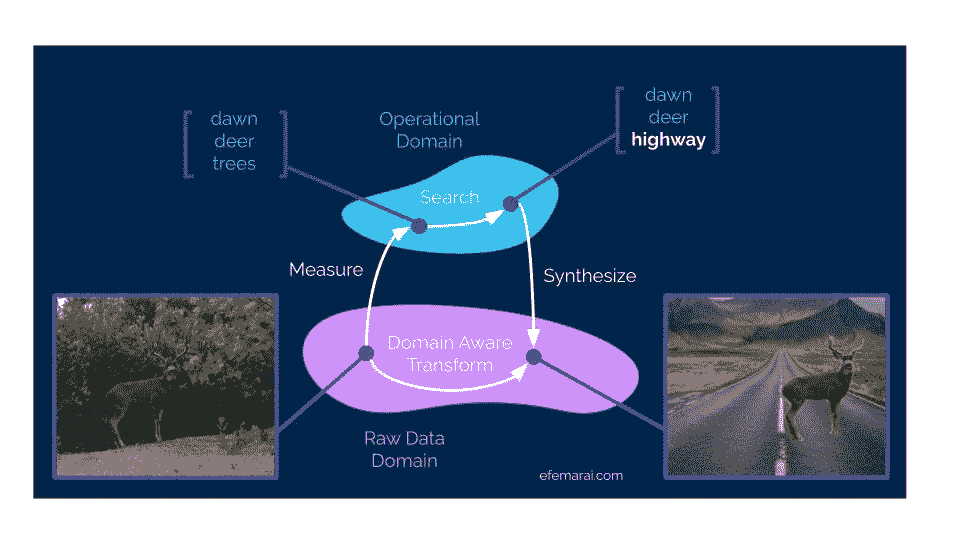
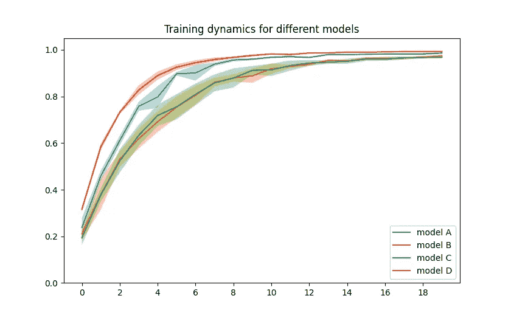
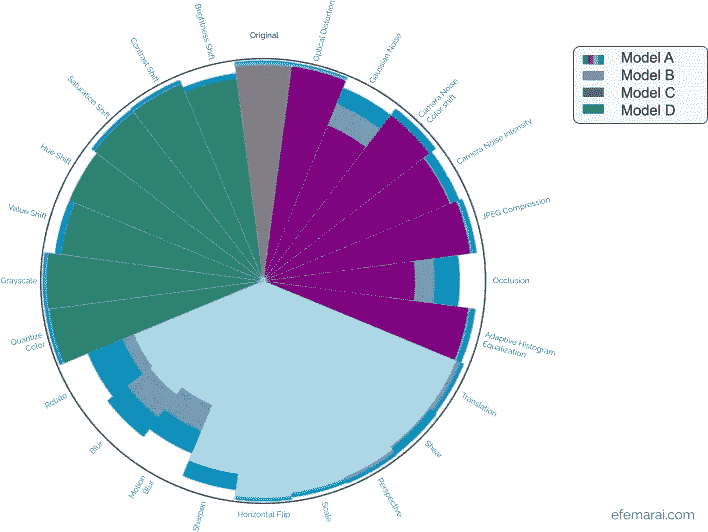

# 让人工智能模型更强大更高效

> 原文：<https://towardsdatascience.com/making-models-more-robust-more-efficiently-e8737178452c?source=collection_archive---------16----------------------->

## [行业笔记](https://towardsdatascience.com/tagged/notes-from-industry)

## 将机器学习模型部署到现实世界容易发现领域覆盖问题。一种使模型稳健的方法是生成看不见的数据，而模型需要处理这些数据。基于属性的测试可以解决这个问题！

基于属性的测试旨在维护给定操作域的某个属性，允许我们估计模型的健壮性。图片作者。

在[上一篇关于测试](/why-dont-we-test-machine-learning-as-we-test-software-43f5720903d)机器学习模型的文章中，我们研究了软件测试和如何在 MLOps 领域中使用这些策略之间的相似之处。我们表明，基于静态数据集的评估模型性能的方法不足以全面检查高维空间中模型的准确性。更深入了解模型稳健性的一种方法是通过基于属性的测试等方法，这些方法根据某些规范合成输入数据，以打破模型！

## 但是测试如何能使你的模型在训练时更加健壮和有效呢？

首先，让我们从谈论预期的操作域开始。换句话说，我们期望我们的输入来自哪个数据域——我们期望观察到什么类型的变化、约束、极值？例如，在计算机视觉领域，我们可以开始描述一天中的时间、气象条件，甚至关于观测本身的属性——物体的大小和类型，它们如何变化以及什么需要保持固定。

这允许我们定义变化轴，或数据的不同可变性。对于一个很少数字输入的小问题，很容易找到一个导致模型性能差的变换输入。但是，如果输入是一个图像，我们该如何做呢？假设我们想将白天的图像转换成夜晚的样子。

在[的上一篇博文](/why-dont-we-test-machine-learning-as-we-test-software-43f5720903d)中，我们谈到了将数据样本从数据域转换到运营域，沿着时间轴执行更改，然后再转换回数据域。在下图中，我们可以看到一只鹿的图像，它的整个身体被捕捉到，头和鹿角朝向我们。我们可以列举描述图像的其他属性，例如它是在黎明时拍摄的，它包含了背景中的各种灌木和树木，等等。

我们可以将一天中的时间属性从黎明改为傍晚。作者配图。

如果我们想确保我们的汽车，在州内高速公路系统中行驶，能够识别鹿，并且不管一天中的时间或假设的背景如何，它都能这样做。这意味着我们现在可以改变这些属性，并评估模型的整体稳健性。在工业应用中，收集的数据将最大化以尽可能覆盖模型的操作域。然而，在最好的情况下，观察跨越整个操作领域的数据是不切实际的，在最坏的情况下也是不可能的，这导致部署的机器学习算法从未在该领域的一些领域中被评估。数据的过度收集不仅会导致管理问题、增加注释成本，还会导致算法迭代变慢。如果我们不能明确地列举数据域，那么推断我们期望 ML 模型在其中工作的操作域就容易得多。

在这种情况下，我们将对象的背景从树木改为公路。作者的图表和 Sebastian Palomino 的照片。

在每个培训阶段结束时，ML 模型需要在部署到相应的操作域之前进行测试。然而，在 Efemarai，我们认为鲁棒性评估不需要在 MLOps 周期结束时进行，而是可以作为培训管道的一部分进行整合。

## 测试平台

[Efemarai](https://efemarai.com) 是一个测试和强健 ML 模型的平台。它的工作原理是在问题的操作域中找到导致模型性能不佳的边缘案例。它使开发人员能够轻松地将他们现有的 ML 资产(模型、数据、代码)与规范和测试相集成，以发现这些健壮性问题。

因此，您可以获得一个健壮性覆盖图，使开发人员能够沿着多个轴(与行业标准准确性、f1 分数、混淆矩阵等一起)监控进度，以获得对部署模型的信心，并为非技术利益相关方(如业务领导、经理、用户和监管机构)提供见解。

例如，UI/UX 设计师可以利用这些见解引导用户走上一条人工智能模型运行良好的道路，并将遇到问题的几率降至最低。

此外，产生的具有边缘情况的新的合成数据集对 ML 模型的性能具有直接影响。它有多种用途，在本文的其余部分，我们将说明如何将这些边缘案例样本添加到训练数据集中，不仅对准确性和 f1 分数，而且对模型的整体稳健性产生直接和可测量的影响。与穷举搜索相比，它加快了迭代和训练时间，从而最小化了所需的资源。

## ML 模型鲁棒性挑战

汽车行业和资产管理中的一个常见问题是识别交通标志。对于那些在现实世界中可以观察到的任何扰动，从一天中的时间、准确的前景、观察角度到天气条件或规模，都必须极其准确和稳健。

让我们使用德国交通标志识别基准数据集，并尝试在最少的时间内训练最鲁棒的模型。因此，我们将对领域覆盖健壮性和训练速度进行基准测试。

我们将使用相同的 ImageNet 预训练模型测试以下条件:

*   a:没有任何额外扰动和变换的有效网络模型；
*   b:用[自动增强](https://pytorch.org/vision/master/transforms.html?highlight=autoaugment#torchvision.transforms.AutoAugment)训练的高效网络模型；
*   c:用所有可能的扰动和变换训练的有效网络模型；
*   d:使用 Efemarai 平台生成的附加数据，在没有额外扰动和转换的情况下训练的 EfficientNet 模型。

## ML 鲁棒性结果

让我们首先强调现代神经网络作为通用特征近似器的巨大能力，因为在所有情况下，模型都达到了 97%以上的准确度。这也显示了一些问题，比如一项新技术可能会改善百分之零点几的结果，但很难评估现实生活中可能会导致什么样的改善。这正是领域覆盖图可以提供帮助的地方。

但首先，让我们从达到的准确度和训练时间开始:

*   模型 A: 98.6%，2 分 0 秒，20 个周期
*   B 型:97.4%，2 分 22 秒，20 个周期
*   模型 C: 97.0%，20 个周期 8 分 20 秒
*   模型 D: 99.3%，20 个周期 3 分 34 秒
*   D 型*: 98.6%， **15 个周期**2 分 40 秒

不同车型的训练力度。图片作者。

从上述结果中，我们可以看到所有模型都表现良好，并且添加不同的扰动在某些情况下可以显著增加训练时间(2 分钟对 8 分钟以上)。使用 Efemarai 平台数据的 D 型在 3 分 30 秒内达到最高精度。如果我们尝试匹配第二好的模型的准确性，它将花费少于 25%的时期，并且将几乎匹配最快的训练模型的墙时间。相比之下，它比使用所有增强功能快近 3 倍。这突出表明，针对模型表现不佳区域的智能转换对整体性能的影响要比统一采样的盲增强高得多。

现在让我们看看健壮性覆盖图。

域覆盖图。图片作者。

上面的径向图显示了每个模型在特定扰动下的稳健性水平。目标是最大程度地鲁棒并完全填充相应的切片。我们有颜色分组扰动，基于它们的类别，如几何的，颜色的，或本质上基于噪声的。

首先，我们要强调的是，经过零转换训练的原始模型 A 非常容易受到在数据集中看不到的扰动的影响！业绩下降 30%以上。考虑操作领域是将模型从开发过渡到部署的一个非常重要的步骤，尤其是影响业务度量的情况。

在几何和一些基于噪声的扰动方面，使用 Efemarai 平台训练的模型 D 的鲁棒性有了显著提高，并显示出整体最佳的鲁棒性。它将性能最低的案例从大约 50%提高到 80%以上，这是一个显著的改进！

值得注意的是，即使训练时间比模型 c 少 3 倍，ML 模型 D 的稳健性的额外数据也能带来多大的改善。

平台的使用和生成的看不见的数据导致模型性能的直接改进、在与用户操作期间观察到的更少的极限情况，以及对需要收集什么类型的数据的理解。在下一篇博文中，我们将展示这个平台的另一种用途。

## 结论

在模型开发过程中考虑模型的健壮性，与在部署前最后一步评估模型相比，在迭代速度和达到的性能方面有巨大的回报。我们已经表明，使用基于属性的测试平台进行机器学习，如 Efemarai，可以产生更好的模型，更深入地了解性能，并在部署这些模型时更有信心。

## **关于作者**

我是 Efemarai 的首席技术官兼联合创始人，这是一家早期初创公司，为测试和调试 ML 模型和数据搭建了一个平台。通过我们的平台，机器学习团队可以跟踪回归，监控改进，并满怀信心地交付他们的 ML 解决方案。

在硅谷和欧盟投资者的支持下，我们正在为人工智能世界带来质量保证，并释放出新的 ML 应用程序的寒武纪大爆发！

如果你想联系我们，请发邮件至 team@efemarai.com