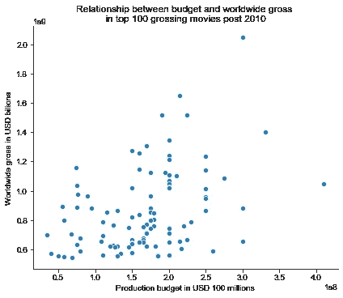
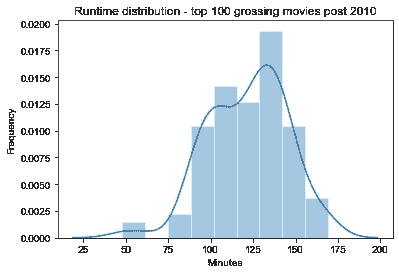
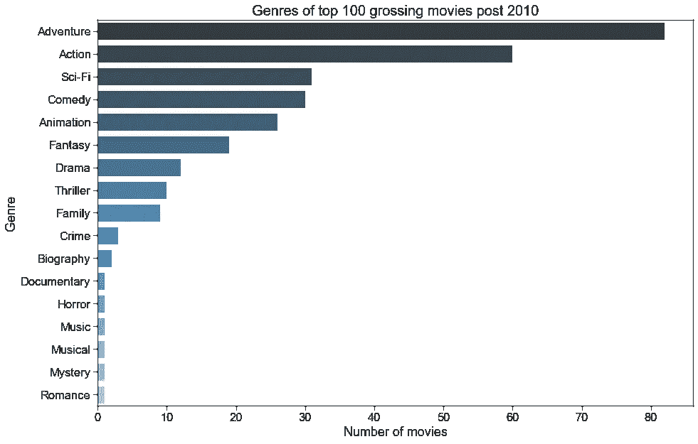
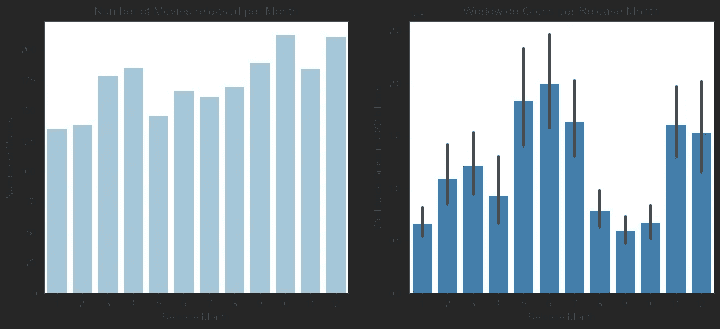

# 制作电影

> 原文：<https://towardsdatascience.com/making-movies-a68fc0f0852e?source=collection_archive---------82----------------------->

## 使用探索性数据分析，提供商业建议，帮助新电影工作室的高管实现利润最大化

克里斯特·卢哈尔斯在 [Unsplash](https://unsplash.com?utm_source=medium&utm_medium=referral) 上的照片

在这篇博文中，我将向非技术受众描述我完成的项目。对于代码，我鼓励你看看我的 [GitHub 库](https://github.com/nadinezab/making-movies)。

# **问题陈述**

一家新电影工作室的高管们正在寻求可行的见解，以最大限度地提高投资回报，并确保制作出成功的电影。

# **商业价值**

“复仇者联盟 4：终局之战 12 亿美元的首映周末是电影史上最大的”——Vox，2019 年 4 月。

“票房猫-tastrophe:猫预计损失 7000 万美元”——《卫报》，2019 年 12 月。

从这两个对比鲜明的标题中，我们看到进入电影业对我们的利益相关者来说是一个高风险/高回报的冒险。有潜力，但需要确保“正确”的电影。通过数据分析，我们将寻求提供建议，以最大化成功的机会。

# 数据

本项目使用的主要数据来自两个来源。

来自 IMDB 的数据包括 146，144 个条目，以起始年份、运行时间和流派作为关键特征。

来自数字的数据包括 5，782 个条目，以发行日期、生产预算、国内总收入和全球总收入为主要特征。

我们还删除了维基百科中与网飞原创电影相关的数据。

# 方法学

第一阶段集中于数据准备，包括:
-导入库
-读取并清理提供的数据
-处理缺失值
-连接数据集
-抓取额外的数据并清理它

第二阶段集中于可视化和洞察，包括:
-在适用的情况下实施特征工程
-创建可视化
-得出结论
-提供建议

# **挑战**

第一个挑战是决定什么是成功的电影。我看了两个指标利润(全球总收入减去预算)和利润率(利润超过收入)。我发现最赚钱的电影是你所期待的动作/冒险大片。然而，利润率最高的电影大多是小成本的恐怖片。我们注意到，电影业因使用不透明的会计方法而臭名昭著，使用这样的指标我们不太可能获得准确的财务状况。我们没有考虑其他形式的收入，包括商品和 DVD 销售，也没有考虑其他成本，包括延期支付人才。由于不明确，我们将全球总收入作为衡量成功的标准。

第二个挑战是结合来自两个不同来源的数据。IMDB 的数据有相关的细节，如运行时间，类型和发行日期，而来自-numbers 的数据有全球总收入和预算数字。然而，在两个源之间没有唯一的电影标识符，因此唯一的选择是使用电影名称，即字符串来合并数据帧。这并不理想，因为字符串对间距、标点符号很敏感。此外，在电影同名的情况下，存在错误匹配的风险。如果有更多的时间，我们会探索其他的方法。

# 调查结果和建议

《T2》的制作预算和全球票房之间没有明显的关联，2010 年后票房收入最高的 100 部电影的预算从 3500 万美元到 4 . 1 亿美元不等。

作者图片

如前所述，公开可用的财务信息有限，需要进一步分析以帮助确定最佳预算。

根据我们的数据，一部电影的平均 T4 时长为 100 分钟。然而，当具体查看票房前 100 名的电影时，运行时间更长，为 120 分钟。我们建议将目标定为 2 小时的电影，因为这对电影观众来说似乎是合适的时间长度。

作者图片

我们接下来研究了**流派**。每部电影被指定了三种类型。在 2010 年后票房前 100 的电影中，我们看到超过 80 部被描述为冒险电影，60 部被认为是动作片。因此，以动作/冒险电影为目标是明智的。然而，我们发现这类电影的制作成本平均要高出 4500 万美元。其他值得考虑的类型是科幻、喜剧或动画。

作者图片

最后，我们看看电影是什么时候上映的。与票房收入最高的电影相关的**上映月份**是 5 月/6 月，夏季大片季的开始，以及 11 月/12 月，与假期相一致，并为新年的奖项进行了优化。电影工作室应该致力于在这两个时期中的一个时期发行他们的电影。

作者图片

作为最后一个考虑，虽然我们的利益相关者没有明确要求，但随着网飞等平台的崛起，调查电影的**在线发行可能是值得的。我们简要检查了网飞的原创电影，发现喜剧/剧情片非常突出(相对于动作/冒险片)。这是有道理的，因为动作/冒险电影更适合受益于大屏幕和更身临其境的体验的票房。我们还发现，网飞原创电影的平均时长为 99 分钟。**

# 未来的工作

作为后续步骤，我们将积极开展以下工作:

*   进一步的财务分析(例如，如何分配预算)
*   顶级创意人才调查(导演、制片人、演员)
*   评论的情感分析(洞察消费者偏好和趋势)
*   剧本来源分析(如小说改编)

我希望你觉得这个项目审查有趣。如果你想了解更多，请访问我的 [GitHub 知识库](https://github.com/nadinezab/making-movies)，里面有 Jupyter 笔记本和一个非技术演示。