# 用人工智能技术实现我孩子的飞行梦想

> 原文：<https://towardsdatascience.com/making-my-toddlers-dream-of-flying-come-true-with-ai-tech-82881eac01b8?source=collection_archive---------40----------------------->

## [实践教程](https://towardsdatascience.com/tagged/hands-on-tutorials)

## 使用姿势估计模型、使用亚马逊 SageMaker JumpStart 构建的对象检测模型、手势识别系统和在 NVIDIA Jetson AGX Xavier 上运行的 OpenGL 编写的 3D 游戏引擎，我构建了 Griffin，这是一个让我的蹒跚学步的孩子在幻想的 3D 世界中用身体像鹰一样飞翔的游戏。

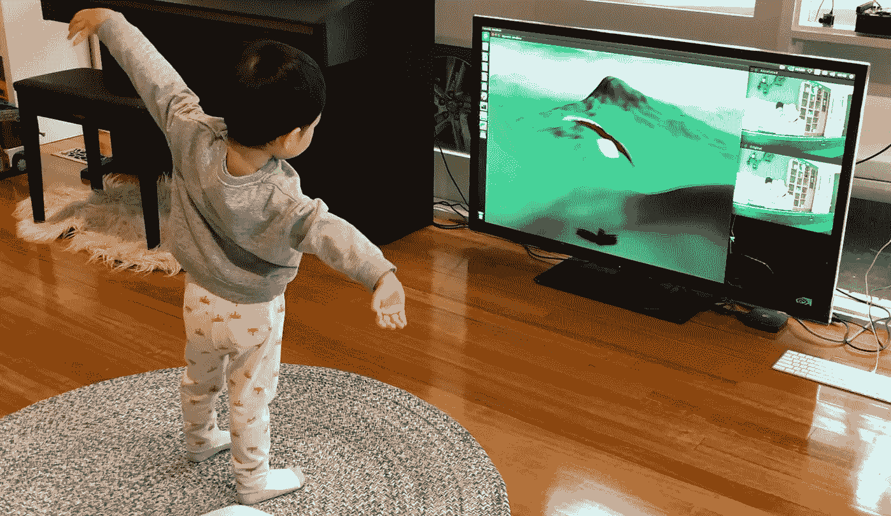

我和我老婆有一个超级好动的 2.5 岁男孩，叫德协。他喜欢动物，他最喜欢的动物之一是老鹰——他经常在房子周围巡游，假装像老鹰一样飞翔。

最近，我还收到了 NVIDIA 的 NVIDIA Jetson AGX Xavier，因为我的 [Qrio 项目](/building-a-bot-that-plays-videos-for-my-toddler-597330d0005e)赢得了本月的 Jetson [项目](https://news.developer.nvidia.com/jetson-project-of-the-month-qrio-an-interactive-ai-bot/#:~:text=Agustinus%20(Gus)%20Nalwan%20was%20awarded,his%20interactive%20AI%20bot%2C%20Qrio.&text=Furthermore%2C%20Gus%20found%20Jetson%20Nano's,bot's%20avatar%20in%20real%2Dtime.)，这是一个为 Dexie 说话和播放 YouTubeKids 视频的机器人。它包括强大的硬件和强大的 GPU，这使它成为这个计算密集型项目 Griffin 的完美硬件平台。

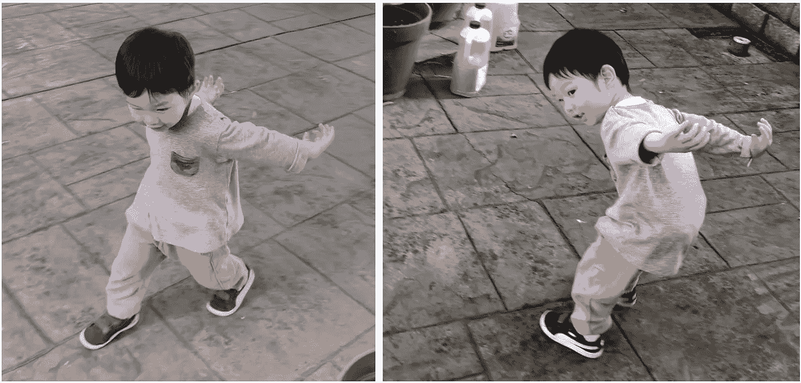

德西假装像鹰一样飞翔。

# 概念

基于 Dexie 对鹰和飞行的兴趣，以及我在新冠肺炎为期两周的圣诞假期中不能去任何地方，我认为如果我能建立一个能给他鹰飞行体验的系统或游戏会很酷。此外，为了增强沉浸感，我希望他能够用自己的身体控制鹰的身体——站在树枝上，用自己的手臂拍打翅膀为飞行做准备，跳跃起飞，在飞行中途左右摆动手臂以控制方向。

我决定把这个系统叫做狮鹫，它是一种神话生物，有着狮子的身体和鹰的头。


格里芬，由[publicdomainvestors](https://publicdomainvectors.org/en/free-clipart/Griffin-vector-drawing/78881.html)

# 研究

为了实现上述目标，Griffin 需要具备以下模块:

*   **3D 游戏引擎**——使用 OpenGL 编写的飞行模拟器，将有丘陵、山脉、蓝天和狮鹫的 3D 幻想世界带入生活。
*   **身体姿势估计** —使用 OpenPose 姿势估计模型和 SSD 对象检测模型，不断检测玩家的身体姿势作为系统的输入，以控制 Griffin。
*   **动作映射和手势识别**——将身体姿势转化为有意义的动作和手势，如抬起左/右翼、左右滚动身体、起跳等。
*   **通信系统**——使用套接字将手势输入发送到 3D 游戏引擎。我将在后面讨论为什么我们需要它。

以下是运行系统所需的硬件列表:

*   **NVIDIA Jetson AGX Xavier**——一款基于 GPU 的小型嵌入式设备，将运行上述所有模块。这是这项工作的完美设备，因为它可以通过简单的 HDMI 端口支持视频和音频输出，并且它有一个以太网端口，便于互联网接入。你甚至可以插入鼠标和键盘，在设备上进行开发和调试，因为它有一个功能齐全的 Ubuntu 18.04 操作系统。
*   **电视**(带有 HDMI 输入和内置扬声器)——作为游戏引擎的显示器。
*   **摄像头** —索尼 IMX327。这是一个非常棒的微型全高清超低光相机。老实说，我本来可以选择一款更低端的相机，因为我只需要 224x224 的图像分辨率。然而，既然我已经为另一个项目准备了这台相机，为什么不使用它呢？
*   **Blu-Tack**——将所有东西粘在一起，确保所有东西都在原位。:)

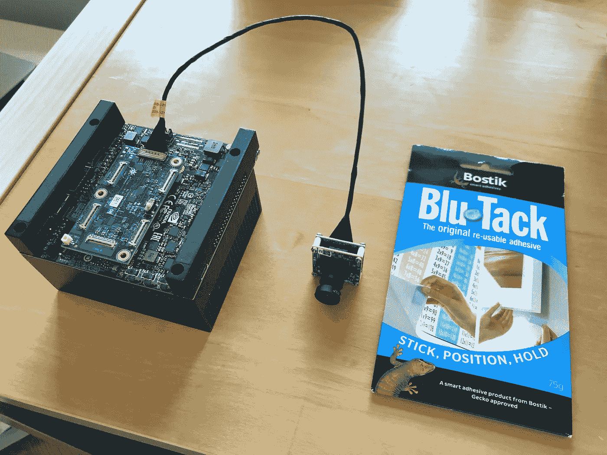

Jetson AGX Xavier，IMX327 相机和 Blu Tack。

# 履行

现在是我动手开始建设的时候了。

## 构建 3D 游戏引擎

为了更好地模拟飞行体验，Griffin 系统将以第三人称视角渲染 3D 世界。想象一下，一台摄像机紧跟在格里芬身后，准确地观察着他正在观察的地方。为什么不用像飞行模拟器风格的单人视图？因为看到一只鹰的翅膀和他的手臂同步移动，将有助于德协快速学习如何控制游戏，并享受更身临其境的体验。

构建自己的 3D 游戏引擎不是一件容易的事情，可能需要几周时间。如今，大多数开发者只是简单地使用一个专有的游戏引擎，如 Unity 或 Unreal。然而，我运气不好，因为我找不到任何运行在 Ubuntu OS/ARM 芯片组上的游戏引擎。一个替代方法是找到一个完全在 OpenGL 上运行的开源飞行模拟器。这将保证它可以在 AGX 上工作，因为它支持 OpenGL ES(OpenGL 的轻量级版本)并且是硬件加速的，如果你不想游戏引擎运行得像乌龟一样慢，这是必须的。

幸运的是，我遇到了一个符合上述标准的 C++ [开源](https://github.com/amhndu/fly)飞行模拟器。我进行了以下修改:

*   我把基于按键的飞行控制系统换成了基于目标的系统。这样，我可以不断地为格里芬的身体设定一个目标翻滚角度，让它慢慢翻滚。这个滚动目标稍后将由手势识别模块通过映射 Dexie 手臂的方向来自动设置。
*   我增强了静态 3D 模型管理，以支持分层结构。最初的飞机模型作为一个刚体移动，没有移动的身体部分。然而，格里芬有两个翅膀，需要能够独立于身体移动。为此，我将两个翅膀作为独立的 3D 模型添加到身体上。我仍然可以独立旋转每个翅膀，但我也可以移动格里芬的身体，从而间接移动两个翅膀。一个正确的方法是建立一个骨骼动画系统，并将身体的各个部分组织成一个树状结构。然而，因为我只有三个身体部分要处理(身体和两个翅膀)，所以把它们分割开就行了。为了编辑老鹰和树的 3D 模型，我使用了 Blender，这是一个免费且易于使用的 3D 创作工具。

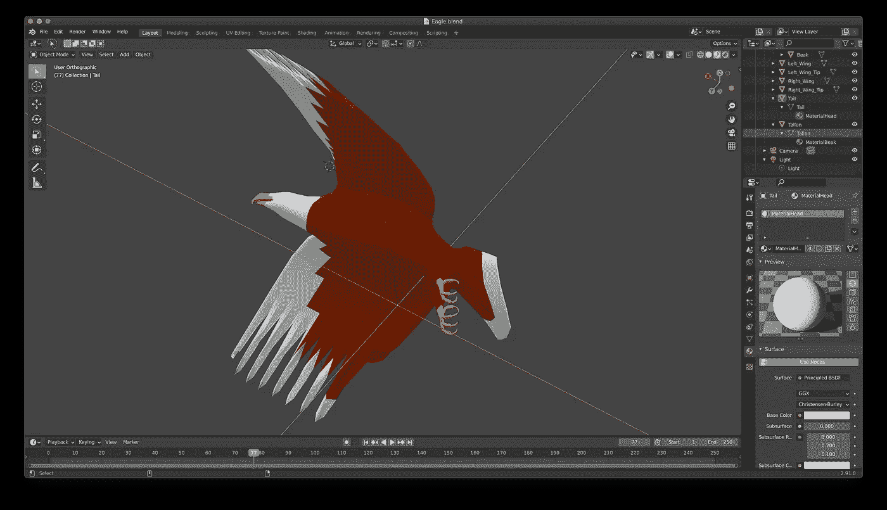

在 Blender 中编辑 eagle 3D 模型。

*   我为 Griffin 添加了一个树模型和一个游戏状态，可以在不重启应用程序的情况下重启游戏。格里芬有两种状态:站立，也就是格里芬站在树枝上飞行的状态。
*   我使用 libSFML 添加了声音回放:一只尖叫的鹰和格里芬一起飞就开始播放的循环风声。

## 建立身体姿势评估

该模块的工作是不断地从摄像机输入中检测身体姿态。具体来说，我们需要知道左/右肘、左/右肩、脖子和鼻子的位置，以便能够驱动格里芬的翅膀和身体，并触发特定的手势。 [OpenPose](https://github.com/CMU-Perceptual-Computing-Lab/openpose) 是一个流行的开源库，收集了估计身体姿势、手部姿势甚至面部特征的 AI 模型。我使用的模型是以 resnet18 为骨干特征提取器的人体姿态 COCO 模型。这个模型可以实时检测 18 个关节，包括上面我们需要的 6 个关节。


身体 COCO 联合图。

一个大问题是 OpenPose 是建立在 PyTorch 框架之上的，它在 NVIDIA AGX Xavier 中以 4FPS 的速度运行非常慢，因为它不会利用高度优化的 TensorRT 框架。幸运的是，有一个很棒的工具叫做 torch2trt，它可以自动将 PyTorch 模型移植到 TensorRT！安装 OpenPose，将 PyTorch 转换成 TensorRT，下载预先训练好的 resnet18 主干模型的步骤在[这里](https://github.com/NVIDIA-AI-IOT/trt_pose)有完整的讲解。

为了从摄像机获取视频，我使用了另一个名为 [Jetcam](https://github.com/NVIDIA-AI-IOT/jetcam) 的强大库。在 4 行代码内，您就可以让整个系统运行起来。

```
from jetcam.csi_camera import CSICameracamera = CSICamera(width=224, height=224, capture_width=224, capture_height=224, capture_fps=30)
image = camera.read()
```

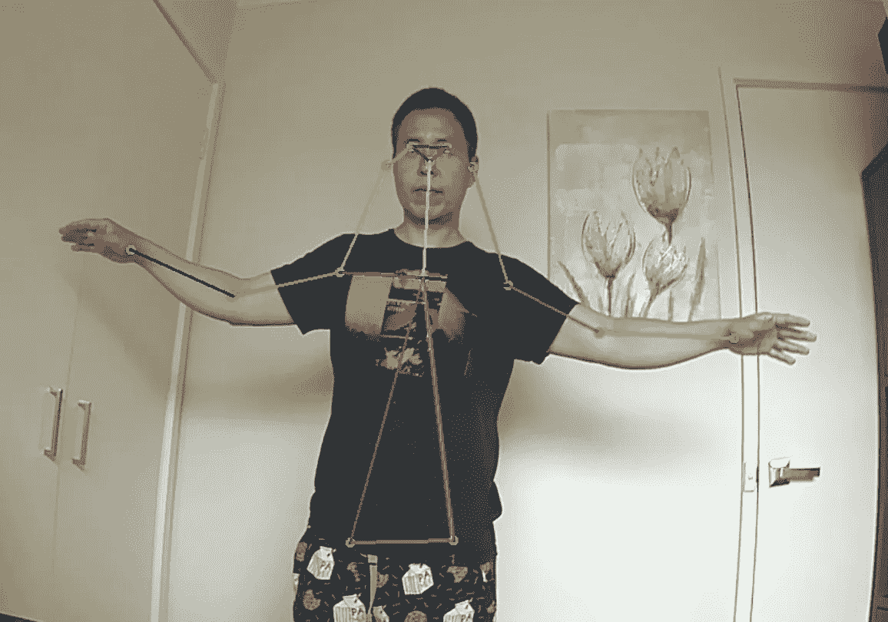

动作中的身体姿态估计。

正如你在上面看到的，我让姿态估计模块以 100FPS 的速度运行！我确信这还可以进一步优化。

经过几次测试后，我发现有时模型会错误地将随机对象识别为关节(假阳性)，如下图所示。这足以在格里芬的运动控制中制造麻烦。


检测到假阳性身体关节

## **用亚马逊 SageMaker JumpStart 建立物体检测模型**

解决这个问题的一个方法是添加一个辅助人工智能模型，一个物体检测，给我一个检测到人类存在的边界框。然后，我可以排除这些框之外的所有检测到的身体关节。作为一个额外的收获，边界框还帮助我从背景中的其他可见玩家中识别出主要玩家。被认为是主要玩家的离摄像机最近的人会使他/她的脚(边界框的底部)最靠近屏幕的底部。请注意，这个假设只有在他们的脚可见时才有效。

在我过去的项目中，我手动训练了一个 SSDMobileNetV2 对象检测模型。这次我使用了一个[亚马逊 SageMaker JumpStart](https://docs.aws.amazon.com/sagemaker/latest/dg/studio-jumpstart.html) ，这是 AWS 几周前发布的一个工具，让你只需点击一个按钮，就可以从 TensorFlowHub 和 PyTorchHub 部署一个人工智能模型。有 150 多种型号可供选择，其中一种是经过全面预培训的 SSDMobileNetV2:)

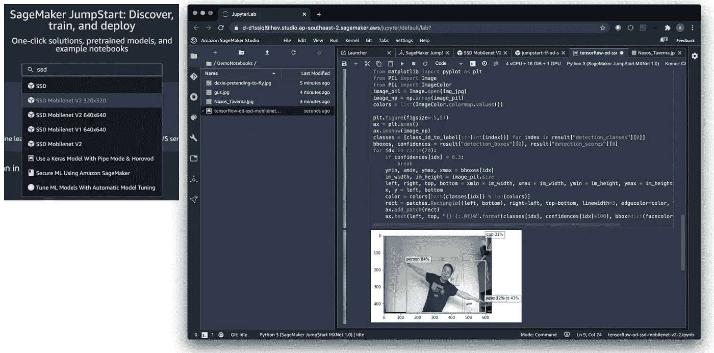

从 Amazon SageMaker Studio 启动 JumpStart

亚马逊 JumpStart 是亚马逊 SageMaker Studio 中的一个功能，这是一个集成的人工智能开发环境，让你可以轻松地构建、训练、调试、部署和监控你的人工智能模型。在我选择了 SSDMobileNetV2 之后，只需点击一个按钮，我就可以部署这个模型了。接下来，我打开提供的 Jupyter 笔记本，它带有推理代码，让我通过调用已经为您自动构建的模型端点来立即测试模型。

如果您将这个模型作为 REST API 部署在云中，那么您的工作基本上已经完成，无需编写任何代码。然而，由于我将在 edge 上部署这个模型，我将在 S3 bucket 中创建的预训练模型文件复制到我的 Jetson AGX Xavier，并使用 tf.saved_model.load 函数加载它们，为推理调用做好准备。看，更好的方法可能是使用亚马逊 SageMaker Neo 编译模型，然后使用 AWS 物联网 Greengrass 直接部署到 Jetson AGX Xavier。然而，由于一些张量的命名惯例，在撰写本文时，Amazon SageMaker Neo 无法从 JumpStart 编译 SSD 对象检测模型，否则这将是一个完整的端到端过程。

以上整个过程只花了我 5 分钟。相比之下，在我的上一个项目中，我花了两天时间标记所有数据，设置训练代码，并等待训练完成。

现在有了对象检测，我在盒子排除逻辑之外添加了身体关节，我看到假阳性大大减少了。耶！

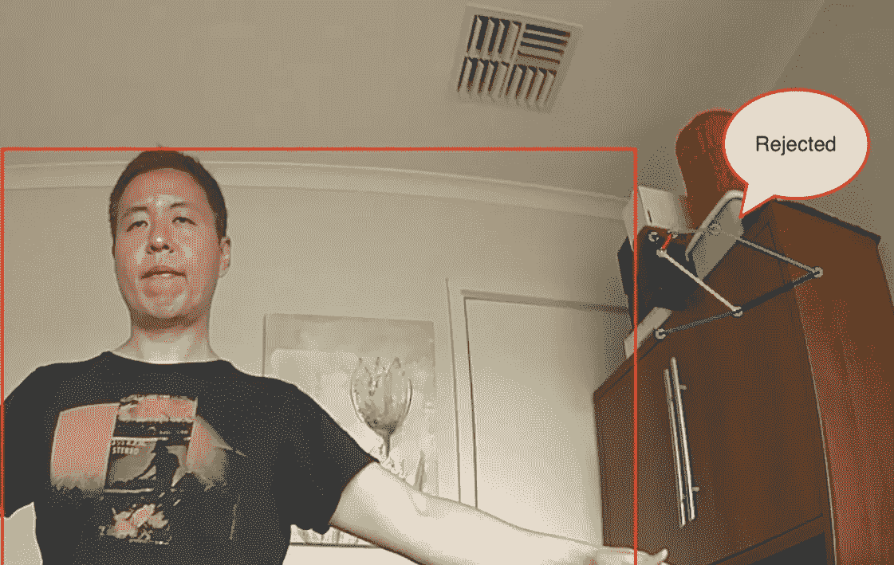

在人体边界框之外的拒绝的身体点。

今天你可以用人工智能做的事情是相当惊人的。回想 20 年前，当我还是一名游戏和电影 SFX 开发人员时，要做这样的事情，你需要花费数十万美元的动作捕捉硬件，这需要在你的身体和脸上到处都有摄像头和红外线灯以及反光球。看，公平地说，他们更准确；然而，用不了多久，我们就可以用人工智能和 50 美元的网络摄像头达到同样的结果。

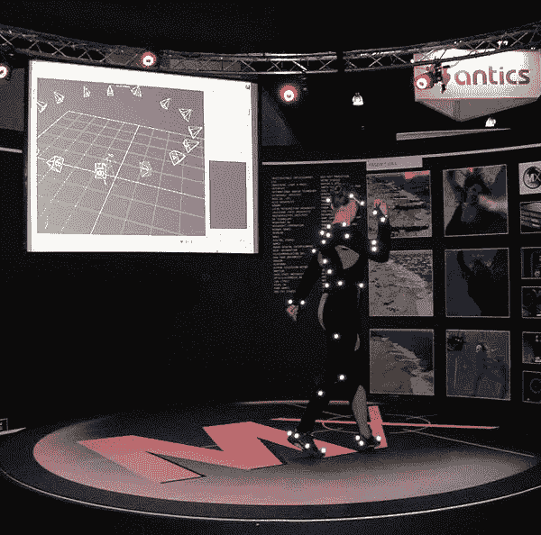

动作捕捉系统设置，由[维基百科](https://en.wikipedia.org/wiki/Motion_capture)

## 建立动作映射和手势识别

这个模块对于将姿态估计模块检测到的 6 个关节的运动转换成对游戏系统更有意义的输入是至关重要的。这包括三个从检测到的关节到 Griffin 运动的直接运动映射和两个触发动作的手势识别。

*   **飞行时身体翻滚**——控制狮鹫飞行的前进方向。身体滚动是根据水平轴和从右到左肘部向量之间的角度计算的(顶部照片)。当飞行时，两翼使用这个滚转角同步移动。选择肘部而不是手腕是为了最大化可见度，因为手腕经常移动到相机的视野之外或者被其他身体部位挡住。
*   **站立时旋转翅膀**——这纯粹是一个装饰性的动作，除了让游戏更有趣和给人更多站立时独立控制每只翅膀的印象之外，没有其他目的。它是根据水平轴和每个机翼的肩到肘向量(下图)之间的角度分别计算出来的。最终的横滚角度增加了 15 度，以夸大机翼的运动，因为在一段时间内将双臂高高举起是相当累人的。

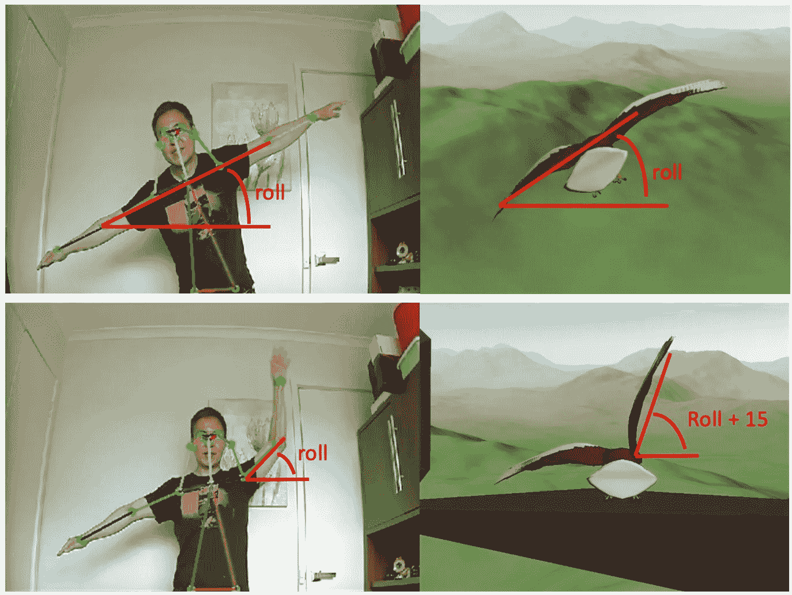

身体滚动和机翼旋转运动映射。

*   **蹲伏**是另一个修饰动作，给人一种在飞机起飞前控制格里芬蹲伏姿势的印象。它是根据脖子到鼻子的向量和肩膀向量的长度之比计算出来的。你蹲得越远，你的脖子和鼻子之间的距离越小，而你的左肩和右肩之间的距离保持不变，这就产生了一个更小的比值。你可能想知道为什么我不直接使用颈部垂直坐标作为下蹲偏移。直接使用原始坐标从来都不是一个好主意，因为颈部垂直运动的幅度取决于人和相机之间的距离。我们不希望当人越来越靠近和远离摄像机时错误地触发蹲伏动画。蹲伏动画只是通过向下移动格里芬来实现。理想情况下，我可以让双腿弯曲；然而，这需要做更多的工作，却没有什么附加值。我需要将腿作为身体的一部分分离出来，并像制作翅膀一样分别制作它们的动画。

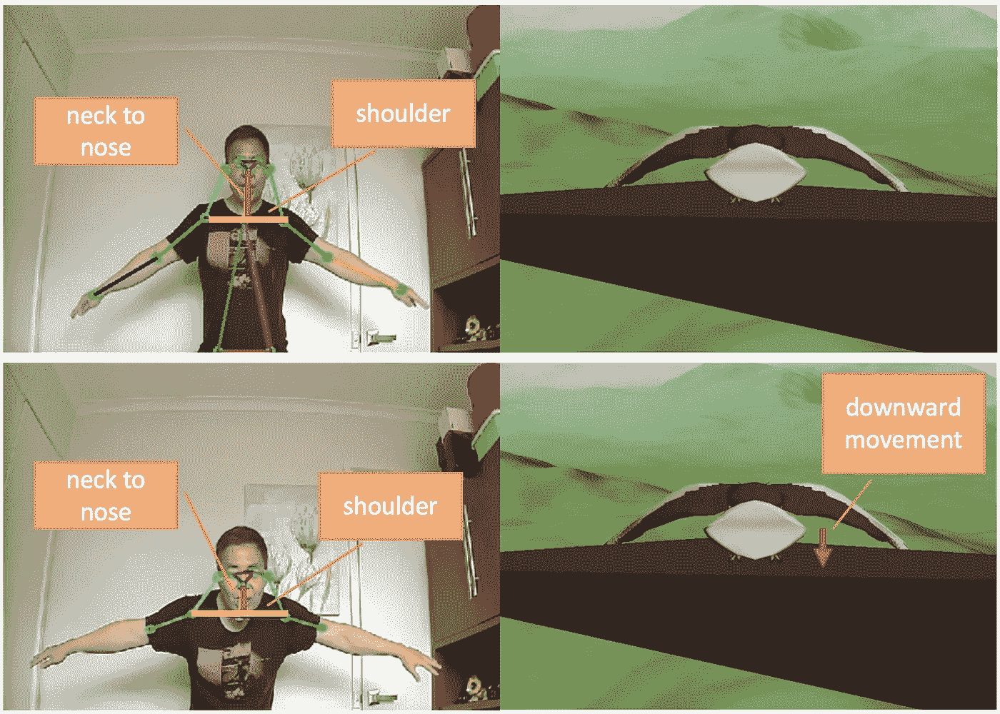

蹲伏运动贴图。

*   **起跳手势**——当左肩和右肩之间的中心点在不到一秒的时间内上下移动大于阈值时被识别。阈值被选择为肩部之间的长度。顾名思义，当这个手势被触发时，格里芬会从树枝上跳下来开始飞行。
*   **游戏重置手势** —当左肩和右肩的水平位置颠倒时被识别。例如，演员背对着摄像机。当这个手势被触发时，游戏将重置，格里芬将重新站在树上，准备下一次飞行。

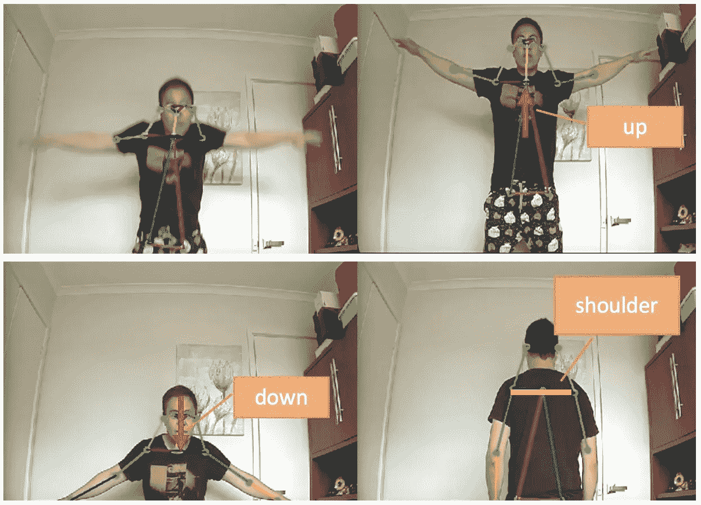

取下并重置手势识别。

## 通信系统

现在，随着三个主要组件的完成，我们只需要把所有的东西粘在一起。我们需要将从姿态估计中检测到的身体关节发送到手势识别模块。这是一项简单的任务，因为它们都是用 Python 编写的同一个应用程序的一部分。然而，没有简单的方法将映射的动作和手势发送到 3D 游戏引擎，因为它在 C++中是作为单独的应用程序构建的。你可能想知道为什么我不直接用 Python 来构建游戏引擎。原因是因为没有可靠的方法使用 Python 访问 OpenGL。此外，即使有可能，我也不想花费数周时间将 C++移植到 Python 代码中。

我需要找到一种方法，以最小的开销在两个应用程序之间高效地传递这些信息。我想强调最小开销的要求，因为这是一个游戏引擎的关键因素。在输入控制器和相关动作发生之间的小至 100 毫秒的延迟将很容易消除沉浸感。考虑到这一点，两个独立应用程序之间的最佳通信媒介是通过套接字。它是 TCP 协议(通俗地说就是互联网的主干技术)使用的一种底层通信机制。由于这两个应用程序驻留在同一台计算机中，延迟将在 5 毫秒之内。

在 C++中，我们简单地使用 sys/socket 库，而在 Python 中，我们可以使用 socket 框架。手势识别和姿势估计模块，从现在开始我将调用 Python 应用程序，作为发送 5 条信息的客户端:roll_target、lwing_target、rwing_target、body_height(蹲伏偏移)和 game_state。3D 游戏引擎，从现在开始我将称之为 C++应用程序，作为一个服务器监听并不断接收上述信息。

为了将这 5 条信息/变量正确地从 Python 映射到 C++，在我们发送它们之前，它们被放置在一个类似 Python C 的结构中。

```
class Payload(Structure):
 _fields_ = [(“roll_target”, c_int32),
             (“lwing_target”, c_int32),
             ("rwing_target", c_int32),
             ("body_height", c_int32),
             ("game_state", c_int32)]
```

在 C++应用程序中，它们作为本机 C 结构被接收。

```
typedef struct payload_t 
{    
    int32_t roll_target;    
    int32_t lwing_target;
    int32_t rwing_target;
    int32_t body_height;
    int32_t game_state;
} payload;
```

正如您在下面的架构图中所看到的，通信层由位于 Python 应用程序中的客户端模块和位于 C++应用程序中的服务器模块组成。

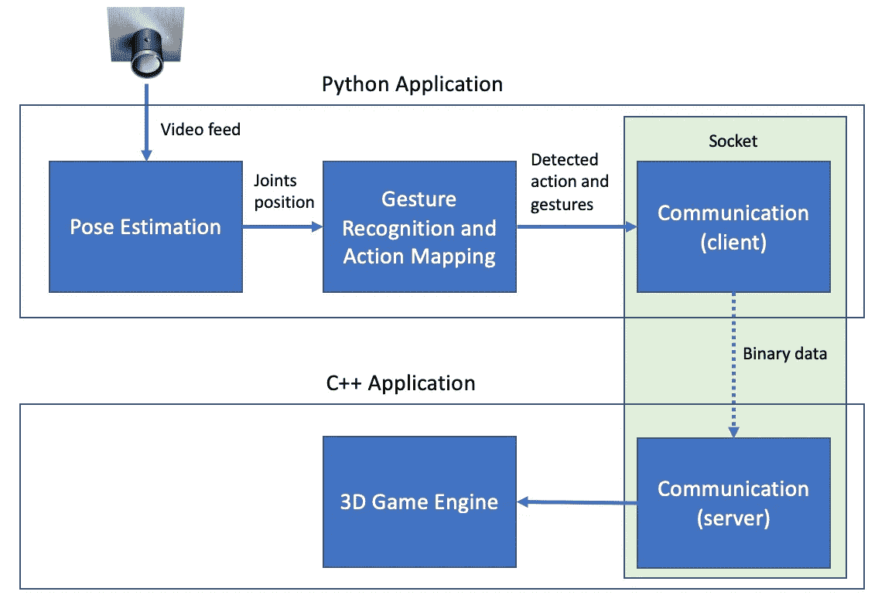

格里芬架构图。

# 校准和测试

一切准备就绪后，我在办公室安装了 Griffin 系统来进行校准和测试。该系统的表现比我预期的好得多，在进行所有实时 3D 渲染和姿态估计时，整体帧率为 60FPS。NVIDIA Jetson AGX Xavier 果然名不虚传。你可以在下面的视频中看到校准和测试过程。视频可能看起来有点断断续续，因为我以 15FPS 的速度拍摄 Ubuntu 桌面，以最小化对 Griffin 的性能影响。

格里芬系统校准和测试。

# 表演时间

最后，是时候进行一次真正的测试了，让德西与格里芬一起进行他的第一次飞行。我在起居室里安装了系统，他正不耐烦地等着开始行动。

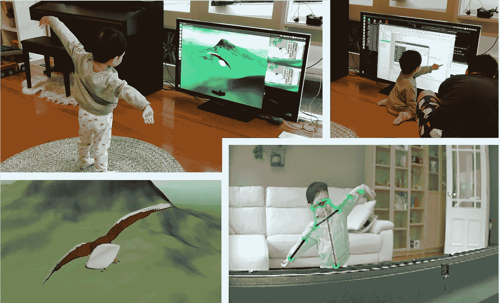

德西和格里芬的经历。

只用了一次演示如何控制格里芬，跳跃起飞和左右移动我的手臂来控制翅膀，德谢就熟悉了这个系统。他收集到格里芬的翅膀运动与我的手臂运动直接同步，这要归功于第三人称视角模式！从那以后，一切变得非常自然，他开始独自享受他的飞行经历。这证明了没有比自己的身体更好的游戏操控了。还记得史蒂夫·乔布斯在发布第一代 iPhone 时嘲笑手写笔胜过手指的评论吗？

很有趣的是，有一次，当德西快要撞到一座山的时候，他把手臂举得很高，试图来个急转弯。然而，由于我设置的最大滚动角度限制，格里芬不会让他变得更急，最终撞到了山上。:)下面的视频会给你展示这一切。

德西与格里芬的第一次飞行。

他玩了足足半个小时，直到他累得发狂，疯狂地挥舞着双臂。好的方面是，那天晚上他睡得非常好，这对我们来说是一场胜利。耶！更多网飞时间:)

# 摘要

我确实从建造格里芬中学到了很多，同时也获得了乐趣。以下是我学到的一些东西:

*   Torch2trt 是一个很棒的工具，可以自动将 PyTorch 模型转换为 TensorRT，以优化您在 Jetson AGX Xavier 中运行的 AI 模型。许多前沿的人工智能模型都是在 PyTorch 中构建的，将它们手动移植到 TensorFlow 是一件痛苦的事情。
*   NVIDIA Jetson AGX Xavier 真是个畜生！很多人说过，你可以运行一个计算机视觉模型，同时处理 30 个直播的 1080p 视频流。现在，我对此毫不怀疑。
*   Amazon SageMaker JumpStart 通过使部署它们变得超级容易，为您提供了大量受欢迎的人工智能模型。
*   构建 3D 游戏引擎让我回到了过去作为游戏和电影 SFX 开发人员的生活，并让我重温了 OpenGL、C++和三角学方面生疏的技能。
*   我可以用 Unity 引擎和 Kinect 传感器在 Xbox 上构建 Griffin。然而，这有什么乐趣呢？有时候从头开始建设才是乐趣所在。
*   做老鹰是一件相当累人的工作，尤其是举起手臂一段时间。然而，一只真正的鹰可能会从空气阻力中获得很多帮助，以在飞行过程中保持翅膀张开。

就这样了，伙计们。我希望你喜欢这个故事。

完整的源代码可以在[这里](https://github.com/msubzero2000/Griffin-public)找到。