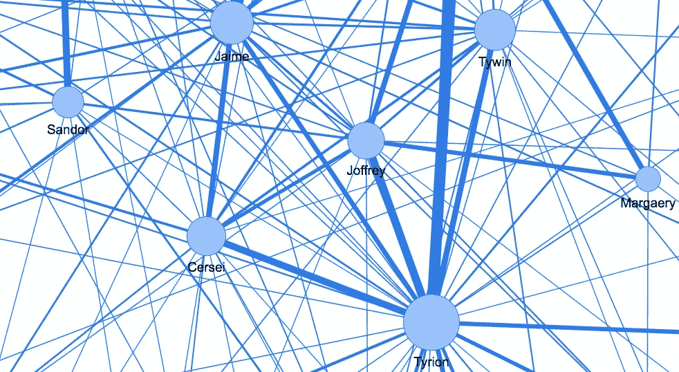
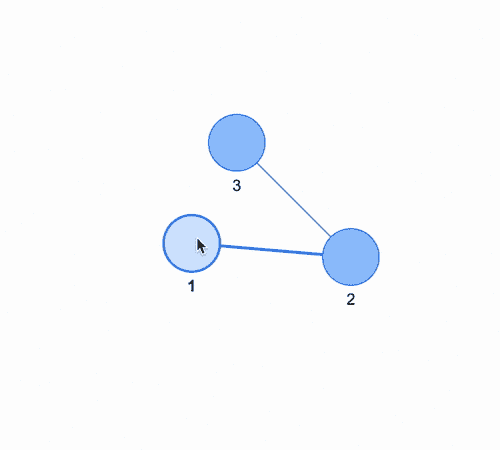
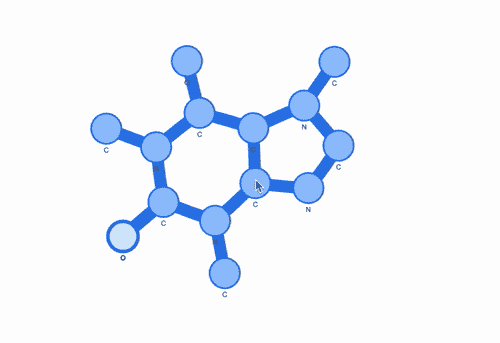
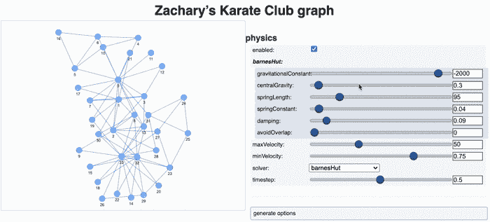
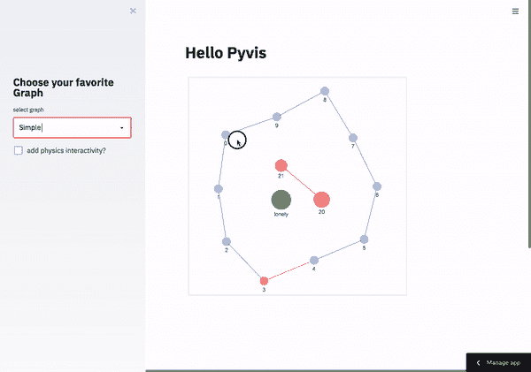

# 用 Python 和 Pyvis 制作交互式网络图。

> 原文：<https://towardsdatascience.com/making-network-graphs-interactive-with-python-and-pyvis-b754c22c270?source=collection_archive---------6----------------------->

## 绘制精美图表的简单方法。



图片作者。

有一段时间，我和 [Streamlit 社区的其他人](https://discuss.streamlit.io/) [1]一直在寻找一种工具来呈现交互式图形，但直到现在，只有少数人能够实现这一点。这可能是因为需要 javascript 的专业水平，这是许多 Streamlit 用户可能想要避免的，因为这是项目的承诺，从 python 部署漂亮的 web 应用程序，不需要 javascript！！(当然，掌握 javascript 是制作令人敬畏的 streamlit 应用程序的一大优势)。

最近，经过几周的努力，我发现 Pyvis 正在寻找其他基于 javascript 的库的替代品，这些库用于使图形具有交互性。我非常喜欢 pyvis，并想在这篇文章中分享一些我学到的技巧。但是如果你想自己看，可以查看文档页面[2]:

[](https://pyvis.readthedocs.io/en/latest/index.html#) [## 交互式网络可视化- pyvis 0.1.3.1 文档

### 编辑描述

pyvis.readthedocs.io](https://pyvis.readthedocs.io/en/latest/index.html#) 

这篇文章的其余部分如下:首先，我将展示一个超级简单的例子来做一个小的 3 节点网络。其次，我展示了如何固定节点的位置，以及如何保持分子图形的形状。第三个案例是用 Networkx 构建一个网络。最后，我展示了一个使用 Pyvis 的 Streamlit 应用程序。

# 1.简单的图形例子。

我将从一个简单的例子开始，创建一个网络对象并添加 3 个节点(方法 *add_node* )，用两条边分别标记为 1、2 和 3(方法*add _ edge*)[1–2]和[2–3]。为了部署图表(例如在 Jupyter 或 Colab 环境中), pyvis 使用 *show* 方法将 python 代码“翻译”成 html+javascript。调用 *g.show('example.html')* 将可以用 *display* 渲染的 html 文件写入磁盘:

这是结果，



图片作者。Pyvis 的简单示例🚀。

这很容易，不是吗？这个基本配方将在下文中使用。我做了一个小函数 *show_graph()* 来一步完成显示，如下面的代码片段所示。您可以在底部的 github repo 中的 Colab 笔记本中找到这些代码和所有代码🙌。

# 2.图形形式的分子。

下一个案例是我认为可以实现的，将 pyvis 与化学信息学库 [RDKit](https://www.rdkit.org/) 结合起来🤓 [3].我假设这不是普遍感兴趣的，所以我将避免构建分子的过程，相反，我将只呈现原子的最终节点和连接信息。这里显示的是咖啡因分子☕️.


图片作者。咖啡因分子

因为我想保持它的形状，首先我需要原子的坐标，还需要一些非常具体的物理选项。让我用一种简单的方式来解释这是如何完成的:因为有 14 个原子，所以我在每个原子编号上运行了一个循环，用 *add_node* 方法分配节点。对于每个节点，我给出了原子符号，以及来自三个独立列表的笛卡尔坐标(这是我从 RDKit 预处理中获得的),这三个列表分别命名为*id*、 *xs* 和 *ys* :

```
for atomo in range(14): 
    g3.add_node(atomo,label=ids[atomo],
    x=int(100*xs[atomo]),y=int(100*ys[atomo]),
    physics=True,size=30)
```

( *xs* 和 *ys* 被任意乘以 100，只是为了使图形更易于管理)

完整的片段由❤️主持:)，在这里你还可以看到物理选项:

这就是我认为可以接受的结果:



图片作者。用 Pyvis 将 2D 表示转换成交互式图形😎。

这可以主要用于吸引眼球的演示或设计面向化学的网页。但是也可以设想其他用途。

# 3.现在，一些空手道动作。

如果你熟悉[Networkx](https://networkx.org/)【4】的话，你应该知道它很受欢迎，因为这个库很好用，文档也很好，但是据我所知，它缺少这个让图形交互的功能。幸运的是，Pyvis 漂亮地接受了来自 Networkx 的 graph 对象。Networkx 已经预建了 [Zachary 的空手道俱乐部](https://en.wikipedia.org/wiki/Zachary%27s_karate_club)图[5]，其中有 34 个俱乐部成员，0 和 33 个主席和老师有冲突，他们根据成员之间的影响将俱乐部分成两组。下面显示了 pyvis 中这个图形所需的代码片段。首先，我们从 Networkx 得到了图 *G* 。然后我们构建 pyvis 对象 *g4、*和方法 *from_nx is* 用于将图形导入 pyvis…就这么简单:

在这里，我必须强调第 8 行中的 *show_buttons* 方法，该方法用于部署物理选项，允许用户交互地改变节点相互交互的方式，就好像它们由弹簧连接并具有其他物理交互一样。这使得图形的动态看起来更“自然”，在视觉上是一种享受。



图片作者。Pyvis 中使用 Networkx 生成的扎卡里空手道俱乐部数据集的图表🤛。

当然，还有其他方法可以使图形具有交互性，比如使用高级库，但是一般来说，它们更复杂。pyvis 提供的简单性值得赞赏。

# 4.在 streamlit 上部署。

最后，我展示了这些动态图表在 Streamlit web 应用程序中的外观。我不打算讨论如何做这个应用程序，我把它作为读者的家庭作业。

> 提示:你可以在下面看到 github 回购😏



图片作者。Pyvis 在 Streamlit 中运行🔥。

# 现在该怎么办..

*   **如果你愿意，你可以在这里玩网络应用:**

[https://share . streamlit . io/napoles-uach/streamlit _ network/main/app . py](https://share.streamlit.io/napoles-uach/streamlit_network/main/app.py)

*   **如果你喜欢，请启动 github 回购**🌟

[https://github.com/napoles-uach/streamlit_network](https://github.com/napoles-uach/streamlit_network)

*   **这里展示的代码片段是 Colab 笔记本的一部分，您可以在这里找到:**

[https://github . com/napoles-uach/streamlit _ network/blob/main/pyvis _ sample . ipynb](https://github.com/napoles-uach/streamlit_network/blob/main/pyvis_sample.ipynb)

*   在 twitter 上关注我👉[https://twitter.com/napoles3D](https://twitter.com/napoles3D)🙌

## 感谢阅读！！

# 帮助我通过使用下面的链接成为媒体成员来继续创建这样的内容。只需 5 美元/月，你就可以在媒体上看到所有的故事，还可以用 2.27 美元支持我，谢谢！

# [https://medium.com/@jnapoles/membership](https://medium.com/@jnapoles/membership)

[](https://jnapoles.medium.com/membership) [## 通过我的推荐链接加入 Medium-joséMANUEL na POLES du arte

### 作为一个媒体会员，你的会员费的一部分会给你阅读的作家，你可以完全接触到每一个故事…

jnapoles.medium.com](https://jnapoles.medium.com/membership) 

引用的链接:

[](https://discuss.streamlit.io/) [## [1]简化 it

### 讨论 Streamlit 的社区。

discuse . streamlit . io](https://discuss.streamlit.io/) [](https://pyvis.readthedocs.io/en/latest/index.html#) [## [2]交互式网络可视化- pyvis 0.1.3.1 文档

### 编辑描述

pyvis.readthedocs.io](https://pyvis.readthedocs.io/en/latest/index.html#) [](https://www.rdkit.org/) [## [3]快速诊断试剂盒

### 编辑描述

www.rdkit.org](https://www.rdkit.org/)  [## [4] NetworkX - NetworkX 文档

### NetworkX 是一个 Python 包，用于创建、操作和研究…的结构、动力学和功能

networkx.org](https://networkx.org/) [](https://en.wikipedia.org/wiki/Zachary%27s_karate_club) [## [5]扎卡里空手道俱乐部

### 扎卡里的空手道俱乐部是一个大学空手道俱乐部的社交网络，在论文“信息流…

en.wikipedia.org](https://en.wikipedia.org/wiki/Zachary%27s_karate_club)