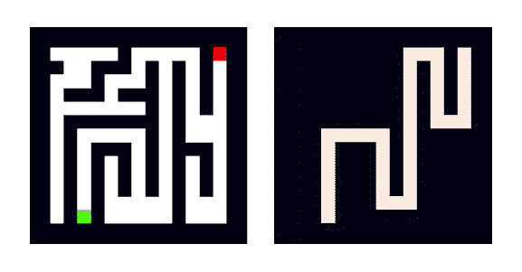
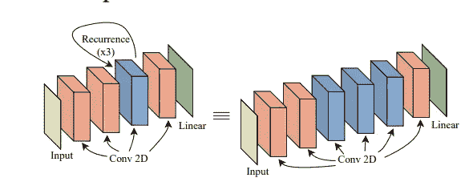
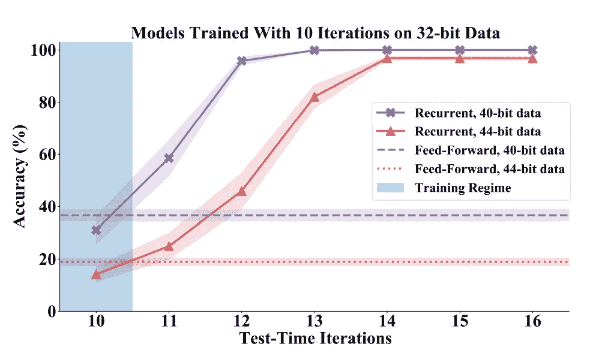
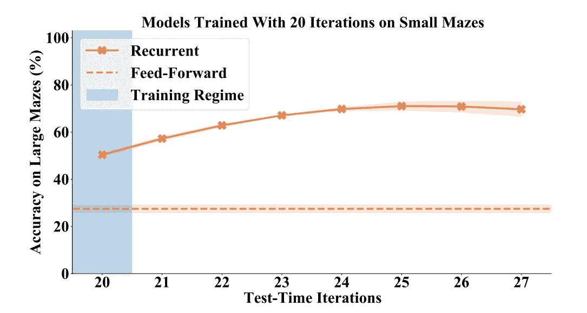
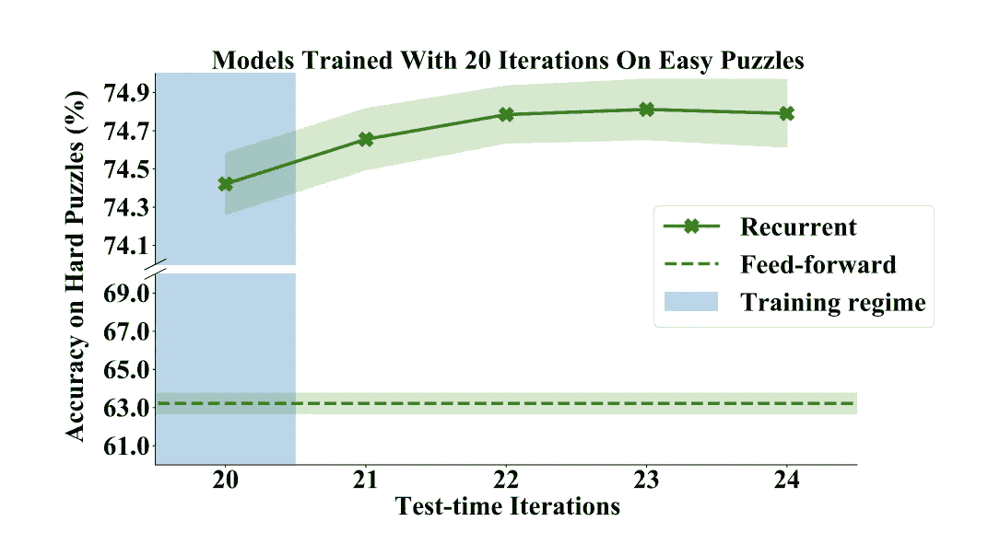

# 让神经网络通过更长时间的“思考”来解决更棘手的问题！

> 原文：<https://towardsdatascience.com/making-neural-networks-solve-tougher-problems-by-thinking-for-longer-32ecb599bcd?source=collection_archive---------29----------------------->

> 这是我根据对论文的理解写的一篇博文——“**你能学会一个算法吗？从简单到困难的循环网络问题的归纳**，来自 Schwarzchild 等人(2021) [ [链接](https://arxiv.org/abs/2106.04537)。
> 
> **TL；在这里，作者在更简单的迷宫/谜题形式上训练一个递归神经网络(RNN)，并在测试时，在“更难”的问题上评估它们。与通常的训练/测试集评估不同，在这里，RNN 可以“思考更长时间”进行测试。更具体地说，它将比在训练阶段有更多的循环块。作者注意到，与具有类似深度的简单前馈神经网络相比，通过思考更长时间，RNNs 能够以有原则的方式解决更复杂的问题。也就是通过使用更多的循环层。这里，相似深度指的是训练时 RNN 和前馈神经网络的有效深度。**
> 
> **长处** —论文开始了一个重要的方向——“如何让神经网络处理看不见的测试情况？使用比训练时更多的计算有助于在测试时表现得更好吗？NNs 能从它的记忆(或内部表征)中归纳/推断吗？在这里，作者让 RNN 推断它对类似的，但“更难”的问题的理解。最初的实验看起来很有希望，并可能成为我们理解什么实际上使更深(或更宽)的模型表现更好的方法。
> 
> **告诫** — 除了少数简单明了的案例，很难对问题的难度进行精选和排序。因此，在较简单的问题上进行训练并理解对较难问题的影响将是一个挑战。这在其他研究领域也是一个众所周知的问题，比如课程学习(Bengio et al .，2008)。
> 
> **未来方向** —作者注意到，由于更好的感受野，利用扩张的卷积得到了更好的结果。一个增加的方法是使用注意层、变压器等来观察更大感受野的效果。因此，回答了一个更大的问题，什么是重要的——思考更长时间还是对整体空间有“感觉”,或者两者都有。此外，这里通过使用相同的权重(权重共享)天真地增加了循环迭代。观察随机扰动一小部分权重的效果会很有趣。最后，尽管 rnn 考虑的时间更长，但他们应该考虑的“时间”仍然是预定义的——使额外的循环步骤的数量由数据驱动可能是一个有趣的实验。

**简介**

人类表现出解决复杂问题的能力，这是基于他们对简单玩具问题的学习。例如，解决了一个 3x3 难题的人，可以使用类似的逻辑，花更多的时间来解决一个 5x5 难题，尽管以前从未见过它。更具体地说，人类可以通过“更努力/更长时间地思考”，从更小的问题中得出解决更大问题的模式。

在 Schwarzchild 等人(2021)的文章中，作者从人类身上看到的这些现象中获得了灵感，以了解是否可以在神经网络(NNs)中观察到类似的模式。也就是说，我们能否让神经网络基于对简单问题的学习来解决*未知和更复杂的*问题。这里，对 3 种主要类型的数据进行分析——前缀和计算、迷宫和象棋。

出于多种原因，在测试推断中思考更长时间可能是一个有趣且重要的问题，但不限于—

1.  计算预算的限制——模型可以在测试时进化，而不是训练非常深的网络。
2.  这在问题不断发展的领域(与训练相比，输入的复杂性和输入的大小都在增加)，以及对测试分布的访问是有限的，可能是特别有趣的。
3.  理解神经网络从其记忆中进行推断的能力，并为*推广*带来新的视角。

已经有大量的文献从**迁移学习** *的角度研究类似的方面(Hinton 等人，2006；刘冰等人，2007 年；本吉奥等，2012)* ，**神经网络中的泛化** *(张等，2016；阿罗拉等人，2019；马内尔等人，2020 年；Garg 等人，2021)* ，**元学习** *(Schmidhuber，1987；本吉奥等人，1992 年；Thrun & Pratt，1998；Andrychowicz 等人，2016；拉维&拉罗歇尔，2017；Finn 等人，2017)* 、**神经架构搜索** *(Zoph 等人，2016)* 等等。虽然，本文中使用的任务类型(Schwarzchild 等人，2021)与上述作品不同—

1.  在这里，重点是让神经网络像人类一样“思考更久”，以解决更复杂的问题——也就是说，在这里，模型被提供更多的计算(或更长的执行时间)，直到它对答案有信心。在传统的迁移学习框架中，模型根据*开放世界知识*进行预训练，然后根据相关的下游任务进行微调——目的是让模型从大量可用数据中学习有用的表示，并使用它来提高下游任务的性能。
2.  在元学习设置中，重点是 ***学习一个可以学习***的算法。而在目前的工作中，作者着眼于学习一种算法来解决一个特定的问题，例如，一个国际象棋配置或拼图游戏。
3.  典型的*概括与记忆*工作侧重于理解神经网络从数据中学到了什么，以及它们基于相同分布、不同分布等的“概括误差”(训练/验证误差)概括得有多好。在这项工作中，重点是了解模型是否可以从较小的问题中学习模式，并在额外计算的帮助下将它们用于较大的问题，从而进行归纳。

## **数据集**

如前所述，作者分析了 3 类问题的假设——

1.  **前缀求和问题** [ [链接](https://en.wikipedia.org/wiki/Prefix_sum) ]—这里输入的是 32 位长度的二进制字符串(测试时使用 40 到 44 位的字符串)。重点是计算二进制字符串模 2 的前缀和。也就是说，输出将是计算输入模 2 的累积和的等长字符串。

模 2 前缀和的一个例子。[ [来源](https://arxiv.org/pdf/2106.04537.pdf)

2.**迷宫** —训练时输入为 9x9 迷宫，测试时输入为 13x13 迷宫。预期输出是二进制掩码输出，它突出显示输入迷宫中绿色和红色点之间的最短路径。

左侧面板是迷宫的示例，绿点代表起点，红点代表终点(目的地)。白色像素是代理可以采取的步骤，黑色像素是代理无法通过的障碍物。右图显示了这些点之间的最短路径(这是网络的预期输出)。[ [来源](https://arxiv.org/abs/2106.04537)

3. **Chess —** 输入数据是一个 8x8x12 数组，输入棋盘中所有棋子的位置。这些配置来自在线平台 Lichess。与之前的数据集不同，其中输入大小在训练和测试时间中变化，这里我们有不同的“难度评级”:模型在难度较低的样本上训练(基于评级)，在难度较高的样本上测试。

左图是输入的国际象棋布局，右图是可以引导玩家走向胜利的(单个)最佳走法。来源

## 模型架构和培训

基于循环块的*展开*测量有效深度的样本。[ [来源](https://arxiv.org/abs/2102.11011)

所用的前馈网络基于 ResNet 架构，但有一些变化——除了初始层和最后一个递归层之后，宽度没有变化，没有批处理，完全卷积——以确保递归模型尽可能接近前馈实现。用于循环网络的模型架构类似于经典的 ResNet 模型。也就是说，两个模型之间的主要区别在于，权重在*循环块*中共享，但在前馈网络中不是这样。

## 结果

该图将最佳前馈模型与等效深度的递归模型进行了比较。[ [来源](https://arxiv.org/abs/2106.04537)

**前缀总和** —从上图中我们可以看出，随着迭代次数的增加(循环块的展开)，性能会提高。

结果基于在 32 位字符串上训练后在 40 位字符串上的测试。[ [来源](https://arxiv.org/abs/2106.04537)

**迷宫求解—** 模型在经历更多迭代的同时改进并学习其路径，如下图所示。递归模型表现出比传统前馈模型更好的性能

在这里，模型解决迷宫的顺序思考能力可以被可视化。此外，根据模型在其输出中的置信度对像素进行着色。[ [来源](https://arxiv.org/abs/2106.04537)

8×8 拼图训练后在 13×13 格子上的表现。递归模型始终比深度相当的前馈模型表现更好。

这里将递归模型与最佳前馈模型进行比较。通过思考更长的时间，循环模型能够表现得更好。

**国际象棋—** 观察到的国际象棋趋势也类似。在考虑这个难题的最佳解决方案时，为了简洁起见，忽略了一些边缘情况。

我们可以注意到一个相似的趋势，模型依次分析所有可能的移动，并且随着迭代的进行越来越自信。

与表现最好的深度为 20 的前馈网络相比，在测试时思考得更深入有助于递归模型更好地解决更难的象棋难题。

## 讨论

作者提出了一个关于循环层如何帮助的重要问题。这里仍有许多未解的问题

1.  递归模型如何模拟分层滤波器，即，尽管权重共享，但是与每层中具有特定滤波器的前馈网络相比，递归模型如何能够提取相似的模式以学习特定模式？这个问题在作者的另一篇论文中得到了部分回答——复发和深度的不可思议的相似性[ [链接](https://arxiv.org/pdf/2102.11011.pdf) ](很快会有更多关于这篇论文的内容！).
2.  怎样才能让模型明白什么时候停止思考？人类在找到一个谜题的最优解后，不会突然走向一个随机的方向，最后得出一个错误的答案(至少，我们*大部分*不会:)
3.  理解思考时间更长、视野更大的影响。该论文表明，对于较大的感受野使用扩张的卷积是有帮助的。这是否意味着有一个方向，我们不仅可以看到模型思考了多长时间，还可以看到所有模型(在空间上)可以思考/感觉什么？

如果你已经读到这里，非常感谢，希望你能读到一些新的有趣的东西！请查看[原始论文](https://arxiv.org/pdf/2106.04537.pdf)以获得更深入的分析和结果！请随时让我知道你的想法。我是这方面文献的初学者，如有理解上的错误，欢迎随时指出！乐学！

[Twitter](https://twitter.com/rohanalchemist) | [LinkedIn](http://linkedin.com/in/rohan-sukumaran-3271ba145)

PS——所有的数字都来自原始论文，如果没有，我也提到了来源。这些信息图表的所有荣誉归原作者所有。谢谢！