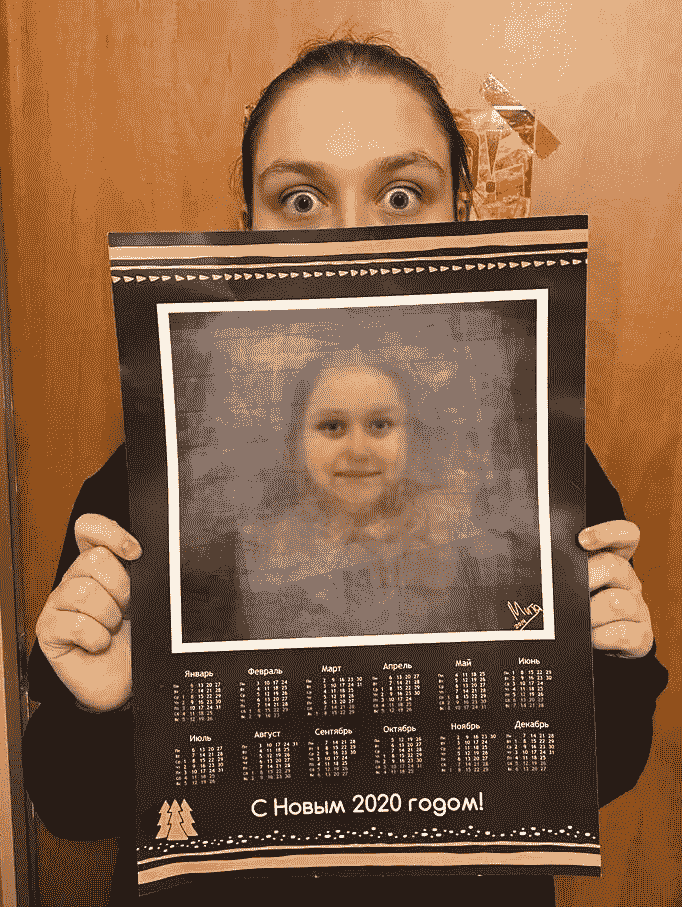
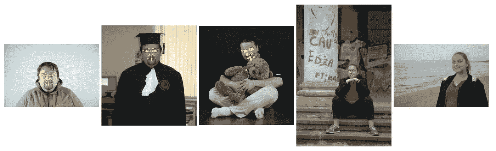
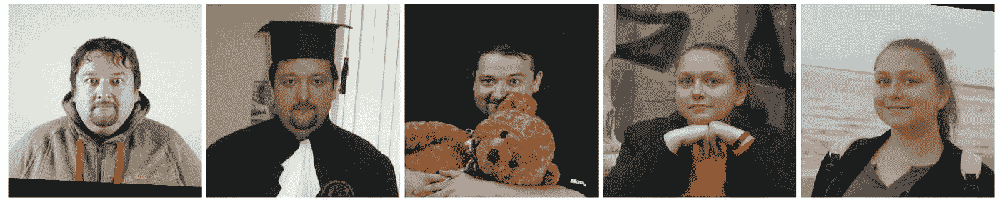
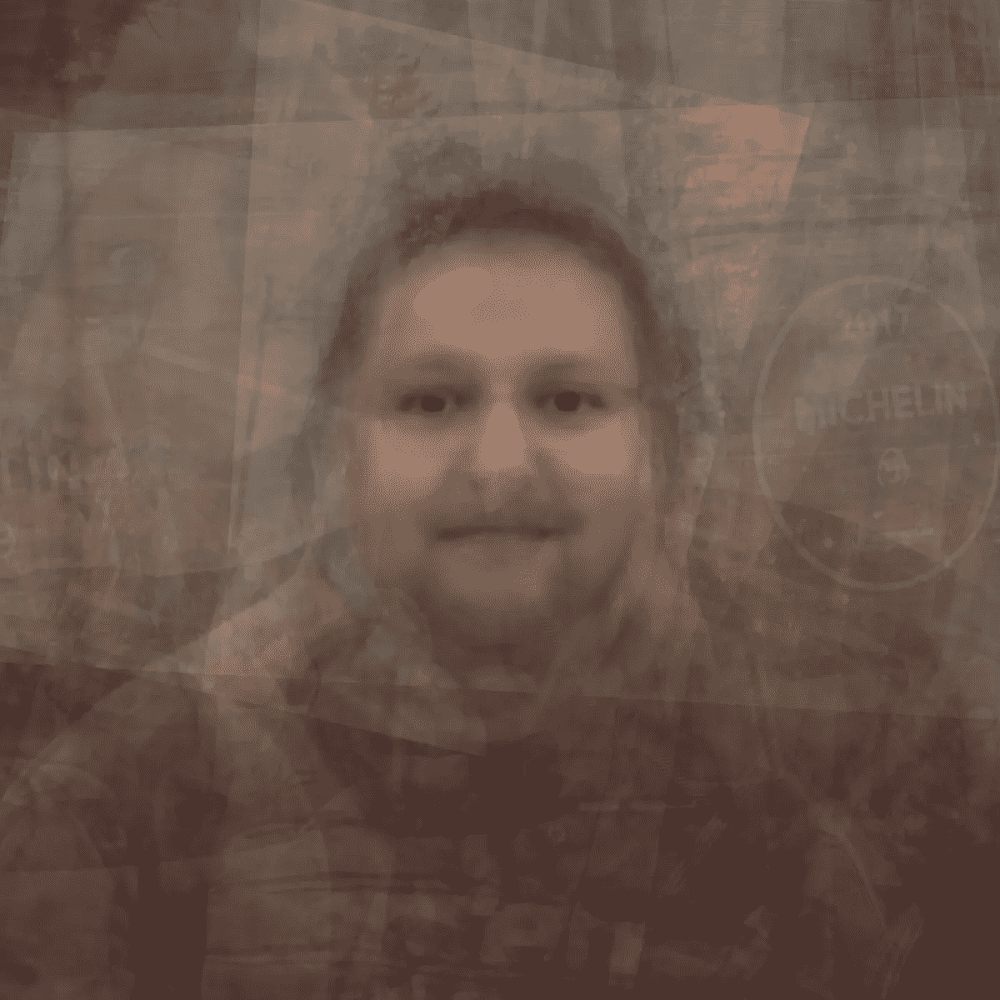
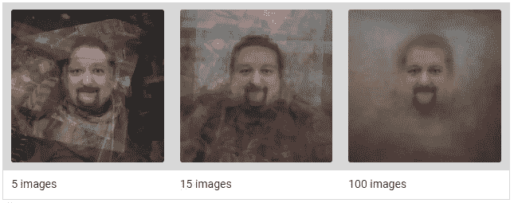
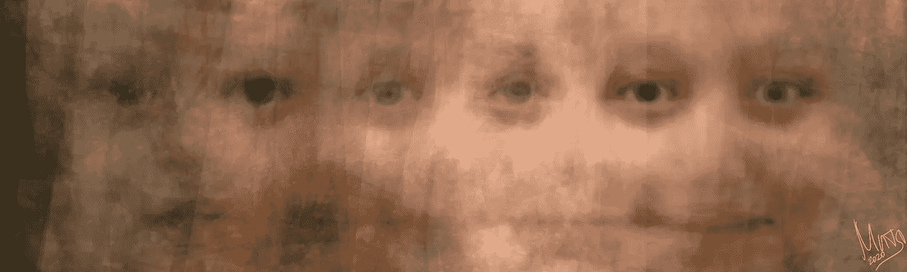

# 用 Face API 和一些创意为朋友制作新年礼物

> 原文：<https://towardsdatascience.com/making-new-year-presents-for-friends-with-face-api-and-some-creativity-57c169e73c99?source=collection_archive---------10----------------------->

几年前，我想出了制作认知画像的主意，这是一个人的混合图像，由许多自动对齐的照片组成。因为就在圣诞节和新年之前，我通过在日历海报上打印朋友和亲戚的认知画像，为他们制作了个性化的礼物。今年圣诞节，我想和你分享做同样事情的秘诀。



我的女儿[薇琪](http://github.com/vickievalerie)带着自己的新年认知日历

> **TL；DR:** 产生认知画像的代码可以在[认知画像 GitHub 库](https://github.com/CloudAdvocacy/CognitivePortrait)中获得。如果你想出一些新的创造性的方法来有计划地排列照片，并向原始回购请求贡献你的想法，我会很高兴！

创建认知肖像的方式是根据他们的眼睛排列几幅肖像，从而在有些混合或模糊的背景上创建看起来像组合混合脸的东西。虽然你当然可以在 PhotoShop 中手动完成，但这会很耗时，而且你快速实验的能力会受到严重限制。

使用 [**微软认知服务**](https://azure.microsoft.com/en-us/services/cognitive-services/?WT.mc_id=academic-35500-dmitryso) ，也就是 [Face API](https://azure.microsoft.com/services/cognitive-services/face/?WT.mc_id=academic-35500-dmitryso) ，可以通过编程创建同样的效果。它能做的事情之一是从面部提取关键点，即所谓的面部标志。

> *如果你想了解更多关于 Face API 和它能做的很酷的事情，我推荐你参加* [***微软学习课程***](https://docs.microsoft.com/learn/modules/detect-analyze-faces/?WT.mc_id=academic-35500-dmitryso) *。*

# 准备照片

你应该做的第一件事是收集你朋友的照片——理想情况下，每个人你应该有 10-30 张照片。分辨率没有多大关系，因为最终的肖像是相当混合的，相对低分辨率的图像也很好。我将假设你有你的朋友的脸是图片上最大的一张的图片——如果不是这样的话，你可能想要裁剪图像。

# 提取面部标志

让我们从学习如何从图片中提取面部标志开始。 [**微软人脸 API**](https://azure.microsoft.com/services/cognitive-services/face/?WT.mc_id=personal-blog-dmitryso) 提供了一个简单的 REST API，可以从人脸图像中提取很多有用的信息，包括眼睛的坐标。

通过 REST 直接调用 Face API 相当容易，但使用现有的 SDK 更好，它作为 [**Azure SDK 库**](https://docs.microsoft.com/azure/cognitive-services/Face/Quickstarts/client-libraries?pivots=programming-language-python&WT.mc_id=academic-35500-dmitryso&tabs=visual-studio) 的一部分可供 Python 使用。你可以 [**访问微软文档**](https://docs.microsoft.com/azure/cognitive-services/face/?WT.mc_id=academic-35500-dmitryso) 获取更多关于 Face API 的详细信息，以及在 Python 之外的语言中使用它。

我们使用以下命令安装 SDK(以及我们将需要的 OpenCV 库):

```
pip install azure-cognitiveservices-vision-face opencv-python
```

要使用 Face API，你需要访问微软 Azure 云。如果你没有，你可以随时获得一个<https://azure.microsoft.com/free/?WT.mc_id=academic-35500-dmitryso>**，或者[**Azure for Students**](https://azure.microsoft.com/free/students?WT.mc_id=academic-35500-dmitryso)/[**GitHub Student Developer Pack**](https://education.github.com/pack)以防你是学生。**

**一旦有了订阅，[创建 Face API 端点](https://portal.azure.com/#create/Microsoft.CognitiveServicesFace/?WT.mc_id=academic-35500-dmitryso)。选择离您最近的地区和免费层。它将允许您免费拨打多达 30000 个电话，每分钟 20 个电话的限制(这对我们的任务来说足够了)。**

**这样做之后，您就可以获得资源键和端点，这是以编程方式访问 API 所必需的。将它们放入我们的代码中:**

```
key **=** '--INSERT YOUR KEY HERE--'
endpoint **=** 'https://westus2.api.cognitive.microsoft.com'
```

**Face API 的大多数调用都是通过 FaceClient 对象完成的:**

```
**from** azure.cognitiveservices.vision.face **import** FaceClient
**from** msrest.authentication **import** CognitiveServicesCredentialscli **=** FaceClient(endpoint,CognitiveServicesCredentials(key))
```

**面部检测的主要功能称为`face.detect_with_url`或`face.detect_with_stream`。根据您指定的参数，它可以从面部提取许多有用的信息——在我们的例子中，我们需要面部标志:**

```
im_url**= \** 'https://2016.dotnext-piter.ru/assets/images/people/soshnikov.jpg'
res **=** cli.face.detect_with_url(im_url,return_face_landmarks**=**True)
**print**(res[0].facial_landmarks.as_dict())
```

**在这段代码中，`res`是一个数组，它的每个元素对应于图片中的一张脸。最大的脸将首先出现，因此使用`res[0]`将给出该脸的信息。我们还可以使用`as_dict()`将其转换为 Python 字典，以便于操作:**

```
{
  "eyebrow_right_inner": {
    "y": 106.3,
    "x": 157.2
  },
  "pupil_right": {
    "y": 118.9,
    "x": 170.9
  },
  "eye_right_outer": {
    "y": 118.5,
    "x": 181.5
  },
  "pupil_left": {
    "y": 126.7,
    "x": 112.6
  }, 
...
```

# **处理图像**

**假设您将想要为其创建认知画像的人的所有照片放在`images`目录中，我们可以遍历所有照片并提取所有照片的面部标志:**

```
**import** glob
filenames **=** []
images **=** []
imagepoints **=** []
**for** fn **in** glob.glob("images/*"):
  **print**("Processing {}".format(fn))
  **with** open(fn,'rb') **as** f:
    res **=** cli.face.detect_with_stream(f,return_face_landmarks**=**True)
    **if** len(res)**>**0:
      filenames.append(fn)
      images.append(cv2.cvtColor(cv2.imread(fn),cv2.COLOR_BGR2RGB))
      imagepoints.append(res[0].face_landmarks.as_dict())
```

**处理完所有图像后，我们可以显示它们，以及获得的面部标志:**

```
**def** decorate(i):
   img = images[i].copy()
   **for** k,v **in** imagepoints[i].items():
      cv2.circle(img,(int(v['x']),int(v['y'])),7,(255,255,0),5)
   **return** imgdisplay_images([decorate(i) **for** i in range(5)])
```

****

**作者图片**

**在这段代码中，函数`display_images`用于绘制一系列图像，这里我将省略这段代码，你可以在资源库中找到它[。](https://github.com/CloudAdvocacy/CognitivePortrait/blob/master/CognitivePortrait.ipynb)**

# **仿射变换**

**现在我们有了这些点，我们需要对齐图像，这样眼睛就可以移动到所有图像的完全相同的位置。要做到这一点，我们需要缩放图像，旋转它，可能还需要做一些倾斜。在数学上，图像的这种变换叫做 [**仿射变换**](https://en.wikipedia.org/wiki/Affine_transformation) 。众所周知，仿射变换由三个点*的变换唯一定义。***

**在我们的例子中，我们知道眼睛的位置，并且我们知道我们想要将它们移动到位置(130，120)和(170，120)，如果我们的目标图像尺寸是 300x300，这听起来是一个不错的位置。然而，除了眼睛之外，我们还需要一点来完整地定义转换。**

**虽然我们可以选择任何一个点，但选择嘴中间是很方便的——因为它在某种程度上与眼睛相对，并且三角形的眼睛——嘴中间覆盖了脸的相当大的区域。我们没有中嘴的面部标志，但是我们可以在`mouth_left`和`mouth_right`之间取一个平均值。**

**使用矩阵在 2D 空间中定义仿射变换。OpenCV 包含一个函数`getAffineTransform`，它可以计算这样一个矩阵，给定变换前后的 3 个点的坐标，如我们上面所描述的。然后，我们使用`warpAffine`对原始图像应用变换——它还剪切掉图像的剩余部分，以便它适合指定大小的矩形。**

```
target_triangle **=** 
   np.float32([[130.0,120.0],[170.0,120.0],[150.0,160.0]])
size **=** 300**def** **affine_transform**(img,attrs):
    mc_x **=** (attrs['mouth_left']['x']**+**attrs['mouth_right']['x'])**/**2.0
    mc_y **=** (attrs['mouth_left']['y']**+**attrs['mouth_right']['y'])**/**2.0
    tr **=** cv2.getAffineTransform(np.float32(
        [(attrs['pupil_left']['x'],attrs['pupil_left']['y']),
         (attrs['pupil_right']['x'],attrs['pupil_right']['y']),
         (mc_x,mc_y)]), target_triangle)                                
    **return** cv2.warpAffine(img,tr,(size,size))
```

**一旦我们定义了这个函数，我们就可以变换我们所有的图像:**

```
aligned **=** [affine_transform(i,a) **for** i,a **in** zip(images,imagepoints)]
display_images(aligned[:5])
```

****

**作者图片**

# **然后…瞧！**

**为了得到最终的结果，我们基本上需要将图像融合在一起。要做到这一点，让我们回忆一下 Python 中的图像是用 numpy 数组表示的，并且可以很容易地用`np.average`对它们进行平均——我们只需要指定正确的轴:**

```
imgs**=**np.array(aligned,dtype**=**np.float32)**/**255.
plt.imshow(np.average(imgs,axis**=**0))
```

**这里的一个技巧是，我们需要将图像数据从整数矩阵转换为浮点(在 0..1)为了获得正确的平均。一旦我们做到了——这就是结果:**

****

**作者图片**

# **要混合多少个图像**

**一个很好的问题是混合在一起的图像的正确数量是多少。从下面的例子可以看出，不同数量的图像会产生不同的结果。虽然很少有图像留下一些周围的细节可见，这可能会添加一些有趣的背景，有更多的图像产生非常混合的背景。**

****

**作者图片**

**尝试找到正确的平衡。此外，从随机选择和不同数量的照片中生成许多认知画像是完全有意义的，以便能够选择最佳结果。**

# **下一步是什么？**

**将一个人的照片混合在一起仅仅是个开始！你可以尝试混合不同人的照片，或者混合一个人的不同年龄。此外，由于您可以通过编程控制图像在生成的画布上的放置方式，因此您可以创建一些有趣的艺术效果，如下所示:**

****

**《长大了》，2020。[认知画像](https://soshnikov.com/art/cognitiveportrait/)作者[德米特里·索什尼科夫](https://soshnikov.com)**

**这张照片是从我的家庭照片档案中自动创建的，通过使用 Face API 来检测我女儿的面部，然后过滤掉那些包含面部直视视图的照片，并根据年龄分成几个类别，以显示她的成长过程。**

> **要了解如何识别人脸和处理家庭照片档案，请随意查看我的另一篇博客文章。**

**你可以在我的网站和 GitHub 知识库中找到更多认知画像的例子[。如果你想出了一个新主意，利用面部标志提取将照片排列在一起——请随时通过提出拉取请求来为该存储库做出贡献。](https://soshnikov.com/art/cognitiveportrait/)**

**我会等着看你们能把这个想法带到哪里去！**