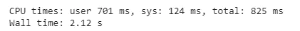
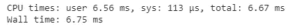

# 让熊猫快速工作

> 原文：<https://towardsdatascience.com/making-pandas-work-fast-35104cafa6b4?source=collection_archive---------33----------------------->

## 用摩丁让熊猫手术更快


照片由[萨夫](https://unsplash.com/@saffu?utm_source=medium&utm_medium=referral)在 [Unsplash](https://unsplash.com?utm_source=medium&utm_medium=referral) 上拍摄

在我们的数据科学之旅中，我们一定都遇到过熊猫。它是最常用的 python 库之一，有助于执行各种操作，如解析数据、创建数据可视化、执行统计操作等。

但是，如果我们处理大型数据集，Pandas 可能会有点慢，它需要时间来加载数据并对其执行操作。那么，对于大型数据集，我们如何让它更快呢？我们可以使用开源 python 库 Modin 来加速熊猫库。

在这篇文章中，我们将探讨如何使用摩丁，并将其与熊猫进行比较。

让我们开始吧…

# 安装所需的库

我们将从使用 pip 安装一个 Modin 开始。下面给出的命令可以做到这一点。

```
!pip install modin[dask]
```

# 导入所需的库

在这一步，我们将导入所需的库，Pandas 和 Modin，因为我们将比较它们加载数据集所用的时间。

```
import modin.pandas as mpd
import pandas as pd
```

# 比较熊猫和摩丁

在这一步中，我们将使用 Pandas 和 Modin 加载数据集，以比较两者所用的时间。为此，您可以使用任何数据集。我用了著名的糖尿病数据集。

```
%%time
df1 = pd.read_csv("/content/Diabetes.csv")
```



熊猫(来源:作者)

```
%%time
df2 = mpd.read_csv("/content/Diabetes.csv")
```



摩丁(来源:作者)

您可以看到，Modin 在加载数据集时花费的时间更少，同样，它在执行所有其他操作时也会节省时间。

继续尝试不同的数据集，并使用 Modin 执行 pandas 操作，节省时间。如果您发现任何困难，请在回复部分告诉我。

本文是与[皮尤什·英加尔](https://medium.com/u/40808d551f5a?source=post_page-----35104cafa6b4--------------------------------)合作完成的。

# 在你走之前

***感谢*** *的阅读！如果你想与我取得联系，请随时通过 hmix13@gmail.com 联系我或我的* [***LinkedIn 个人资料***](http://www.linkedin.com/in/himanshusharmads) *。可以查看我的*[***Github***](https://github.com/hmix13)**简介针对不同的数据科学项目和包教程。还有，随意探索* [***我的简介***](https://medium.com/@hmix13) *，阅读我写过的与数据科学相关的不同文章。**