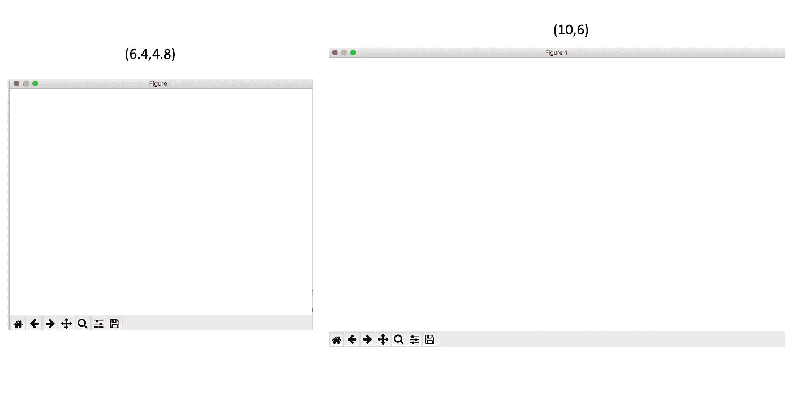
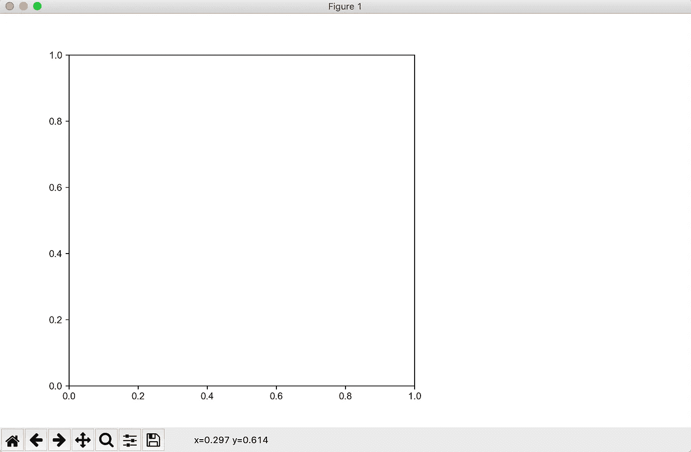
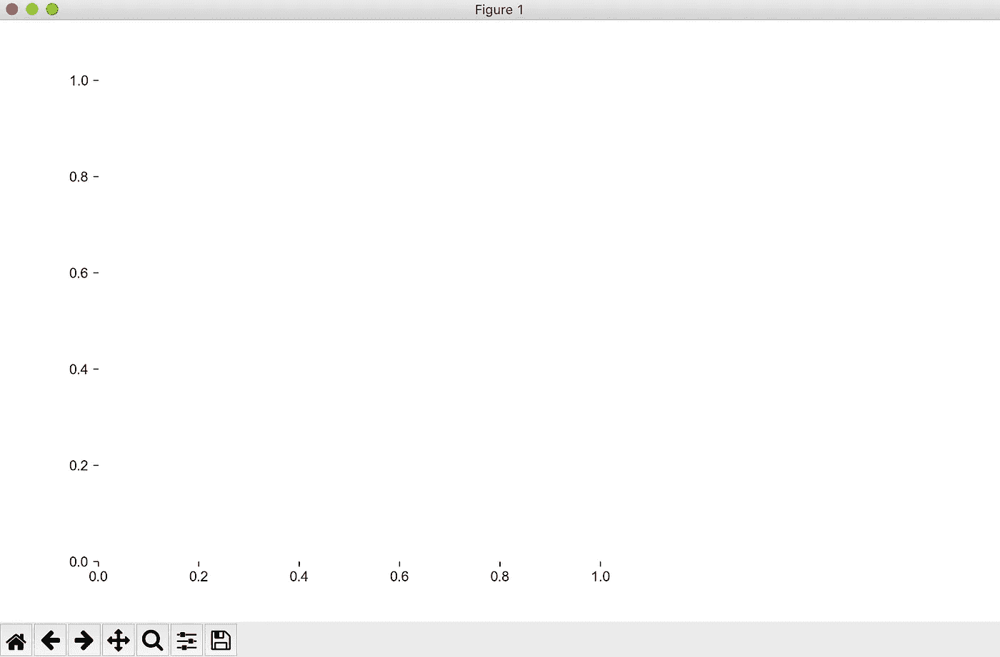
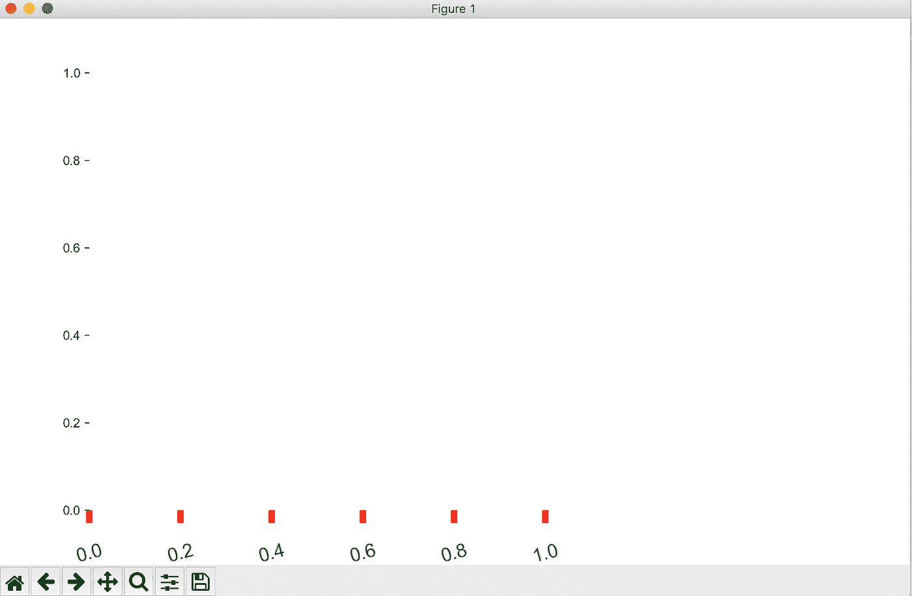
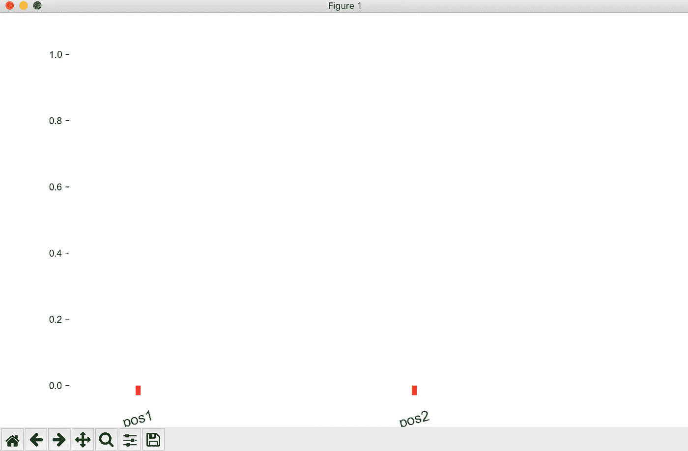
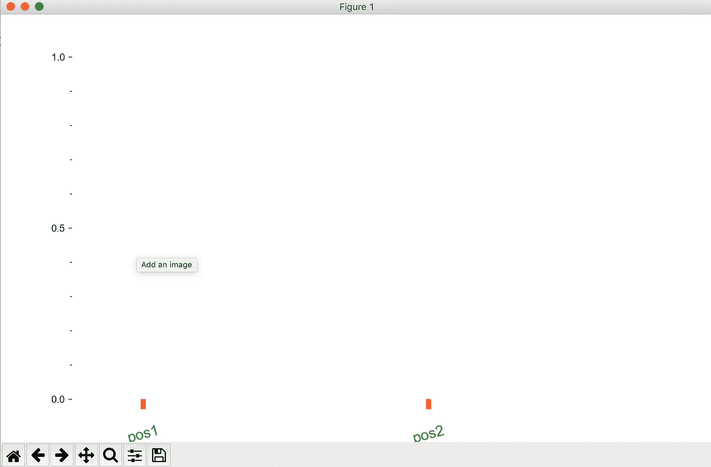
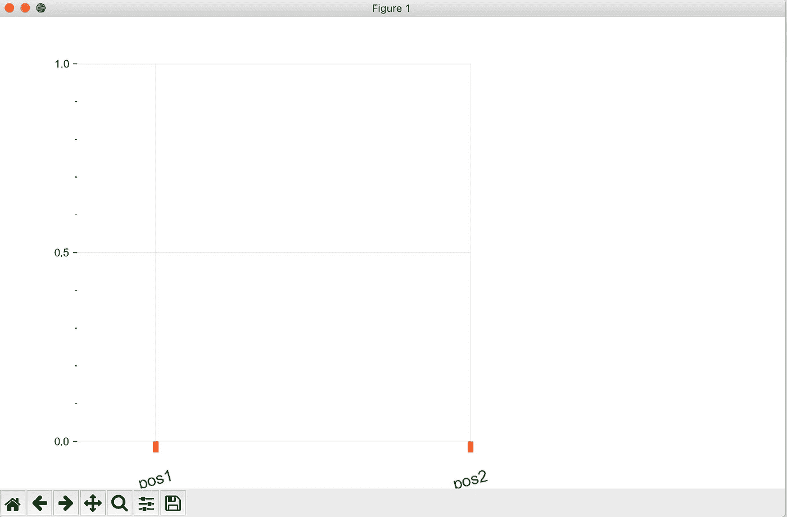
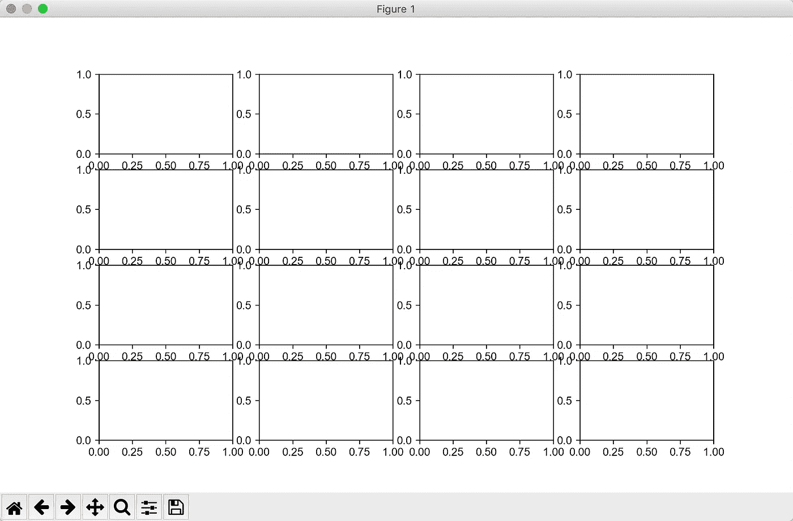
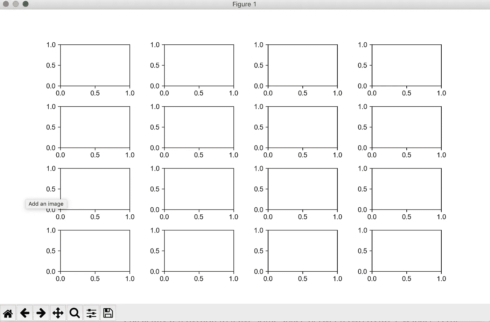

# 用 Python 制作出版物质量的图形(第一部分):图形和轴

> 原文：<https://towardsdatascience.com/making-publication-quality-figures-in-python-part-i-fig-and-axes-d86c3903ad9b?source=collection_archive---------7----------------------->

## [python-可视化-教程](https://towardsdatascience.com/tagged/python-visualization)

## 如何自己完全理解和控制所有的绘图参数


由[迈克尔·泽兹奇](https://unsplash.com/@lazycreekimages?utm_source=medium&utm_medium=referral)在 [Unsplash](https://unsplash.com?utm_source=medium&utm_medium=referral) 上拍摄的照片

在这整个系列中，我将与你分享我通常是如何用 Python 制作出版质量的数字的。我想真正传达如何完全控制 python 情节中的每个元素的想法。本教程结束时，你将能够完全理解用 Python 制作图形的哲学。

因为这将是一个巨大的话题，我决定把它分成几个部分。在本教程的第一部分中，我将把重点放在第一步——理解你将要绘制的画布( **Fig object** )和每个图形的边界( **Ax object** )。在接下来的教程中，我将带你了解如何制作你所熟悉的各种图形(如散点图、箱线图、热图等)。

1.  教程 I: Fig 和 Ax 对象
2.  [教程二:线图、图例、颜色](/making-publication-quality-figures-in-python-part-ii-line-plot-legends-colors-4430a5891706)
3.  [教程三:箱线图、条形图、散点图、直方图、热图、色彩图](https://frankligy.medium.com/making-publication-quality-figures-in-python-part-iii-box-plot-bar-plot-scatter-plot-407fa457449)
4.  [教程四:小提琴剧情，树状图](/making-publication-quality-figures-in-python-part-iv-violin-plot-and-dendrogram-ed0bb8b23ddd)
5.  [教程 Seaborn 的图(聚类热图、pair 图、dist 图等)](https://frankligy.medium.com/all-you-need-to-know-about-seaborn-6678a02f31ff)

所有代码和附加信息可在:[https://github.com/frankligy/python_visualization_tutorial](https://github.com/frankligy/python_visualization_tutorial)获得

我们开始吧！

顺便提一下，有几个 python 绘图包，像 matplotlib、seaborn、plotly 等。我想展示 matplotlib 中的所有技术，因为它是最底层的库，学习 matplotlib 可以让你完全理解所有的细节。我们将在本教程的最后谈到 seaborn，在那里您可以看到这个高级库的好处。然而，学习任何东西都没有捷径，如果你想制作出版物质量的数字并完全控制我们正在制作的数字，matplotlib 是我所能建议的最佳选择。

# 了解 matplotlib 全局参数

首先，让我们加载必要的包，不要害怕，我经常感到不知所措看到人们加载十个不同的包，我不知道他们是什么。你基本上加载 **matplotlib** 包，我们要用的武器。然后是 maplotlib 包中的一个子包 **pyplot** ，这只是为了方便。最后，我们需要使用另一个子包 **ticker** 中的一些有用的函数，这些函数将用于我们定制轴的刻度。所以你看，你真的只是用 matplotlib，没什么复杂的！

```
# load package
import matplotlib as mpl
import matplotlib.pyplot as plt
from matplotlib.ticker import MultipleLocator,FormatStrFormatter,MaxNLocator 
```

在我们开始绘图之前，我想介绍一下 matplotlib 的一些全局设置，它有很多你的图形元素的默认设置，比如字体类型，字体大小，刻度等等。因此，了解这一点是非常重要的，同样，本文的目的是向您展示如何充分理解每个细节。

您可以按如下方式访问全局参数:

```
a = list(mpl.rcParams.keys) # just a dictionary
len(a)
# 305
```

如您所见，共有 305 个全局参数，让我们来看一看:

```
...
axes.grid
axes.grid.axis
axes.grid.which
axes.labelcolor
axes.labelpad
axes.labelsize
axes.labelweight
axes.linewidth
axes.prop_cycle
axes.spines.bottom
axes.spines.left
axes.spines.right
...
```

完整列表可在我的 github 页面获得:[https://github . com/frank ligy/python _ visualization _ tutorial/blob/main/RC params . txt](https://github.com/frankligy/python_visualization_tutorial/blob/main/rcParams.txt)

如果有一些参数您希望所有后续图形都遵循，您可以通过简单地更改这个庞大的 python 字典的值来随时调整任何参数。

我发现更改如下设置很有用，原因是当我们制作出版物质量的图形时，我们有时会使用 Adobe Illustrator 进行最终格式化，默认字体类型在 Adobe Illustrator 中无法识别，所以我将它们更改为 42 号。另外，在学术上，我们更喜欢使用“Arial”字体，所以我也改了。

```
mpl.rcParams['pdf.fonttype'] = 42
mpl.rcParams['ps.fonttype'] = 42
mpl.rcParams['font.family'] = 'Arial'
```

# 您的画布(Fig 对象)

现在让我们创建一个画布:

```
fig = plt.figure(figsize=(10,6))
```

默认的 figsize 是(6.4，4.8)英寸，记住 6.4 英寸是宽度，4.8 英寸是高度。它也可以通过以下方式访问:

```
mpl.rcParams['figure.figsize']
# [6.4, 4.8]
```

让我们看看不同 figsize 的效果，我使用 Pycharm 作为我的 python 编程 IDE，它会立即弹出一个画布窗口，这样你就可以清楚地看到不同之处:



(左侧尺寸)默认的体形尺寸，(右侧)增大的体形尺寸

好了，这就是你要画数字的画布。让我们开始在画布上画一个图形，每个单独的图形将是一个 ax 对象，我们可以通过指定图形的(左，下，宽，高)来创建一个 Ax，当你看到结果时就很清楚了，

```
fig = plt.figure(figsize=(10,6))ax = plt.axes((0.1,0.1,0.5,0.8))
```



该图形由其锚点、左下角(0.1，0.1)和大小参数(0.5，0.8)定位

让我们看看这个元组的值，(0.1，0.1)意味着这个图形的左下角位于整个画布的这个坐标(0.1，0.1)，整个画布将在范围(0，1)内。然后(0.5，0.8)确定宽度将为 0.5，高度将为 0.8。搞定了。

# 操纵 Ax 对象

首先，我想摆脱这个人物的脊椎，我找到 ax.spines 对象，并设置它们不可见。

```
fig = plt.figure(figsize=(10,6))
ax = plt.axes((0.1,0.1,0.5,0.8))ax.spines['right'].set_visible(False)
ax.spines['left'].set_visible(False)
ax.spines['bottom'].set_visible(False)
ax.spines['top'].set_visible(False)
```



去掉四根刺

你看，它们都不见了，现在你可以清楚地看到，一个图形是由四个刺、记号和标签组成的。这是我想在这里传达的信息。

接下来，我们要使用 x 轴刻度和刻度标签，我使用 tick_params 函数将所有参数设置为我想要的值。

```
fig = plt.figure(figsize=(10,6))
ax = plt.axes((0.1,0.1,0.5,0.8))
ax.spines['right'].set_visible(False)
ax.spines['left'].set_visible(False)
ax.spines['bottom'].set_visible(False)
ax.spines['top'].set_visible(False)ax.tick_params(axis='x',which='major',direction='out',length=10,width=5,color='red',pad=15,labelsize=15,labelcolor='green',
               labelrotation=15)
```



玩 x 轴刻度和刻度标签

这里发生了什么？首先，我增加了每个 x 记号的长度和宽度，然后我将 x 记号的颜色改为红色。我增加了 x 记号与它们对应的标签之间的间距，然后我改变了标签的大小和颜色，最后我将标签逆时针旋转了 15 度。我没有动 Y 轴，所以你可以清楚地看到我调整了什么。同样，我希望你能完全控制 python 图形中的每个元素。

除了改变格式，你还可以改变刻度和刻度标签本身，我们使用 set_xticks()函数和 set_xticklabels 函数来实现，见下图效果:

```
fig = plt.figure(figsize=(10,6))
ax = plt.axes((0.1,0.1,0.5,0.8))
ax.spines['right'].set_visible(False)
ax.spines['left'].set_visible(False)
ax.spines['bottom'].set_visible(False)
ax.spines['top'].set_visible(False)
ax.tick_params(axis='x',which='major',direction='out',length=10,width=5,color='red',pad=15,labelsize=15,labelcolor='green',
               labelrotation=15)ax.set_xticks([0.2,1])
ax.set_xticklabels(['pos1','pos2'])
```



更改 x 刻度和 x 刻度标签的内容

接下来，让我们简要介绍一个稍微高级一点的话题，我们上面尝试的都是大分笔成交点，如果你想在每个大分笔成交点间隔之间添加小分笔成交点呢？我们将使用 set_minor_locator()函数，以及开始时从 ticker 子包中导入的 locator()对象。基本上，Locator()确定记号的位置，Formatter()确定记号的格式。这里我们用 Y 轴来证明。

```
fig = plt.figure(figsize=(10,6))
ax = plt.axes((0.1,0.1,0.5,0.8))
ax.spines['right'].set_visible(False)
ax.spines['left'].set_visible(False)
ax.spines['bottom'].set_visible(False)
ax.spines['top'].set_visible(False)
ax.tick_params(axis='x',which='major',direction='out',length=10,width=5,color='red',pad=15,labelsize=15,labelcolor='green',
               labelrotation=15)
ax.set_xticks([0.2,1])
ax.set_xticklabels(['pos1','pos2']) ax.yaxis.set_major_locator(MultipleLocator(0.5))
ax.yaxis.set_minor_locator(MultipleLocator(0.1))
```

**MultipleLocator** 能够在某个基数的倍数的位置创建分笔成交点，在上面的例子中，每 0.1 个单位间隔将有一个次要分笔成交点，每 0.5 个单位间隔将有一个主要分笔成交点。



在 Y 轴上添加次要刻度

您也可以使用 tick_params()函数调整次要刻度参数，只需将“which”参数指定为“minor”。

还有一堆额外的 Locator()和 Formatter()类，我想向您推荐一个解释得很好的博客:[https://jakevdp . github . io/python datasciencehandb/04.10-customizing-ticks . html](https://jakevdp.github.io/PythonDataScienceHandbook/04.10-customizing-ticks.html)

最后，我想告诉你另一件操作 Ax 对象的事情，那就是添加网格线，有时这会使我们的图形看起来更好。

```
fig = plt.figure(figsize=(10,6))
ax = plt.axes((0.1,0.1,0.5,0.8))
ax.spines['right'].set_visible(False)
ax.spines['left'].set_visible(False)
ax.spines['bottom'].set_visible(False)
ax.spines['top'].set_visible(False)
ax.tick_params(axis='x',which='major',direction='out',length=10,width=5,color='red',pad=15,labelsize=15,labelcolor='green',
               labelrotation=15)
ax.set_xticks([0.2,1])
ax.set_xticklabels(['pos1','pos2'])
ax.yaxis.set_major_locator(MultipleLocator(0.5))
ax.yaxis.set_minor_locator(MultipleLocator(0.1))
a=ax.yaxis.get_major_locator()
b=ax.yaxis.get_major_formatter()

ax.grid(True,which='major',axis='both',alpha=0.3)
```

我们使用 grid()函数，并指定我们想要基于两个轴上的主要刻度的网格线(True ),不透明度将为 0.3。



添加网格线

# 检查 Ax 对象

这里我要介绍一类非常重要和有用的方法，我们创建的图形(或 Ax 对象)基本上是一个 python 对象，我们可以通过定义访问它的所有属性。有时，我们需要这些信息来完全控制我们的图形生成过程。

你可以使用 **get** 方法来实现，你基本上可以得到我们刚刚玩过的每一个元素。例如，我想获得 x 轴刻度和刻度标签。

```
fig = plt.figure(figsize=(10,6))
ax = plt.axes((0.1,0.1,0.5,0.8))
ax.spines['right'].set_visible(False)
ax.spines['left'].set_visible(False)
ax.spines['bottom'].set_visible(False)
ax.spines['top'].set_visible(False)
ax.tick_params(axis='x',which='major',direction='out',length=10,width=5,color='red',pad=15,labelsize=15,labelcolor='green',
               labelrotation=15)
ax.set_xticks([0.2,1])
ax.set_xticklabels(['pos1','pos2'])
ax.yaxis.set_major_locator(MultipleLocator(0.5))
ax.yaxis.set_minor_locator(MultipleLocator(0.1))
a=ax.yaxis.get_major_locator()
b=ax.yaxis.get_major_formatter()
ax.grid(True,which='major',axis='both',alpha=0.3)

c = ax.get_xticks()
d = ax.get_xticklabels()
```

我们使用了 get_xticks()和 get_xticklabels()函数，并将返回的对象存储在两个变量 c 和 d 中。

```
print(c)
# [0.2 1\. ]
print(d)
# [Text(0.2, 0, 'pos1'), Text(1.0, 0, 'pos2')]
```

有道理，对吧？我希望到目前为止，你对 python Fig 和 Ax 对象感觉更舒服。实际上，我并没有告诉你如何做出漂亮的图形，但是我给了你一个工具包，你可以用它来做出你想要的任何图形。

# 一张画布上的多个图形

我们经常会遇到这样的情况，我们想在一块画布上制作多个图形。一种方法是像上面那样，通过指定 Ax1 对象的位置元组来手动创建 Ax1 对象，然后一次又一次地对 Ax2 对象做同样的事情。有时候这样做是个好办法。但是，如果你想在一个 9 x 7 的网格中生成 63 个图形，我们该如何实现呢？

我们可以使用 plt.subplots()函数，

```
fig,axes = plt.subplots(nrows=4,ncols=4,figsize=(10,6))
```

在这里，我建立了一个 4 x 4 的网格，并指定 figsize。我们来看看效果:



一张画布上的多个图形

你看到这画布有什么问题了吗？每个图之间有很多重叠，你可以通过增加图的尺寸或者减小标签的字体来解决这个问题，但是我提供了一个更好的方法。

```
fig,axes = plt.subplots(nrows=4,ncols=4,figsize=(10,6),gridspec_kw={'wspace':0.5,'hspace':0.5})
```

我基本上告诉 python 在两个图形之间留一些空间，wspace 是水平间隙，hspace 是垂直间隙。我们来看看效果:



多个图形被很好地分开

好了，我现在就知道这些。我希望现在你能更好地使用 python 来设计和创建你自己的图形。如果将来我发现有趣的技巧和窍门来分享，我可能会给这个故事添加新的内容。另外，请继续关注我的后续教程，我们将深入研究如何制作每一种图形。不要犹豫问我问题。所有的代码都在这里:[https://github.com/frankligy/python_visualization_tutorial](https://github.com/frankligy/python_visualization_tutorial)

如果你喜欢这些教程，请在 medium 上关注我，非常感谢你的支持。在我的 [Twitter](https://twitter.com/FrankLI55917967) 或 [LinkedIn](https://www.linkedin.com/in/guangyuan-li-399617173/) 上联系我，也可以问我你想学习如何简洁地画哪种图形，我会回复你！

# 继续阅读

教程二:[线图、图例和颜色](/making-publication-quality-figures-in-python-part-ii-line-plot-legends-colors-4430a5891706)

教程三:[箱线图、条形图、散点图、直方图、热图、色彩图](https://frankligy.medium.com/making-publication-quality-figures-in-python-part-iii-box-plot-bar-plot-scatter-plot-407fa457449)

教程四:[小提琴剧情，树状图](/making-publication-quality-figures-in-python-part-iv-violin-plot-and-dendrogram-ed0bb8b23ddd)

教程 V:[Seaborn 的图(聚类热图、对图、距离图等)](https://frankligy.medium.com/all-you-need-to-know-about-seaborn-6678a02f31ff)