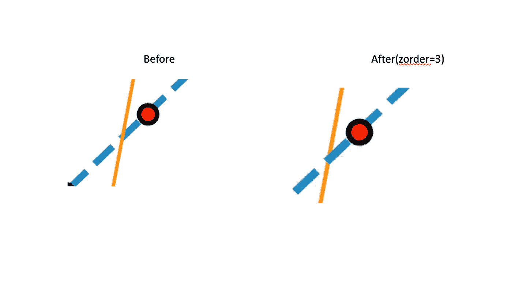

# 用 python 制作出版物质量的图形(第二部分):线图、图例、颜色

> 原文：<https://towardsdatascience.com/making-publication-quality-figures-in-python-part-ii-line-plot-legends-colors-4430a5891706?source=collection_archive---------12----------------------->

## [python-可视化-教程](https://towardsdatascience.com/tagged/python-visualization)

## 学习如何绘制线图，理解图例和颜色


照片由[Cookie Pom](https://unsplash.com/@cookiethepom?utm_source=medium&utm_medium=referral)在 [Unsplash](https://unsplash.com?utm_source=medium&utm_medium=referral) 上拍摄

这是我的 python 可视化教程的第二篇文章:制作出版物质量的图形。以下是我到目前为止已经发表并将很快发表的文章列表:

1.  [教程一:Fig 和 Ax 对象](/making-publication-quality-figures-in-python-part-i-fig-and-axes-d86c3903ad9b)
2.  教程 II:线形图、图例、颜色
3.  [教程三:箱线图、条形图、散点图、直方图、热图、色彩图](https://frankligy.medium.com/making-publication-quality-figures-in-python-part-iii-box-plot-bar-plot-scatter-plot-407fa457449)
4.  [教程四:小提琴剧情，树状图](https://frankligy.medium.com/making-publication-quality-figures-in-python-part-iv-violin-plot-and-dendrogram-ed0bb8b23ddd)
5.  [教程 Seaborn 的图(聚类热图、pair 图、dist 图等)](https://frankligy.medium.com/all-you-need-to-know-about-seaborn-6678a02f31ff)

如果您还没有查看教程 I，我建议您在阅读本文之前先查看一下。然而，如果你已经很好地理解了什么是图形和轴对象，可以跳过第一部分。

在本文中，我将以线图为例向您展示:

1.  关于线图你需要知道的每一个元素。
2.  涵盖了 matplotlib 颜色的一部分知识。(将在后面的教程中继续讨论)
3.  了解图例是什么以及如何控制它们。

同样，所有的代码都可以在我的 GitHub 页面上找到:[https://github.com/frankligy/python_visualization_tutorial](https://github.com/frankligy/python_visualization_tutorial)

事不宜迟，我们开始吧！

我会把所有的内容串成一个简单的线条图。首先，我们将加载 matplotlib 包，并稍微更改一下全局设置，以确保字体类型和字体系列是我们想要的，如果这是我想了解的更多信息，请查看第一篇教程[。](/making-publication-quality-figures-in-python-part-i-fig-and-axes-d86c3903ad9b)

此外，我将为绘制线图做一点准备，只需创建一些随机数据`x,y1,y2` 来绘制图形。

# **绘制线条图**

与其他图相比，折线图可以说是最简单的图，它将帮助我们展示数据的动态趋势，并帮助读者比较几个类别之间的内在差异。上面，我创建了一个数组`x`和两个响应数组`y1`和`y2`。现在让我们首先通过使用`ax.plot()`基本函数绘制`y1`与变量`x`的关系。

```
fig = plt.figure(figsize=(10,6))
ax = fig.add_axes([0.1,0.1,0.5,0.8])ax.plot(x,y1) 
```

你会有一个非常基本的线图:


基本线图

然后让我们再次开始玩一些参数，我会向你解释每个参数的意思，以及如何理解它们。但首先，让我们看看效果:

```
fig = plt.figure(figsize=(10,6))
ax = fig.add_axes([0.1,0.1,0.5,0.8])ax.plot(x,y1,   # data
marker='o',     # each marker will be rendered as a circle
markersize=8,   # marker size
markerfacecolor='red',   # marker facecolor
markeredgecolor='black',  # marker edgecolor
markeredgewidth=2,       # marker edge width
linestyle='--',            # line style will be dash line
linewidth=3)          # line width 
```


修改的线图

现在我们来思考一下，**线状图是由什么构成的？**它是一系列标记和一条线，对吗？因此，当我们调整线形图的外观时，我们将首先调整标记的外观，包括标记样式、标记大小、标记表面颜色、标记边缘颜色、标记边缘宽度。然后让我们移动到线条，我们可以调整线条样式和线条宽度。为了帮助您理解这一过程，我们提出了这样一个问题:为什么我们最初在默认设置下绘制的基本图看起来像这样？

要回答这个问题，我们需要再次检查`rcParams` 全局设置。

```
mpl.rcParams['lines.marker']  #None
mpl.rcParams['lines.markersize']  #6.0
mpl.rcParams['lines.linewidth']   # 1.5
```

我们会看到，默认情况下，不会有任何标记样式，所以你没有看到任何标记，但一条蓝线。默认情况下，标记大小为 6.0，现在我们将其放大到 8.0。默认的线宽是 1.5，现在是 3.0。

我希望现在我们会对线条图更加熟悉，并且知道如何控制它，因为我们已经了解了它的所有构成。会有一个快捷参数叫做`fmt`代表格式化字符串，`fmt='ro-'`相当于`marker='o',markerfacecolor='red',linestype='-'`。但是，我再次建议通过明确地指定它们来完全理解每个参数所代表的内容。

完事了吗？当然不是，但这是我接下来材料的第一步。

# 颜色和“zorder”

接下来，让我们在刚刚画出的第一条线的上面画第二条线。

```
fig = plt.figure(figsize=(10,6))
ax = fig.add_axes([0.1,0.1,0.5,0.8])
ax.plot(x,y1,marker='o',markersize=8,markerfacecolor='red',markeredgecolor='black',markeredgewidth=2,linestyle='--',linewidth=3)ax.plot(x,y2,marker='o')
```


用橙色绘制另一个线图

让我问你两个问题:

1.  现在橙色线在蓝色线的上面，这是由我们画这两条线的顺序决定的。但是，如果我希望我的蓝线向我们移动，即使它不是我们画的最后一条线，该怎么办呢？

2.我们没有指定第二个图的颜色，为什么渲染成橙色？

让我们首先解决问题 1。为了实现这一点，我们需要使用`zorder`参数。它决定了哪条线(艺术家对象)将被首先画出，`zorder`越高，这条线将被画得越晚，因此它将更靠近我们。现在让我们把蓝线的`zorder`增加到 3。

```
fig = plt.figure(figsize=(10,6))
ax = fig.add_axes([0.1,0.1,0.5,0.8])
ax.plot(x,y1,marker='o',markersize=8,markerfacecolor='red',markeredgecolor='black',markeredgewidth=2,linestyle='--',linewidth=3,zorder=3)ax.plot(x,y2,marker='o')
```



(左)前面的图，(右)我们将蓝线的“zorder”增加到 3

对于第二个问题，我们将稍微涉及一下 python 的颜色。基本上，matplotlib 根据全局设置`rcParams['axes.prop_cycle']`确定第二行的颜色为橙色，列表如下:

```
cycler('color', ['#1f77b4', '#ff7f0e', '#2ca02c', '#d62728', '#9467bd', '#8c564b', '#e377c2', '#7f7f7f', '#bcbd22', '#17becf'])
```

如您所见，有十种颜色，如果您连续绘制 10 条线，每条线将被分配到该颜色列表中基于颜色的索引。

默认情况下，第一行会采用第一个十六进制颜色“#1f77b4”，为蓝色，第二行自然会采用第二个“#ff7f0e”，为橙色。现在有意义了，对吧？但是让我给你展示更多关于颜色系统的东西。

我不打算向你解释整个色彩理论，例如，互补色图式等等。因为我不是这方面的专家，我也不想假装是。但这里有一些我做数字时遵循的提示，经验法则是，

**在分类变量中，您需要选择对比明显的颜色，例如蓝色和橙色。**

**在连续变量中，比如热图，你最好选择连续色图(cmap)来反映它们的关联性。**

因此，在线图中，我们希望反映不同线条之间的差异，我建议您在大多数情况下坚持使用 python 默认的颜色系统，因为它们使用的颜色确实有非常强烈的对比效果，就像我上面显示的蓝色和橙色。您可以通过使用十六进制符号来表示每种颜色，并且您可以使用如下方式将每个十六进制符号转换为(红色、绿色、蓝色)元组:

```
mpl.colors.to_rgb('#1f77b4')
#(0.12156862745098039, 0.4666666666666667, 0.7058823529411765)
```

在 Maplotlib 中，它也有一些表示颜色的快捷方式，有 8 个内置的单字母颜色(b-blue，g-green，r-red，c-cyan，m-magenta，y-yellow，k-black，w-white)和一个 tableau 调色板，与我们刚刚打印出来的设置`rcParams['axes.prop_cycle']`相同。此外，还有一堆颜色可以通过特定的名称访问，如“橙色”，完整列表显示在此[https://matplotlib . org/3 . 1 . 0/gallery/color/named _ colors . html](https://matplotlib.org/3.1.0/gallery/color/named_colors.html)

请查看它们，更好地了解 maplotlib 中的颜色系统。**总之**，无论何时你想告诉 maplotlib 用某种颜色画任何东西，你都可以选择:

1.  **十六进制符号**(我建议保存一份你读过的论文中你发现它们的颜色令人印象深刻的颜色列表，或者你可以通过打印出`rcParams['axes.prop_cycle']`来使用 python 默认的 tableau 调色板)
2.  **单字母快捷键**，仅适用于 8 种内置类型
3.  **可以通过字符串对象**访问的其他颜色，如“橙色”。

对于连续和离散的色彩图，当我们绘制散点图或热图时，我会涉及到它，因为我相信当你实际使用它并看到它的效果时，它会更有意义。但现在，我希望你能更好地理解如何选择颜色，并理解不同的颜色表示，当涉及到分类/定性变量时。

# 传说

我们仍将使用这个线图示例来说明如何向 python 图添加图例。最简单的方法是在蓝线和橙线中添加一个标签参数。然后我们调用函数`ax.legend()`，它会自动检测这两行和对应的标签信息。

```
fig = plt.figure(figsize=(10,6))
ax = fig.add_axes([0.1,0.1,0.5,0.8])ax.plot(x,y1,marker='o',markersize=8,markerfacecolor='red',markeredgecolor='black',markeredgewidth=2,
linestyle='--',linewidth=3,zorder=2,label='blue line')
ax.plot(x,y2,marker='o',label='orange line')ax.legend()
```


自动添加图例

然而，这种方法并不能帮助我们理解它实际上是如何工作的。因此，我将向您展示如何明确地向图形添加图例。

`ax.legend()`该函数接受两个参数，`handles`和`labels`，`hanles`将是一个存储 matplotlib `Artist`对象的列表。我们刚刚画的蓝线将是一个`Artist`对象，橙色线也是。`labels`将是一个列表，存储与您要分配给`handles`列表中每个`Artist`对象的标签相对应的字符串对象。我们首先需要从我们刚刚画的图中提取出`Artist`对象。

```
p1 = ax.plot(x,y1,marker='o',markersize=8,markerfacecolor='red',markeredgecolor='black',markeredgewidth=2,
        linestyle='--',linewidth=3,zorder=3)p2 = ax.plot(x,y2,marker='o')
```

我使用两个变量`p1`和`p2`来存储 ax.plot()函数返回的数据。让我们检查这两个变量:

```
print(p1)
#[<matplotlib.lines.Line2D object at 0x1822957f0>]
type(p1)
# <class 'list'>
type(p1[0])
# <class 'matplotlib.lines.Line2D'>
```

你看，p1 将是一个只有一个元素的列表，我们通过 p1[0]访问这个元素，p1[0]将是一个 Line2D 对象，这是一个`Artist`对象，我们可以传递给 ax.legend()函数。p2[0]也是如此。

现在让我们明确地添加图例:

```
fig = plt.figure(figsize=(10,6))
ax = fig.add_axes([0.1,0.1,0.5,0.8])
p1 = ax.plot(x,y1,marker='o',markersize=8,markerfacecolor='red',markeredgecolor='black',markeredgewidth=2,
        linestyle='--',linewidth=3,zorder=3)
p2 = ax.plot(x,y2,marker='o')ax.legend(handles=[p1[0],p2[0]],labels=['blue line','orange line'])
```


显式添加图例

我将总是使用后一种方法，因为这是 ax.legend()函数实际工作的方式。同样，快捷方式是方便的，但是理解这些机制可以帮助您实现简单快捷方式无法实现的目标。

现在我想挑战一下自己，向你展示一下传奇实际上是 python 情节中的一个独立元素。这一次，我们将不会从刚刚绘制的线图中提取`Artist`对象。相反，我将从头开始创建`handles`。


单独图例添加

在这里，我实际上没有绘制线条，只是使用 ax.plot()函数得到两个句柄，`h1`和`h2`，它们将用于添加图例。现在你知道了，事实上传奇是你可以随意改变的东西。

最后，我将与你分享另一个完全控制图例的技巧，那就是调整它的位置和外观。

```
ax.legend(handles=[p1[0],p2[0]],
labels=['blue line','orange line'],
loc='upper left',
bbox_to_anchor=(1,1))
```

我添加了两个额外的参数，这意味着，使用图例的左上角作为一个锚点，并将这个锚点放置到 ax 坐标(1，1)，记住这里整个 ax 对象将在范围(0，1)内。现在让我们看看效果，然后一切都有意义了:


调整图例框的位置

如果你想去掉图例框的框架并给图例添加一个标题，我们可以这样做:

```
ax.legend(handles=[p1[0],p2[0]],
labels=['blue line','orange line'],
loc='upper left',
bbox_to_anchor=(1,1),
title='legend',
frameon=False)
```

只需添加两个参数，`title`和`frameon`。搞定了。


修改图例框的外观

好了，这就把我们带到了本教程的结尾，我希望它能以某种方式帮助你。我的目标是真正帮助你理解 maplotlib 绘制过程的底层细节。明白了这一点，你就可以使用这些技巧来设计你自己的形象，有时审美偏好因人而异，但我打算与你分享一些技术机制，通过这些机制，你可以使用你最喜欢的审美风格来构建自己的情节。

如果你喜欢这些教程，请在 medium 上关注我，我将教你如何在 matplotlib 中制作小提琴图和树状图，非常感谢你的支持。在我的 [Twitter](https://twitter.com/FrankLI55917967) 或 [LinkedIn](https://www.linkedin.com/in/guangyuan-li-399617173/) 上联系我，也请问我关于你想学习如何以简洁的方式绘制哪种图形的问题，我会回复！

所有代码都可以在[https://github.com/frankligy/python_visualization_tutorial](https://github.com/frankligy/python_visualization_tutorial)获得

# 继续阅读

[教程三:箱线图、条形图、散点图、直方图、热图、色彩图](https://frankligy.medium.com/making-publication-quality-figures-in-python-part-iii-box-plot-bar-plot-scatter-plot-407fa457449)

[教程四:小提琴剧情，树状图](https://frankligy.medium.com/making-publication-quality-figures-in-python-part-iv-violin-plot-and-dendrogram-ed0bb8b23ddd)

[教程 Seaborn 的图(聚类热图、pair 图、dist 图等)](https://frankligy.medium.com/all-you-need-to-know-about-seaborn-6678a02f31ff)