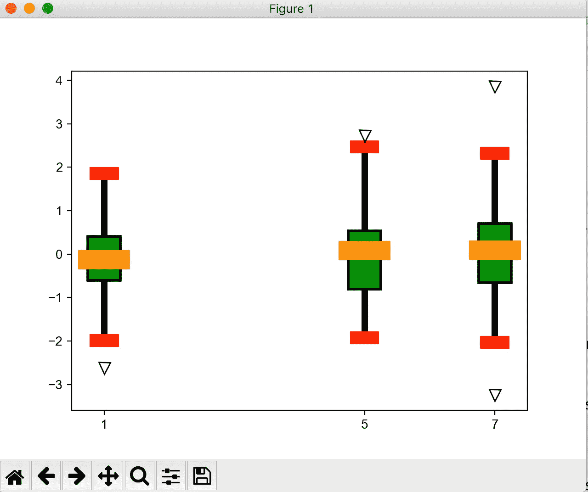
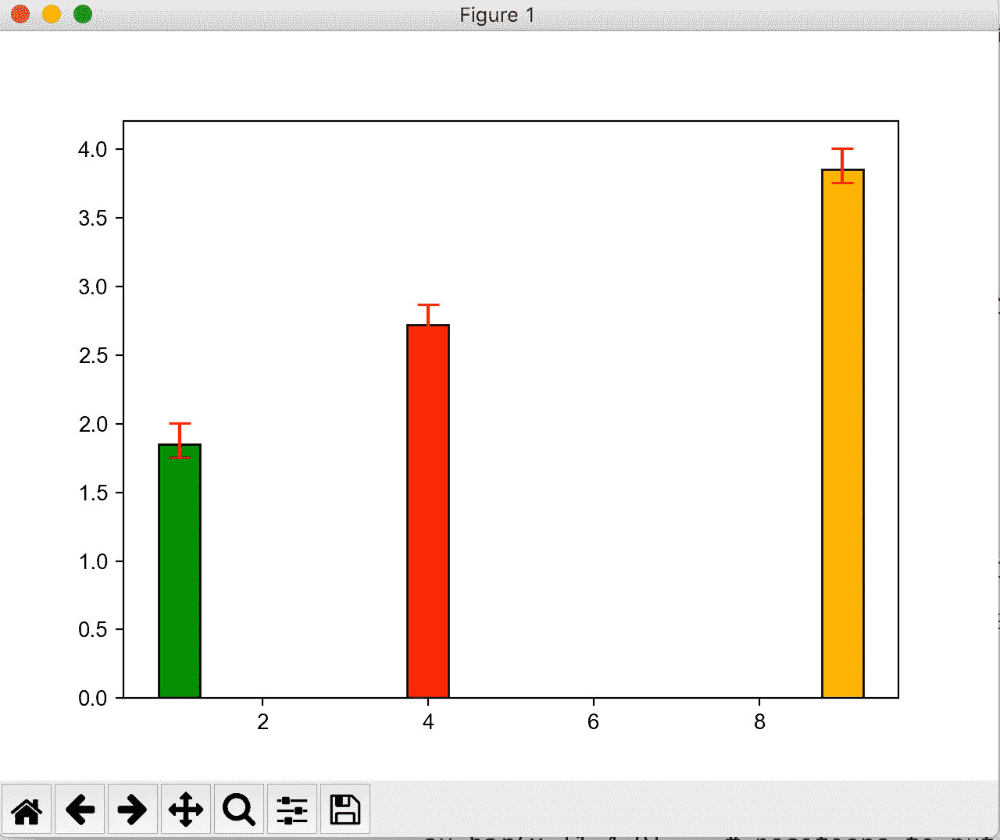
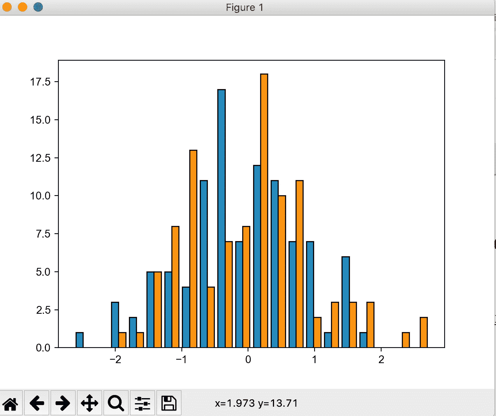
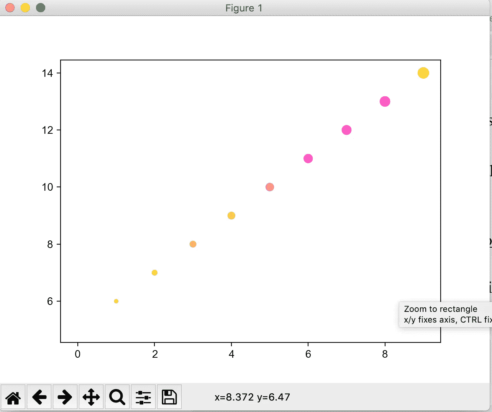
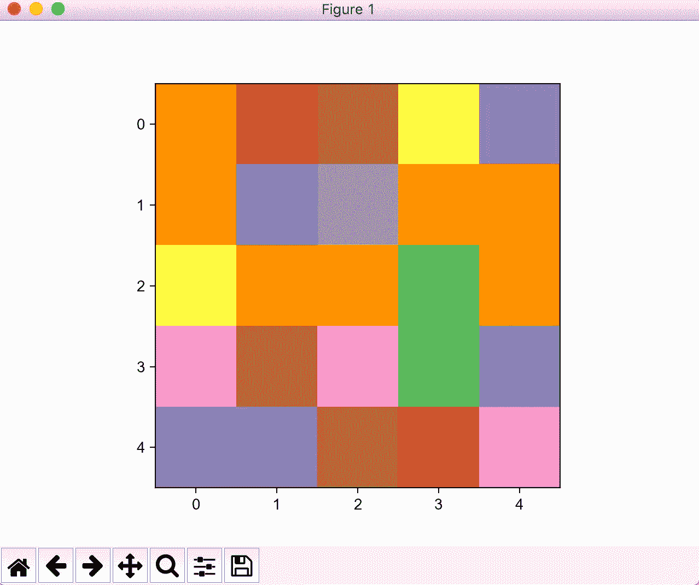
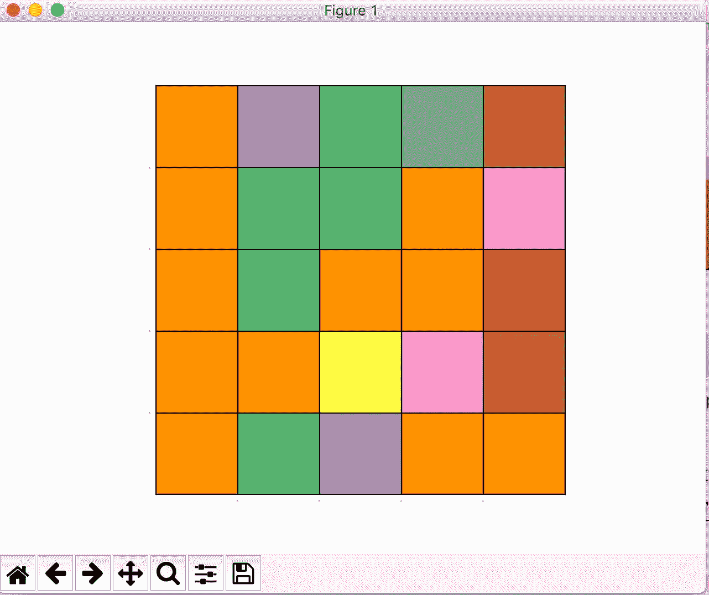

# 用 Python 制作出版物质量的图形(第三部分):箱线图、条形图、散点图、直方图、热图、彩色图

> 原文：<https://towardsdatascience.com/making-publication-quality-figures-in-python-part-iii-box-plot-bar-plot-scatter-plot-407fa457449?source=collection_archive---------25----------------------->

## [实践教程](https://towardsdatascience.com/tagged/hands-on-tutorials)

## 带您了解如何理解这些广泛使用的图形类型背后的机制


由[米利安·耶西耶](https://unsplash.com/@mjessier?utm_source=medium&utm_medium=referral)在 [Unsplash](https://unsplash.com?utm_source=medium&utm_medium=referral) 上拍摄的照片

这是我的第三篇教程，这里列出了我以前所有的帖子和我即将发布的帖子:

1.  [教程一:Fig 和 Ax 对象](/making-publication-quality-figures-in-python-part-i-fig-and-axes-d86c3903ad9b)
2.  [教程二:线图、图例、颜色](/making-publication-quality-figures-in-python-part-ii-line-plot-legends-colors-4430a5891706)
3.  教程 III:箱线图、条形图、散点图、直方图、热图、色彩图
4.  [教程四:小提琴剧情，树状图](/making-publication-quality-figures-in-python-part-iv-violin-plot-and-dendrogram-ed0bb8b23ddd)
5.  [教程 Seaborn 的图(聚类热图、pair 图、dist 图等)](https://frankligy.medium.com/all-you-need-to-know-about-seaborn-6678a02f31ff)

我为什么做这个教程？你有什么理由需要把宝贵的时间花在阅读这篇文章上？我想分享一下学习 matplotlib 的最重要的事情，**就是理解每种类型图形的构建模块，以及如何完全控制它们**。有了这款 undersood，你可以轻松构建出你喜欢的任何图形，无论它有多复杂。我会用非常虚拟的例子来夸大情节中的每个元素，以便让你感受到每个元素在哪里，它们是如何布局的。

我制作本教程的第二个动机是**我想向你展示如何阅读 matplotlib 文档**。仅仅通过阅读我的教程或任何一个单独的教程是不可能学会 matplotlib 的，(**不要相信任何题为“5 分钟学会 XXX”**的文章)，但我想与你分享当你有问题时你应该去哪里查找资源。如何快速找到你正在寻找的解决方案？

如果这符合你的需求，那么这就是适合你的文章。

所有的代码都可以在 https://github.com/frankligy/python_visualization_tutorial 买到

# 箱线图

当您制作箱线图时，您基本上输入一维数组的序列，每个数组的分布将由一个方框表示，该方框显示数据的中值、25%分位数、75%分位数以及上限(q3 + 1.5*IQR)和下限(Q1–1.5 * IQR)。

```
# load packages
import matplotlib as mpl
import matplotlib.pyplot as plt
import numpy as np# prepare some data
np.random.seed(42)
data1 = np.random.randn(100)
data2 = np.random.randn(100)
data3 = np.random.randn(100) fig,ax = plt.subplots()
bp = ax.boxplot(x=[data1,data2,data3],  # sequence of arrays
positions=[1,5,7],   # where to put these arrays
patch_artist=True).  # allow filling the box with colors
```


基本箱形图

一个盒子由一个盒体(中间的矩形)、须(垂直线)、帽(水平帽)、中线(橙色线)、传单(离群标记)组成。如何控制所有人？

ax.boxplot()函数将返回一个 python 字典，该字典如下所示:

```
{'whiskers': [<matplotlib.lines.Line2D object at 0x16b113748>, <matplotlib.lines.Line2D object at 0x16b1136a0>, <matplotlib.lines.Line2D object at 0x16b22b978>, <matplotlib.lines.Line2D object at 0x16b22b2b0>, <matplotlib.lines.Line2D object at 0x16145f390>, <matplotlib.lines.Line2D object at 0x16145f7f0>], 'caps': [<matplotlib.lines.Line2D object at 0x16b1bee10>, <matplotlib.lines.Line2D object at 0x16b1c7358>, <matplotlib.lines.Line2D object at 0x1961afd30>, <matplotlib.lines.Line2D object at 0x1961afb00>, <matplotlib.lines.Line2D object at 0x16b4672b0>, <matplotlib.lines.Line2D object at 0x153ea0eb8>],

'boxes': [<matplotlib.patches.PathPatch object at 0x1614793c8>, <matplotlib.patches.PathPatch object at 0x16b3acc18>, <matplotlib.patches.PathPatch object at 0x16b399b00>], 'medians': [<matplotlib.lines.Line2D object at 0x1546fb5f8>, <matplotlib.lines.Line2D object at 0x1960db9b0>, <matplotlib.lines.Line2D object at 0x153ea0518>], 'fliers': [<matplotlib.lines.Line2D object at 0x16b1e3ba8>, <matplotlib.lines.Line2D object at 0x1960f9fd0>, <matplotlib.lines.Line2D object at 0x161476898>], 
'means': []}
```

它准确地存储了您想要修改的所有`Artist`元素。这里是关键的部分，例如，`boxes`键下有三个`PathPatch`物体，它们对应上面图中的三个箱体。每个箱体将是一个`PathPatch`对象。(如果你没有指定`patch_artist = True`，它们将是`Line2D`对象)。**这是我想说明的一点——学习和理解 matplotlib 的正确方法是理解每个元素是什么对象。图中显示的每个美学元素都有一个指向它的底层 python 对象。每个底层 python 对象都拥有自己的方法和属性，这是我们需要掌握的知识，以便能够随意修改情节。**

不知道`PathPatch`对象是什么，也不知道`Line2D`。所以我通过谷歌搜索找到了这些文件:

[https://matplotlib . org/3 . 1 . 1/API/_ as _ gen/matplotlib . patches . path patch . html](https://matplotlib.org/3.1.1/api/_as_gen/matplotlib.patches.PathPatch.html)

他们告诉我这个对象有一个有效的属性叫做`facecolor`，所以我点击这个属性，并找到如何将它设置为不同颜色的方法。

[https://matplotlib . org/3 . 1 . 1/API/_ as _ gen/matplotlib . patches . patch . html # matplotlib . patches . patch . set _ face color](https://matplotlib.org/3.1.1/api/_as_gen/matplotlib.patches.Patch.html#matplotlib.patches.Patch.set_facecolor)

现在我知道我只需要使用`set_facecolor`功能来调整我所有箱体的正面颜色。然后，基本上对盒状图中的所有元素做同样的事情，如下所示:

```
for flier in bp['fliers']:    # outliers
    flier.set_markersize(9)
    flier.set_marker('v')
for box in bp['boxes']:     # box bodys
    box.set_facecolor('green')
    box.set_edgecolor('black')
    box.set_linewidth(2)
for whisker in bp['whiskers']:   # whisker line
    whisker.set_linewidth(5)
for cap in bp['caps']:     # cap line
    cap.set_color('red')
    cap.set_linewidth(10)
for median in bp['medians']:   # median line
    median.set_linewidth(15)
```



改良箱线图

我故意把这个图形做成虚拟的，以突出每个独立的元素。这是方块图的组成部分，现在明白了，难道你不能做出任何你想要的方块图吗，你可以！

并且一定要定期查看文档，这是掌握 matplotlib 的必经之路。

# **柱状图**

同样的哲学也适用于我将在这里讲述的所有其他情节。对于柱状图，你基本上告诉他们我想画一个带有某个`height`的柱状图，我会把柱状图放在某个`position`上。除此之外，他们只是一些审美调整。

```
fig,ax = plt.subplots()
ax.bar(x=[1,4,9],   # positions to put the bar to
height=(data1.max(),data2.max(),data3.max()),  # height of each bar
width=0.5,   # width of the bar
edgecolor='black',   # edgecolor of the bar
color=['green','red','orange'],    # fill color of the bar
yerr=np.array([[0.1,0.1,0.1],[0.15,0.15,0.15]]), # 
ecolor='red',
capsize=5)
```



条形图

同样，条形图的构建块就是这么简单，然后请确保查看条形图的文档:

[https://matplotlib . org/3 . 3 . 3/API/_ as _ gen/matplotlib . axes . axes . bar . html](https://matplotlib.org/3.3.3/api/_as_gen/matplotlib.axes.Axes.bar.html)

# 柱状图

直方图是显示单个数组分布的图，它将显示数组中有多少元素落入每个面元中。所以你只要给他们一个数组，它就会给你画一个直方图，就是这样。

```
fig,ax = plt.subplots()
ax.hist(x=[data1,data2],bins=20,edgecolor='black')
```



柱状图

分享一点经验，我一直发现 ax.hist()函数的默认`bin`数没那么好看，把`bin`设置成一个大的数字可能会产生更好的视觉效果。然后添加一个黑边也可以帮助它。

提醒一下，请参考他们的官方文档了解更多信息:

[https://matplotlib . org/3 . 3 . 3/API/_ as _ gen/matplotlib . axes . axes . hist . html](https://matplotlib.org/3.3.3/api/_as_gen/matplotlib.axes.Axes.hist.html)

# 散点图

散点图被广泛使用，它显示点在 2D 平面甚至三维平面中的分布。这里我们只关注 2D 的情节。想法是，对于一系列的点，你准备四个与存储所有点的数组长度相同的向量:

`x`数组中所有点的 x 坐标

`y`数组中所有点的 y 坐标

`s`数组中所有点的大小

`c`数组中所有点的颜色

然后就可以开始出图了。

```
fig,ax = plt.subplots()
ax.scatter(x=[1,2,3],y=[1,2,3],s=[100,200,300],c=['r','g','b'])
```


简单但完整的散点图

现在，我需要介绍一下**色图**的知识，请允许我暂时离题。到目前为止，我们只处理离散的颜色，像这里，我们有红色，蓝色和绿色。有时，我们希望颜色在相邻颜色非常相似的意义上是连续的，我们希望利用颜色的这种相似性来传递一些重要的信息，即这两点之间的相似性。

我们需要连续的颜色，也就是彩色地图。Matplotlib 有很多彩色地图，请在这里查看:

[https://matplotlib . org/3 . 1 . 0/tutorials/colors/colormaps . html](https://matplotlib.org/3.1.0/tutorials/colors/colormaps.html)

你真正需要做的是简单地选择一个颜色图，默认的颜色图叫做`viridis`，但是你可以指定它为例如`autumn`。

让我们看看它在另一个散点图示例中是如何工作:

```
fig,ax = plt.subplots()
ax.scatter(x=np.arange(10),
y=np.arange(10)+5,
s=np.arange(10)*10,
c=np.random.rand(10),  # make sure c is numeric value
cmap='spring')
```



使用彩色地图的散点图

确保这里的`c`需要是一系列数值，所以函数将映射这些浮点值，例如[0.1，0.2，0.3…]来绘制一系列的颜色图，这样你就给每个点分配了相应的颜色。

检查散点图文档，不要忘记！

[https://matplotlib . org/3 . 3 . 3/API/_ as _ gen/matplotlib . axes . axes . scatter . html](https://matplotlib.org/3.3.3/api/_as_gen/matplotlib.axes.Axes.scatter.html)

# 彩色地图

在这一节中，我们将更深入地研究颜色图。有两种经常遇到的情况:

1.  我想使用一个连续的颜色图来给我的连续变量分配颜色，例如，热图，散点图等。
2.  我想提取一定数量的颜色来表示我的离散变量，例如，我有 18 类对象，我需要给它们分配颜色，使它们的差异可以很容易被人眼分辨出来。

第一种情况相对简单，大多数时候你需要做的只是指定一个“cmap”字符串，比如“viridis”或“autumn”。第二种情况可能有点复杂。

如果您想要的颜色数量少于 10 种，您可以使用`rcParams[axes.prop_cycle]`中默认的 10 种颜色:

```
cycler('color', ['#1f77b4', '#ff7f0e', '#2ca02c', '#d62728', '#9467bd', '#8c564b', '#e377c2', '#7f7f7f', '#bcbd22', '#17becf'])
```

或者你可以从任何定性的彩色地图中提取:

如果要<12 colors:

```
import matplotlib.pyplot as plt
from matplotlib.colors import to_hex,to_rgb,to_rgbaa = [to_hex(i) for i in plt.get_cmap('Set3').colors[:12]
```

This is what we get:

```
['#8dd3c7',
 '#ffffb3',
 '#bebada',
 '#fb8072',
 '#80b1d3',
 '#fdb462',
 '#b3de69',
 '#fccde5',
 '#d9d9d9',
 '#bc80bd',
 '#ccebc5',
 '#ffed6f']
```

If you want < 20 colors, just change “Set3” to “tab20”, “tab20b” or “tab20c” where 20 colors are available to choose.

# Heatmap

What is a heatmap? Heatmap is basically mapping a 2D numeric matrix to a color map (we just covered). So the input is a 2D numeric array, that’s it.

```
fig,ax = plt.subplots()
ax.imshow(np.random.randn(5,5),cmap='Set1')
```



Basic heatmap

Most often, I need to add a grid line and text onto the basic heatmap, I already taught how to add a grid line in [教程一:Fig 和 Ax 对象](/making-publication-quality-figures-in-python-part-i-fig-and-axes-d86c3903ad9b)。

```
fig,ax = plt.subplots()
ax.imshow(np.random.randn(5,5),cmap='Set1')
ax.set_xticks(np.linspace(0.5,3.5,4))
ax.set_yticks(np.linspace(0.5,3.5,4))
ax.tick_params(axis='both',length=0,labelsize=0)
ax.grid(b=True,which='major',axis='both',color='black')
```



带网格线的热图

最后，在 matplotlib 中，你可以通过`ax.text()`灵活地在图形上添加文字，你只需要指定你想写下的位置/坐标，然后告诉它你想写什么，简单吧？

```
fig,ax = plt.subplots()
ax.imshow(np.random.randn(5,5),cmap='Set1')
ax.set_xticks(np.linspace(0.5,3.5,4))
ax.set_yticks(np.linspace(0.5,3.5,4))
ax.tick_params(axis='both',length=0,labelsize=0)
ax.grid(b=True,which='major',axis='both',color='black')
ax.text(-0.2,3,'hey')
```


向热图添加文本

# 结论

正如我所说，一个教程涵盖 matplotlib 的所有方面是不现实的，我还在学习。但我想“授人以鱼”，而不是“给你一条鱼”。此外，我一直认为我们应该从最简单的案例中学习一切，这就是为什么我试图用非常愚蠢的例子来涵盖基本概念。但是您应该能够使用这里介绍的技巧来绘制自己的图形。

如果你喜欢这些教程，请在 medium 上关注我，我将教你如何在 matplotlib 中制作小提琴图和树状图，非常感谢你的支持。在我的 [Twitter](https://twitter.com/FrankLI55917967) 或 [LinkedIn](https://www.linkedin.com/in/guangyuan-li-399617173/) 上联系我，也请问我关于你想学习如何以简洁的方式画出哪种图形的问题，我会回复的！

所有代码均可从以下网址获得:

[](https://github.com/frankligy/python_visualization_tutorial) [## frank ligy/python _ 可视化 _ 教程

### 关于如何用 python 制作出版就绪图的综合指南，我计划分享如何制作…

github.com](https://github.com/frankligy/python_visualization_tutorial) 

# 继续阅读

[教程四:小提琴剧情和树状图](/making-publication-quality-figures-in-python-part-iv-violin-plot-and-dendrogram-ed0bb8b23ddd)

[教程五:瑟伯恩](https://frankligy.medium.com/all-you-need-to-know-about-seaborn-6678a02f31ff)