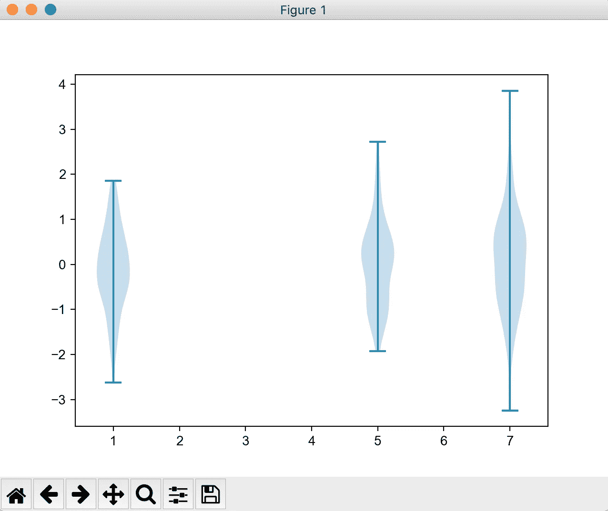
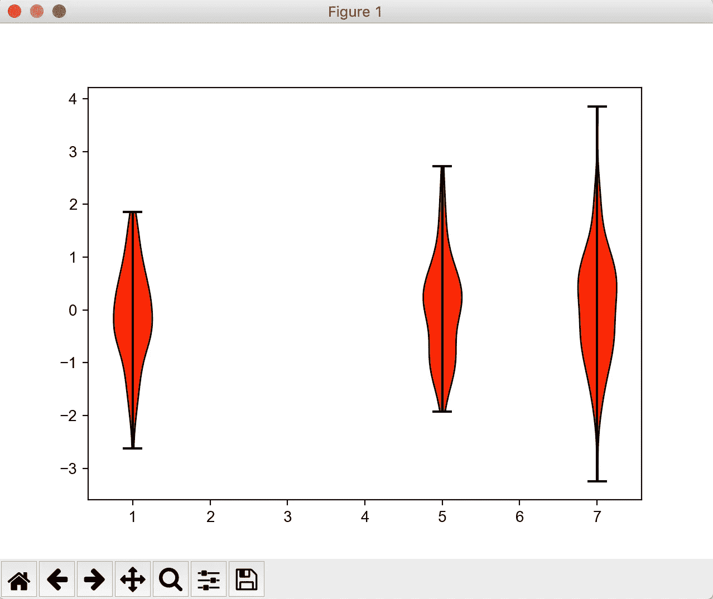
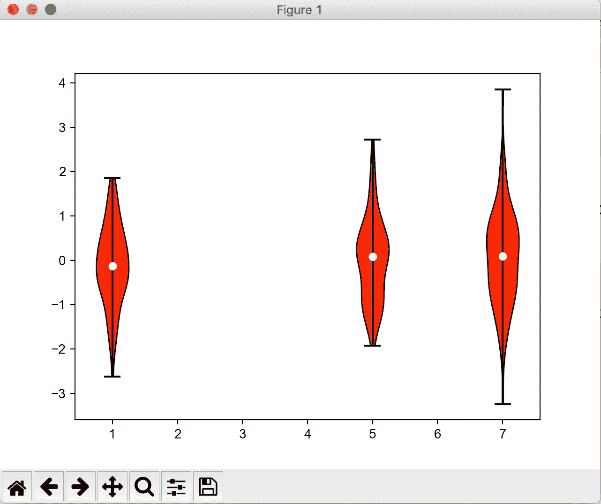
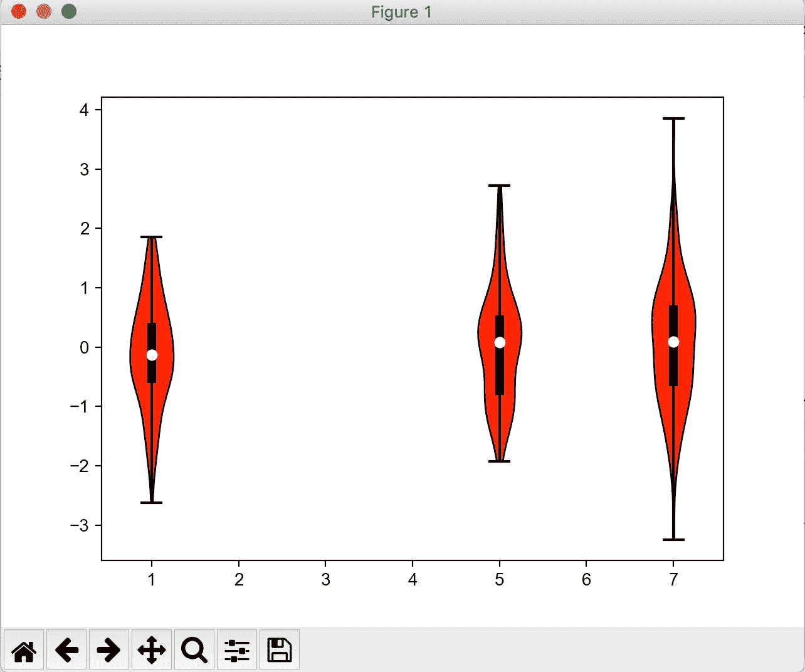
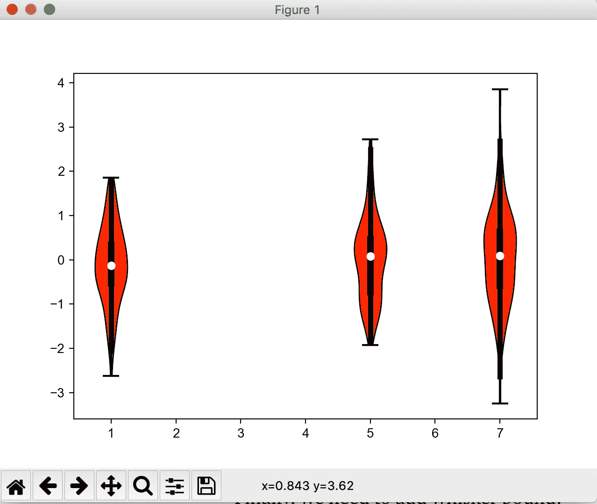
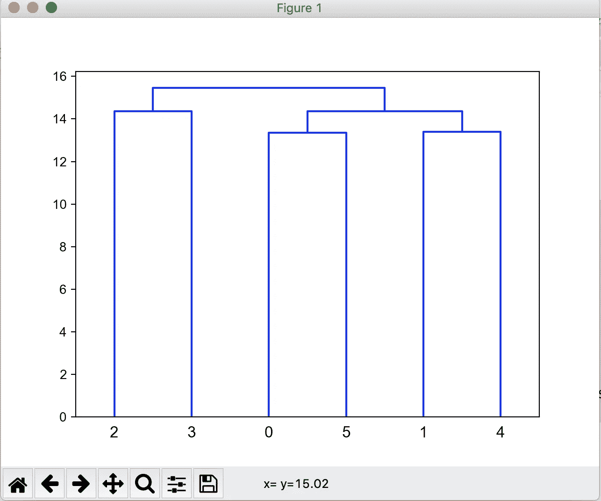
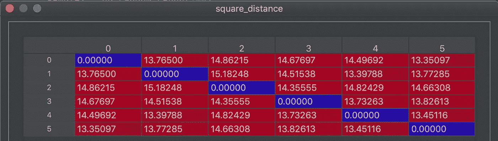
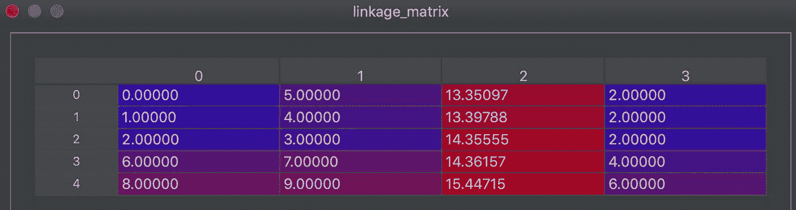

# 用 Python 制作出版物质量的图形(第四部分):小提琴图和树状图

> 原文：<https://towardsdatascience.com/making-publication-quality-figures-in-python-part-iv-violin-plot-and-dendrogram-ed0bb8b23ddd?source=collection_archive---------22----------------------->

## [python-可视化-教程](https://towardsdatascience.com/tagged/python-visualization)

## 从头开始绘制小提琴情节和树状图，一步一步的指南


由[米利安·耶西耶](https://unsplash.com/@mjessier?utm_source=medium&utm_medium=referral)在 [Unsplash](https://unsplash.com?utm_source=medium&utm_medium=referral) 上拍摄的照片

这是我的 [python 可视化系列](https://github.com/frankligy/python_visualization_tutorial)的第四篇教程，

1.  [教程一:Fig 和 Ax 对象](/making-publication-quality-figures-in-python-part-i-fig-and-axes-d86c3903ad9b)
2.  [教程二:线图、图例、颜色](/making-publication-quality-figures-in-python-part-ii-line-plot-legends-colors-4430a5891706)
3.  [教程三:箱线图、条形图、散点图、直方图、热图、色彩图](/making-publication-quality-figures-in-python-part-iii-box-plot-bar-plot-scatter-plot-407fa457449)
4.  教程四:小提琴情节，树状图
5.  [教程 Seaborn 的图(聚类热图、pair 图、dist 图等)](https://frankligy.medium.com/all-you-need-to-know-about-seaborn-6678a02f31ff)

这次让我们做一个简短的介绍，这篇文章只是从教程三停止的地方继续。我想为 Violin 情节和 dendrogram 写一篇单独的文章的原因是，与前面介绍的情节类型相比，它们有点复杂。所以深呼吸一下，让我们深入这两个情节。

# 小提琴情节

Violin 图基本上采用与 box 图完全相同的输入，即一系列 1D 数组。唯一的区别是，violin 图可以显示 1D 阵列的附加信息层，即密度或分布。这条信息被涂抹在盒状图中(盒体必须是矩形的)，但在小提琴图中(这个名字是如何产生的)，密度信息能够被揭示出来，因为我们现在有了一个弯曲的“盒子”，或小提琴。

与[上一篇教程](/making-publication-quality-figures-in-python-part-iii-box-plot-bar-plot-scatter-plot-407fa457449)准备相同，

```
# load packages
import matplotlib as mpl
import matplotlib.pyplot as plt

# set global parameters
mpl.rcParams['pdf.fonttype'] = 42
mpl.rcParams['ps.fonttype'] = 42
mpl.rcParams['font.family'] = 'Arial'# prepare some data for drawing figures
import numpy as np

np.random.seed(42)
data1 = np.random.randn(100)
data2 = np.random.randn(100)
data3 = np.random.randn(100)
```

为了方便起见，我添加了两行代码:

```
dataset = [data1,data2,data3]. # the sequence of arrays
positions = [1,5,7].  # where to put those violin, the x-coordinates
```

现在让我们开始画小提琴的情节:

```
fig,ax = plt.subplots()
vp = ax.violinplot(dataset=dataset,positions=[1,5,7])
```



小提琴基本情节

它看起来很好，它有我们正在寻找的理想密度信息。出于探索的目的，这样做绝对没问题。但是我可能需要把它弄得漂亮一点:

1.  审美调整:脸型颜色、线条颜色等
2.  添加分位数，胡须到小提琴情节

对于第(1)点，这是我在[教程三](/making-publication-quality-figures-in-python-part-iii-box-plot-bar-plot-scatter-plot-407fa457449)、**中所涉及的，找出每个图形元素的基础 python 对象，并通过阅读文档**来查找函数以更改它们各自的美学设置。这很重要！查看[方框图部分](/making-publication-quality-figures-in-python-part-iii-box-plot-bar-plot-scatter-plot-407fa457449)了解更多详情。

```
fig,ax = plt.subplots()
vp = ax.violinplot(dataset=dataset,positions=[1,5,7])

for body in vp['bodies']:
    body.set_facecolor('red')
    body.set_edgecolor('black')
    body.set_alpha(1)
vp['cmaxes'].set_color('black')
vp['cmins'].set_color('black')
vp['cbars'].set_color('black')
```

我们来看看效果:



修改美学元素

对于第(2)点，这是事情变得有点复杂的地方，但是不要担心，让我们一起检查一下。基本上，我们需要两个数组，一个存储分位数信息，姑且称之为`tmp`数组，因为它是临时数组。另一个叫做`whisker`数组，它是用来存储上下界的，或者叫触须。

`tmp` : [(q1，中值，q3)，(q1，中值，q3)，(q1，中值，q3)]

`whisker` : [(上须，下须)，(上须，下须)，(上须，下须)]

你看，每个元组对应一个小提琴盒。现在我们需要计算这些东西，对吗？

`tmp`很简单，`np.percentile()`函数为我们做了所有的事情，我们只是使用一个列表理解来迭代得到最终的`tmp`数组。

```
tmp = [np.percentile(data,[25,50,75]) for data in dataset]
```

那么对于晶须，我们来定义一个函数，逻辑很简单因为我们要计算上晶须和下晶须，需要先计算`iqr`，那么上晶须正好是 1.5 * IQR + q3，下晶须正好是 q1-1.5 * IQR。

```
def get_whisker(tmp,dataset):
    whisker = []
    for quantile,data in zip(tmp,dataset):
        data = np.array(data)
        q1 = quantile[0]
        median = quantile[1]
        q3 = quantile[2]
        iqr = q3 - q1
        upper = q3 + 1.5 * iqr
        upper = np.clip(upper,q3,data.max())
        lower = q1 - 1.5 * iqr
        lower = np.clip(lower,data.min(),q1)
        whisker.append((upper,lower))
    return whisker
```

记住，在这里，如果超过数据(1D 数组)的最大值，我们使用`np.clip()`函数来修剪`upper whisker`，否则它会被误导，因为如果这里没有数据点，就不应该有上须，对吗？

现在我们也有了`whisker`数组。

```
whisker = get_whisker(tmp,dataset)
```

然后我们将这些元素添加到小提琴的情节中:

```
fig,ax = plt.subplots()
vp = ax.violinplot(dataset=dataset,positions=[1,5,7])

for body in vp['bodies']:
    body.set_facecolor('red')
    body.set_edgecolor('black')
    body.set_alpha(1)
vp['cmaxes'].set_color('black')
vp['cmins'].set_color('black')
vp['cbars'].set_color('black')ax.scatter(positions,
[quantile[1] for quantile in tmp],
marker='o',color='white',s=30,zorder=3)
```

我们使用散点图为每把小提琴的主体放置三个中点，请查看以前帖子中的[散点图部分](/making-publication-quality-figures-in-python-part-iii-box-plot-bar-plot-scatter-plot-407fa457449)和 [zorder 部分](/making-publication-quality-figures-in-python-part-ii-line-plot-legends-colors-4430a5891706)。



向小提琴图添加中间点

然后，我们添加 25%分位数和 75%分位数范围:

```
ax.vlines(positions,
[quantile[0] for quantile in tmp],
[quantile[2] for quantile in tmp],
color='black',linestyle='-',lw=5)
```


添加 25 和 75 分位数范围

最后，我们需要添加晶须绑定:

```
ax.vlines(positions,
[bound[0] for bound in whisker],
[bound[1] for bound in whisker],
color='black',linestyle='-',lw=2)
```



添加晶须绑定

由于我们的剪辑功能和黑线背景，这一步与上一步相比没有任何差异，为了展示它的效果，我夸大了一点，但这只是为了展示效果，你不需要那样做，只要坚持上面的一个。

```
ax.vlines(positions,
[bound[0] for bound in whisker],
[bound[1] for bound in whisker],
color='black',linestyle='-',lw=4)
```

我把线宽改成了 4，让我们看看:



夸大胡须边界范围(如果超过最小值或最大值，我们将进行剪裁)

总结一下，这里有两个技巧，我们使用`zorder`总是保持中间点在最前面。然后我们使用不同的`linewidth`来强调`25%-75%`分位数范围。

所有代码可从[https://github.com/frankligy/python_visualization_tutorial](https://github.com/frankligy/python_visualization_tutorial)获得

# 系统树图

说实话，你所在的地区可能不会遇到这种情况。但是作为一名生物信息学学生，我处理了很多聚类问题，在我的项目和日常编码中经常会遇到树状图。

我们什么时候使用树状图？

以著名的`iris`数据集为例，假设我们有 6 朵花，每一朵都有不同的特征，包括但不限于`sepal length`、`sepal width`、`petal length`等。它可以更正式地用一个`m x n`矩阵来表示，其中`m`代表 m 个观察值，n 代表每个观察值的 n 个特征。

让我们为此准备虚拟数据:

```
sample1 = np.random.randn(100)
sample2 = np.random.randn(100)
sample3 = np.random.randn(100)
sample4 = np.random.randn(100)
sample5 = np.random.randn(100)
sample6 = np.random.randn(100)

mat = np.row_stack([sample1,sample2,sample3,sample4,sample5,sample6])
```

`mat`是`m x n`矩阵。

我们感兴趣的是找出这 6 种花之间成对的相似性，哪两朵彼此更近，哪两朵最远。我们需要做**层次聚类**并将花分组在一起，最终，我们会得到这样的东西:



系统树图

你可以看到，这是一个树状图，它告诉你花(2)和花(3)非常相似，基本关系在上面的图中清楚地显示出来。接下来，我将向你们展示如何一步一步地得到这个树状图。

首先，我们需要做[层次聚类](/understanding-the-concept-of-hierarchical-clustering-technique-c6e8243758ec)，点击链接了解更多信息。但简单地说，在每一步中，我们将最相似的两个分组形成一个新的元样本或聚类，然后这个元样本在下一轮中也将被视为单个样本，我们仍然打算在第二轮中找到最相似的两个组。这是一种“自下而上”的方法来聚集不同的观察结果。

```
from scipy.spatial.distance import pdist,squareform
dense_distance = pdist(mat,'euclidean')
square_distance = squareform(dense_distance)
```

我们使用 scipy 中的`pdist()`函数来计算成对距离，它将返回一个`dense_distance`列表，乍一看很难理解列表中的每一项代表什么，所以我们首先将它转换成一个`square_distance`矩阵来建立一些直觉。



平方距离矩阵

现在我们来对比一下`dense_distance`列表:

```
print(dense_distance)
[13.76499829 14.86214799 14.67696826 14.49691937 13.35096827 15.18247523
 14.51538309 13.39787901 13.77284523 14.35555456 14.82429126 14.66308396
 13.73263062 13.82613097 13.45116341]
```

所以，`dense_distance`基本上是按照这个顺序存储两两距离的:[(0，1)，(0，2)，(0，3)，(0，4)，(0，5)，(1，2)，(1，3)，(1，4)，(1，5)，(2，3)，(2，4)，(2，5)，(3，4)，(3，5)，(4，5)，(4，5)]，这里(0，1)是指`0th`观测和`1st`观测之间的两两两距离，**回忆，python 是基于 0 的索引**。如果看`square_distance`矩阵的上三角，正好是从左向右读。

现在我们有了`dense_distance`列表，我们可以进行分层聚类:

```
from scipy.cluster.hierarchy import linkagelinkage_matrix = linkage(dense_distance,method='ward',metric='euclidean')
```

要了解更多关于`method`和`metric`参数的信息，你可以查阅[文档](https://docs.scipy.org/doc/scipy/reference/generated/scipy.cluster.hierarchy.linkage.html)或者[一些不错的博客](/understanding-the-concept-of-hierarchical-clustering-technique-c6e8243758ec)。但是我们将得到的是另一个叫做`linkage_matrix`的矩阵。让我们试着去理解:



连锁矩阵

请跟随我下面的叙述，这样你就能明白它的意思了，

在`0th`迭代中(第一行)，`0th`观察(第一列)和`5th`观察(第二列)基于我们定义的`method`和`metric`最为相似。它们之间的距离是`13.35097`(第三列)，所以我们把它们组合在一起，形成一个新的聚类/观察`6th`(或者 7 号观察，python 是基于 0 的索引)，因为我们已经有 6 个观察了。在新形成的集群`6th (or no.7 observation)`中有 2 个观察/节点(第四列)。

然后在`1st iteration`(第二排)，同样的过程再次进行。

明白了这一点，我们只需要知道，这个`linkage_matrix`是绘制`dendrogram`的输入，那么让我们来绘制它。

```
from scipy.cluster.hierarchy import linkage,dendrogram
linkage_matrix = linkage(dense_distance,method='ward',metric='euclidean')fig,ax = plt.subplots()
dendrogram(linkage_matrix,ax=ax)
```


现在我们得到了树状图

我个人发现制作树状图的文档不是很清楚，所以我打算用简单的英语更详细地描述这个过程，以传达一个更好的直觉。

就这些，希望能有点帮助。

如果你喜欢这些教程，请在 medium 上关注我，非常感谢你的支持。在我的 [Twitter](https://twitter.com/FrankLI55917967) 或 [LinkedIn](https://www.linkedin.com/in/guangyuan-li-399617173/) 上联系我，也请问我关于你想学习哪种图形以及如何简洁地画出它们的问题，我会回复的！

所有代码都可在[https://github.com/frankligy/python_visualization_tutorial](https://github.com/frankligy/python_visualization_tutorial)获得

# 继续阅读

[教程 Seaborn 的图(聚类热图、pair 图、dist 图等)](https://frankligy.medium.com/all-you-need-to-know-about-seaborn-6678a02f31ff)