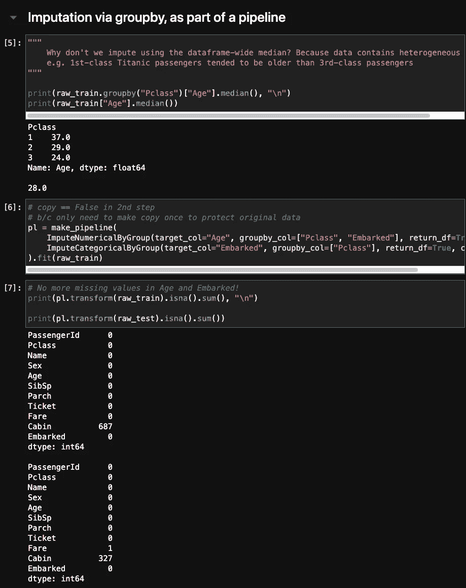
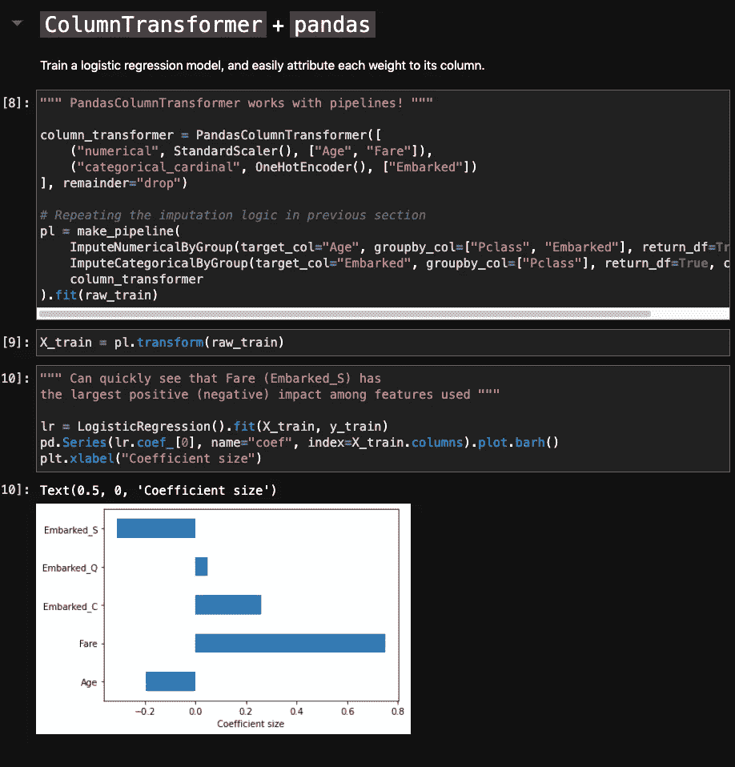

# 让 scikit-learn 更好地与熊猫一起工作

> 原文：<https://towardsdatascience.com/making-scikit-learn-work-better-with-pandas-13d197e60dc9?source=collection_archive---------20----------------------->

## [*招数*](https://towardsdatascience.com/tagged/tips-and-tricks)

## 在功能转换后，再也不会丢失列名

# **何苦呢？**

除了提供常见的机器学习算法，scikit-learn 还允许用户构建可重复使用的 [*管道*](https://scikit-learn.org/stable/modules/compose.html#pipeline) ，将数据处理和模型构建步骤集成到一个对象中。

[iMattSmart](https://unsplash.com/@imattsmart?utm_source=medium&utm_medium=referral) 在 [Unsplash](https://unsplash.com?utm_source=medium&utm_medium=referral) 上拍摄的照片。

pipeline 对象中的每一步都由一个 [Transformer](https://scikit-learn.org/stable/data_transforms.html) 实例组成，该实例公开了易于使用的`fit` / `transform` API。转换器可以对用于输入缺失值、特征工程、模型推理等的逻辑进行编码。

不幸的是， [scikit-learn 直接处理 numpy 数组或 scipy 稀疏数组，而不是在数据科学工作中广泛使用的](https://scikit-learn.org/stable/faq.html#why-does-scikit-learn-not-directly-work-with-for-example-pandas-dataframe) `[pandas.DataFrame](https://scikit-learn.org/stable/faq.html#why-does-scikit-learn-not-directly-work-with-for-example-pandas-dataframe)`。附属于数据帧的元数据，例如列名，对于**调试**和**模型解释**的目的来说*非常*有帮助。

我们应该如何解决上面讨论的问题？虽然 StackOverflow 像往常一样有用，但从长远来看，我更愿意使用组织良好的代码，而不是每次都要谷歌的代码片段。因此，我写了自己的代码，可以在 [GitHub](https://github.com/openerror/PandasTransform/) (笔记本[这里](https://github.com/openerror/PandasTransform/blob/main/playground.ipynb))上找到，并在本文中展示。

## 那`[sklearn.compose.ColumnTransformer](https://scikit-learn.org/stable/modules/generated/sklearn.compose.ColumnTransformer.html)`呢？

公平地说，scikit-learn 使用数据帧中的元数据有一种*方式:`ColumnTransformer`可以通过字符串名称识别数据帧列，并将您需要的转换器指向每一列。这是 Allison Honold 在 TDS 上的一个例子。*

不幸的是，`ColumnTransformer`产生了 numpy 数组或 scipy 稀疏矩阵。这篇文章将扩展`ColumnTransformer`,这样它也会产生`pandas.DataFrame`。

# 用例 1:多元插补

我们可以通过子类化`sklearn.base.BaseEstimator`和`sklearn.base.TransformerMixin`来创建自己的变压器。自定义功能应该在`fit(X, y)`和`transform(X)`方法中实现。

下面是一个运行中的自定义转换器。`[ImputeNumericalByGroup](https://github.com/openerror/PandasTransform/blob/main/src/ImputeByGroup.py)`类计算由`pandas.DataFrame.groupby`标识的每个组的中间值，并使用每个组的所述中间值*估算新数据帧中的缺失值。*

在 Titanic 数据集中证明年龄的异质性，并使用每组中位数进行估算。图片作者。

当你从领域知识中知道你的数据包含不同的组时，按组插补是合理的。下面例子中使用的泰坦尼克号幸存者数据就是一个恰当的例子:众所周知，在这艘命运多舛的豪华邮轮上，三等舱乘客往往比一等舱乘客年轻。

是— [多变量特征插补](https://scikit-learn.org/stable/modules/impute.html#multivariate-feature-imputation)在技术上已经在 scikit-learn 中可用。但是截至 2021 年 4 月 7 日，它仍然是该库的“实验”部分，其 API 可能会发生变化。如果您喜欢类似于`SimpleImputer`的行为，并且需要处理数据帧，我的代码提供了一个可行的替代方案。

# **转换异构数据**

如上所述，scikit-learn 可以通过`sklearn.compose.ColumnTransformer`对 DataFrame 列应用不同的转换。在这里，我提供了一个关于`ColumnTransformer`的包装器，这样它接收并产生一个具有正确列名的数据帧— —即使列数已经改变，例如，由于一次热编码。

我的 PandasColumnTransformer 在 scikit-learn 管道中工作，并允许我快速可视化基于大量数据训练的逻辑回归模型的系数。注意，它只用了一行代码(pd。序列等)来将每个系数归因于一个特征。图片作者。

当然，你总是可以[恢复](https://medium.com/r?url=https%3A%2F%2Fstackoverflow.com%2Fquestions%2F54646709%2Fsklearn-pipeline-get-feature-names-after-onehotencode-in-columntransformer)列名并且*手动*将它们附加到`ColumnTransformer`生成的数组上。但是，当像我这样的代码作为可重用的[管道](https://scikit-learn.org/stable/modules/generated/sklearn.pipeline.Pipeline.html)的一部分为你记账时，为什么还要麻烦呢？

# 摘要

1.  `scikit-learn`对于 Python 中的机器学习来说是很棒的，但是它[故意](https://scikit-learn.org/stable/faq.html#why-does-scikit-learn-not-directly-work-with-for-example-pandas-dataframe)提供了与熊猫有限的互操作性，熊猫是当今数据科学家的面包和黄油。
2.  本文展示了两个自定义 scikit-learn 转换器可以在两个库之间架起桥梁的例子。数据帧中的元数据可以方便调试和模型解释。
3.  我的 [GitHub 资源库](https://github.com/openerror/PandasTransform)中提供了所有代码和一个示例笔记本。