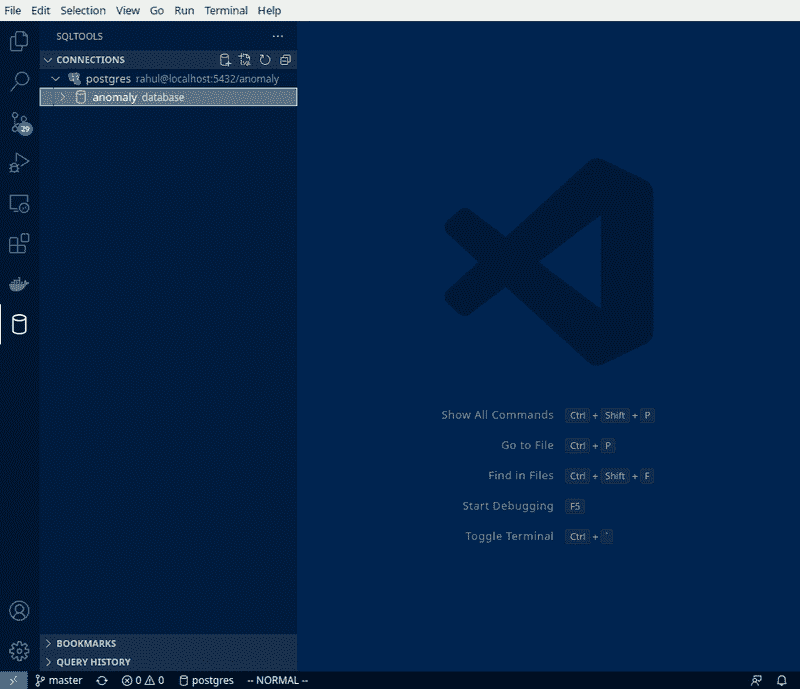
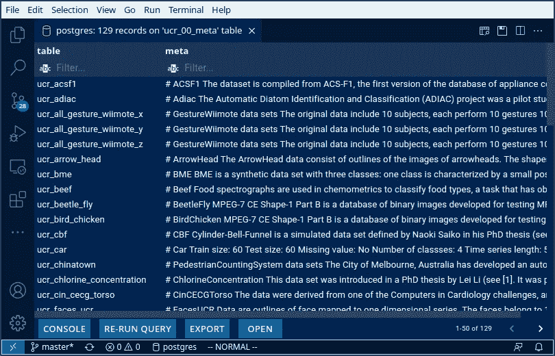
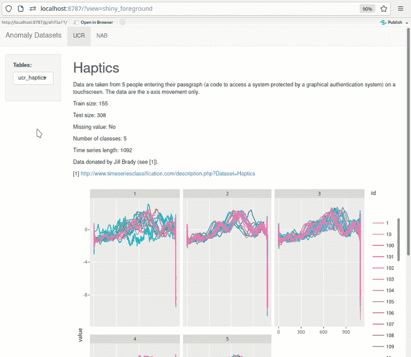

# 制作异常数据库

> 原文：<https://towardsdatascience.com/making-the-anomaly-database-d81471f9ddaf?source=collection_archive---------27----------------------->

## *这是与 Docker、Postgres 数据库和异常数据集相关的两篇文章的第二部分。阅读* [*第一部分*](/docker-based-rstudio-postgresql-fbeefe8285bf) *，它将教你如何使用 Docker 建立一个新的 postgres 数据库。*

这篇文章描述了如何填充在第 1 部分中构建的异常数据库。

# 动机

继续端到端可再现工作流的主题，我还希望能够以编程方式重新创建我的原始数据库。

在这项活动结束时，我能够快速加载和管理大约 6G 的数据供我个人使用。

大量数据，可使用 VSCode 快速浏览。来源:作者。

填充数据库的全部代码都在我的 [GitHub repo](https://github.com/rsangole/anomaly_db) 中。

# 谁应该读这个？

如果你习惯使用`download.file()`、系统命令、`arff`文件格式和`{DBI}`，你在这里不会学到很多东西。如果你对我的方法感兴趣，请继续阅读。

# 步伐

这里只有三个文件:

1.  初始设置(`[00-execute.R](https://github.com/rsangole/anomaly_db/blob/master/00-execute.R)`)
2.  从网上下载数据(`[01-download-data.R](https://github.com/rsangole/anomaly_db/blob/master/01-download-data.R)`)
3.  将数据加载到 PostgreSQL 中的`anomaly`数据库(`[02-load-data-to-postgres.R](https://github.com/rsangole/anomaly_db/blob/master/02-load-data-to-postgres.R)`)

# 初始设置

列表有助于跟踪数据来源，并帮助我关闭任何下载以节省空间/时间(例如，Monash 是一个大约 2G 的下载)。

一些简单的内务处理，以确保目录设置正确。此外，如果文件夹是 git 控制的，存放数据集`large_data`的目录需要在`.gitignore`中。我检查这个。

# 下载数据

现在，对于上面列表中的数据集，只需使用`download.file()`下载所选数据集的数据，并将它们移动/解压缩到`large_data`文件夹。我还在检查文件夹是否已经存在，我想覆盖它。

这里有一个 UCR 数据集的例子。其余数据集的代码非常相似。

# 加载数据

现在，它就像:

1.  使用`DBI::dbConnect`连接到 PostgreSQL 数据库
2.  从`large_data/`读取数据集
3.  简单清理(`janitor::clean_names`，所有时间戳列被称为`time`等)
4.  使用`DBI::dbWriteTable`将数据加载到 postgres 中

下面是一个示例代码:

*对于 monash 数据集，你确实需要使用* `[*foreign::read.arff()*](https://stat.ethz.ch/R-manual/R-devel/library/foreign/html/read.arff.html)` *。*

# 技巧

**大文件下载**将在 1 分钟的默认超时窗口内超时。在调用`download.file()`之前处理这个。

**数据字典**也可以直接存储在数据库中。我将`UCR_Archive2018/*`文件夹中每个`README.md`的内容存储在一个名为`ucr_00_meta`的数据字典表中。这允许我在下游开发中编程调用字典。

UCR 数据集的数据字典。来源:作者。

**闪亮**可以有效用于快速探索。这是一个我为自己建造的东西的例子。仪表板直接从 PostgreSQL 提取数据。UCR 元数据也从呈现在每个页面顶部的数据库中提取，从而可以快速浏览数据集。随着我添加更多数据集，我不断扩展这个仪表板。

闪亮的仪表板快速可视化数据。来源:作者。