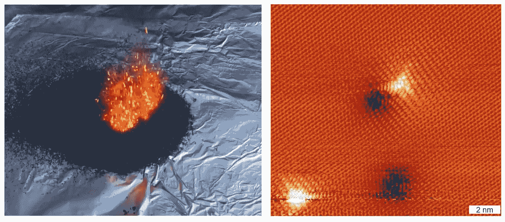
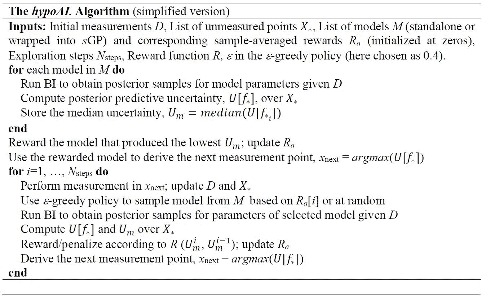
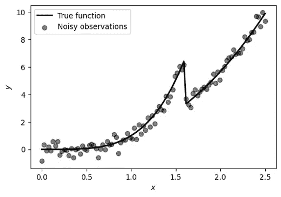
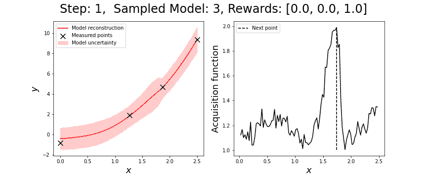
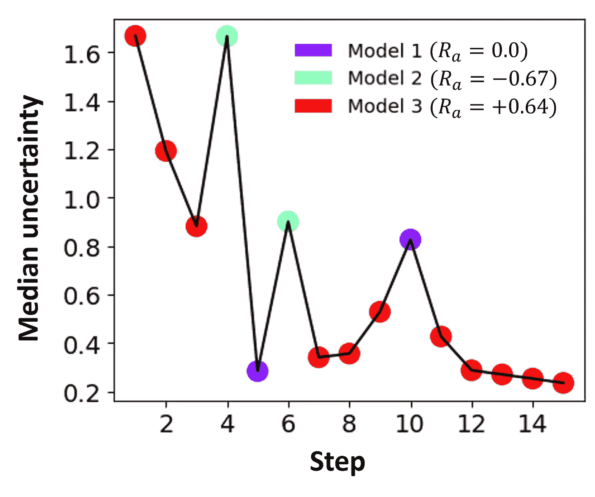
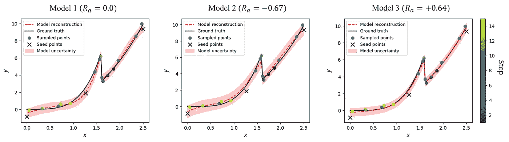
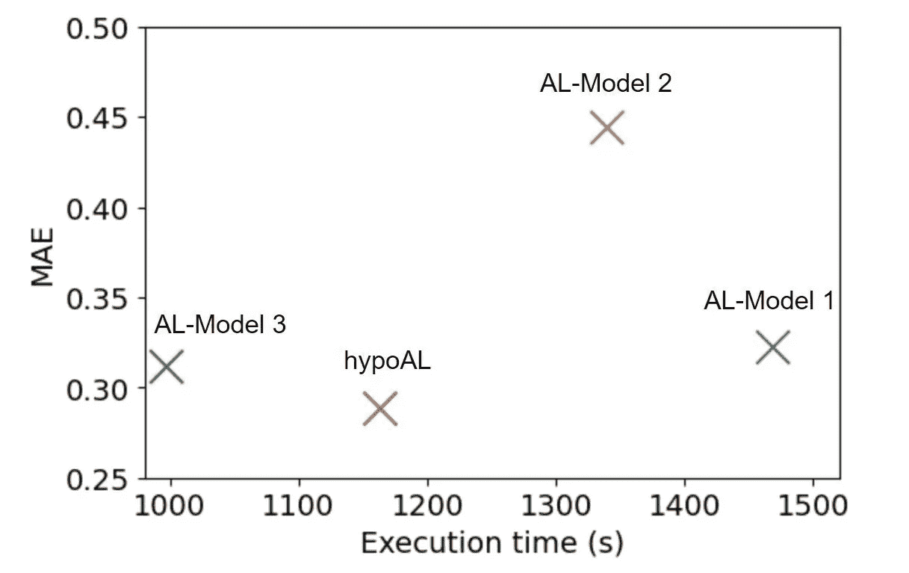

# 制造“自动化科学家”:使用结构化高斯过程共同导航假说和实验空间

> 原文：<https://towardsdatascience.com/making-the-automated-scientist-co-navigating-the-hypothesis-and-experimental-space-using-9c9e14de74c8?source=collection_archive---------42----------------------->

## [思想和理论](https://towardsdatascience.com/tagged/thoughts-and-theory)

*马克西姆·兹亚迪诺夫&谢尔盖·加里宁*

*美国田纳西州橡树岭橡树岭国家实验室纳米材料科学和计算科学与工程中心*

实验科学研究是人类已知的最迷人的活动之一(至少，在作者高度主观的观点中)。我们俩都是因为相对简单的后院实验而开始了我们的科学生涯。对于第二个十几岁的作者，这是应用放热化学反应，又名自制烟花。在这里，按照教科书上的食谱制作出非凡而多彩的灯光效果是相对简单的。我们怀疑这个过程能比 J. R. R .托尔金在《魔戒》开篇描述比尔博的告别会时描述的更好，所以我们就说到这里。然而，更有趣的是理解烟花背后的氧化还原化学方程式，并利用这一知识来调整成分分数，以增强火花的产生或持续时间，或添加碱金属盐来调整光发射。换句话说，理解烟花背后的魔力，并试图利用这种理解让烟花变得更有趣。

作为第二个例子，在他的博士学位中，第一作者使用超高真空扫描隧道显微镜和密度泛函理论的结合来探索石墨烯中边缘和空位的化学修饰如何影响其电子性质[1，2]。同样，对美丽的原子尺度图像的观察只是理解石墨烯功能性的复杂物理机制的第一步。阐明它们使我们能够解决干预性和反事实的问题，即假设问题。例如，如果我们用元素周期表中某个特定原子的邻居来代替它，会发生什么？我们能找到产生所需功能的替代品吗？这些问题和许多其他问题让科学变得如此有趣。

这些是构成科学家大部分工作的科学探索连续循环的例子。我们计划实验以增强对理论机制的理解，从而改进和发展理论模型。在许多情况下，实验会产生新的结果，而这些结果在现有的框架内是无法解释的。这反过来激发了解释观察结果的新理论的发展(或质疑和检查实验方法)。从理论的角度来看，理论可以建立在一组假设或已知的法律和关系，从高度抽象的现代代数理论的建设，以新材料和化合物的计算探索。同样，在实验实现的背景下，新的和非平凡的理论预测通常是令人感兴趣的。

**图一。**(左)放热分解的神秘橙色粉末，在此过程中变成绿色。(右)通过扫描隧道显微镜观察到的含有缺陷的石墨烯的原子分辨率图像。作者图。

输入机器学习(ML)。机器学习有多种概述和观点，描绘了该领域的总体愿景和基础[3，4]。然而，目前绝大多数 ML 方法都是基于纯粹的相关模型——在经典的监督学习中优化特征和目标之间的相关关系的发现，或者在(变分的)自动编码器中解开数据表示。更重要的是，这些方法中的许多通常基于静态数据集，如 MNIST、CIFAR 或大型医学和生物成像数据集。请注意，从静态数据集到动态数据集(动态地包含新数据)的转换是非常重要的——并且经常会受到超出分布效应的影响。经典 ML 的这些局限性是众所周知的，在过去的几年里，关于如何解决这些问题提出了多种观点[5]，包括作者的观点[6]。

部分地为了回应这些限制，在过去的几年里，ML 和物理学团体已经积极地探索 ML 和物理学的结合。例如，科学的中心前提之一是深信正确的物理定律将有优雅的数学表示。也许这个概念最好的代表是 Winer 关于“数学在自然科学中不合理的有效性”的著名的[文章](https://en.wikipedia.org/wiki/The_Unreasonable_Effectiveness_of_Mathematics_in_the_Natural_Sciences)。相应地，将机器学习与简化的符号表示相结合开辟了一种将机器学习与物理学相结合的方法，克兰默、何、巴塔格利亚、布伦顿和库兹的最新作品就是早期的例子。

经典机器学习方法的第二个限制是它们依赖于完善的静态数据集。从某种意义上说，一旦数据完全可用，ML 部分就开始了。因此，经过训练的网络可以应用于新数据，但前提是新数据由相同的过程生成，即来自相同的分布。对于许多最大似然问题，这是通过拥有覆盖所有可能潜力的广泛训练数据集来实现的。然而，这通常是困难或不可能的，这刺激了主动学习方法的发展，其中 ML 算法与数据生成过程动态交互。这可以从简单地选择候选人进行人工标记，到玩雅达利游戏，再到运行定制的科学工具或自动汽车。

主动学习框架的经典例子是贝叶斯优化(BO)和强化学习(RL)。然而，这些框架中的大多数算法仍然是数据驱动的，依赖于动作、状态和奖励之间的相关性。相应地，这些算法通常需要相对大量的数据(到目前为止，RL 比 BO 更多)来建立政策和结果之间的相关关系。请注意，应用于实验或理论的贝叶斯优化和强化学习方法的许多最新进展都是基于纯粹的相关方法[7–9，10，11]。最近，一些小组开始探索结合物理模型和主动学习的方法，或者是在参数模型的经典贝叶斯推理[12]的背景下，或者是更灵活的结构化[高斯过程](/unknown-knowns-bayesian-inference-and-structured-gaussian-processes-why-domain-scientists-know-4659b7e924a4)。然而，在大多数情况下，物理模型是相对刚性的。

这个简短的概述解决了一个自然的问题，即物理发现和主动学习是否可以整合到一个单一的框架。在这种假设驱动的主动学习中，或简称为**假设学习**，算法查询假设空间和实验空间，具有选择和提炼理论以及驱动实验协议的双重目标。在这里，我们假设这是可能的，并介绍了一个 *hypoAL* 算法，允许实现这一点。

当我们有一系列可能的模型作为替代假设时，我们考虑最简单的发现形式。我们假设只有一个模型是正确的。每个模型都有几个参数。我们假设可以定义参数值的先验，这些参数值代表了我们对感兴趣系统的一些了解。这里的想法是，一个正确的系统行为模型会导致系统整体贝叶斯不确定性的快速降低。然而，在每个模型上运行完整的贝叶斯推理(BI)并选择具有最低不确定性的模型在计算上是昂贵的并且非常耗时的(随着新测量的增加，成本和时间迅速上升)。因此，我们的算法只有一个短暂的“预热”阶段，我们对每个模型进行 BI，选择一个在所有未测量点上具有最低总不确定性或中值不确定性的模型，并根据预定义的奖励函数奖励该模型。在这之后，我们利用标准的*ϵ*-贪婪策略在每一步只对一个模型进行采样。将根据样本模型的贝叶斯后验计算的总/中值不确定性与前一步骤中记录的总/中值不确定性进行比较。如果不确定性降低，样本模型会得到正奖励，否则会受到惩罚(负奖励)。然后，下一个测量点被导出为*x*ₙₑₓₜ=*arg max*(*u*)，其中 *U* 是由采样模型产生的不确定性“图”。整个 *hypoAL* 算法总结如下。

*HypoAL* 算法协同导航实验和假设空间

让我们用一个具体的例子来说明 *hypoAL* 算法，这个例子与物理学中的相变有关，相变表现为一个可测量系统属性(例如热容)的不连续性。相应的(合成)数据如图 2 所示，其中 *x* 轴是可调参数(温度、浓度等)。)和 *y* 轴是通过实验测量的系统属性。

**图二。**描述具有不连续“相变”的 1D 系统的合成数据。作者提供的数字。

请注意，图 2 中的完整数据(“噪声观察”)永远不会被算法看到。相反，我们从少量(本例中为 3 个)“种子”测量开始，以初始化 *hypoAL* 算法。该算法包含系统行为的三种可能模型:

模型 1 在转变点之前具有幂律行为，在转变点之后具有线性行为，

模型 2 在转变点之前和之后具有线性行为，

模型 3 在转变点前后具有幂律行为。

我们可以将它们用作独立的概率模型，或者将它们包装到结构化的高斯过程中。我们选择了后者，因为它提供了更多的灵活性，并且可以更好地处理没有一个模型是正确的情况(参见我们之前的[帖子](/unknown-knowns-bayesian-inference-and-structured-gaussian-processes-why-domain-scientists-know-4659b7e924a4))。

在所有这三个模型中，我们在转变点的可能位置上放置一个统一的先验(意味着我们不假设对它可能发生的确切位置有任何了解),并在其余参数上放置正态先验。

下面以动画的形式展示了 *hypoAL* 学习。它显示了由在每个步骤采样的模型执行的重建、相关的不确定性、获取函数(这里相当于中值不确定性)以及每个模型的运行样本平均回报。

**图三。**将 *hypoAL* 应用于具有不连续“相变”的 1D 系统。作者提供的数字。

在该过程中考虑重构函数和获取函数的行为是有益的。我们选择的假设函数在连续区域中的功能行为不同，跳跃的位置和大小也不同。按照惯例，采集函数(此处对应于未测量点上的 *s* GP 不确定性)定义了算法对参数空间不同区域的“感兴趣程度”,采集函数的 *argmax* 定义了进行下一次测量的点。很明显，模型的选择和获取函数的行为是紧密耦合的，该函数寻找不连续的位置。此外，请注意，包含不连续点的位置最初被错误地发现，但随着新观测值的累积，算法已收敛于地面真实值。

主动学习期间贝叶斯不确定性的演变如图 4 所示。该算法倾向于第三种模型，其中系统在转变点之前和之后的行为由幂律函数描述(并且，因为我们使用了具有已知基本事实的合成数据，所以我们知道这是正确的模型)。

**图 4。**主动学习期间中值不确定性的演化(Uₘ在 *hypoAL* 算法中)。每个模型的最终样本平均奖励显示在图图例中。作者提供的数字。

图 5 还显示了使用 *hypoAL* 发现的点对三个模型的整个参数空间进行贝叶斯拟合的结果。获得最高奖励的模型显然是最合适的。因此，我们能够仅使用少量测量来学习由不连续函数产生的正确数据分布，并且还识别描述系统行为的正确模型。

**图五。**利用*海波*发现的点，贝叶斯符合三种不同的模型。每个模型的最终样本平均奖励也显示在支线剧情标题中。作者提供的数字。

通过对种子点的不同初始化以及其他不连续函数进行运行，该算法的可重复性和鲁棒性得到了[的证实](https://arxiv.org/abs/2112.06649)。

到目前为止，我们主要关注我们的算法发现系统行为的正确模型的能力，但它也在整体执行时间和重建精度方面比使用单一概率模型的主动学习策略提供了实际优势(如之前的[文章](/unknown-knowns-bayesian-inference-and-structured-gaussian-processes-why-domain-scientists-know-4659b7e924a4)所述，使用标准 GP 的主动学习不太适合不连续的函数，因此这里根本不考虑)。我们注意到，理想的情况是将 *s* GP 与系统行为的已知/正确模型(本例中为模型 3)一起使用。然而，在实践中，这几乎是不可能的。在图 6 中，我们比较了主动学习与部分正确的独立概率模型(AL-Model 1 和 AL-Model 2)和 *hypoAL* 之间的重建误差和执行时间。hypo al*明显优于这两种型号。它的执行时间也与使用正确模型(AL-Model 3)的主动学习相当，有趣的是，它始终能产生略好的重建。*

**图 6。**对于相同的贝叶斯推理设置，使用独立概率模型(AL-模型 1、AL-模型 2、AL-模型 3)和 hypoAL 的主动学习的效率。请注意，模型 3 是完全正确的模型，模型 2 和模型 1 是部分正确的模型。y 轴对应于平均绝对误差。作者提供的数字。

总之，通过这里开发的 h *ypoAL* 算法实现的假设学习方法提供了与科学家工作的多个相似之处。该算法顺序查询黑盒数据生成过程，有效地执行实验。基于测量结果和感兴趣系统的一些部分知识，如编码在可能的模型列表和它们参数的先验分布中，算法探索哪个模型更好地解释了观察结果，并试图根据它解释数据的程度奖励正确的模型——就像科学家会做的那样。同样，就像以人为基础的研究一样，先验知识很重要。如果先验是正确且狭窄的(即，我们对系统了解很多)，它将极大地加速算法的收敛，如果先验是广泛的(我们知道的不多，但有开放的头脑)，它将收敛到正确的模型，如果先验是狭窄且不正确的(我们有错误的先入为主的观念)，则可能导致非常缓慢的进展。

虽然当前的示例非常简单，并且依赖于模型和地面实况的分析函数，但是扩展到更复杂的模型、更高维度的空间等是相当简单的。在这种情况下，将变得开放的问题包括，我们如何对待高维行为，以及在何种程度上低维嵌入可以与简单的函数形式相结合。类似地，对于大维理论空间，我们需要通过图形或 NLP 编码有效地枚举理论的途径，避免在功能空间中禁止性的枚举搜索。这也与探索政策的选择有关，标准的*ϵ*——贪婪只在低维空间中是足够的(在低维空间中没有那么多做错事的方法)。但这恰恰是这个方向令人兴奋的地方！

继最初的[在《未知的已知》上发布](/unknown-knowns-bayesian-inference-and-structured-gaussian-processes-why-domain-scientists-know-4659b7e924a4)之后，我们的一位读者分享了伊本·亚明([https://onejourney.net/ibn-yamin-quotes/](https://onejourney.net/ibn-yamin-quotes/))的另一部波斯诗歌杰作，他说

谁不知道呢

*不知道自己不知道，*

是个傻瓜——避开他。

*不知者不晓，*

*并且知道自己不知道，*

是个孩子——教他。

*谁知道呢，*

*不知道自己知道，*

他睡着了，叫醒他。

*谁知道呢，*

*并且知道他知道，*

明智——跟随他。

我们希望贝叶斯方法联合导航假设和自动化实验空间可以成为未来几年的发展方向之一。最后，在科学界，我们感谢我们的研究赞助商。这项工作在橡树岭国家实验室纳米材料科学中心(CNMS)进行并得到支持，该中心是美国能源部科学用户设施办公室。您可以使用[此链接](https://my.matterport.com/show/?m=MT819FqAwbT)进行虚拟漫游，如果您想了解更多信息，请告诉我们。

更多细节/结果，请查看我们在 arxiv 上的[预印本](https://arxiv.org/abs/2112.06649)和 GitHub 上相应的[代码](https://github.com/ziatdinovmax/hypoAL)。

**参考文献**

1.齐亚特迪诺夫，m；藤井，s；KusakabeKiguchit .莫里；Enoki,《单一石墨层中单空位-氢复合物的直接成像》。*物理复习 B* **2014、** *89* (15)、155405。

2.齐亚特迪诺夫，m；林，h；藤井，s；KusakabeKiguchit .伊诺克；在石墨烯扶手椅边缘化学诱导拓扑零模式。*理化。化学。Phys.* **2017，** *19* (7)，5145–5154。

3.纽约州勒村；纽约州本吉奥；深度学习。*性质* **2015，** *521* (7553)，436–444。

4.神经网络中的深度学习:概述。神经网络。 **2015，** *61* ，85–117。

5.schlkopf，b；洛卡泰洛，女；鲍尔；柯；北卡罗来纳州卡尔施布伦纳；Goyal，a。迈向因果表征学习。*IEEE 会议录* **2021，** *109* (5)，612–634。

6.瓦苏德万；齐亚特迪诺夫，m；弗尔切克湖；现成的深度学习是不够的，需要节俭、贝叶斯和因果关系。npj 计算机公司。脱线。 **2021、** *7* (1)、6。

7.瓦苏德万；凯利，K. P。欣克尔，j。Funakubo，h；杰西；加里宁公司；扫描探针显微术和光谱学的自主实验:选择在哪里探索铁电体的极化动力学。 *ACS Nano* **2021，** *15* (7)，11253–11262。

8.加里宁公司；瓦莱蒂，m；瓦苏德万；Ziatdinov，m,《通过基于高斯过程的探索发现功能和结构的晶格哈密顿量的探索——利用》。 *J. Appl. Phys* **2020，** *128* (16)，164304。

9.克鲁尔，a。美国好施集团；罗泽尔特区；席夫林，a。人工智能驱动的扫描探针显微镜。*通信物理* **2020，** *3* (1)，54。

10.白银，d；黄；马迪森，首席法官；Guez，A 西弗尔湖；范登德里斯切；Schrittwieser，j；安东诺格鲁岛；Panneershelvam，v。Lanctot，m；迪耶曼公司；格雷韦博士；Nham，j；北卡罗来纳州卡尔施布伦纳；苏茨基弗岛；Lillicrap 利奇，硕士；Kavukcuoglut .格雷佩尔；Hassabis 博士，利用深度神经网络和树搜索掌握围棋游戏。*性质* **2016，** *529* (7587)，484-+

11.Mnih，v；Kavukcuoglu 白银，d；鲁苏公司；Veness，j；贝勒马尔；格雷夫斯，a。里德米勒，m；菲吉兰，又名:奥斯特洛夫斯基；彼得森；贝蒂角；萨迪克；安东诺格鲁岛；h .金；库马兰博士；威斯特拉博士；莱格公司；通过深度强化学习进行人类水平的控制。*性质* **2015，** *518* (7540)，529–533。

12.麦克丹尼尔。佛朗泽克，m。萨维齐；多塞特，硕士；罗德里格斯，E. Ek .默兹；Opsahl-Ong，j；萨马罗夫；竹内岛；通过基于物理学的贝叶斯主动学习实现中子衍射的即时自主控制。 *arXiv 预印本 arXiv:2108.08918*2021。