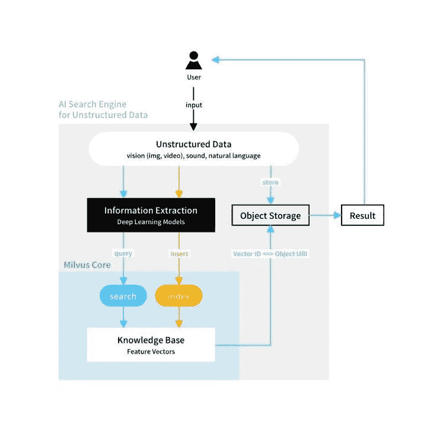
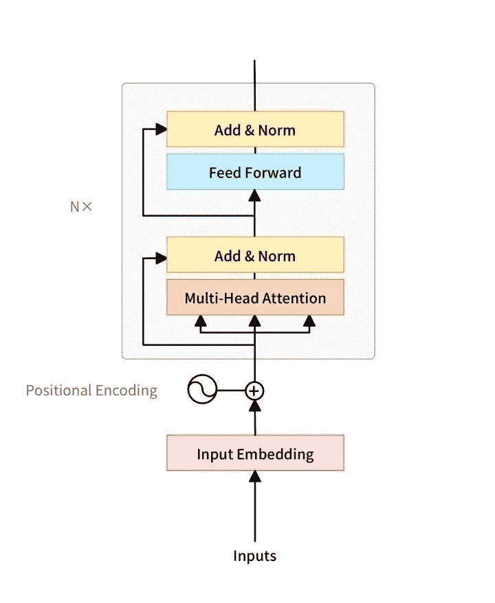
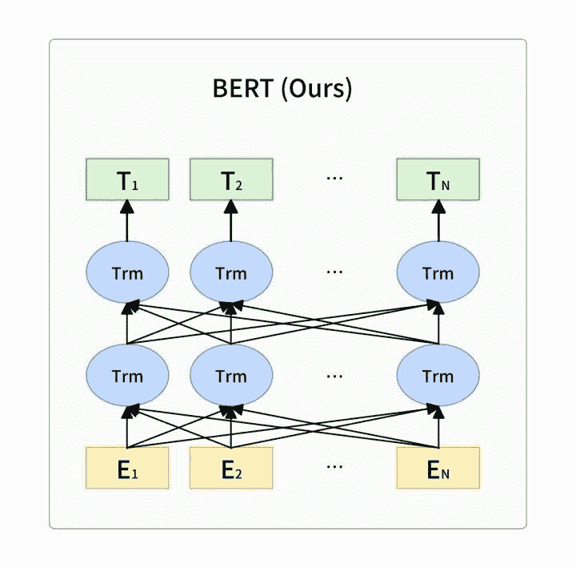
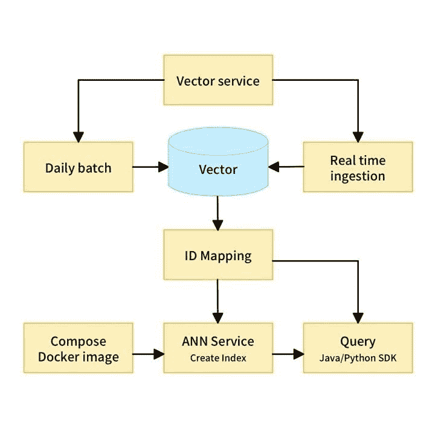

# 用 Milvus 制作:小米手机浏览器内的人工智能新闻推荐

> 原文：<https://towardsdatascience.com/making-with-milvus-ai-powered-news-recommendation-inside-xiaomis-mobile-browser-18e41d112c5f?source=collection_archive---------32----------------------->

## 了解小米如何利用人工智能和 Milvus 构建智能新闻推荐系统，能够为其移动网络浏览器用户找到最相关的内容

普里西拉·杜·普里兹在 [Unsplash](https://unsplash.com?utm_source=medium&utm_medium=referral) 上的照片

从社交媒体反馈到 Spotify 上的播放列表推荐，[人工智能](https://zilliz.com/blogs/Vector-Similarity-Search-Hides-in-Plain-View)已经在我们每天看到和互动的内容中发挥了重要作用。为了使他们的移动网络浏览器与众不同，跨国电子制造商小米建立了一个人工智能新闻推荐引擎。专门为相似性搜索和人工智能构建的开源向量数据库 Milvus 被用作该应用的核心数据管理平台。这篇文章解释了小米如何构建其人工智能新闻推荐引擎，以及如何使用 Milvus 和其他人工智能算法。

# 使用人工智能来建议个性化内容并消除新闻噪音

仅《纽约时报》一家每天就发布超过 230 篇内容，如此庞大的文章量让个人无法全面了解所有新闻。为了帮助筛选大量内容，并推荐最相关或最有趣的作品，我们越来越多地转向人工智能。尽管推荐还远非完美，但机器学习对于从我们日益复杂和互联的世界中涌出的源源不断的新信息越来越有必要。

小米制造并投资智能手机、移动应用、笔记本电脑、家用电器和许多其他产品。为了使该公司每个季度销售的 4000 多万部智能手机中预装的移动浏览器与众不同，小米在其中内置了一个新闻推荐系统。当用户启动小米的手机浏览器时，人工智能用于根据用户搜索历史、兴趣等推荐类似内容。Milvus 是一个开源的向量相似性搜索数据库，用于加速相关文章的检索。

# AI 驱动的内容推荐是如何工作的？

其核心是，新闻推荐(或任何其他类型的内容推荐系统)涉及将输入数据与大规模数据库进行比较，以找到相似的信息。成功的内容推荐包括平衡相关性和及时性，并有效地整合大量新数据—通常是实时整合。

为了适应海量数据集，推荐系统通常分为两个阶段:

1.  **检索:**在检索过程中，根据用户兴趣和行为，从更广泛的库中缩小内容范围。在小米的移动浏览器中，从包含数百万篇新闻文章的海量数据集中选择了数千条内容。
2.  **排序:**接下来，将检索时选择的内容按照一定的指标进行排序，然后推送给用户。当用户使用推荐内容时，系统会实时调整以提供更相关的建议。

新闻内容推荐需要基于用户行为和最近发布的内容实时进行。此外，推荐内容必须尽可能符合用户兴趣和搜索意图。

# Milvus + BERT =智能内容建议

Milvus 是一个开源的向量相似性搜索数据库，可以与深度学习模型集成，以支持跨自然语言处理、身份验证等应用。Milvus 对大型矢量数据集进行索引，使搜索更加高效，并支持各种流行的 AI 框架，以简化开发机器学习应用程序的过程。这些特性使该平台成为存储和查询矢量数据的理想选择，矢量数据是许多机器学习应用程序的关键组件。

小米选择 Milvus 来管理其智能新闻推荐系统的矢量数据，因为它快速、可靠，并且需要最少的配置和维护。然而，Milvus 必须与人工智能算法配对，才能构建可部署的应用程序。小米选择了 BERT(双向编码器表示转换器的缩写)作为其推荐引擎中的语言表示模型。BERT 可以用作通用 NLU(自然语言理解)模型，它可以驱动许多不同的 NLP(自然语言处理)任务。其主要特点包括:

*   BERT 的 transformer 用作算法的主要框架，能够捕捉句子内部和句子之间的显式和隐式关系。
*   多任务学习目标、掩蔽语言建模(MLM)和下一句预测(NSP)。
*   BERT 在处理大量数据时表现更好，并且可以通过充当转换矩阵来增强其他自然语言处理技术，如 Word2Vec。

*米尔乌斯和伯特一起工作。图片作者。*

BERT 的网络架构采用多层变压器结构，摒弃了传统的 RNN 和 CNN 神经网络。它的工作原理是通过其注意力机制将任意位置的两个单词之间的距离转换为一个，并解决了 NLP 中持续了一段时间的依赖问题。

*BERT 中一个变压器的网络架构。图片作者。*

*伯特的网络结构。“Trm”代表上述变压器网络架构。图片作者。*

BERT 提供了一个简单的和一个复杂的模型。对应的超参数如下:BERT 基:L = 12，H = 768，A = 12，总参数 110MBERT LARGE: L = 24，H = 1024，A = 16，参数总数为 340M。

上述超参数中，L 表示网络的层数(即变压器块的个数)，A 表示多头注意中的自我注意数，滤波器大小为 4H。

# 小米的内容推荐系统

小米基于浏览器的新闻推荐系统依赖于三个关键组件:向量化、ID 映射和近似最近邻(ANN)服务。

矢量化是将文章标题转换成一般句子向量的过程。小米的推荐系统采用的是基于 Bert 的 SimBert 模型。SimBert 是 12 层模型，隐藏大小为 768。Simbert 使用训练模型 Chinese L-12_H-768_A-12 进行连续训练(训练任务为“公制学习+UniLM”)，已经使用 Adam 优化器在单个泰坦 RTX 上训练了 117 万步(学习速率 2e-6，批量大小 128)。简单来说，这是一个优化的 BERT 模型。

人工神经网络算法将矢量化的文章标题与存储在 Milvus 中的整个新闻库进行比较，然后为用户返回相似的内容。ID 映射用于获取相关信息，如相应文章的页面浏览量和点击量。

*内容推荐是如何工作的。图片作者。*

存储在 Milvus 中的数据为小米的新闻推荐引擎提供动力，这些数据不断更新，包括额外的文章和活动信息。当系统包含新数据时，旧数据必须被清除。在该系统中，在第一个 T-1 天进行完全数据更新，在随后的 T 天进行增量更新。

在定义的时间间隔，旧数据被删除，T-1 天的处理数据被插入到集合中。在这里，新生成的数据被实时合并。一旦插入新数据，就会在 Milvus 中进行相似性搜索。检索到的文章再次按照点击率和其他因素进行排序，并将排名靠前的内容显示给用户。在这样一个数据频繁更新并且必须实时提供结果的场景中，Milvus 快速整合和搜索新数据的能力使得在小米的移动浏览器中大幅加速新闻内容推荐成为可能。

# Milvus 使向量相似性搜索变得更好

对数据进行矢量化，然后计算向量之间的相似度，是最常用的检索技术。基于人工神经网络的向量相似性搜索引擎的出现极大地提高了向量相似性计算的效率。与类似的解决方案相比，Milvus 提供了优化的数据存储、丰富的 SDK 和分布式版本，大大减少了构建检索层的工作量。此外，Milvus 活跃的开源社区是一个强大的资源，可以帮助回答问题和解决出现的问题。

如果您想了解更多关于向量相似性搜索和 Milvus 的信息，请查看以下资源:

*   在 Github 上查看 [Milvus](https://github.com/milvus-io/milvus) 。
*   [矢量相似性搜索隐藏在普通视图中](https://zilliz.com/blogs/Vector-Similarity-Search-Hides-in-Plain-View)
*   [使用向量索引加速大数据的相似性搜索](https://zilliz.com/blogs/Accelerating-Similarity-Search-on-Really-Big-Data-with-Vector-Indexing)