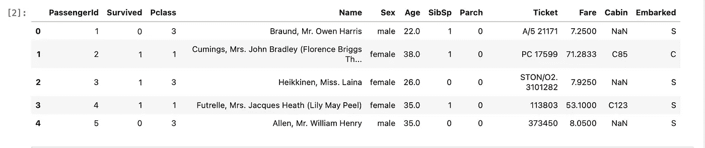
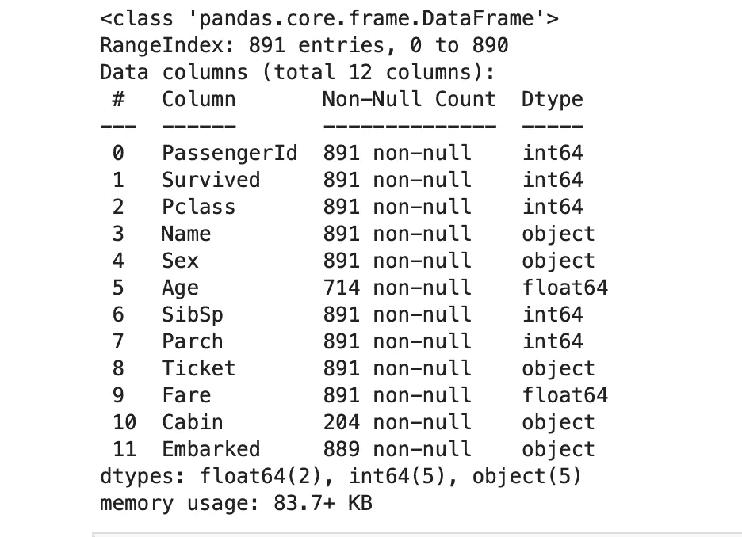
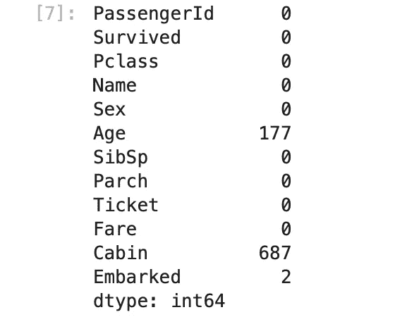
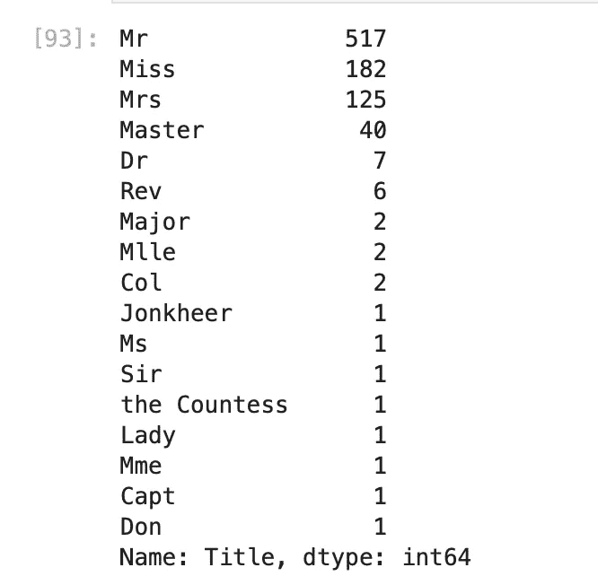
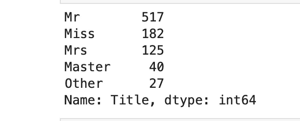
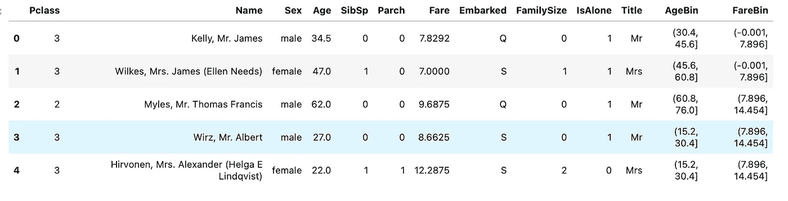
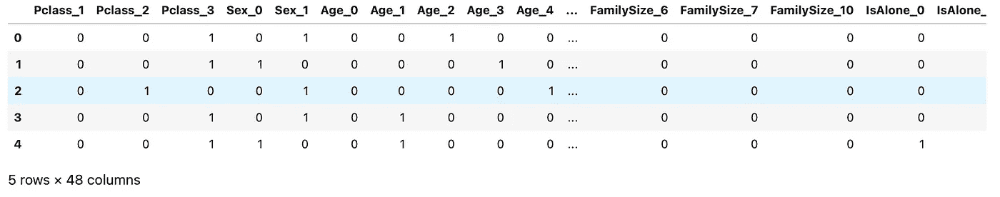
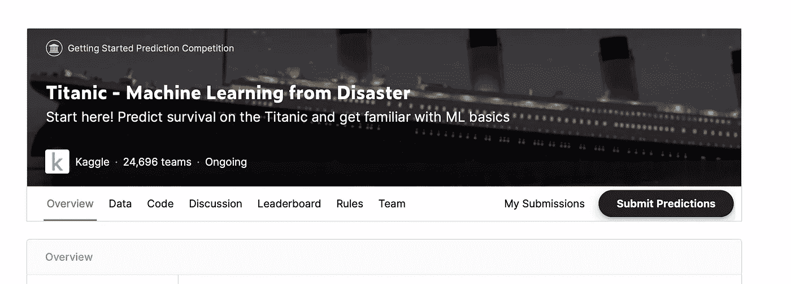

# 首次提交 Kaggle

> 原文：<https://towardsdatascience.com/making-your-first-kaggle-submission-36fa07739272?source=collection_archive---------5----------------------->

## 这是一本简单易懂的指南，指导你如何开始比赛，如何成功地建模和制作你的第一份作品。


照片由[戴恩·托普金](https://unsplash.com/@dtopkin1?utm_source=medium&utm_medium=referral)在 [Unsplash](https://unsplash.com?utm_source=medium&utm_medium=referral) 拍摄

在数据科学的世界里，使用 Kaggle 几乎是必须的。你用它来为你的项目获取数据集，查看和学习那些希望看到你成功建立良好的机器学习模型的人慷慨分享的各种笔记本，发现如何处理复杂的机器学习问题的新见解，这样的例子不胜枚举。

> 在现实世界中尝试你的技能的最好方法之一是通过网站上举办的比赛。[泰坦尼克号竞赛](https://www.kaggle.com/c/titanic)是最有益的、对初学者友好的入门方式，可以让他们很好地了解会发生什么，以及如何以最好的方式解决问题。

在本文中，我将带领您制作您的第一个机器学习模型，并成功进入您自己的船，在这些竞赛的海洋中航行。

我们走吧！

## 理解数据

> 首先——打开[比赛页面](https://www.kaggle.com/c/titanic)。你需要时不时地引用它。

对于这一特定任务，我们的问题陈述和最终目标在竞赛页面上有明确定义:

我们需要开发一种 ML 算法来预测泰坦尼克号上乘客的生存结果。

> 测量结果为 **0(未存活)和 1(存活)**。这就是我们手头有一个二元分类问题的确凿证据。

好吧，打开你的 jupyter 笔记本，让我们看看数据是什么样的！

```
df = pd.read_csv(‘data/train.csv’)
df.head()
```



将数据训练成数据帧

乍一看——有分类和连续特征的混合。让我们来看看列的数据类型:

```
df.info()
```



关于列车数据的信息

我不会详细说明这些特征实际上代表了泰坦尼克号乘客的什么——我假设你现在已经在 Kaggle 网站上读过了(如果你还没有的话，你应该已经读过了)。

## 数据清理

这是我们整个 ML 工作流程的主干，是决定一个模型成败的步骤。我们将处理:

1.  准确(性)
2.  一致性
3.  一致性，以及
4.  完全

的数据，如[这篇](/the-ultimate-guide-to-data-cleaning-3969843991d4)精彩文章所述。如果您想获得关于数据清理技术的最深入的知识，请稍后阅读。

同样，也要研究测试数据。我称之为`df_test`。

现在，继续制作一个训练和测试数据的组合列表，开始我们的清理工作。

```
data = pd.concat(objs = [df, df_test], axis = 0).reset_index(drop = True)
```

我们的目标变量将是`**Survived**`列——让我们把它放在一边。

```
target = ['Survived']
```

首先，我们检查训练数据列中的空值。

```
df.isnull().sum()
```



列中空值的总和

我们马上可以观察到，三列对于建模来说似乎是不必要的。还有，机舱柱表现得相当稀疏。我们*可以*保留它，并从中获得某种价值，但现在，让我们保持简单。

```
data = data.drop(['PassengerId', 'Ticket', 'Cabin'], axis = 1)
```

现在我们转到具有空值的其他列。

我们用中间值代替**年龄**和**票价**，而用众数代替**上船**(将是 **S** )。

```
data.Age.fillna(data.Age.median(), inplace = True)
data.Fare.fillna(data.Fare.median(), inplace = True)
data.Embarked.fillna(data.Embarked.mode()[0], inplace = True)
```

这样，我们的数据中就没有空值了。干得好！

## 特征工程

现在，让我们为数据创建一些新的特性。

我们创建一个名为' **familySize** 的列，它将是我们的父母+兄弟姐妹+子女的总和。

```
data['FamilySize'] = data.SibSp + data.Parch
```

此外，我们想要一个名为“ **isAlone** 的新列，基本意思是泰坦尼克号的乘客是否独自在船上旅行。

```
data['IsAlone'] = 1 #if alone
data['IsAlone'].loc[data['FamilySize'] > 1] = 0 #if not alone
```

最后，我们再补充一点，那就是——乘客的头衔作为单独的一栏。

让我们先创建一个新列。

```
data['Title'] = data['Name'].str.split(", ", expand=True)[1].str.split(".", expand=True)[0]
```

现在，让我们看看有多少独特的标题被创建。

```
data[Title].value_counts()
```



乘客的所有头衔

那是相当多的！我们不想要那么多头衔。

因此，让我们继续将少于 10 名乘客的所有标题累积到一个单独的“ **Other** ”类别中。

```
title_names = (data.Title.value_counts() < 10) 
data[‘Title’] = data[‘Title’].apply(lambda x: ‘Other’ if title_names.loc[x] == True else x) 
# data.drop(‘Name’, axis = 1, inplace= True) # uncomment this later
```

现在我们来看看修改后的列。



这看起来好多了。

好了，让我们最终将两个连续的列——年龄和费用——转换成四分位数。点击了解关于此功能[的更多信息。](https://www.google.com/url?sa=t&rct=j&q=&esrc=s&source=web&cd=&cad=rja&uact=8&ved=2ahUKEwip8beKssDvAhU7wzgGHbOEC0YQFjAAegQIARAD&url=https%3A%2F%2Fpandas.pydata.org%2Fpandas-docs%2Fstable%2Freference%2Fapi%2Fpandas.qcut.html&usg=AOvVaw2cFQPp5veGiEe8kXuY0n9G)

```
data['AgeBin'] = pd.qcut(data['Age'].astype(int), 5)
data['FareBin'] = pd.qcut(data['Fare'], 4)
```

这使得这两列是绝对的，这正是我们想要的。现在，让我们再来看看我们的数据。

```
data.head()
```



工程数据

## 标签编码我们的数据

我们所有的分类列现在可以编码成 0，1，2…等等。通过 sklearn 提供的便利功能进行标记。

```
from sklearn.preprocessing import LabelEncoderlabel = LabelEncoder()
data['Sex'] = label.fit_transform(data['Sex'])
data['Embarked'] = label.fit_transform(data['Embarked'])
data['Title'] = label.fit_transform(data['Title'])
data['Age'] = label.fit_transform(data['AgeBin'])
data['Fare'] = label.fit_transform(data['FareBin'])
```

好吧！现在只剩下两步了。首先，我们删除不必要的列。

```
data.drop(['FareBin', 'AgeBin'], axis = 1, inplace = True)
```

最后，我们**一个** - **热** - **用熊猫的 **get_dummies** 函数编码**我们的非标签列。

```
columns_train = [col for col in data.columns.tolist() if col not in target]
data = pd.get_dummies(data, columns = columns_train)
```

现在让我们再看一下我们的数据，好吗？



一位热编码数据

厉害！现在我们可以开始建模了！

## 制作 SVM 模型

将我们数据分成训练集和验证集。

```
train_len = len(df)
train = data[:train_len]# to submit 
test = data[train_len:]
test.drop(labels=["Survived"],axis = 1,inplace=True)
```

现在，我们的训练数据将具有以下形状:

```
train.shapeOutput:
(891, 49)
```

现在，我们从训练数据中删除标签列。

```
train["Survived"] = train["Survived"].astype(int)
```

最后，我们将标签为**的列与其他列分开。**

```
columns_train = [col for col in data.columns.tolist() if col not in target]
label = train['Survived']
train = train[columns_train]train.shape Output:
(891, 48)
```

通过 sklearn 的分割功能，我们使用**80–20 分割**将我们的训练数据分割成训练集和验证集。

```
X_train, X_test, y_train, y_test = model_selection.train_test_split(train, label, test_size = 0.20, random_state = 13)
```

让我们再看一下数据形状。

```
X_train.shape, y_train.shape, X_test.shape, y_test.shapeOutput:
((712, 48), (712,), (179, 48), (179,))
```

完美！我们准备训练我们的 **svm** 模型。

## 训练模型

我们导入我们的**支持向量机**模型:

```
from sklearn import svm
```

接下来，我们从它构建一个简单的分类器，并将其应用于我们的训练数据和标签:

```
clf = svm.SVC(kernel='linear') # Linear Kernelclf.fit(X_train, y_train)
```

很好！我们非常接近做出最终的提交预测。到目前为止做得很好！

现在，让我们在**验证**装置上验证我们的模型。

```
y_pred = clf.predict(X_test)print("Accuracy: ", metrics.accuracy_score(y_test, y_pred)) Output:
Accuracy:  0.8379888268156425
```

对于简单的线性 svm 模型来说，这看起来相当不错。

## 为提交做预测

我们终于来了，这是我们生成第一份提交预测的时刻，也是我们将上传到竞赛网站的文件的时刻。

让我们使用经过训练的分类器模型来预测测试(提交)数据集。

```
test_Survived = pd.Series(clf.predict(test), name="Survived")
```

最后，我们制作一个

```
ID_column = df_test["PassengerId"]
results = pd.concat([ID_column, test_Survived], axis=1)
```

我们检查最终预测输出数据帧的形状:

```
results.shapeOutput:
(418, 2)
```

厉害！这正是我们所需要的。

最后一步是从该数据帧创建一个 csv 文件:

```
results.to_csv("svm_linear.csv",index = False)
```

我们完了。

## 提交材料

进入竞赛网站，寻找下面的页面上传您的 **csv** 文件。



提交您的申请！

本文中的所有代码都可以在我的 repo 中找到。尽管如此，如果您已经完成了，那么您已经有了一个可以提交的 code base+文件。

README**文件也有助于其他事情，比如构建虚拟环境和其他一些事情，所以如果你想的话，一定要检查一下。**

<https://github.com/yashprakash13/data-another-day#ml-mini-projects-because-crash-courses-are-the-best>  

> 单独学习数据科学可能会很难。[跟我来](https://medium.com/@ipom)让我们一起乐一乐。😁
> 
> 在 [Twitter](https://twitter.com/csandyash) 上与我联系。

另外，看看我的另一篇文章，你可能会感兴趣:

<https://pub.towardsai.net/how-to-build-an-end-to-end-deep-learning-portfolio-project-caa459bf3029> 