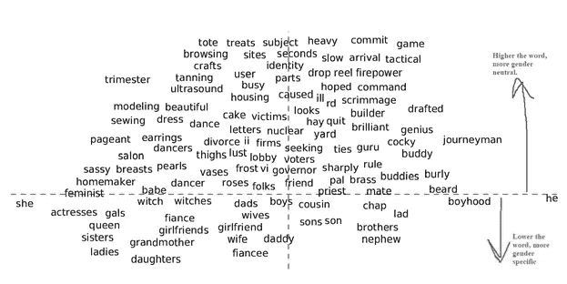

# 男人对于电脑程序员就像女人对于家庭主妇一样？

> 原文：<https://towardsdatascience.com/man-is-to-computer-programmer-as-woman-is-to-homemaker-e57b07cbde96?source=collection_archive---------20----------------------->

## 本文是《男人对于电脑程序员就像女人对于家庭主妇？去偏置词嵌入”

照片由 [Unsplash](https://unsplash.com?utm_source=medium&utm_medium=referral) 上的 [Dainis Graveris](https://unsplash.com/@dainisgraveris?utm_source=medium&utm_medium=referral) 拍摄

# **简介**

本文是“男人对于电脑程序员就像女人对于家庭主妇”一文的摘要[1]。本文讨论了机器学习中由于使用有偏见的训练数据而导致的性别偏见，并提出了一种解决模型去偏见的方法。本文概述了该白皮书，并讨论了该白皮书的 python 实现中的主要发现。

# **概述**

该论文的作者使用单词嵌入模型来证明训练数据中的性别偏见。单词嵌入模型在谷歌新闻文章上进行训练，所有单词的向量表示存储在“ **w2v_gnews_small.txt** 文件中。w2v_gnews_small 包含来自 Google 新闻文章的单词，这些单词用 300 维向量表示。

例如，二维向量将是:

作者图片

因此，如果单词被表示为向量，我们可以使用余弦相似度来发现这些向量有多接近，从而理解单词之间的语义相似度。

本文讨论了使用单词的向量表示来寻找类比。例如，我们要找类比，“人是为了什么？作为女人吗？”。在线性代数中，我们会找出向量男女之间的差异，并找出有差异的向量对与男女向量的差异一样接近。

最接近这种差异的向量组合将是男人对 x 的最佳类比，就像女人对 y 的最佳类比一样。下图用图形解释了这一点:

作者图片

人类最好的类比是？就像女人一样。男人之于国王，犹如女人之于王后。使用简单的向量算法，单词嵌入对于捕获语料库中的各种关系是强大的。

然而，作者发现了单词嵌入模型放大的训练数据中隐含的性别歧视。例如，模型返回的性别歧视类比有:

男人对于电脑程序员就像女人对于家庭主妇一样。

父亲对于医生就像母亲对于护士一样。

因此，在谷歌新闻文章中存在隐含的性别偏见，这是单词嵌入模型识别并可能夸大的。本文讨论了如何评估训练数据中的性别偏见，并提出了消除或最小化性别偏见的方法。我们将在接下来的章节中讨论这些。

# **偏差评估**

性别专用词是指与其性别相称且没有偏见的词。比如父亲这个词是男性性别，母亲是女性性别。因此，父亲和母亲是一对性别专用词。

为了量化偏见，作者将一个词向量与一对性别特定的词进行了比较。考虑单词矢量“护士”和父亲-母亲的性别特定的成对单词。护士这个词应该是中性的。我们将它非正式地形象化如下:

作者图片

使用*余弦相似度*计算向量奶妈和奶爸之间的距离。我们注意到奶妈之间的距离比奶爸之间的距离要小。因此，嵌入意味着护士更女性化，更接近母亲的向量。这是不正确的，因为护士可以是男性也可以是女性。

本文讨论了两种类型的性别偏见:

1.  **直接偏差:**

在这种类型的性别偏见中，中性词被投射到性别轴上，理想情况下应该是中性的。如果偏向男性或女性，那么就存在性别偏见。论文中直接性别偏见的一些例子如下:

图片来自纸张[1]

**2。间接偏置**:

在这种性别偏见中，中性词被投射在极端-她极端-他职业轴上。

例如，垒球被认为是极限职业，足球被认为是极限职业。理想情况下，中性词应该在垒球-足球轴的中间。如果他们偏向轴线的任何一边，那么就有间接的性别偏见。论文中间接性别偏见的一些例子如下:

图片来自纸张[1]

我们已经讨论过嵌入产生性别偏见的输出。但是为了正式量化这些偏差，进行了群体实验。总部位于美国的亚马逊机械土耳其人被用来征求对单词或类比的性别偏见评级。

# **去偏置程序**

消除性别偏见模型的程序解释如下:

1.我们首先从语料库中找到一小组特定性别的词，如他、她、男人、女人。这些充当种子词。完整列表可在附录 C[1]中找到。

2.使用这些种子词，创建线性 SVM 分类器来获得所有性别特定的词。

3.使用所有性别特定的单词，我们对语料库进行补充，以找到性别中性的单词，如程序员、家庭主妇、园丁。我们最终分离出性别专用词和性别中性词，如下图所示:

在该图中，y 轴表示该单词是特定于性别的还是中性的。

4.接下来，我们选择种子对单词作为 x 轴。我们选择 she-he 单词对，其他单词被投射到这个**性别轴**上。这个步骤被称为*识别性别子空间*，即识别捕获偏差的嵌入的方向。

于是，女演员更偏向她，少年时代更偏向何。我们注意到像*天才*这样的中性词更倾向于“他”而不是“她”。这是数据上的性别偏见。

我们可以用两种方法来消除中性词的偏见。我们可以执行硬去偏置(中和和均衡)或软去偏置(软化)。

硬债务是一种极端措施，在这种措施中，性别中性术语的性别痕迹将不复存在。软 debias 根据指定的超参数以中性术语保留性别。接下来我们将讨论硬德拜斯技术。

5.在 neutralize 中，我们将所有性别中性术语投影到 y 轴上，从而消除了性别偏见。视觉表现是，

图片来自纸张[1]

6.在 equalize 中，我们使中性词与每个等式集合中的所有词等距，如{祖母、祖父}、{guy、gal}。这意味着单词保姆将在祖母-祖父轴上等距，在男人-女人轴上等距。

该论文指出，模型的去偏化减少了刻板的类比(比如男人=程序员，女人=家庭主妇),并保持了嵌入的可用性。

# **Python 实现**

使用来自以下 GitHub repo 的代码成功地重复了该实验:[https://github.com/simsong/debiaswe](https://github.com/simsong/debiaswe)[2]

GitHub repo 的文件描述如下:

作者图片

## [教程 _example1.ipynb](https://github.com/simsong/debiaswe/blob/master/tutorial_example1.ipynb) 的代码讨论:

1.  在**步骤 1** 中，我们正在加载在谷歌新闻语料库上训练的单词嵌入。

来自代码[2]的图像

2.在**步骤 2 中，**我们通过舍和的方向来定义性别方向。

来自代码[2]的图像

3.在**步骤 3** 中，我们为她和性别方向找到最佳类比对。

来自代码[2]的图像

来自步骤 3 输出的 she-he 对的一些语义正确且无偏见的类比是:
1。女汉子
2。女儿-儿子 3。女商人-商人
4。女孩-男孩。女演员

来自步骤 3 输出的 she-he 对的一些有偏差的类比是:
1。钢琴大师 2。紧张自大的人。愉快地——出色地。助理教授经济学教授。注册 _ 护士-医生

4.在**步骤 4** 中，我们分析与职业相关的性别偏见。

来自代码[2]的图像

职业词汇列表来自人群实验，这些词汇是从亚马逊机械土耳其人那里征集来的。

每个字后的双浮点数定义如下:

来自代码[2]的图像

**例如**:

作者图片

根据定义，球员是弱男性职业，但刻板印象中，它比男性职业得分高。

5.最后，我们把嵌入这个词去掉。我们使用 debiaswe.debias 函数对我们选择的词集进行去偏置。

来自代码[2]的图像

# 结论

本文讨论了去偏差技术和量化数据偏差的指标。总之，词嵌入可以用来捕捉性别关联和性别偏见。一旦我们确定了偏见，我们就可以消除它们，以减轻性别偏见的扩大。我强烈推荐阅读原始论文，它写得非常好。

# 参考资料:

[1]t . Bolukbasi，k . Chang，j . Zou，Saligrama，v .，& Kalai，A. (2016 年 7 月 21 日)。男人对于电脑程序员就像女人对于家庭主妇一样？去偏置词嵌入。检索于 2020 年 10 月 28 日，发自 https://arxiv.org/abs/1607.06520

[2]辛姆森·加芬克尔男人对于电脑程序员就像女人对于家庭主妇一样？来自 https://github.com/simsong/debiaswe[的去偏置词嵌入(2019)。](https://github.com/simsong/debiaswe)

[3] Bolukbasi，t .，Chang，k .，Zou，j .，Saligrama，v .，& Kalai，A. (2016 年 7 月 21 日)，男人对于电脑程序员就像女人对于家庭主妇？[https://github.com/tolga-b/debiaswe](https://github.com/tolga-b/debiaswe)

[4]t . Bolukbasi，k . Chang，j . Zou，Saligrama，v .，& Kalai，A. (2016 年 7 月 21 日)。男人对于电脑程序员就像女人对于家庭主妇一样？去偏置词嵌入。[https://drive . Google . com/file/d/1 ixidmreh 4 qvynx 68 qvkqcc 9-_ yyksoxR/view](https://drive.google.com/file/d/1IxIdmreH4qVYnx68QVkqCC9-_yyksoxR/view)

[5]t . Bolukbasi，k . Chang，j . Zou，Saligrama，v .，& Kalai，A. (2016 年 7 月 21 日)。男人对于电脑程序员就像女人对于家庭主妇一样？去偏置词嵌入。[https://pdfs . semantic scholar . org/cc F6/a 69 a 7 f 33 BCF 052 a 7 def 176d 3 b 9 de 495 beb 7 . pdf](https://pdfs.semanticscholar.org/ccf6/a69a7f33bcf052aa7def176d3b9de495beb7.pdf)