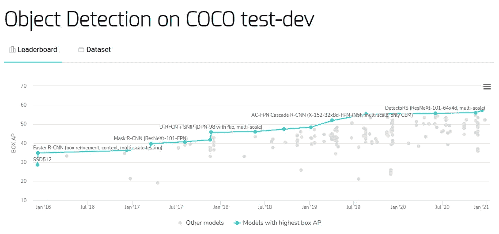
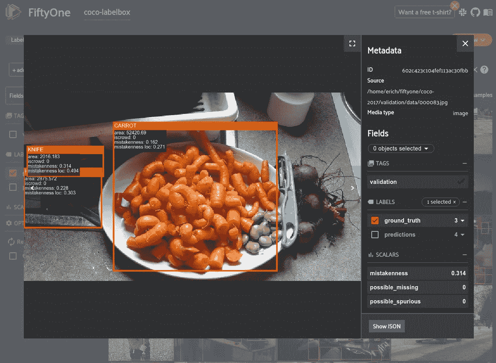
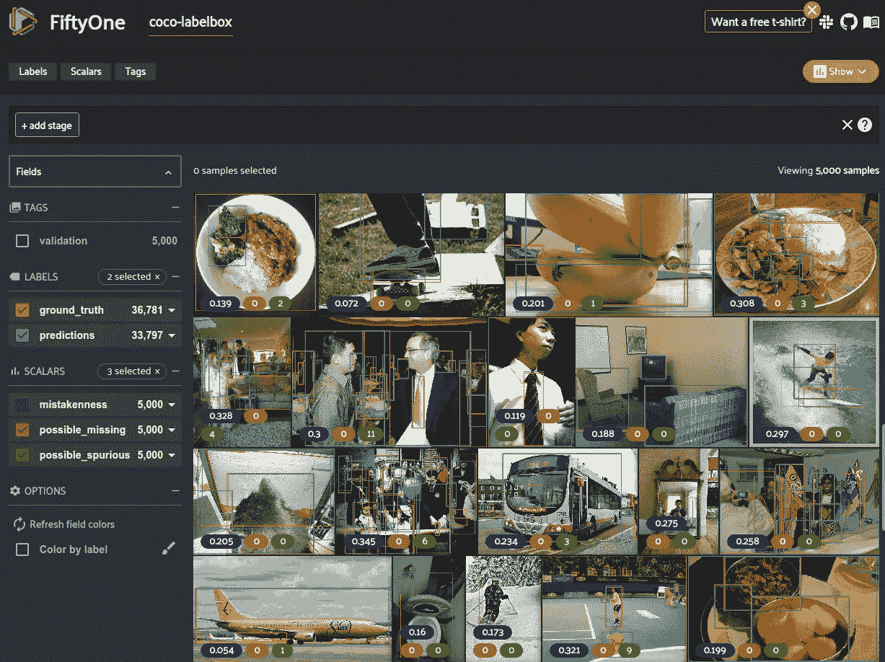
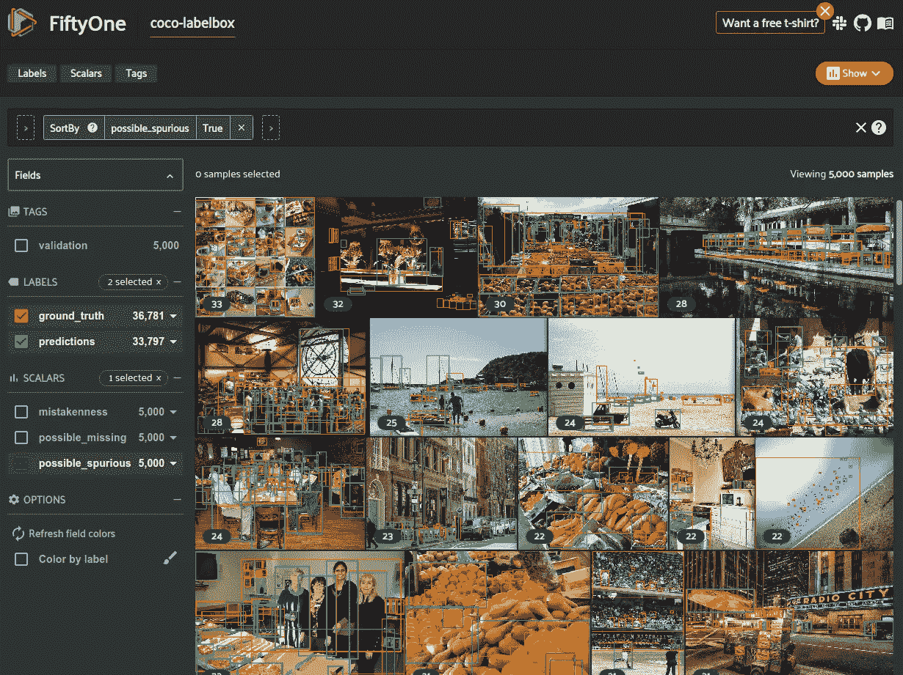
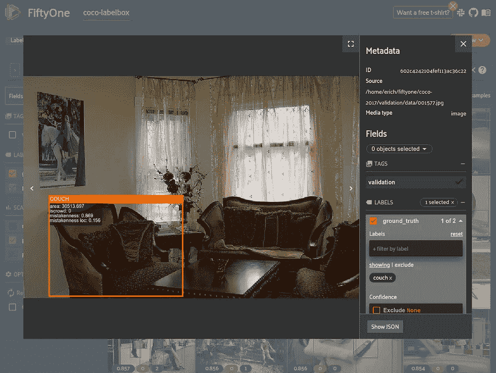
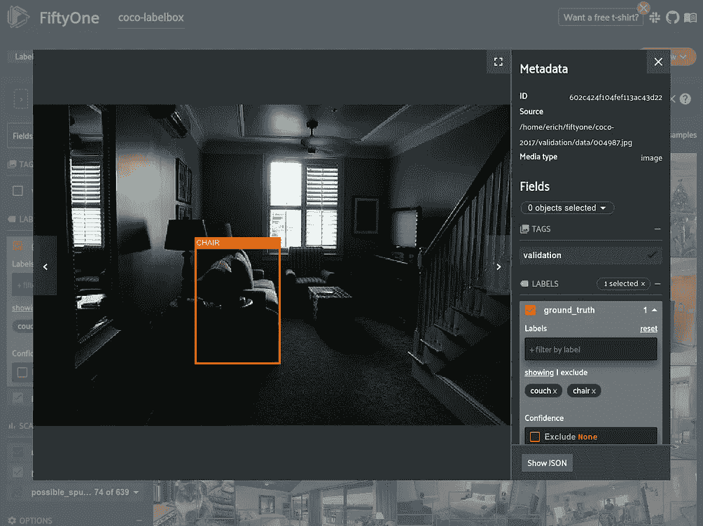
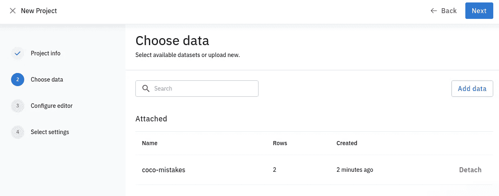
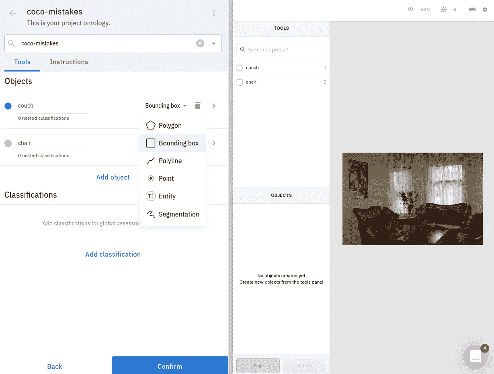
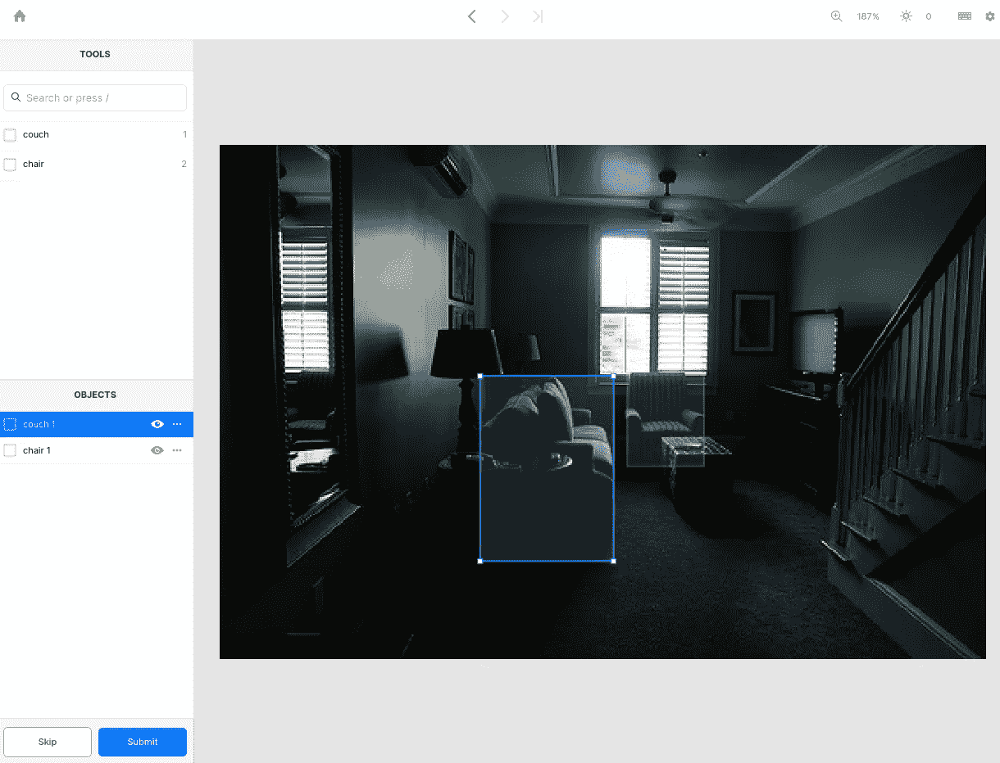

# 使用 FiftyOne 和 Labelbox 管理注释错误

> 原文：<https://towardsdatascience.com/managing-annotation-mistakes-with-fiftyone-and-labelbox-fc6e87b51102?source=collection_archive---------20----------------------->

## 使用 51 查找图像数据集中的注释错误，并在 Labelbox 中修复它们


约翰尼·麦克朗在 [Unsplash](https://unsplash.com?utm_source=medium&utm_medium=referral) 上的照片

随着计算机视觉数据集增长到包含数百万张图像，注释错误无疑会悄然而至。虽然训练数据中的注释错误如果大量存在，可能对模型的性能有害，**黄金标准测试集没有任何错误是至关重要的。**

在学术界，ImageNet 和 MS-COCO 等著名数据集充当基准，允许研究人员比较相隔多年创建的计算机视觉方法。但是即使是流行的公共数据集也不是没有错误的。



COCO 数据集上的模型性能在 5 年内缓慢提高([图片来自 paperswithcode.com](https://paperswithcode.com/sota/object-detection-on-coco)，CC-BY-SA)

随着时间的推移，这些数据集的性能仍在提高。当您需要决定使用哪种特定的模型来完成任务时，问题就来了。在公共数据集上比较整体性能是不够的。尤其是在生产环境中，**当表现不佳会带来金钱甚至道德后果时，你需要确定你的模型的表现**。

高质量的黄金标准数据集即使不比高质量的模型更有价值，也同样有价值。能够准确地选择最佳模型并保持对其生产数据性能的信心，特别是在困难边缘情况下的性能，将节省时间和金钱，否则将不得不花费在取下模型并修改它上。

在这篇博客文章中，我看了两个机器学习工具，它们可以快速轻松地找到并修复可视化数据集中的注释错误。我正在使用开源的 ML 开发工具 [**第五十一**](http://fiftyone.ai/) 来计算标签的错误。然后，FiftyOne 直接与标注工具 [**Labelbox**](https://labelbox.com/) 集成，让我们可以轻松地重新标注有问题的样本。

# 设置

[五十一](http://fiftyone.ai/)和[标签盒](https://docs.labelbox.com/python-sdk/en/index-en#labelbox-python-sdk)API 都可以通过`pip`安装:

```
pip install fiftyone
pip install labelbox
```

使用 Labelbox 首先需要您创建一个免费帐户。这使您可以访问 Labelbox 注释应用程序，并让您上传原始数据。

FiftyOne 是一个开源工具，所以不需要帐户，只需要安装 pip。

为了使用 Labelbox Python SDK，您需要生成并[验证您的 API 密钥](https://docs.labelbox.com/python-sdk/en/index-en#authentication):

```
export LABELBOX_API_KEY="<your-api-key>"
```

***注*** *:你需要一个付费账号在 Labelbox 中进行模型辅助标注。这是将现有标签上传到 Labelbox 的唯一方法。*

# 将数据载入 51

在这篇博客中，我使用 [COCO-2017 对象检测数据集](https://cocodataset.org/#home)作为例子。该数据集在[51 数据集 Zoo](https://voxel51.com/docs/fiftyone/user_guide/dataset_zoo/index.html) 中，因此可以在一行代码中加载到 51 中:



加载到第五十一个应用程序中的 COCO 数据集样本(图片由作者提供)

当然，在实践中，您会希望使用自己的数据，所以让我们来讨论一些数据存储在哪里以及如何加载数据的场景。

## 案例 1:数据集在 Labelbox 中

如果您有一个正在 Labelbox 中注释的数据集，并且只想使用 fiftone 来浏览该数据集并找到注释错误，那么 fiftone 中提供的 Labelbox 集成使这变得快速而简单。

首先，您需要从 Labelbox 中导出您的数据。这就像登录 Labelbox 应用程序一样简单，选择一个项目，转到 Exports 选项卡，然后生成标签的 JSON 导出。

接下来，您可以使用 FiftyOne 中提供的 [Labelbox 实用程序来导入数据集。您只需要指定导出的 JSON 的路径以及用于从 Labelbox 下载原始数据的目录。](https://voxel51.com/docs/fiftyone/api/fiftyone.utils.labelbox.html?highlight=labelbox#module-fiftyone.utils.labelbox)

## 案例 2:数据集遵循通用格式

[FiftyOne 支持加载](https://voxel51.com/docs/fiftyone/user_guide/dataset_creation/index.html)十多种常见的计算机视觉数据集格式，包括 [COCO](https://voxel51.com/docs/fiftyone/user_guide/dataset_creation/datasets.html#cocodetectiondataset-import) 、 [TFRecords](https://voxel51.com/docs/fiftyone/user_guide/dataset_creation/datasets.html#tfobjectdetectiondataset-import) 、 [YOLO](https://voxel51.com/docs/fiftyone/user_guide/dataset_creation/datasets.html#yolodataset-import) 和 [more](https://voxel51.com/docs/fiftyone/user_guide/dataset_creation/datasets.html#supported-formats) 。如果您的数据集遵循这些格式之一，那么您可以用一行代码将其加载到 FiftyOne 中:

## 案例 3:数据集以自定义格式存储

不管你使用什么格式，你总是可以把你的[数据和标签放到 51 个](https://voxel51.com/docs/fiftyone/user_guide/dataset_creation/samples.html#manually-building-datasets)中。你需要做的就是用 Python 解析你的标签，将你的标签添加到[51 个样本](https://voxel51.com/docs/fiftyone/user_guide/using_datasets.html#samples)，然后将样本添加到[51 个数据集](https://voxel51.com/docs/fiftyone/user_guide/using_datasets.html#datasets)。例如，如果您有检测，以下代码将构建一个数据集:

# 用 51 查找注释错误

FiftyOne 还包括 [FiftyOne Brain](https://voxel51.com/docs/fiftyone/user_guide/brain.html) 包，其中包含各种方法，可以帮助您分析数据集，以找到[独特的](https://voxel51.com/docs/fiftyone/user_guide/brain.html#image-uniqueness)和[坚硬的](https://voxel51.com/docs/fiftyone/user_guide/brain.html#sample-hardness)样本，以及在分类和对象检测数据集中找到潜在的[注释错误](https://voxel51.com/docs/fiftyone/user_guide/brain.html#label-mistakes)。

## 生成模型预测

51 大脑中的`[mistakenness](https://voxel51.com/docs/fiftyone/user_guide/brain.html#label-mistakes)`方法使用模型预测，根据模型的置信度对可能的注释错误进行排序。因此，让我们向数据集添加一些模型预测。

我们可以使用 [FiftyOne Model Zoo](https://voxel51.com/docs/fiftyone/user_guide/model_zoo/index.html) 从各种预训练的模型中自动加载和生成检测，并将检测添加到我们的数据集中，只需两行代码。

在这个例子中，我使用的是在 COCO-2017 上预训练的 EfficientDet-D6。

***注*** *:如果您正在使用自定义数据集，那么您可能需要使用自己的训练模型来生成预测，并手动将它们添加到您的 51 数据集。无论您使用的是* [*分类*](https://voxel51.com/docs/fiftyone/user_guide/using_datasets.html#classification) *，* [*检测*](https://voxel51.com/docs/fiftyone/user_guide/using_datasets.html#object-detection) *，还是* [*更多*](https://voxel51.com/docs/fiftyone/user_guide/using_datasets.html#labels) *，这个过程都很简单。对于分类，您还可以为每个预测添加逻辑来计算误差。*

## 计算错误

一旦我们将基础事实和预测标签添加到 51，我们只需要运行一个命令[来计算错误](https://voxel51.com/docs/fiftyone/user_guide/brain.html#label-mistakes)。

这将在标签上填充以下属性:

*   `mistakenness` — [0，1]地面实况标签上的值，指示地面实况对象的标签不正确的可能性
*   `mistakenness_loc` — [0，1]基本事实检测值，表示基本事实的边界框不准确的可能性
*   `possible_spurious` —基于地面真实检测的布尔型，指示潜在对象可能不存在
*   `possible_missing` —预测检测上的布尔值，表示注释过程中可能会遗漏某个对象

## 浏览数据集

既然已经为数据集中的所有样本计算了错误率，我们可以使用[51 应用](https://voxel51.com/docs/fiftyone/user_guide/app.html)来可视化我们的数据集，并寻找我们需要修复的特定样本和注释。



第五十一个应用程序中的错误计算结果(图片由作者提供)

此外，我们可以通过[在数据集](https://voxel51.com/docs/fiftyone/user_guide/using_views.html)中创建视图来搜索、排序和查询错误计算的结果。例如，我们可以按最多`possible_spurious`次检测的样本进行排序:



带有虚假对象的顶级样本(图片由作者提供)

或者，我们可以过滤所有检测，只查看`mistakenness`大于 0.6 的检测:



椅子和沙发类的错误注释示例(图片由作者提供)

浏览一下上一个查询中的一些样本，我们可以看到一个常见的错误模式是误认为`couch`和`chair`类。这两个类似乎经常包含注释错误的事实会人为地降低模型在这些类上的性能。让我们从这些样本中选择一些，并将其加载到 Labelbox 中进行重新计数。

# 修复 Labelbox 中的批注

FiftyOne 使查找有注释错误的样本变得快速而容易。由于 FiftyOne 和 Labelbox 之间的集成，我们现在可以[将我们想要重新标注的数据加载到 Labelbox](https://docs.labelbox.com/en/import-data/direct-upload) 中。在 [Labelbox 应用](https://app.labelbox.com/)中，只需创建一个新的数据集并选择您想要上传的文件。

您还可以使用 FiftyOne 中的 [Labelbox 实用程序将媒体文件添加到您之前在 Labelbox 应用程序中创建的数据集中:](https://voxel51.com/docs/fiftyone/api/fiftyone.utils.labelbox.html?highlight=labelbox#module-fiftyone.utils.labelbox)

*注意:如果您标记的项目已经存在于 Labelbox 中，那么您只需要收集您想要修复的样本的 id。*

## 使用标签框编辑器

使用 Labelbox 的主要好处之一是能够访问用于标记图像的强大编辑器。他们的在线工具非常容易使用，非常适合我们希望尽快修复这些错误注释的工作流。

一旦 Labelbox 应用程序的数据集中有了原始数据，我们现在就可以创建一个新项目，并附加我们想要重新标注的数据。



为 Labelbox 中的项目选择数据集(按作者排序的图像)

然后我们需要为我们想要注释的类配置编辑器。在本例中，我们只想重新标记我们选择的样本中的`chairs`和`couches`，所以我们添加了这些对象类。



在 Labelbox 中配置编辑器(按作者排列的图像)

一旦建立了项目，您就可以开始根据所定义的类来标记样本。



重新标注错误的治疗床标签(作者图片)

现在这些样本已经被重新标注，我们可以更新 Labelbox 数据集中的标签，或者再次下载标注，并在 Labelbox 外部手动更新我们的数据集。

## (可选)模型辅助标注

Labelbox 还为 Pro/Enterprise Labelbox 用户提供付费的[模型辅助贴标功能](https://docs.labelbox.com/en/model-assisted-labeling)。这样，您可以将注释直接加载到 Labelbox 中并编辑它们。这使得更新错误的注释或使用模型预测作为未来注释的起点变得更加容易。

第五十一个中的[标签盒实用程序提供了多种功能来帮助实现这一点。您可以将数据集以 Labelbox 格式导出到磁盘，然后将其上载到现有的 Labelbox 项目。](https://voxel51.com/docs/fiftyone/api/fiftyone.utils.labelbox.html?highlight=labelbox#)

# 摘要

带有正确标签的干净数据是黄金标准测试集的关键。注释错误会导致不可靠的模型性能，这在生产环境中可能是昂贵的，甚至是危险的。利用 FiftyOne 和 Labelbox 之间的紧密集成来快速查找和修复注释错误可能是生成成功模型的关键。

# 关于体素 51

高质量、有针对性的数据对于训练优秀的计算机视觉模型至关重要。在 [Voxel51](https://voxel51.com/) ，我们拥有超过 25 年的 CV/ML 经验，非常关心如何让社区将他们的 AI 解决方案带入生活。这就是为什么我们开发了 [FiftyOne](https://voxel51.com/docs/fiftyone) ，一个帮助工程师和科学家更快更好地完成 ML 的开源工具。

想了解更多？在 [fiftyone.ai](http://fiftyone.ai/) 查看我们的网站。