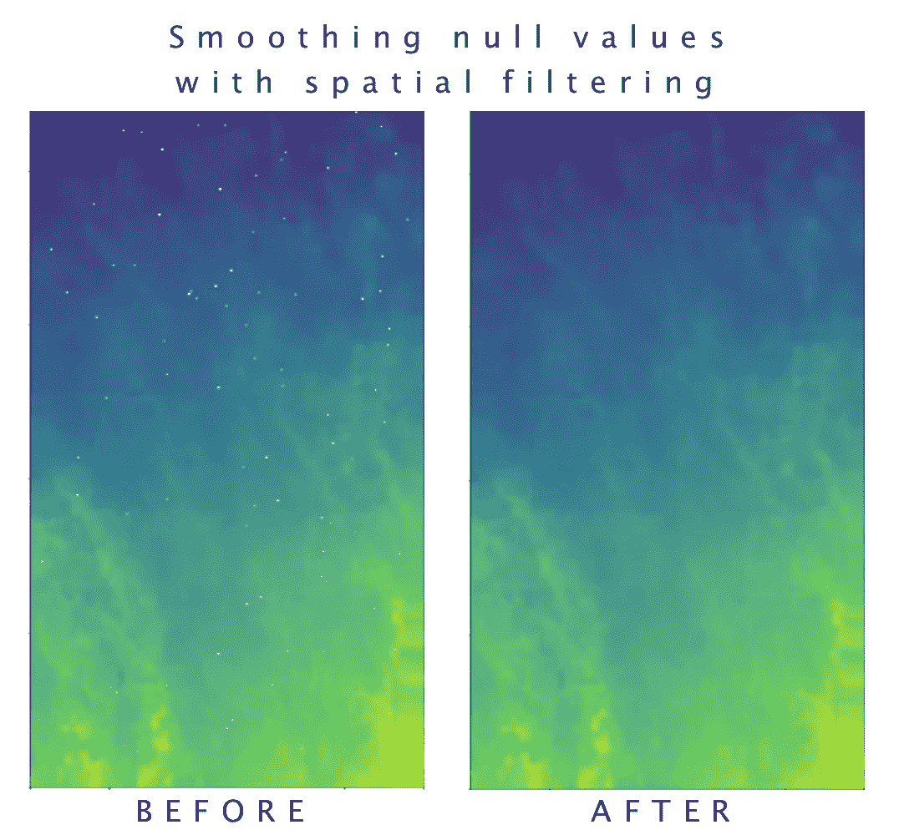
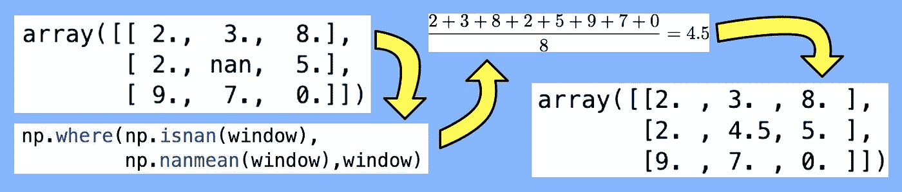
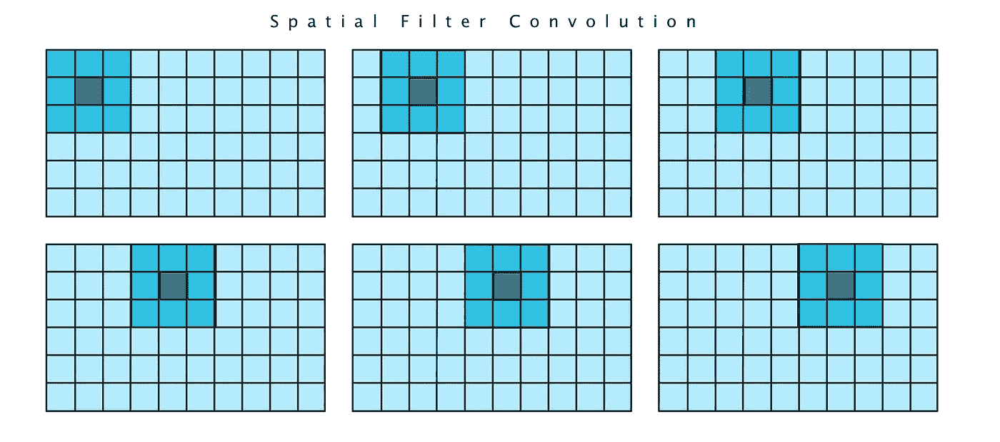
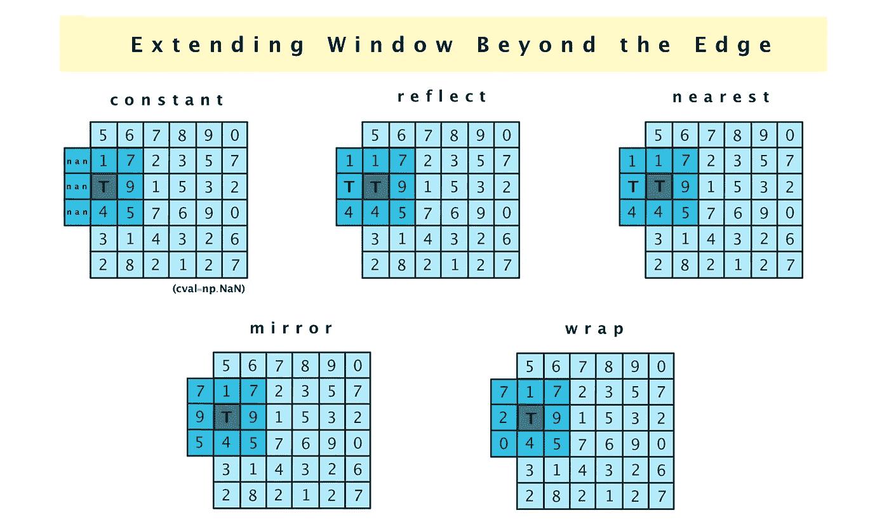
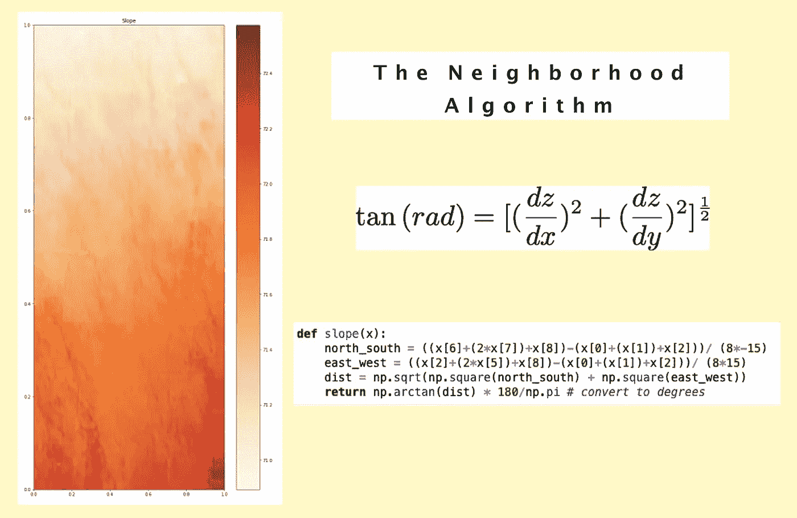

# 使用 Python 管理栅格数据中的空值

> 原文：<https://towardsdatascience.com/managing-null-values-in-raster-data-with-python-511339b1b31b?source=collection_archive---------36----------------------->

## [入门](https://towardsdatascience.com/tagged/getting-started)

## 使用地图代数将简单算法应用于图像

空值总是数据科学家的心头之火，正确地管理它们可能是应用程序崩溃和应用程序腾飞的区别。

这对于 GIS 影像或任何栅格化数据尤为重要。我们不能忽略空值或用零填充它们(删除不是一个选项！)因为它会在生成的图像中产生难看的洞(见下面的例子)。

左侧的数字高程模型(DEM)显示了包含空值的栅格数据集；右图显示了对空值应用空间滤波平滑后的效果。(图片| **布比杰尼斯**)

我们必须应用一种叫做**空间过滤**的技术，用反映我们发现它们的背景或环境的信息来填充空白。

为了使“之后”的图像(上图)看起来一致或*平滑*，我们知道“之前”图像顶部的空像素应该用与图像底部的空像素完全不同的值填充。那么，如何才能使用 Python 恰当而系统地计算出这些新值呢？

> 在我的 Github 页面上查看该项目的完整代码([链接](https://github.com/bubjanes/spatial_filtering))。

# 数据工程任务

我的同事 Daniel Bonhaure 和我构建了一个非常标准的 GIS 分析 web 应用程序，允许用户上传矢量数据集(即 shapefiles)，可视化它们并对存储的数据进行分析。然而，在将数据存储到数据库中之前，我们的数据工程管道必须正确地处理空值。

如果我写的是关于 R 编程语言的文章，这篇文章会短得多，因为 R 提供了一个简单的函数， **focal()** ，它完成了所有的工作。然而，使用 Python，这是一个更难解决的问题。我们需要召唤 NumPy，SciPy 和 Matplotlib 的力量。

# 这很复杂…从好的方面来说

空间过滤或焦点分析是一种地图代数技术，在这种技术中，我们使用相邻像素的值来改变目标像素的值，在我们的情况下，目标像素为空值。如果你曾经使用过图像滤镜来增强你的 Instagram 照片，这是完全相同的技术。

空间过滤器如何用周围值的平均值替换空值的示例。(图片| **bubjanes** )

她有许多名称——窗口、内核、过滤器足迹、地图——但本质上它是一个二维数组(最常见的是 3 x 3 或 5 x 5)，它在图像中逐个像素地移动，其中数据集中的每个像素在中心有一个转折，即我们的 3 x 3 数组中的第五个或位置**x[4】**。这个过程叫做卷积。

过滤器覆盖区或“窗口”以这种卷积模式逐个像素地穿过整个栅格。️(image| **布比杰斯&玛琳**

我们在函数中使用的过滤器仅在目标位置发现空值时触发，即 **x[4]** 。当找到时，它用周围像素的平均值填充该值。

Code| **dbonaure**

SciPy 多维图像处理子模块为卷积和滤波提供了几个选项；我们在我们的系统中使用了[**【generic _ filter()**](https://docs.scipy.org/doc/scipy/reference/generated/scipy.ndimage.generic_filter.html#scipy.ndimage.generic_filter)(见下文)。

# 边缘案例

如果你检查一下笔记本[你会发现我们的过滤窗口效果很好，但是我们忽略了一个非常重要的细节:边缘。也就是说，当我们的过滤窗口的目标值在我们的光栅矩阵的边界上时，我们该怎么办？](https://github.com/bubjanes/spatial_filtering/blob/main/spatial_filtering.ipynb)

这由 SciPy **generic_filter()** 函数中的**模式**参数处理，该函数提供了五个选项:

用于将窗口扩展到卷积计算边缘之外的选项(image| **bubjanes)**

*   **常量** —通过用我们传递给 *cval* 参数的任何内容填充窗口来扩展窗口的值；在我们的例子中 **cval=np。南**。
*   **反射** —以相反的顺序重复外部边缘附近的值(对于 3 x 3 窗口，这将只包括栅格边缘的像素；一个 5 x 5 将包括两个额外的*反射*值)。
*   **最近的**-仅取最靠近边缘的值(对于 3 x 3 窗口，这相当于*反射* **)** 。
*   **镜像** —在内部矩阵的反射模式中，将窗口的值扩展到光栅边缘之外，但跳过边缘值(在 3×3 矩阵中，这意味着添加的行或列不是边缘，而是边缘的第二行)。
*   **wrap** —通过从矩阵的另一边获取值来扩展窗口的值(就像在*超级马里奥*中，当你跳出屏幕的一边，出现在另一边)

# 高级过滤算法

既然我们已经使用空间滤波成功地平滑了我们的空值，为什么不更进一步呢？使用相同的管道，我们可以通过将它添加到我们的 **generic_filter()** 函数来应用任何我们想要的空间算法。

在本例中，由于我们使用的是数字高程模型或 DEM，因此计算地块中每个点的坡度可能是合理的。我们可以使用邻域算法来实现这一点(如下)。

用 Python 实现邻域算法。(图片| **bubjanes** )

我们正在查看的数据集是农田(非常平坦)，因此斜率图并不十分令人兴奋，…但你已经明白了。

# 结论

此处提供的清理栅格数据的解决方案(空间过滤)是影像处理科学特有的，需要地图代数和卷积的专业知识。

尽管空间滤波是一种较为复杂的平滑空值的方法，但我们可以重新利用这种技术对我们的数据进行更复杂的科学计算，例如计算数字高程模型在每个点的斜率。

🔥🔥🔥🔥

# 延伸阅读:

*   克里斯·杰拉德，[使用 Python 进行地理处理](https://livebook.manning.com/book/geoprocessing-with-python/chapter-11/77) (2016)
*   宾夕法尼亚州立大学的[邻域算法](https://www.e-education.psu.edu/natureofgeoinfo/book/export/html/1837)