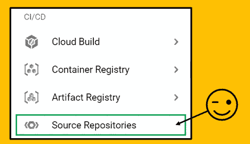
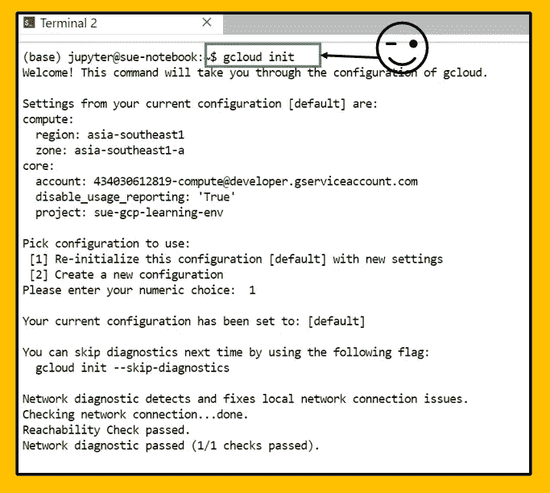

# 利用 GCP 云资源仓库管理人工智能平台上的脚本

> 原文：<https://towardsdatascience.com/managing-scripts-on-ai-platform-with-gcp-cloud-source-repository-b27f5f0db70c?source=collection_archive---------21----------------------->

## 分享通过 GCP 云资源仓库管理和共享脚本的步骤的教程


Thiago Barletta 拍摄于 [Unsplash](https://unsplash.com/)

## 介绍

之前我曾经在组件 Google Cloud AI 平台下有多个 Jupyter 笔记本。当我想将脚本从 Notebook-1 复制到 Notebook-2 时，我将启动 Notebook-1 的实例，并从那里下载脚本以上传到 Notebook-2。这种方法效率很低，并且随着实例的启动会产生更多的成本。然后我的队友建议与 Google 云资源仓库合作——这是一个绝妙的主意！

## 那么什么是 Google 云源码库呢？

Google Cloud Source Repositories 是一个很好的平台，可以在团队成员之间管理和共享代码，或者在项目结束时与客户共享您的脚本。云资源存储库可以是团队共享脚本、管理和跟踪变更的单一位置。用户可以轻松地将他们的脚本的更新版本从笔记本推送到云资源存储库。

Google Cloud Source Repository 可以连接到许多其他 GCP 组件，如 App Engine、Cloud Build 等。然而，本文将分享创建存储库所需的步骤，并将脚本从您的 AI 平台 Jupternotebook 推送到云资源存储库，并从云资源存储库克隆到 AI 平台 Jupternotebook。

让我们开始我们的教程！*(本教程假设已经设置了一个 GCP 项目)*

## 创建云资源存储库:

首先从您的 GCP 控制台下拉菜单导航到云源存储库。



步骤 1:开放云源代码库

选择“添加存储库”选项，然后选择“创建新存储库”


步骤 2:创建新的存储库

提供一个“存储库名称”并指定您希望云资源存储库成为的“项目”。


步骤 3:指定“存储库名称”和“项目”

一旦成功创建了您的存储库，将会有一个指南分享您如何将代码添加到存储库中。有三种方法:

*   SSH 认证
*   谷歌云 SDK
*   手动生成的凭据

让我们遵循“Google Cloud SDK”方法，它为我们提供了将脚本推送到存储库所需的命令。


步骤 4:选择并遵循方法——Google Cloud SDK

## 将存储库克隆到 Jupyternotebook

现在让我们打开 Jupyternotebook，看看如何将新创建的存储库克隆到 Jupyternotebook 中。要运行笔记本中提供的代码，我们需要启动“终端”。


第五步:在 Jupternotebook 中启动“终端”

这将启动一个新的“终端标签”。现在，我们可以通过运行提供的命令集，在这个“终端选项卡”中开始克隆我们新创建的云资源存储库

首先运行第一个命令来设置身份验证凭据:

```
gcloud init 
```



步骤 6:提供身份验证凭据

接下来，克隆您新创建的云资源存储库

```
gcloud source repos clone Our-Scripts-Folder --project=sue-gcp-learning-env
```


步骤 7:克隆存储库

当我们克隆一个空的存储库时，在警告消息显示上注明。让我们切换到这个新的克隆存储库，并向其中添加文件。

```
cd Our-Scripts-Folder
```


步骤 8:切换到新的克隆存储库

将一些文件上传到新的克隆存储库文件夹中。在这个例子中，我上传了 2 个文件到文件夹“我们的脚本文件夹”


步骤 9:将文件/脚本上传到新文件夹

## 推送至云资源存储库

上传完成后，我们需要添加并提交它们，然后将它们推回主云资源存储库。

此外，您需要通过运行以下命令在提交之前设置您的详细信息:

```
git config — global user.email “you@example.com”
git config — global user.name “Your Name”
```


步骤 10:更新用户详细信息

现在，您可以添加、提交和推送您的代码到云源代码库。

```
git add . 
git commit -m "type your commit message here"
git push -u origin master
```


步骤 11:添加、提交和推送

成功推送文件后，检查它们是否上传到了云资源存储库中。


步骤 12:执行检查

恭喜你！文件已成功上传到云源资料档案库。

现在，让我们反过来工作。假设我们正在与新同事分享这组脚本。我们的新同事需要将云资源存储库中的脚本克隆到他/她的 Jupyternotebook 中。让我们看看如何做到这一点！

## 从云资源库中克隆和提取

在云资源仓库中，有一个“克隆”选项，向我们展示了如何克隆仓库并提取代码。选择“+克隆”选项，然后选择“如何设置？”。


步骤 13:选择“+克隆”选项

与之前类似，有 3 种克隆方法。让我们选择选项——Google Cloud SDK，它为我们的新同事克隆存储库提供了所需的命令。

通过在终端中运行克隆命令来克隆存储库

```
gcloud source repos clone Our-Scripts-Folder --project=sue-gcp-learning-env
```


步骤 14:克隆存储库

这就是所需的所有步骤，并且已经用文件夹中的文件和脚本克隆了存储库。

如果云源存储库中有新的变化。需要执行以下命令来获取文件/脚本的最新版本。

切换到新的克隆存储库位置，然后提取更新的文件/脚本。

```
cd Our-Scripts-Foldergit pull origin master
```

这些是你在 jupter notebook with Cloud Source Repository 上管理代码所需的步骤。

## 结论:

使用 Google 云源码库管理团队成员在不同 AI 平台笔记本上的脚本效率更高，并且可以跟踪更改。文件和移交给另一个成员的过程也将更加顺利。

感谢你阅读这篇文章，我希望这能帮助那些从 GCP 云资源仓库起步的人。

## 参考和链接:

[1][https://cloud.google.com/source-repositories/docs/](https://cloud.google.com/source-repositories/docs/)

[2][https://blog . peterschen . de/use-cloud-source-repositories-in-jupyter-notebooks/](https://blog.peterschen.de/use-cloud-source-repositories-in-jupyter-notebooks/)