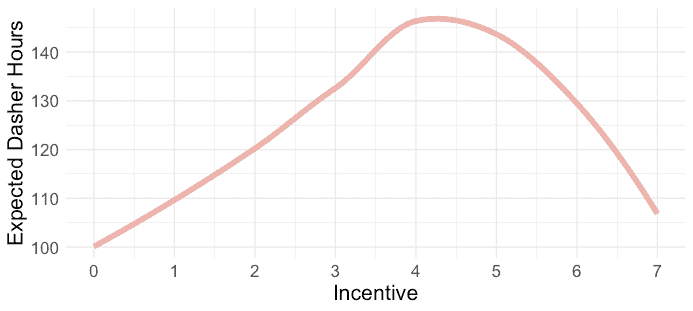
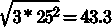
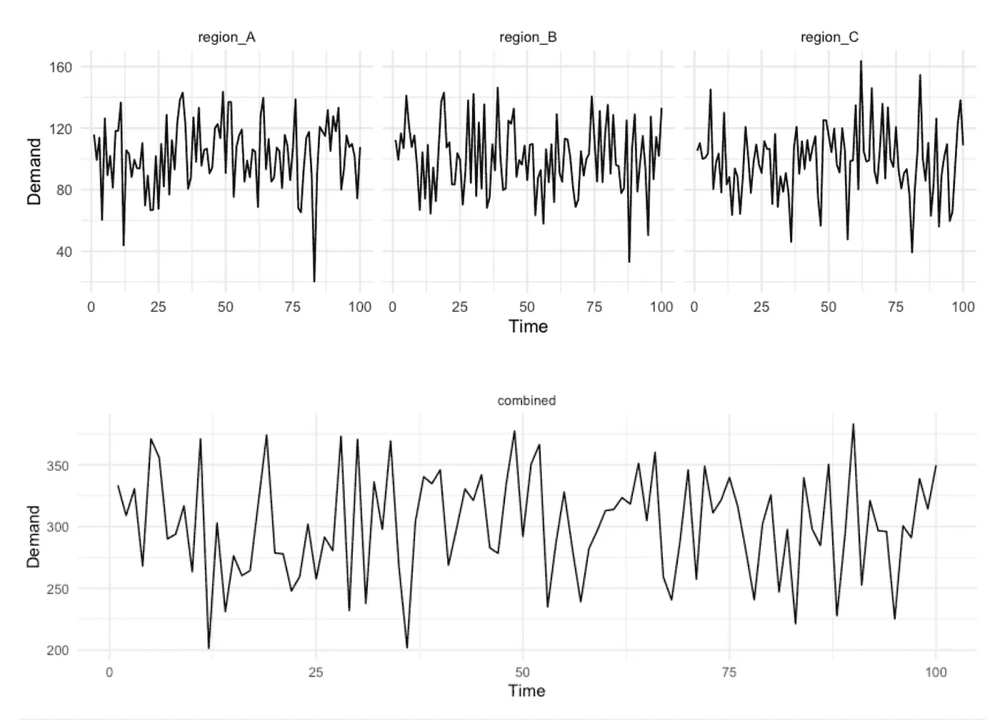
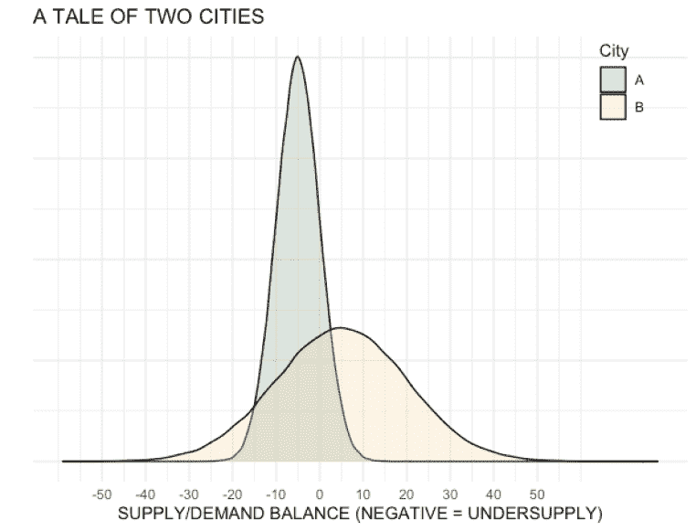
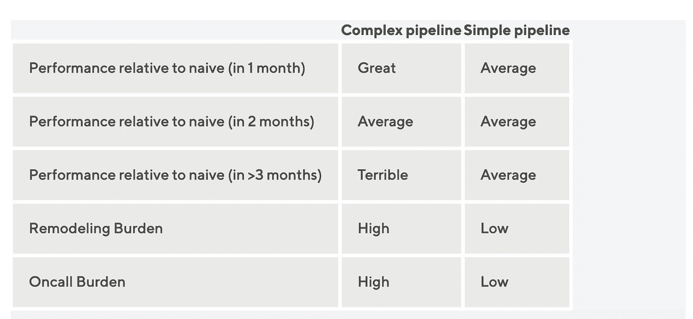

# DoorDash 如何通过机器学习管理供需平衡

> 原文：<https://towardsdatascience.com/managing-supply-and-demand-balance-through-machine-learning-70d4f0808617?source=collection_archive---------25----------------------->

## 预测和数学优化如何用于最后一英里物流行业。

照片由 [Kenjo](https://stock.adobe.com/search?load_type=search&native_visual_search=&similar_content_id=&is_recent_search=&search_type=autosuggest&k=scale+balance&acp=2&aco=scale&asset_id=228613189) 提供

在 DoorDash，我们希望我们的服务成为日常便利，提供及时的送货和一致的价格。实现这些目标需要在配送员(我们对配送司机的称呼)的供应和订单需求之间取得良好的平衡。

在高需求时期，我们一般会增加工资(T3)，这是一种激励措施，以确保有足够的司机供消费者尽快接受订单。我们不会将增加的费用转嫁给消费者，因为无论何时，消费者都将支付相同的费用。

考虑到向员工提供高峰需求薪酬的复杂性，我们建立了一个新的动员系统，在任何预期的供需失衡之前分配激励措施。在构建该系统时，我们重点关注以下几个方面:

*   明确定义我们的供需衡量指标和项目目标
*   生成高保真的供需预测
*   建立约束条件下激励分配的新优化过程
*   管理不确定性
*   提高系统的可靠性和可维护性

# 我们如何量化供需不平衡？

在概述供求不平衡的问题时，采用所有受影响方的背景是有益的:

*   对于消费者来说，在高峰需求期间缺少司机更有可能导致订单延迟、更长的交付时间，或者无法请求交付而不得不选择提货。
*   对于短跑运动员来说，订单的缺乏会导致收入下降，为了达到个人目标，轮班时间更长、频率更高。
*   对于商家来说，供应不足会导致交货延迟，这通常会导致冷食和再订购率下降。

在这种背景下，很明显，理想的场景是拥有一个在交付层面而不是市场层面平衡供需的系统，但是在选择市场测量指标时，这是不现实的。交付层面的平衡意味着每个订单都有一个在最佳时间可用的搅拌器。

相比之下，市场水平的平衡意味着市场中有相对相等数量的搅拌器和订单，但在交货水平上不一定有每个组的最优条件。在实践中，由配料器和消费者偏好以及环境中的其他变化条件(如交通和天气)驱动的供应和需求的差异水平使得很难在交付水平上平衡供应和需求。因此，我们专注于市场级别的指标来定义每个市场的状态，即使交付级别的指标会提供更理想的结果。

对于我们的主要供应和需求测量指标，我们查看了交付所需的小时数，同时保持交付持续时间低和 Dasher 繁忙程度高。通过关注小时，我们可以考虑由交通状况、配料率和食物准备时间驱动的区域变化。

为了理解这一指标在实践中是如何工作的，我们来看一个例子。让我们假设纽约市的晚餐时间是星期天，我们估计需要 1000 个驾驶小时来满足预期的需求。我们还可能估计，除非我们提供额外的激励，否则只有 800 小时可能是有机提供的。如果没有动员行动，我们将会少供应 200 小时。

我们通常在 Dash 注册 Dash 和时间单位时计算这一指标，时间单位可以从每小时持续时间到像午餐和晚餐这样的白天单位。非常重要的一点是，不要选择会导致人为需求和供应平滑的汇总层。例如，一天之内，我们可能在早餐时供应过多，而在晚餐时供应不足。一整天的优化将导致平滑任何不平衡，并产生不正确的动员行动。

一旦我们决定了健康指标和我们采取行动的单位，我们就通过调整供应来平衡供应和需求。我们的团队通常通过提供激励来调整市场的供应方，以便在需求增加时提高搅拌机的使用率。我们将在下一节中描述预测和优化在其中的作用。

# 我们如何在局部水平上预测供给和需求？

现在，我们有了衡量供应和需求水平的指标、采取行动的区域/时间单位以及管理供应的行动，我们可以确定预测需求的详细信息以及如何预测每个市场的供应和需求状况。

## 定义预测需求

鉴于我们生成的预测旨在用于自动化系统，我们用于预测的算法和我们将依赖的后续图书馆生态系统从长远来看都会对维护自动化产生巨大影响。我们主要将预测问题转化为回归问题，并通过微软开发的开源 [LightGBM 框架](https://lightgbm.readthedocs.io/en/latest/index.html)使用[梯度推进](https://en.wikipedia.org/wiki/Gradient_boosting#Gradient_tree_boosting)。这一选择背后有几个原因。

## 支持多元预测

许多[单变量](https://stats.stackexchange.com/questions/342754/what-is-the-difference-between-univariate-and-multivariate-time-series)预测方法在生成数以千计的低粒度区域预测时并不适用。我们的经验有力地支持了这样一个论点，即一些最好的模型是通过快速原型制作过程创建的，因此我们寻找从假设模型改进到获得最终结果可以快速完成的方法。LightGBM 可用于在一次训练运行中训练和生成数千个区域预测，使我们能够非常快速地迭代模型开发。

## 支持外推法

随着 DoorDash 在国内和国际的扩张，我们需要我们的预测系统能够对我们目前不提供服务的地方的供需增长情况产生一些预期。例如，如果我们在一个新城市启动，即使没有历史数据，我们仍然可以对供需轨迹做出合理的预测。深度学习和传统的基于机器学习(ML)的方法在这种情况下特别有效，因为有助于外推的潜在信息可以通过嵌入向量或通过良好的特征工程来学习。关于人口规模、一般交通状况、可用商家数量、气候和地理的信息都可以用来进行推断。

## 支持反事实

预测用于设定对将要发生的事情的预期，但也不可避免地用于指导决策过程。例如，我们的利益相关者会问我们，如果我们改变供应预测模型中的激励水平，情况会如何变化，这样我们就可以了解如何在供应和成本之间进行权衡。这些反事实不仅有助于预测我们认为会发生什么，也有助于估计我们将要采取的行动的影响。在 LightGBM 中，可以通过在推理时改变进入模型的输入来生成近似的反事实。

## 依赖性小

我们希望预测系统具有最小的依赖性，这意味着我们不会过度依赖大量的第三方库。这一需求立即消除了许多自动预测方法，在这些方法中，安装一个库通常意味着安装 100 多个额外的库，或者提供统一工具包并具有大量可传递依赖项的方法。臃肿的内存占用会带来兼容性问题、升级挑战和大量安全漏洞。LightGBM 具有非常小的依赖性，并且执行升级相对容易。

## 繁荣的社区

最后，我们希望依靠一个拥有繁荣社区和强大核心维护团队的生态系统。维护一个开源库很有挑战性。一个库可以由一个研究生或者一个公司里的一到三个核心开发人员创建。尽管如此，人们还是会找到新的兴趣，新的工作，换工作，寻找新的职业，或者放弃职业。几年或几个月后，跟踪与库相关的问题和错误通常不是优先考虑的事情。这种最终缺乏支持的情况迫使用户创建内部分支，以便为他们的用例采用预测工具，或者参与完整的重新建模工作。出于这些原因，在选择工具时，我们会考虑发布周期、星级数和社区参与度等指标，以确保未来有良好的社区维护。

# 用 ML 预测

在纯回归问题的背景下进行预测可能会有其挑战，其中之一与理解数据生成过程以及输入和输出之间的因果关系有关。例如，下面的图 1 显示了我们的激励措施与办公时间增长的关系。

图 1:该数据表明，激励和动员之间存在非线性关系，较高的激励导致办公时间增加，而非常高的激励导致工作时间大幅减少。这种违反直觉的关系通常可能是[遗漏变量偏差或同时因果偏差](https://www.econometrics-with-r.org/9-2-ttivomra.html)的标志。

如果我们盲目地依赖模型，通过数据中发现的相关性来学习因果关系，我们将会创建一个系统，该系统会错误地认为提供非常高的激励水平会导致路上更少的司机。高增长激励会导致流动性下降的因果解释是荒谬的。

更有可能的是，这个模型只是缺少了一个[混淆变量](https://www.scribbr.com/methodology/confounding-variables/)。例如，在与恶劣天气或假日相关的时期，达什尔人想呆在家里或与家人在一起。在这些时候，我们更有可能看到可用性的下降，从而触发我们的供需系统提供更高的激励来保持市场平衡。

缺乏天气或假期知识的模型可能会了解到，当因果关系只是缺少一个协变量链接时，高激励会导致更少的休息时间。这个例子说明了为什么找出一种方法变得很重要，这种方法有时通过领域知识来约束在数据中发现的关系，或者依赖实验结果来调整由模型识别的一些相关关系，而不是盲目地将算法应用于可用数据。

第二个挑战与预测中发现的一个普遍真理有关，即预测的单位需要与做出决策的背景相匹配。进行更精细的预测可能很诱人，但这通常不是一个好主意。这可以很容易地通过模拟来演示。

考虑以下三个子区域，通过从平均值为 100、标准偏差为 25 的正态分布中抽取样本来描述日需求量，如下图 2 所示，得出变异系数为 25%。当我们合计这些地区时，我们简单地合计预期平均值，得到预期总需求为 300。尽管如此，组合标准差不等于标准差之和，而是等于方差之和

，得出综合预测的变异系数为 14.4%。通过简单地聚集随机变量，我们能够相对于平均值减少超过 40%的方差。

图 2:上图显示了三个次区域的需求。底部面板简单地表示总需求。通过执行随机变量的聚集，底部面板中的相对方差减少了 40%。

# 选择优化器

使用最大似然算法的一个好处是，在给定输入数据的情况下，它们提供了对将要发生的事情的更准确的预期。尽管如此，最大似然算法通常只是一个更大系统中的一个构件，它消耗预测并试图产生一组最优动作。[基于混合整数规划](https://en.wikipedia.org/wiki/Integer_programming) (MIP)或[强化学习](https://en.wikipedia.org/wiki/Reinforcement_learning#:~:text=Reinforcement%20learning%20(RL)%20is%20an,supervised%20learning%20and%20unsupervised%20learning.) (RL)的解决方案在构建专注于特定业务约束下回报最大化的系统方面非常出色。

我们决定采用 MIP 方法，因为它易于形式化、实施和向利益相关者解释，并且我们在该领域拥有大量的[专业知识](https://doordash.engineering/2020/02/28/next-generation-optimization-for-dasher-dispatch-at-doordash/)。优化器有一个自定义的目标函数，通过几个约束条件最小化供应不足。目标本身是非常灵活的，可以根据业务需求指定为有利于盈利或增长。在优化器中，我们通常对一些全局约束进行编码:

*   不要在一个特定的地区-时间单位内分配一个以上的激励。
*   永远不要超过我们的财务和运营合作伙伴设定的最大允许预算。

根据不同的要求，我们还可能有不同的地区或国家约束，例如不同的预算、定制罚款、哪些单位不应包括在优化中的排除标准，或者由输入可变性引导的激励约束。

## 处理不确定性

当资源有限时，输入的不确定性对优化器如何分配激励起着重要作用。为了证明这一点，下面的图 3 显示了两个城市中假设的供需不平衡的分布情况。

图 3:在城市 A，我们相信我们将会供应不足，并且对我们的预测也很有信心。在城市 B，我们的平均预测是，我们将略有过剩，但我们在我们的估计不太确定，并有一定的可能性经历大量供应不足。

如果优化器对不确定性一无所知，它最终会遇到两个问题。首先，它缺乏对供需平衡可能从极度供应不足转变为极度供应过剩的理解。如果优化器被设置为在一些预设的阈值下进行优化，它将错过为城市 B 进行优化的机会，因为分布的平均值大于零。

第二个问题是，它最终会在我们预测不确定的地方过度分配资源。我们的预测往往是在那些没有多少搅拌器和订单的小区域的长尾区域最嘈杂。因为这些地区的数量很大，并且它们表现出很高的方差，如果我们不明确说明这种不确定性，我们更有可能产生估计，偶然会有很高的供应不足，从而过度分配激励给相对于具有低方差的地方表现出高方差的地方。

为了解决差异问题，我们使用重采样过程从预测中生成小时差距的预期估计值。通过执行重新采样，我们实际上是在供应不足发生的可能性的背景下测量供应不足的影响。例如，在上面的图 3 中，城市 B 只有 34%的机会供应不足。然而，如果发生这种情况，我们可以更准确地估计供应不足的巨大变化的影响。这些方法中的任何一种都会导致激励分配中的更优决策，而不是简单地使用来自上游预测输入的平均估计。

# 可靠性和可维护性的改进

DoorDash 在去年有了巨大的增长。DoorDash 超过 70%的人是在 2020-21 年期间加入的。这通常带来了一波新的工程、产品、平台和基础设施相关项目，有助于持续增长、扩展和可伸缩性。例如，我们有几十个内部项目，这些项目与打破我们的垄断和[采用更加面向微服务的架构](https://doordash.engineering/2020/12/02/how-doordash-transitioned-from-a-monolith-to-microservices/)有关。我们有数百个与产品改进或新的垂直发布相关的大大小小的项目。这些项目中的许多都伴随着我们的数据模型以及数据生成和收集过程的变化。不幸的是，当数据如何产生和暴露的生态系统不断变化时，ML 模型可能非常不可靠，因此我们需要做出一些改变来增强我们系统的可靠性。

## 解耦数据依赖链

我们可以使用许多不同的数据源，并对数百个特征进行编码，以构建一个具有高性能的模型。虽然这种选择非常有吸引力，并且确实有助于创建一个性能优于简单数据管道的模型，但在实践中，它会创建一个缺乏可靠性的系统，并为[特性漂移](https://doordash.engineering/2021/05/20/monitor-machine-learning-model-drift/)产生很大的表面积，其中输入的分布会随时间而变化。因此，在建立我们的预测模型时，我们首先追求简单和可靠。这一战略还帮助我们更快地创建了一个端到端的移动系统。

图 4:具有复杂数据管道的模型通常可以在部署的最初几周显示出它们的优势，但随着时间的推移会迅速恶化。简单的数据管道通常更健壮，并减少维护和改造负担。

为了管理复杂性和数据暴露方式的转变，我们做了两件事。首先，我们将数据管道从彼此分离到独立的业务领域。现在，当有人致力于改善用于预测的输入信号时，他们不需要被单一的查询和数据管道淹没。相反，开发人员在一个隔离的管道上工作，只需要确保聚合在一个适当的实体上完成。

我们做的第二件事是移除中间数据依赖性。我们认识到，如果我们的输入信号来自 [ETL](https://en.wikipedia.org/wiki/Extract,_transform,_load) 作业，并且在它们的[有向无环图](https://en.wikipedia.org/wiki/Directed_acyclic_graph)(Dag)中有非常长的依赖链，我们将增加失败的表面积。因此，我们希望依赖由我们的商业智能团队彻底审查过的主表，或者生产数据源的副本，其中的数据生成没有隐藏在复杂的 ETL 后面。

图 5:在这个例子中，任务 E 是带有数据转换的 ML 任务。如果 ML 模型的源数据来自 ETL 系统中的长依赖链(从 A 到 D)，那么如果任何上游依赖失败，就有经历特性漂移和数据失败的高风险。

## 专注于实验

测试我们的系统是否可维护的最好方法之一是简单地检查迭代速度，以此我们可以在不产生错误或引入回归的情况下推动新的变化和启动实验。在 DoorDash，我们执行许多实验来确定某个功能是否按预期工作。这通常意味着我们更加重视通过扩展和交付新功能的速度来衡量软件质量。不出所料，如果实验很难启动，新功能很难测试，我们的目标就失败了。

类似地，如果一个系统在很长一段时间内(例如，六个月或更长时间)保持不变，这也是一个错误的迹象，因为这意味着我们创建了一个僵化的系统，不需要改进、构思和实验。持续的实验是一种强制采用更好实践的功能，例如依赖于自动化的 [CI/CD](https://en.wikipedia.org/wiki/CI/CD) 系统，建立库依赖管理，将代码分离到业务领域，以及添加测试、警报和文档。

# 结果

实施这一动员系统让我们能够更准确地将激励分配给从供需平衡改善中受益最大的地区时间单位。该系统为我们的客户带来了更好的体验，因为我们的指标显示交付时间、取消和极端延误的减少。对于 Dashers，我们能够确保将激励措施分配到最需要的地方。对于商家，我们降低了整体订单取消量。此外，由于预测准确性的提高，我们还能够更可靠地达到预算预期，并在支出决策中观察到更少的可变性。由于可靠性的提高，我们能够快速提高激励动员系统的实验速度。

# 结论

处理在约束条件下优化系统的问题从在适当的聚集级别上评估行动的影响的度量标准中受益匪浅。如果每天都进行预测，但优化措施是隔天进行的，那么决策可能不是最佳的。

其次，我们一般建议将预测组件与决策组件分离。如果输入具有稳定的统计属性，并且预测是无偏估计，则大多数优化系统会工作得更好。例如，在预测中开始使用非对称损失函数，以与我们是否更关心低估或高估产出保持一致，这可能很有诱惑力。虽然这种方法对于 ML 模型的输出直接用于驱动决策的各种问题来说是完美的，但是对于 ML 预测仅仅是更广泛的优化引擎的另一个输入的问题，最好生成无偏的预测。相反，最好让优化引擎来处理权衡。

如果你热衷于构建能够积极影响数百万商人、老板和顾客生活的 ML 应用程序，考虑[加入我们的团队](https://www.doordash.com/careers/)。

# 承认

非常感谢 Jared Bauman 和 Dan Madwed 为新系统的架构出谋划策，感谢 Gary Ren 指导我们解决供需工程组件的复杂性，感谢 Henry Liao 简化实验，感谢 Matthew Ferro 和 Eugene Braude 推动自动化程度的提高。

*欲获取本帖原文，请查看* [*DoorDash 工程博客*](https://doordash.engineering/2021/06/29/managing-supply-and-demand-balance-through-machine-learning/) *。*