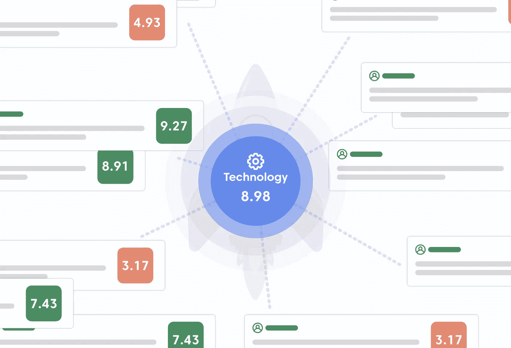

# 管理创新的风险

> 原文：<https://towardsdatascience.com/managing-the-risk-of-innovation-8f964dc64b14?source=collection_archive---------17----------------------->

## 意见

## 从 iBuyer 的失败中我们能学到什么

将集体智慧应用于技术决策(图片由作者提供)

Zillow 在 AI 上下了大赌注，输了。Zillow 几周前报告的人工智能损失揭示了信任基于数据预测的自主黑盒算法的危险。数千人失去了工作，经济损失超过 5 亿美元。损失之后出现了无数的文章。这不是另一篇试图分析问题所在的文章。相反，它讨论了降低风险的新途径，并回答了导致成功结果的三个问题:

1.管理部署人工智能技术决策的最有效流程是什么？

2.我们如何在部署新技术的过程中降低风险？

3.我们如何在部署的人工智能应用程序中建立信任？

第一代人工智能研究和开发集中在人类身上，手工制作模拟人类如何应用知识解决问题的程序，从而产生了基于知识的专家系统。第二代人工智能专注于数据，希望模拟人脑如何处理信息。第二代人工智能的基本信念是，适当构建的人工神经元将引领我们走向人工智能，相当于关于智能的“万物理论”。

人工智能机器的概念鼓励最好的想象场景和最坏的人类傲慢。我们是多么迅速地掩盖了如此大规模工程的潜在隐患。这也发生在 20 世纪 80 年代。建立世界上最广泛的知识库，包含人类知识和“鲍勃是你的叔叔。”目前，这转化为一种信念，即构建示例性的深度学习架构将导致一般化的人工智能。

在这些错位的希望中，蕴含着科学知识的核心，承诺给未来带来极大的好处。理解人类大脑如何工作是一项巨大的创举，可能比万物理论更难。发展弦理论和超对称性的倡议始于 50 年前，第一次关于 AI 的会议是在 60 多年前。我们应该根据任务的大小来调节对人工智能进展的期望。人工智能在扩展信息技术的能力和用途方面取得了长足的进步。因此，我们应该满怀信心地继续前进，我们将在前进的道路上看到经济和社会效益。

DARPA 对人工智能的概述对公众开放。它包括一个简单的被忽视的陈述，“第二代人工智能在统计上是正确的，但在个体上是错误的。”这就是问题所在。你能相信什么？齐洛太相信了。

对于一个基于从数据中学习的模式的人工智能来说，信任它为你做决定是有风险的。如果它在统计学上是正确的，但个体有风险，你怎么知道什么时候该相信它？

由于过于信任统计人工智能，我们忽视了人类智能的力量和神秘。计算机科学家朱迪亚·珀尔说得很好，“你比你的数据更聪明。”我相信珀尔的话包含了一种成功可能性非常高的方法的精髓。本文的剩余部分将专注于该解决方案——讨论一种集人类智能和人工智能技术之大成的集体智能技术。

# 问题 1:管理部署人工智能技术的决策的最有效流程是什么？

1961 年，技术历史学家埃尔廷·e·莫里森在麻省理工学院做了一次关于计算机潜力的演讲。在书中，他提到了一种担忧——“计算机可能会显著增加我们社会中封闭决策的趋势。”他继续表达了对“给不真实披上数学现实外衣”的趋势的额外关注。虽然已经 60 岁了，但这两个观察都照亮了我们走向成功的道路。

将人类的集体智慧融入任何决策过程都将带来新的发现，因为人类的思维能够直觉地看到超出我们在逻辑、编程和数学中所能描述的东西。不幸的是，我们未能理解自动化的局限性和人类思维未开发的潜力和力量。

在过去的十年里，对集体智慧的广泛研究表明，我们集体更聪明。认知多样化个体的适当集合远比任何单个专家更准确。多样性预测定理抓住了集体智慧的本质:

***集体误差=平均个体误差—预测差异***

简而言之，分集预测定理指出:

1.  多样性胜于能力
2.  集体智慧胜过个人专长
3.  总的来说，我们更有可能发现新的前进道路

该定理的明显问题是:“我如何创建和管理预测多样性？”这就是集体智慧的艺术:为手头的问题召集合适的问题解决者。这个定理的实际价值在泰特洛克、佩奇和马龙的书中得到了论证和广泛讨论。六年前，我们实施了一种人工智能方法，将集体人类智能集成到一个系统中。

CrowdSmart 系统最初应用于一个严重依赖人类判断的复杂问题:预测一家早期创业公司筹集第一笔 100 万美元种子资金并继续进行投资的可能性。在四年多的时间里，我们测量、跟踪并投资了那些筹集到第一个一百万美元种子资金的公司。每个公司组成的集体小组各不相同，但评审小组的重点始终是平衡投资、行业、技术和最终用户体验(如果有)。小组进行评分，并集体讨论他们得分的驱动因素。这一过程是由早期投资研究中得出的启发式模型指导的。总体而言，集体预测那些将获得后续融资(生存的必要条件)的公司的准确率超过 80%。结果显示多样性得分和准确性之间有直接的相关性。群体的评分模式越多样化，结果就越准确。关于这个话题的更多内容可以在另一篇文章中找到: [**运用集体推理进行投资**。](https://tom-kehler.medium.com/applying-augmented-collective-intelligence-to-investing-11ddf53a6797)结果揭示了另一个意想不到的结果——这一过程大大减少了性别偏见。42%投资的公司由女性领导。其结果与现有的风险投资实践形成鲜明对比。此外，得分最高的公司以大约 1000 万美元的投资前估值筹集了第一个 100 万美元，目前正在筹集 3.5 亿美元。

总之，使用该技术进行投资的经验非常清楚: ***将人类集体智慧与人工智能结合和集成的技术在减少偏差的同时，在预测准确性方面表现出了显著的提高。*** 这些结果导致了集体推理平台的创建:

CrowdSmart 的集体推理系统从群体审议中学习知识模型。在这种情况下，人工智能是一个“智能促进者”，它使用模板驱动的过程来引导群体做出决策、计划或预测。结果是一个动态的知识模型，保留了从小组讨论中提取的所有知识。知识模型是决策或计划过程的“迷你专家系统”,用于“假设”战略分析。有关 CrowdSmart 的集体推理系统的更多信息，请参见 [**用集体推理转变协作决策。**](/transforming-organizational-decision-making-with-collective-reasoning-c859c1a9d991)

集体推理过程和认知多样化的团队减少了偏见。在集体推理过程中，个体在掩盖其身份的环境中表达他们的思想和感受。他们通过优先考虑哪些表达符合他们的观点来表达他们与他人的想法和感受的一致。

**回到本文的副标题**:集体推理是如何帮助 Zillow 决定部署其房屋买卖程序 iBuyer 的？很可能，一个包括房地产行业经验的认知多元化的团队会在信任算法方面引入更广阔的视角。

Zillow 可能会咨询专家，但他们不太可能参与系统部署的详细推理过程。报告中记录的专家访谈的标准做法不尽人意。很有可能产生偏见和误解。主动协作提供主动学习；在采访和报道过程中完全漏掉的东西。

集体推理过程拓宽了逻辑和数学创建者与实践领域专家之间的互动。撒下更大的网可以降低风险，为信任打下更坚实的基础。

# 问题 2:我们如何降低部署新技术的风险？

埃尔廷·莫里森指出了一个导致实践的担忧:

***“在我们的社会中，计算机可能会明显增加封闭决策的倾向。”***

自动化和遗忘太容易了，当伤害已经造成的时候才醒悟过来已经太晚了。Zillow 只是一个发现自动化过程失败的例子。断层很深。在大多数情况下，我们将决策视为时间点而非过程。

集体推理用连续的决策过程取代了决策作为时间点的概念。集体推理系统允许在数据从初始决策中出现时进行修改。

如果 Zillow 团队有一个包括与决策相关的原因和假设的模型会怎么样？当早期的结果从 iBuyer 推出时，是否有可能对策略进行修改或提供指导？让一个由具有房地产交易经验的人组成的认知多元化团队来审查算法所做的决策，这样做有意义吗？

决策过程允许在假设和证据出现时重新审视它们。决策过程最适合于复杂的、适应性强的环境，在这种环境中，由于问题本身的复杂性，结果的预测变得很困难。

# 问题 3:我们如何在部署的 AI 应用中建立信任？

黑盒模型可能是危险的。黑箱模型可以给不真实披上数学现实的外衣。如果要信任人工智能应用程序，就需要详细解释系统如何做出预测。

可解释性是在第一代人工智能中开发的几乎每个人工智能应用程序的核心特征，因为它是基于符号逻辑结构的。在第一代人工智能中，复杂逻辑和表示的可解释性是一种催化剂，能够解决以前逃避自动化的问题。可解释性创造了系统和用户之间的信任。

可解释性是集体推理系统的核心。例如，运行一个集体推理过程来为 iBuyer 程序提供资金将会产生一个分数。该分数代表决策小组对项目成功(或失败)的集体预测。此外，集体推理系统提供了支持得分的集体推理的详细解释。

# 未来之路:持续的、创造性的、协作性的学习

我们设想集体推理使决策过程成为可能，在这个过程中，创造性指导的机会总是存在的。在这个挑战迅速变化的时代，这是应对我们面临的挑战的适当框架。

我们生活在一个错综复杂的时代。我们面临的问题非常复杂，它们给预测结果带来了挑战。集体智慧提供了一个框架，通过结合人类和人工智能的精华，创造性地合作应对这些挑战。

我们太依赖于研究、计划、执行的阶段控制过程了。这些 20 世纪的工具——访谈、焦点小组和调查——已经导致文档和电子表格模型变得过时。这一过时的流程不再适应我们日常生活中所面临的时间框架。此外，它没有解决人和机器之间相互联系、纠缠和复杂的交互。

当我们考虑技术对我们日常生活的深度时，我们必须超越逻辑，拥抱整个人类体验。语言是表达人类对未来的决定、计划或信念的由衷反应的源泉。我们不仅仅是逻辑和信息。当我们的面孔和友谊生活在由计算模型驱动的设备中，为我们的情感镀金时，我们再也不能将信息技术划分为后台事件。

莫里森很久以前就发现了失败决策的根本原因。在他的书的两个章节中,*人、机器和现代*,他追溯了与军事重大创新相关的决策过程。这两个案例都有强有力的证据证明为什么创新会产生更好的结果，然而尽管有强有力的证据，这些创新却遇到了关于为什么它们不会起作用的强有力的争论。原因很微妙。如果一项创新导致个人的感知价值和身份受到威胁，他们会本能地寻求生存。杰伊·范·巴维尔和多米尼克·帕克最近在《T2:我们的力量》一书中谈到了这种身份的力量。

在合作过程中很难挖掘身份和生存问题。然而，理解一个决定背后的推理，在一个身份被掩盖的环境中挖掘观点、感觉和原因，是朝着正确方向迈出的重要一步。在一个特定的决定或预测的背景下，自由地发表我们的意见，打开了发现潜在直觉和感觉的大门。找到发现身份问题的安全方法对于创造创新文化至关重要。

在计算能力出现之初，埃尔廷·莫里森说:

"..情感在人的生活中有一种存在，一种身份，一套需求和要求，一种独立于自身的塑造性影响。人是存在的，不仅因为他思考，而且因为他感觉，正是这两种令人印象深刻的能量之间的相互作用，建立了今天人们所说的人类状况。……不重视受过教育的心灵的社会——或者不管情感的所在地是什么——将会灭亡。”一

我们如何看待我们在一个组织或社会中的个人身份，在我们如何做决定和如何看待未来方面起着巨大的作用。从来没有比这更真实的了:部落主义影响了我们处理信息的方式。企业界也不能幸免于部落潜流的负面影响。

集体推理包含自由形式的语言表达，旨在挖掘人类头脑中存在的复杂性。此外，它鼓励以建设性的摩擦分享想法，从而能够分享从合作中产生的新想法。集体推理提供了一条前进的道路。

# 我们赢在哪里

Zillow 的人工智能经历不应该动摇人工智能作为一门科学或创新源泉的信任基础。相反，它应该提高我们在决定如何部署和管理技术时的谨慎程度。我们必须适应。在 1950 年对加州理工学院的一次演讲中，埃尔廷指出:

“适应性..指的是一种韧性，它能使我们完全轻松地接受挑战性环境的最佳承诺，而不会失去我们的连续性意识或基本的完整性。

..建造不只是工作的机器，而是在人类自然反应和同情的范围内继续工作的机器。"

马丁·里维斯(Martin Reeves)的新书《想象机器》(The Imagination Machine)重申了人工智能开发人类认知的前景。

“因为人工智能是一种认知技术，除非我们重新思考商业的认知方面，否则我们不会受益——除非我们建立公司，培养和利用人类最有价值的思维能力，与智能算法合作。”

集体推理建立在这样一个概念上，即我们真正相信和感受的东西是可以用语言表达的。如果我们了解决策过程参与者的认知多样化群体在决策或项目的预期结果方面的能量一致性，我们就赢了。我们还必须不断挖掘集体想象力，以预见下一件大事。

1.  埃尔廷·e·莫里森，《人、机器和现代》，50 周年纪念版，麻省理工学院出版社 2016 年
2.  斯科特·佩奇，《差异》，第八章，《多样性和预测》，普林斯顿大学出版社，2007 年
3.  结果是值得注意的，因为没有试图策划评估团队来平衡多样性。准确性和减少偏差直接归因于集体推理技术。