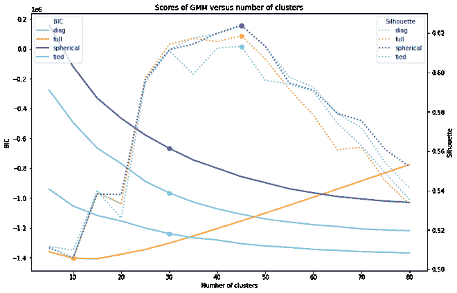

# 使用 UMAP 和 GMM 的嵌入空间中的流形聚类

> 原文：<https://towardsdatascience.com/manifold-clustering-in-the-embedding-space-using-umap-and-gmm-dbab26a9efba?source=collection_archive---------25----------------------->

## 如何降低嵌入向量的维数并保持分组到簇中的流形结构。

马頔·瓦伦蒂娜在 [Unsplash](https://unsplash.com/s/photos/flock?utm_source=unsplash&utm_medium=referral&utm_content=creditCopyText) 上的照片

在上一篇文章[使用 PyTorch 和 ResNeXt-WSL](https://datasciencevademecum.com/2020/12/02/extracting-rich-embedding-features-from-pictures-using-pytorch-and-resnext-wsl/) 从图片中提取丰富的嵌入特征中，我们已经看到了如何将图片表示到多维数字嵌入空间中。我们还看到了嵌入空间表示彼此接近的相似图片的有效性。在本教程中，我们将看到一些适用于发现和识别数据集中流形的聚类技术。
此外，提出的聚类技术也受到“文档嵌入平均化”的启发，这将在下一篇文章中描述。

# 通过均匀流形逼近和投影(UMAP)进行维数约简

降维不仅用于数据可视化，而且由于“[维数灾难](https://en.wikipedia.org/wiki/Curse_of_dimensionality)”，它也是聚类算法的一个基本步骤。换句话说，如果维度的数量增加，那么大部分的点将开始在至少几个维度上看起来相似和不同。结果是没有清晰的结构可循，导致数据点的随机分组。

无监督降维技术分为两类:线性投影和流形学习。

使用线性投影(例如 PCA、SVD)的流形学习的主要区别在于，它可以处理数据中的非线性关系，并且它对于聚类相似数据点的组保持它们的相对邻近性非常有效。对于我们的目的和给定的数据性质(由深度卷积神经网络产生的嵌入空间)，我们不认为任何线性投影技术是合适的。

在多元学习家族中，有两个主要的竞争者:t-SNE 和 UMAP。

可可检测 2017 图片的 t-SNE 3d 投影由超级分类着色

UMAP 3d 投影可可检测 2017 图片由超级分类着色

t-SNE vs UMAP COCO detection 2017 的 3d 投影图片由 supercategory 着色

一致流形逼近和投影(UMAP)是一种通用的流形学习和降维算法。
T-分布式随机邻居嵌入(t-SNE)是一种算法，它生成低维图，试图保持相似的实例靠近，不相似的实例分开。

它们听起来很相似，事实上从很多方面来看都是如此。尽管如此，让我们总结一下出于集群目的而更喜欢 UMAP 而不是 SNE 霸王龙的几个原因:

SNE 与 UMAP 的比较

要更全面地比较 t-SNE 和 UMAP，请参考下面的文章:[UMAP 到底是如何工作的](/how-exactly-umap-works-13e3040e1668)。

由于上面讨论的原因，我们可以得出结论，t-SNE 是一个伟大的可视化工具，但 UMAP 是一个更适合的技术，用于流形结构的聚类目的。

# 高斯混合模型聚类(GMM)

GMM 是一种概率模型，它假设所有的数据点都是由有限个参数未知的高斯分布混合生成的。可以看作是更流行的 k-means 模型的推广。与 k-means 相比，使用 GMM 的优势在于它可以基于参数协方差矩阵表示不同大小和形状的聚类。
在 k-means 中，簇在所有维度上都是球形的，并且具有相同的直径。当考虑流形特征空间时，这是一个很大的限制，如用 UMAP 变换深度卷积神经网络嵌入空间的情况。

使用 iris 数据集
( [来源](/mixture-modelling-from-scratch-in-r-5ab7bfc83eef))上的两个模型的不同聚类输出

另一个区别是对聚类输出的解释。k-means 将空间划分为 voronoi 单元，并将每个点硬分配给最近质心的聚类。另一方面，GMM 给了我们一个可解释的输出，它模拟了每个数据点属于每个聚类的概率。后者是用于处理存在重叠聚类或离群值的模糊情况的期望概率。

# GMM 参数

和 k-means 一样，GMM 也要求指定聚类数 k。

此外，为了使 GMM 能够在特征空间中模拟任意椭圆形状，协方差矩阵应该是“完整的”。“全”GMM 模型的问题在于，自由度随着特征空间的维度成二次方地增加，存在过度拟合数据的风险。有几个 GMM 的约束版本会对协方差矩阵施加某些属性。，即:球形、对角线形和并列形。

使用不同协方差类型获得的聚类形状
(来源: [scikit-learn](https://scikit-learn.org/stable/auto_examples/mixture/plot_gmm_covariances.html) )

*   **球形**是圆形轮廓的“对角线”情况(更高维度的球形，由此得名)。
*   **对角线**表示轮廓轴沿坐标轴定向，但除此之外，组件之间的偏心率可能不同。
*   **全**表示部件可以独立采用任何位置和形状。
*   **并列**表示形状相同，但形状可以是任何形状。

现在我们只剩下两个主要参数需要调整:上面列出的 4 个选项中的聚类数 k 和协方差类型。

# 使用 BIC 和轮廓分数的模型选择

很可能，由于 GMM 是一个概率模型，我们可以计算贝叶斯信息标准(BIC ),这是一个统计计算为模型的负对数似然性和一个惩罚项，这是数据样本的数量和模型的自由参数的数量的函数。BIC 值越小，模型越可取。尽管如此，搜索最小 BIC 分数可能会建议选择一个在分数微小下降之前有很多聚类的模型。这就是为什么优选的方法是识别对应于二阶导数最小值的曲线的拐点。
只有当不同聚类输出表示相同特征空间中的相同点时，它们之间的 BIC 分数才是可比较的。也就是说，我们不能比较通过 PCA 减少的数据点和通过 UMAP 减少的数据点。

另一种技术是[剪影评分](https://en.wikipedia.org/wiki/Silhouette_(clustering))，这是一种通过比较一个点与其聚类的相似程度(内聚力)与其他聚类的相似程度(分离度)来衡量聚类一致性的经验方法。轮廓的范围从 1 到+1，其中高值表示对象与其自己的簇匹配良好，而与相邻簇匹配较差。如果大多数对象都有一个高值，那么集群配置是合适的，否则集群配置可能有太多或太少的集群。

如果我们将 BIC 曲线和剪影曲线绘制为 4 种不同协方差类型的聚类数 k 的函数，我们将获得下图:

使用 BIC 和剪影分数的 GMM 模型选择。图片作者。

这些点分别对应于 BIC 和剪影曲线的肘部和最大值。

我们可以得出结论，理想的集群数量应该在 30 到 50 之间。
就协方差类型而言，束缚类型使 BIC 最小化，而没有强有力的证据表明轮廓曲线中的结果恶化。
较低的 BIC 分数可以通过低模型复杂性和点的高可能性之间的良好权衡来解释。此外，给定特征空间的性质，考虑不规则但相似形状的流形是有意义的。

用 40 个聚类训练的 GMM 模型的约束协方差矩阵。图片作者。

为我们选择的配置将是并列协方差类型和 40 个集群。

# 可视化集群

为了可视化聚类，我们将重新使用在[中计算的 3D 投影，使用 PyTorch 和 ResNeXt-WSL](https://datasciencevademecum.com/2020/12/02/extracting-rich-embedding-features-from-pictures-using-pytorch-and-resnext-wsl/) 从图片中提取丰富的嵌入特征，但我们将基于分配的聚类而不是图片的 COCO 超级类别来着色点。

第一行:按可可类别(左侧)或 GMM 聚类(右侧)着色的 PCA 3D 投影。第二行:UMAP 三维投影，由可可类(左边)或 GMM 集群(右边)着色。

# 与可可分类学的比较

# 通过监督学习预测 COCO 注释

为了测量嵌入空间的预测能力，让我们尝试预测 COCO 注释。我们可以在多标签任务上用默认参数训练一个随机森林分类器。由于每张图片可以没有、一个或多个类别注释，任务包括预测给定标签是否出现在图片中。

我用 4000 张图片进行训练，用 1000 张图片对每张图片中最常见的标签进行分层测试。多标签准确度([sci kit-learn](https://scikit-learn.org/stable/modules/generated/sklearn.metrics.accuracy_score.html)中定义的标签匹配的精确子集)将是 16.7%，考虑到任务的高基数，这并不坏。如果我们对所有标签预测进行微平均，我们可以执行二元评估:

多标签随机森林分类器的混淆矩阵

我们已经在所有可能的图片注释上实现了 89%的准确率和 31%的召回率，不算太差也不算太好。我们应该考虑到，我们只在非常小的图片样本上进行训练，并且少数标签出现的次数非常少。尽管如此，本教程的目的不是预测 COCO 类别，而是展示嵌入特性在识别正确流形中的有效性。

# 聚类相似性和一致性

因为我们已经将 COCO 图片分组为 40 个无监督的聚类，所以让我们将我们的分组与 COCO 分类法中提供的类别进行比较。我们可以使用[调整后的 Rand 指数](https://en.wikipedia.org/wiki/Rand_index#:~:text=(true%20negatives).-,Adjusted%20Rand%20index,specified%20by%20a%20random%20model.)，它是两个聚类输出之间相似性的度量。分数越高，两个分组之间的一致性越高。

我们获得了以下结果:

*   adjusted rand(GMM _ 聚类，可可 _ 超级分类)= 0.09955
*   AdjustedRand(GMM 聚类，可可分类)= 0.08844

正如我们已经从 3D 投影中观察到的，我们可以得出结论，由数据中的流形定义的发现的主题性与 COCO 分类法不匹配。

# 群集中的图片

那么每个集群代表什么主题呢？
让我们打印几组样本中最接近质心的图片。

聚类 0:马

第三组:餐饮

第 10 组:海洋和水上运动

第 18 组:熊

第 22 组:塔楼

# 结论

在本教程中，我们学习了如何在图片的潜在嵌入空间中对图片进行聚类。我们首先用 UMAP 分离流形，并把它们投影到一个低维空间。然后我们用 GMM 发现了 UMAP 空间的高密度区域。BIC 肘和剪影技术被用来寻找理想的集群数量以及协方差矩阵的约束。通过 AdjustedRand 测试，我们证明了数据本质上被组织到与 COCO 分类法不匹配的主要主题中。例如，我们发现了马、熊、塔、水上运动、人们用餐等的集群。

所提出的方法可以用于聚类任何呈现高维流形的数据集，而不仅仅是图片。它通常适用于由神经网络模型产生的嵌入。

如果不使用预先训练好的网络，而是训练自己的网络，您可能希望考虑较小的维数(低于 50 ),以便在聚类之前不需要任何维数缩减。其他适用于任何形状且不受高斯混合假设约束的聚类算法是基于密度的分层模型，如 [HDBSCAN](https://hdbscan.readthedocs.io/en/latest/) 。

请继续关注下一篇文章，讨论如何利用嵌入特性和流形集群来平均和表示相同潜在空间中的数据点(文档)集合。

你可以在 https://github.com/gm-spacagna/docem 找到代码和笔记本。

如果你想了解更多关于数据聚类算法的调优技术，你可以阅读这些文章:[数据聚类？不要担心算法](https://datasciencevademecum.com/2014/02/27/data-clustering-dont-worry-about-the-algorithm/)和[数据聚类的分布式遗传进化调优:第 1 部分](https://datasciencevademecum.com/2014/02/27/a-distributed-genetic-evolutionary-tuning-for-data-clustering/)。

*原载于 2021 年 1 月 2 日 https://datasciencevademecum.com***。**