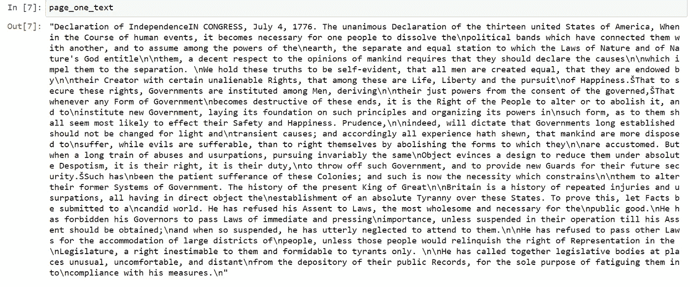

# 操作 PDF 文件，使用 PyPDF2 和正则表达式提取信息(第 2 部分)

> 原文：<https://towardsdatascience.com/manipulate-pdf-files-extract-information-with-pypdf2-and-regular-expression-39ff697db0ca?source=collection_archive---------3----------------------->

## 使用 PyPDF2 和正则表达式简化 PDF 操作任务


照片由 [Benoit Gauzere](https://unsplash.com/@bgauzere?utm_source=medium&utm_medium=referral) 在 [Unsplash](https://unsplash.com?utm_source=medium&utm_medium=referral) 拍摄

## 介绍

毫无疑问，现代科技使我们的生活变得容易了。甚至我们也无法想象没有现代技术的日子。自然语言处理是近来使用最多的技术之一。基本上，自然语言处理在我们的日常交流中起着重要的作用。如果我们开始了解对技术的见解，并能运用我们自己的技术，这将是我们的一大乐事。

*最开始，*我们要了解一下玩文本文件的各种技巧。如果你不熟悉，我推荐你看我之前的文章。

</tips-and-tricks-to-work-with-text-files-in-python-89f14a755315>  

然后，我们需要了解如何从 pdf 或其他格式的文本文件中提取文本信息。但是在本文中，我们将讨论如何使用`PyPDF2`库来浏览 pdf 文档。从文本文件中提取信息的另一个最重要的工具是正则表达式。使用正则表达式，我们可以很容易地获得我们想要的信息，如电话号码、地址、电子邮件等等。特别地，正则表达式是一些符号和字母的组合，用于从成千上万的文本数据中获取我们想要的信息。

***【注意——为了您的方便，我在结论的最后链接了文章的完整源代码。】***

## 路标

本文旨在用 python 覆盖 NLP 的先决条件。以下主题将在下一篇文章中涉及。

***第一部***

*   `PyPDF2`概述
*   阅读 PDF 文件
*   向 PDF 添加文本
*   从 PDF 中抓取所有文本

***第二部分***

*   Python `re`库概述
*   搜索基本模式
*   复杂模式概述
*   使用量词的模式搜索
*   用`re`库分组
*   or 运算符
*   通配符
*   以字符开始和结束
*   将字符分散成字符串
*   从字符串中删除标点符号
*   用于分组的括号
*   多个选项的括号
*   实践问题

让我们开始吧

## 第一部分

接下来的部分是关于 python 的`PyPDF2`库，用于处理 PDF 文件。

1.  **概述** `**PyPDF2**` **库**

你经常需要处理 PDF 文件。Python 中有许多用于处理 PDF 的库，每一个都有其优缺点，最常见的是 PyPDF2。您可以安装它(注意区分大小写，您需要确保您的大写匹配):

```
pip install PyPDF2
```

请记住，不是所有的 PDF 文件都可以用这个库读取。太模糊、有特殊编码、加密的 PDF，或者可能只是用不适合 PyPDF2 的特定程序创建的 pdf，将无法被读取。如果你发现自己处于这种情况，尝试使用上面链接的库，但是记住，这些也可能不起作用。这是因为 PDF 有许多不同的参数，而且设置可能非常不标准，因此文本可以显示为图像，而不是 utf-8 编码。这方面要考虑的参数很多。

就 PyPDF2 而言，它只能从 PDF 文档中读取文本，而不能从 PDF 中抓取图像或其他媒体文件。

**2。阅读 PDF 文件**

首先需要导入`PyPDF2`库如下

```
# note the capitalization
import PyPDF2
```

现在，我们打开一个 pdf，然后为它创建一个 reader 对象。注意我们是如何使用二进制阅读方法的，`‘rb’`，而不仅仅是`‘r’`。

```
# Notice we read it as a binary with 'rb'
f = open('US_Declaration.pdf','rb')
```

[阅读更多为什么用](https://www.quora.com/What-does-opening-a-file-rb-in-Python-mean) `[‘rb’](https://www.quora.com/What-does-opening-a-file-rb-in-Python-mean)` [代替](https://www.quora.com/What-does-opening-a-file-rb-in-Python-mean) `[‘r’](https://www.quora.com/What-does-opening-a-file-rb-in-Python-mean)`

这里，文件`‘US_Declaration.pdf’`位于与`jupyter notebook`文件位置相同的目录中。

[*你可以从这里下载*](https://drive.google.com/file/d/115DPlPclA69A2VvIAfrRPoSRWA26SDvd/view?usp=sharing) `[*US_Declaration.pdf*](https://drive.google.com/file/d/115DPlPclA69A2VvIAfrRPoSRWA26SDvd/view?usp=sharing)` [*文件。*](https://drive.google.com/file/d/115DPlPclA69A2VvIAfrRPoSRWA26SDvd/view?usp=sharing)

是时候读这一页的课文了。下面这段代码将帮助我们阅读 pdf 格式的页面。

```
#pdfFileReader() reads the text  form the pdf
pdf_reader = PyPDF2.PdfFileReader(f) #the following lines of code will output the number of pages of the pdf
pdf_reader.numPages#getPage()reads the text of a specific page. Here the parameter 0 indicates the first page of the pdf
page_one = pdf_reader.getPage(0)
page_one_text = page_one.extractText()
#Finally the extractText() extracts the the texts in a text format of page 1\. 
```

如果您运行上面的代码并想看看`page_one_text`变量包含什么，您会发现下面的输出。



作者照片

**3。向 pdf 添加文本**

我们不能使用 Python 编写 PDF，因为 Python 的单个字符串类型与 PDF 可能具有的各种字体、位置和其他参数之间存在差异。

*我们能做的就是复制页面，把页面追加到最后。*

我们将提供一个向新的 pdf 文件添加文本的例子。很简单。

```
f = open('US_Declaration.pdf','rb')
pdf_reader = PyPDF2.PdfFileReader(f)first_page = pdf_reader.getPage(0)#pdfFileWriter() enables to create a page
pdf_writer = PyPDF2.PdfFileWriter()#addPage() adds the content of first_page to a new page
pdf_writer.addPage(first_page)#The open() function with "wb" mode creates a document named "Some_New_Doc.pdf" to the directory
pdf_output = open("Some_New_Doc.pdf","wb")#finally we will get a pdf file with the contents of the first page of the previous pdf by write() function
pdf_writer.write(pdf_output)
```

***搞定！*** 现在我们已经复制了一页，并添加到另一个新文档中！

**4。从 pdf 文件中抓取所有文本**

从上面的代码中，我们知道使用`PyPDF2,`我们一次只能阅读特定页面的文本。但是我们如何一次获得 pdf 的所有文本呢？有什么解决办法吗？耶！显然，一个简单的循环就可以解决这个问题。让我们看看实际情况。

```
f = open('US_Declaration.pdf','rb')# List of every page's text.
# The index will correspond to the page number.
pdf_text = [0]  # zero is a placehoder to make page 1 = index 1pdf_reader = PyPDF2.PdfFileReader(f)for p in range(pdf_reader.numPages):

    page = pdf_reader.getPage(p)

    pdf_text.append(page.extractText())
```

代码的和平将有助于把所有的文本保存到一个列表对象中。现在，我们可以像`print(pdf_text[1])`一样将索引插入列表，轻松打印出页面内容。它将打印第 2 页的文本。

*【注意——使用* `*f.close()*` *命令关闭文档总是一个好习惯。】*

## 第二部分

1.  **正则表达式概述**

正则表达式(有时简称为 regex)允许用户使用他们能想到的几乎任何类型的规则来搜索字符串。例如，在字符串中查找所有大写字母，或者在文档中查找电话号码。

正则表达式因其看似奇怪的语法而臭名昭著。这种奇怪的语法是他们灵活性的副产品。正则表达式必须能够过滤掉你能想象到的任何字符串模式，这就是为什么它们具有复杂的字符串模式格式。

正则表达式使用 Python 内置的 **re** 库来处理。更多信息参见[文档](https://docs.python.org/3/library/re.html)。

让我们从解释如何在字符串中搜索基本模式开始！

**2。搜索基本模式**

假设我们有以下字符串:

```
text = "The agent's phone number is 408-555-1234\. Call soon!"
```

我们将首先尝试找出字符串“phone”是否在文本字符串中。现在，我们可以通过以下方式快速做到这一点:

```
'phone' in text
```

它将返回在语句中找到的`True`。

但是让我们来展示正则表达式的格式，因为稍后我们将搜索没有如此简单解决方案的模式。看一个使用 python 正则表达式库`re`的简单例子。

首先，

```
import re
```

现在，

```
pattern = 'phone'
re.search(pattern,text)
```

输出

```
<_sre.SRE_Match object; span=(12, 17), match='phone'>
```

表示`phone`与变量`text`的字符串匹配，并且存在该字符串的`12`到`17`索引。另一个例子可以如下。

```
pattern = "NOT IN TEXT"
re.search(pattern,text)
```

它不会返回任何内容，因为没有找到匹配。现在我们已经看到 re.search()将获取模式，扫描文本，然后返回一个匹配对象。如果没有找到模式，则返回 None。

让我们仔细看看这个匹配对象。跨度`match.span()`有开始和结束索引。如果我们运行代码`match.start()`，它将输出`12`。另一方面，`match.end()`输出匹配字符串的结束索引，即`17`。

*但是如果这种模式出现不止一次呢？*

```
text = "my phone is a new phone"
match = re.search("phone",text)
```

它将返回输出`<re.Match object; span=(3, 8), match=’phone’>`。请注意，虽然字符串`phone`有 2 个匹配，但只找到第一个匹配。

如果我们想要所有匹配的列表，我们可以使用`.findall()`方法:

```
matches = re.findall("phone",text)
```

输出

```
['phone', 'phone']
```

如果您想要匹配的实际文本，您可以使用`.group()` 方法。

```
match.group()
```

输出

```
'phone'
```

**3。复杂模式概述**

到目前为止，我们已经学习了如何搜索一个基本字符串。更复杂的例子呢？比如试图在一大串文本中找到一个电话号码？或者电子邮件地址？

如果我们知道确切的电话或电子邮件，我们可以使用搜索方法，但如果我们不知道呢？我们可能知道一般的格式，我们可以使用它和正则表达式在文档中搜索匹配特定模式的字符串。

这是语法开始看起来奇怪的地方，但是要慢慢来；通常只需要查找模式代码。

我们开始吧！

**4。模式中字符的标识符**

数字或单个字符串等字符有不同的代码来表示。您可以使用这些来构建模式字符串。注意这些是如何大量使用反斜线`\` 的。因此，在为正则表达式定义模式字符串时，我们使用以下格式:

```
r'mypattern'
```

将 r 放在字符串前面可以让 python 理解模式字符串中的 `\` 不是转义斜杠。

下面是所有可能标识符的列表:

你可以边工作边看表格，因为记住这些符号是不可能的。

请看下面的代码

```
text = "My telephone number is 408-555-1234"
phone = re.search(r'\d\d\d-\d\d\d-\d\d\d\d',text)
phone.group() #there are three groups separated with (-) symbol
```

输出

```
'408-555-1234'
```

注意`\d`的重复。这有点麻烦，尤其是当我们在寻找很长的数字串时。量词让这个任务变得简单了。

**5。使用量词的模式搜索**

让我们探索可能的量词。

现在，我们知道了特殊的字符标识，我们可以使用它们和量词来定义我们期望的数量。我们不需要重复使用标识符。

让我们使用这些量词重写我们的模式:

```
text = "My telephone number is 408-555-1234"
phone = re.search(r'\d{3}-\d{3}-\d{4}',text)
phone.group()
```

代码的输出和前面的一样。但现在它似乎很容易，可以很容易地用于复杂和大的模式。

**6。组有** `**re**` **库**

如果我们想做两个任务，查找电话号码，但也能够快速提取他们的区号(前三位数字)的上述例子。我们可以将组用于任何涉及到将正则表达式组合在一起的常规任务(以便我们稍后可以分解它们)。

以电话号码为例，我们可以使用括号分隔正则表达式组:

```
# The entire result
results.group()
```

输出

```
'408-555-1234'
```

然后

```
# Can also call by group position.
# remember groups were separated by parentheses ()
# Something to note is that group ordering starts at 1\. Passing in 0 returns everything
results.group(1)
```

这段代码返回第一组(电话号码的 3 位数)。

**7。** `**or**` **符**

使用钻杆操作器进行**或**定位。例如

```
re.search(r"man|woman","This man was here.")
```

输出

```
<_sre.SRE_Match object; span=(5, 8), match='man'>
```

又..

```
re.search(r"man|woman","This woman was here.")
```

输出

```
<_sre.SRE_Match object; span=(5, 10), match='woman'>
```

8。通配符

使用`“wildcard”`作为一个位置，它将匹配放置在那里的任何字符。可以用简单的句号**。**为此。例如:

```
re.findall(r".at","The cat in the hat sat here.")
```

输出

```
['cat', 'hat', 'sat']
```

假设，我们想匹配前 3 个字母。

```
re.findall(r"...at","The bat went splat")
```

它生成类似`[‘e bat’, ‘splat’]`的输出。请注意，我们只匹配了前 3 个字母，这是因为我们需要为每个通配符字母添加一个 `**.**` 。或者使用上面描述的量词来设置自己的规则。

如果我们想要以“at”结尾的单词，应该怎么做？

```
# One or more non-whitespace that ends with 'at'
re.findall(r'\S+at',"The bat went splat")
```

上面的代码已经完成了工作并返回输出`[‘bat’, ‘splat’]`。

**9。开始和结束字符**

我们可以用**来查找以字符开头的, **$** 来查找以字符结尾的:**

```
# Ends with a number
re.findall(r'\d$','This ends with a number 2')# Starts with a number
re.findall(r'^\d','1 is the loneliest number.')
```

**上面的代码返回`[‘2’]`，`[‘1’]`作为字符串的结束和开始字符。**

***注意，这是针对整个字符串，不是针对单个单词！***

****10。分散字符串中的字符****

**为了排除字符，我们可以将`^`符号与一组方括号`[]` `.`一起使用，方括号内的任何内容都被排除在外。例如:**

```
phrase = "there are 3 numbers 34 inside 5 this sentence."
re.findall(r'[^\d]',phrase)
```

**输出**

```
['t',
 'h',
 'e',
 'r',
 'e'
....]
```

****11。去除标点符号****

```
test_phrase = 'This is a string! But it has punctuation. How can we remove it?'
re.findall('[^!.? ]+',test_phrase)
```

**它将只返回单词。**

```
['This',
 'is',
 'a',
 'string',
 'But',
 'it',
 'has',
 'punctuation',
 'How',
 'can',
 'we',
 'remove',
 'it']
```

**我们可以把这个词按如下顺序连接起来。**

```
clean = ' '.join(re.findall('[^!.? ]+',test_phrase))
clean
```

**它将返回不带标点符号的字符串。**

```
'This is a string But it has punctuation How can we remove it'
```

****12。用于分组的括号****

**如上所示，我们可以使用括号将选项组合在一起，例如，如果我们想要查找带连字符的单词:**

```
text = 'Only find the hypen-words in this sentence. But you do not know how long-ish they are'
re.findall(r'[\w]+-[\w]+',text)
```

**输出**

```
['hypen-words', 'long-ish']
```

**13。多个选项的括号**

**如果我们有多个匹配选项，我们可以使用括号列出这些选项。例如:**

```
*# Find words that start with cat and end with one of these options: 'fish','nap', or 'claw'*text **=** 'Hello, would you like some catfish?'re.search(r'cat(fish|nap|claw)',text)
```

**输出**

```
<_sre.SRE_Match object; span=(27, 34), match='catfish'>
```

**14。练习题**

**这是额外的任务。我已经上传了一个 jupyter 笔记本文件到[***github***](https://github.com/Zubair063/ML_articles/blob/fe3aabe41a68f1b0a305e63dd38cb91b5445d9bd/PDF%20manupulation%20an%20regular%20expression/Python-Text-Basics-Assessment.ipynb)。你可以从[这里](https://github.com/Zubair063/ML_articles/blob/fe3aabe41a68f1b0a305e63dd38cb91b5445d9bd/PDF%20manupulation%20an%20regular%20expression/Python-Text-Basics-Assessment.ipynb)下载文件，并根据指示填写单元格。有六项任务。试着做你自己的。我认为这很容易，也很有趣。如有任何问题或困惑，请在下面评论。**

****

**[M](https://unsplash.com/@lamerbrain?utm_source=medium&utm_medium=referral) 在 [Unsplash](https://unsplash.com?utm_source=medium&utm_medium=referral) 上拍照**

## **结论**

**我认为我们学到了很多。虽然主题和语法很简单，但对于自然语言处理(NLP)和其他数据科学任务来说，它们非常重要。我已经开始将这些文章作为一系列 NLP。从下一篇文章中，我们将学习 NLP 的核心基础知识。和我保持联系。**

***第一部分完整的 Jupyter 笔记本如下***

**<https://github.com/Zubair063/ML_articles/blob/fe3aabe41a68f1b0a305e63dd38cb91b5445d9bd/PDF%20manupulation%20an%20regular%20expression/Working-with-PDF-Text.ipynb>  

*找到下面给出的完整正则表达式源代码*

<https://github.com/Zubair063/ML_articles/blob/fe3aabe41a68f1b0a305e63dd38cb91b5445d9bd/PDF%20manupulation%20an%20regular%20expression/Regular-Expressions.ipynb>  

# 祖贝尔·侯赛因

*   *如果你喜欢这篇文章，请关注我的* [***中型***](https://mzh706.medium.com/) *了解更多。*
*   *在*[***LinkedIn***](https://www.linkedin.com/in/zubair063/)*上连接我进行协作。***