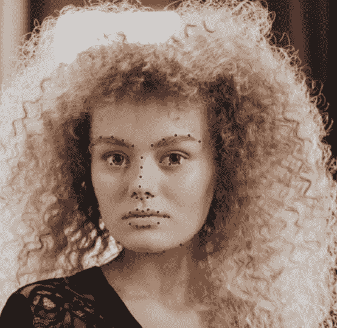

# 用 OpenCV 和 Dlib 操作面部特征

> 原文：<https://towardsdatascience.com/manipulating-facial-features-with-opencv-and-dlib-14029f136a3d?source=collection_archive---------21----------------------->

## 如何使用 OpenCV 和 Dlib 在图片上使用虚拟口红的快速教程。


这位女士用的是虚拟口红！照片由科托姆布罗，[https://www.pexels.com/@cottonbro](https://www.pexels.com/@cottonbro)

这是一个关于如何使用 OpenCV 和 Dlib 在图像上应用虚拟口红的快速教程。同样的原则也可以延伸到其他面部特征，比如某人的眼睛、鼻子、下巴……要有创意。

为了达到上图所示的效果，我们需要执行以下步骤:

1.  检测面部标志
2.  使用包含嘴部标志的凸多边形创建一个遮罩
3.  用形态学操作增强蒙版，模糊蒙版以获得更好的混合效果
4.  隔离嘴唇和脸
5.  对嘴唇应用颜色变换
6.  将嘴唇和脸合在一起

首先要做的是检测人脸的面部标志。库 Dlib 提供了一种方便的方法来实现它；但是，请记住，拍摄对象的脸需要面向摄像机。如果头部的姿态不对，检测结果不会很好。



面部标志

在这个例子中，我们只对嘴唇的点感兴趣。下图是 Dlib 返回的面部标志点的索引。如你所见，我们感兴趣的是点 48 到 60(嘴唇的外部“轮廓”)。


来自 iBUG 300-W 数据集的 68 个面部标志坐标(来源:【https://www.pyimagesearch.com/】T2

利用这些点，我们可以建立一个面具，让我们在不影响面部整体外观的情况下处理嘴唇的颜色。但是坚持住。在我们开始处理这些颜色之前，我们需要改进蒙版。在这个例子中，具有 4×4 矩形核的形态学闭合操作就足够了。请注意下图，该步骤填充了由 cv2.fillConvexPoly 函数生成的原始多边形右上角的一个间隙。


右:使用 lips 界标创建的凸多边形/左:闭合操作后的多边形

为了得到自然的效果，我们还需要模糊蒙版。模糊蒙版将产生更好的混合。我们通过应用 cv2 来做到这一点。高斯布鲁到面具。最后，我们倒置面具(我们将需要两个，一个为嘴唇，一个为脸)。


右:模糊遮罩/左:模糊反向遮罩

我们将应用这些遮罩，将它们从 0–255(uint 8)转换到 0–1(浮点)范围，然后乘以图像。下面右边的图像是原始图像乘以反转遮罩。左边的图像是原始图像的颜色变换乘以蒙版的结果。颜色转换由 cv2.applyColorMap(im，cv2。COLORMAP_INFERNO)。


右:原始图像和反模糊蒙版的按位与/左:颜色变换图像和模糊蒙版的按位与

现在，剩下要做的就是把这两幅图像加在一起。


右:原始图像/左:结果图像

我希望你喜欢这个简短的教程。如果你有更好的方法或者你有什么建议，请在评论中告诉我。(对了，我老婆说从来不允许我选择她的口红颜色。不知道她是什么意思。)

这是代码。尽情享受吧！

```
import cv2
import dlib
import faceBlendCommon as face
import numpy as np# Load Image
im = cv2.imread("cv2/girl-no-makeup.jpg")# Detect face landmarks
PREDICTOR_PATH = r"C:\Users\felipe.cunha\Documents\venv\cv2\week1-pyton\data\models\shape_predictor_68_face_landmarks.dat"faceDetector = dlib.get_frontal_face_detector()
landmarkDetector = dlib.shape_predictor(PREDICTOR_PATH)
landmarks = face.getLandmarks(faceDetector, landmarkDetector, im)# Create a mask for the lips
lipsPoints = landmarks[48:60]
mask = np.zeros((im.shape[0], im.shape[1], 3), dtype=np.float32)
cv2.fillConvexPoly(mask, np.int32(lipsPoints), (1.0, 1.0, 1.0))
mask = 255*np.uint8(mask)# Apply close operation to improve mask
kernel = cv2.getStructuringElement(cv2.MORPH_RECT, (40,40))
mask = cv2.morphologyEx(mask, cv2.MORPH_CLOSE, kernel, 1)# Blur the mask to obtain natural result
mask = cv2.GaussianBlur(mask,(15,15),cv2.BORDER_DEFAULT)# Calculate inverse mask
inverseMask = cv2.bitwise_not(mask)# Convert masks to float to perform blending
mask = mask.astype(float)/255
inverseMask = inverseMask.astype(float)/255# Apply color mapping for the lips
lips = cv2.applyColorMap(im, cv2.COLORMAP_INFERNO)# Convert lips and face to 0-1 range
lips = lips.astype(float)/255
ladyFace = im.astype(float)/255# Multiply lips and face by the masks
justLips = cv2.multiply(mask, lips)
justFace = cv2.multiply(inverseMask, ladyFace)# Add face and lips
result = justFace + justLips# Show result
cv2.imshow("", result)
cv2.waitKey(0)
```