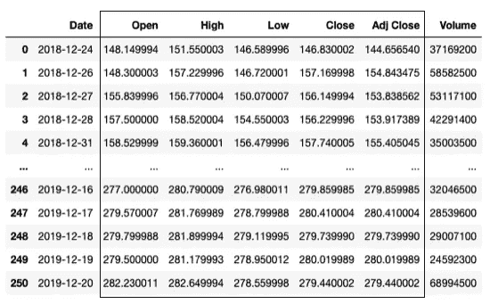

# 处理熊猫数据框中的值

> 原文：<https://towardsdatascience.com/manipulating-values-in-pandas-dataframes-a84fe35a190?source=collection_archive---------24----------------------->

## 知道何时使用 map()、apply()和 applymap()


安妮·斯普拉特在 [Unsplash](https://unsplash.com?utm_source=medium&utm_medium=referral) 上的照片

数据分析中的一个常见任务是处理数据帧中的值。对于那些熟悉熊猫的人来说，你知道通常你有三个函数可以使用——**map()**、 **apply()** 和 **applymap()** 。然而，通常不清楚什么时候应该使用哪一个，有时每个函数的工作原理都很混乱。

这篇文章试图让你明白每个函数是如何工作的，以及什么时候你应该使用什么。

# 各种功能的快速总结

首先，让我们快速浏览一下每个功能的定义:

*   **map()** —对序列应用函数
*   **apply()** —将函数应用于序列或数据帧(沿两个轴中的一个)
*   **applymap()** —对数据帧元素应用函数

记住它们如何工作的最好方法是使用下表来总结它们:


如您所见， **map()** 函数仅适用于系列， **applymap()** 函数仅适用于数据帧，而 **apply()** 函数可用于系列或数据帧。

与其解释每个函数的用法，不如让我们通过陈述你试图解决的问题来解决这个问题。

# 修改单列值

如果您想修改数据帧中的一列值，使用 **map()** 函数很容易做到。考虑以下 AAPL 数据集([https://finance.yahoo.com/quote/AAPL/history/](https://finance.yahoo.com/quote/AAPL/history/)):

```
import pandas as pd
df = pd.read_csv('AAPL.csv')
df
```


假设您想要重新格式化日期，使其现在以下列格式显示:

`Dec 24, 2018 (Mon)`

一种简单的方法是将**日期**列作为一个序列，然后对其使用 **map()** 函数。以下代码片段将**日期**值转换为我们想要的格式:

```
from datetime import datetimedef format_date(x):
    return datetime.strptime(x, '%Y-%m-%d').strftime(
        '%b %d, %Y (%a)')df = pd.read_csv('AAPL.csv')df['Date'] = **df['Date'].map(format_date)**
df
```

在 **format_date()** 函数中，参数 **x** 是字符串类型(**日期**列的每个值)。例如“*2018–12–24*”)。为了转换成我们想要的日期格式，我首先使用 **strptime()** 将给定的字符串转换成一个 **datetime** 对象，然后使用 **strftime()** 函数将 **datetime** 对象转换成想要的字符串格式。然后使用 **map()** 函数(这是一个序列)的结果来更新**日期**列。

更新后的数据帧现在如下所示:


您也可以使用 **apply()** 函数达到同样的目的，因为它也适用于序列。以下代码片段显示了如何使用 **apply()** 函数实现上述步骤:

```
df = pd.read_csv('AAPL.csv')
df['Date'] = **df['Date'].apply(format_date)** 
df
```

# 修改数据帧中的多列值

假设现在除了更改日期格式之外，您还需要将 **Close** 列中的值向下舍入到两位小数。在这种情况下，使用 **apply()** 函数会很有用，因为它适用于数据帧。

以下代码片段显示了如何修改**日期**列中值的日期格式，以及如何对**结束**列执行舍入:

```
from datetime import datetimedef format_date2(x): 
    x['Date'] = datetime.strptime(
        x['Date'], '%Y-%m-%d').strftime('%b %d, %Y (%a)')
    x['Close'] = round(x['Close'],2)
    return xdf = pd.read_csv('AAPL.csv')
df = **df.apply(format_date2, axis=1)**   
df
```

这一次，您在数据帧上使用 **apply()** 函数。在 **format_date2()** 函数中，参数 **x** 现在将是一个序列(包含每一行，因为我们指定了 **axis=1** )。


在该函数中，我们首先修改**日期**值，然后对**收盘**值进行舍入。结果将如下所示:


> 在数据帧上使用 **apply()** 功能时，可以指定**轴**参数(0 或 1)。但是，当您在系列上使用 **apply()** 功能时，不支持**轴**参数。

当您在**轴**设置为 1 的数据帧上使用 **apply()** 函数时，您可以将其视为遍历数据帧中的每一行，然后将所有 ***列*** 作为一个序列，如下图所示。


另一方面，如果将**轴**指定为 0，它现在将遍历数据帧中的每一列，然后将所有 ***行*** 作为一个序列，如下图所示:


# 组合数据帧中的列

这里是另一个数据集，我将使用它来说明在数据帧上使用 **apply()** 函数。这次我将使用来自 http://www.weather.gov.sg/climate-historical-daily/[的降雨数据集。](http://www.weather.gov.sg/climate-historical-daily/)

```
df = pd.read_csv('DAILYDATA_S24_202107.csv')
df
```

数据帧看起来像这样:


该数据集包含新加坡 2021 年 7 月 31 天每天的降雨量(以及温度和风速等其他要素)。

假设我想将三个独立的列— **年**、**月**和**日**合并成一个列— **日**。这是使用 **apply()** 函数的好时机:

```
import datetimedf['Date'] = **df[['Year','Month','Day']].apply(
    lambda x: datetime.date(** # x is a series **int(x['Year']),
        int(x['Month']),
        int(x['Day'])), 
    axis=1)**
df
```

您首先提取想要作为数据帧的三列(**年**、**月**和**日**)，然后对其使用 **apply()** 函数。当您指定 **axis=1** 时，dataframe 的每一行(包含三列— **年**、**月**和**日**)将作为一个序列( **x** )传递给 lambda 函数。现在，您可以使用序列中的值来创建一个 **datetime.date** 对象。现在在数据帧中创建了一个新列( **Date** )，用于存储新创建的 **datetime.date** 对象(数据帧中的最后一列):


# 列或行值的聚合

有时需要聚合数据帧中特定列的值。例如，使用降雨量数据集，您可能想要计算该月的平均日降雨量。在这种情况下，您可以使用 **apply()** 功能，将**轴**参数设置为 0:

```
df[['Daily Rainfall Total (mm)']].apply(lambda x: x.mean(),
    axis=0)
```

当您为 **apply()** 函数指定 **axis=0** (或者省略它，因为这是默认值)时，dataframe 中的每一列都将作为一个序列传递给 lambda 函数:


假设您想获得整个月的平均降雨量和平均温度。您可以首先提取降雨量和温度这两列，然后使用 **apply()** 函数:

```
df = pd.read_csv('DAILYDATA_S24_202107.csv')**df[['Daily Rainfall Total (mm)','Mean Temperature (°C)']].apply(
    lambda x: x.mean()**,
    axis=0)
```

结果将是一系列:

```
Daily Rainfall Total (mm)     6.316129
Mean Temperature (°C)        28.619355
dtype: float64
```

如果你想计算降雨量的平均值和温度的中值呢？在这种情况下，您可以使用序列的**名称**属性来标识每一列。以下示例向您展示了如何操作:

```
def aggregate_columns(x):
    if **x.name** =='Daily Rainfall Total (mm)':
        return x.mean()
    if **x.name**=='Mean Temperature (°C)':
        return x.median()

**df[['Daily Rainfall Total (mm)','Mean Temperature (°C)']].apply(
    aggregate_columns,
    axis=0)**
```

结果将如下所示:

```
Daily Rainfall Total (mm)     6.316129
Mean Temperature (°C)        **29.200000**
dtype: float64
```

# 变换数据帧中的元素

到目前为止，我们的讨论一直集中在对数据帧执行按行或按列的操作上。然而，有些时候你并不真正关心你的值被计算的顺序，只要它们被计算。我们之前使用的 AAPL 数据集就是一个很好的例子。假设您需要将**打开**、**高**、**低**、**关闭**和**调整关闭**列中的所有数字四舍五入到两位小数:



我们是按行还是按列处理它们有关系吗？没有。只要能四舍五入到小数点后两位，我们就很高兴了。这是一个使用 **applymap()** 函数的完美例子。 **applymap()** 函数将遍历数据帧中的每个元素，并执行指定的功能。以下代码片段显示了这是如何实现的:

```
df = pd.read_csv('AAPL.csv')
**df[['Open','High','Low','Close','Adj Close']] = \
    df[['Open','High','Low','Close','Adj Close']].applymap(
        lambda x: round(x,2))** 
df
```

所选数据帧中的每个元素都将作为参数传递给 lambda 函数。

指定列中的值现在四舍五入到两位小数:


# 结论

我希望这篇文章已经让您清楚地决定了什么时候应该使用 **map()** 、 **apply()** 或 **applymap()** 函数。总而言之:

*   如果你想修改数据帧中的一列，使用 **map()**
*   如果你想一次修改数据帧中的几列，使用 **apply()**
*   如果想对数据帧中的列或行执行聚合函数，使用 **apply()**
*   如果您想修改数据帧中的值，而不用担心是按行还是按列执行，请使用 **applymap()**