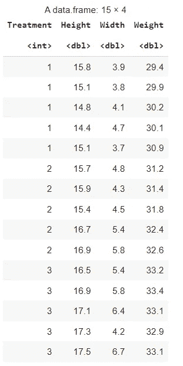
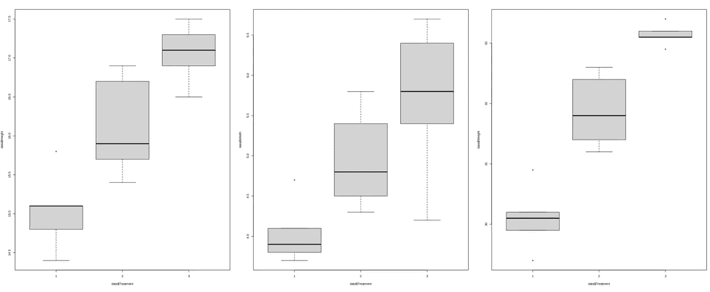
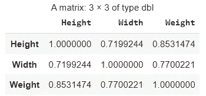
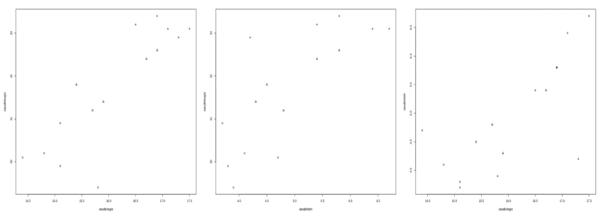
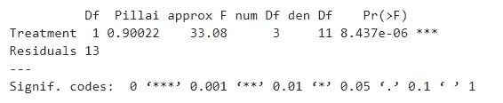
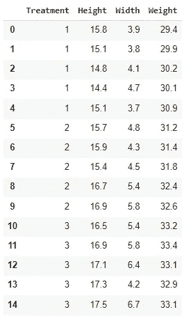
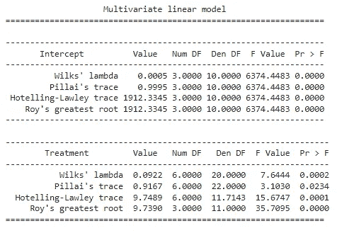

# 马诺娃

> 原文：<https://towardsdatascience.com/manova-97e675a96158?source=collection_archive---------1----------------------->

## 用 R 和 Python 编写的示例深入研究 MANOVA

马诺娃。照片由 [Unsplash](https://unsplash.com/s/photos/color-crops?utm_source=unsplash&utm_medium=referral&utm_content=creditCopyText) 上的 [Nick Fewings](https://unsplash.com/@jannerboy62?utm_source=unsplash&utm_medium=referral&utm_content=creditCopyText) 拍摄。

# 方差分析

[ANOVA 是方差分析的简称，也叫 AOV](/1-way-anova-from-scratch-dissecting-the-anova-table-with-a-worked-example-170f4f2e58ad) ，是一种主要用于假设检验的统计方法。方差分析最常见的用例是当你做一个实验，其中你的结果变量是数字，而你的解释变量是一个有三个或更多类别的分类变量。

ANOVA 用于[统计假设检验](/an-intuitive-explanation-of-hypothesis-testing-and-p-values-8391db2c90f)。如果您还不熟悉假设检验，我强烈建议您先阅读这篇文章。

## 使用 [ANOVA](/1-way-anova-from-scratch-dissecting-the-anova-table-with-a-worked-example-170f4f2e58ad) 的示例研究

一个例子是对一种新的农作物生长产品的试验，在这个试验中，你要衡量两种新的处理方法和一个对照组的表现。您在三个组(处理 1、处理 2 和对照)中测量数字结果(例如收获的千克数)。

为了统计的有效性，你需要多次应用[每种处理](https://en.wikipedia.org/wiki/Design_of_experiments)。想象一下，你在 15 个支线剧情中切割了你的农田，你做了 5 次治疗 1，5 次治疗 2，5 个支线剧情都没有(对照)。

然后计算每次处理的平均收获公斤数，你会发现平均值存在差异。但是，您需要定义差异是否大到足以说明结果 [**显著不同**](/an-intuitive-explanation-of-hypothesis-testing-and-p-values-8391db2c90f) 并且差异不仅仅是由于一些随机变化。

这就是方差分析的用途。当然，许多领域的许多研究都遵循**完全相同的设置**(三个或更多独立组和一个连续结果变量)。

你可以查看这篇文章，了解更多关于方差分析和高级选项的详细内容。

# 马诺娃

MANOVA 是 ANOVA 模型的多变量版本。这里的多变量表示有多个**因变量**而不是只有一个的事实。

MANOVA 分析的目标仍然是检测相对于其他组是否有治疗效果。然而，这种影响现在是通过多个连续变量而不是一个变量来衡量的。

## 一个方差分析与多个方差分析

你可以对每个因变量进行单独的方差分析，得到的结果与方差分析方法没有太大的不同。

然而，非常可能的是，MANOVA 发现了显著的治疗效果，而这种效果在对每个单独的因变量进行单独的 ANOVA 时不会被发现。

## 马诺娃:多元统计的一部分

现在，不要把 MANOVA 看作 ANOVA 的多变量替代，我们也可以把 MANOVA 描述为多变量统计领域的一个工具。

家族多元统计中的其他方法有[结构方程建模](/structural-equation-modeling-dca298798f4d)、[多维标度](/multidimensional-scaling-d84c2a998f72)、[主坐标分析](/principal-coordinates-analysis-cc9a572ce6c)、[典型相关分析](/canonical-correlation-analysis-b1a38847219d)，或[因子分析](/what-is-the-difference-between-pca-and-factor-analysis-5362ef6fa6f9)。这些方法的一个中心点是，它们都被用来理解许多变量，并试图将这些变量总结成一个或几个教训。

这与假设检验(常用于实验研究)非常不同，假设检验是一个专注于为非常精确的假设找到绝对答案(基于显著性的真理)的领域。

对于马诺娃来说，两者都是正确的，但重要的是要注意，具有一个因变量的“常规”假设检验领域通常具有与多元统计领域相对不同的应用。在选择方法时，考虑你的学习目标是很重要的。

# MANOVA 的使用案例示例

让我们开始研究一个马诺娃的例子。在这种情况下，让我们做一项研究，其目标是证明不同的植物生长产物导致显著不同的植物生长。

因此，我们将有三种治疗方法:

*   处理 1(对照，无产品)
*   处理 2(产品 1)
*   处理 3(产品 2)

我们将使用三种测量方法来定义植物生长:

*   植物的高度
*   植物的宽度
*   植物的重量

与多元统计中可能遇到的情况相比，拥有三个结果变量相对较少。然而，它将非常适合跟随这个 MANOVA 的例子。

# R 中的 MANOVA

让我们从 r 中的 MANOVA 分析开始。

## 获取 R 中的 MANOVA 数据

我把数据上传到了 S3 桶里。您可以在 R 中使用以下代码来获取数据:

数据如下所示:

MANOVA 数据。作者图片。

## 数据的单变量描述

为了快速了解治疗对三个因变量的影响，您可以使用以下代码创建方框图:

创建 MANOVA 植物生长数据的方框图。

您将获得以下图:

MANOVA 植物生长数据的方框图。作者提供的图像。

您在该图中可以看到，接受处理 1 的植物具有最低的高度、宽度和重量。接受治疗 3 的植物是所有植物中最高的。在某些地方有一些重叠，但我们可以合理地预期，处理 3 是植物生长的最佳整体产品。

## 数据的多元描述

在进行多元分析时，查看因变量之间的关系也很重要。

让我们从用下面的代码查看因变量之间的相关性开始

计算因变量之间的相关性

您将获得以下结果:

因变量之间的相关性

这三个变量之间都有很强的相关性。身高与体重的关系最为密切。

## 包括多元分析中的治疗

通过绘制散点图，您可以看到所表示的各个数据点。如果您将治疗方法作为一个形状添加到其中，您可以在一个绘图中看到相关性和治疗方法。

您可以使用以下代码来完成此操作:

创建 MANOVA 散点图

您将获得以下图:

MANOVA 散点图

## 在 R 中安装 MANOVA

现在，与其看图，我们想有一个客观的答案，以找出治疗是否是**显著**改善植物生长。

在 R 中安装 MANOVA

您将获得以下结果:

MANOVA 导致 R

## 了解 R 中 MANOVA 的输出

[如果你不熟悉假设检验，我建议你先读这篇文章。](/an-intuitive-explanation-of-hypothesis-testing-and-p-values-8391db2c90f)

假设检验输出中首先要看的通常是检验统计量和 p 值。

MANOVA 中的检验统计量是**皮莱轨迹**:一个介于 0 和 1 之间的值。像往常一样，p 值需要解释为重要性结论。p 值低于 0.05 表明治疗对结果有显著影响。

在目前的情况下，我们可以得出结论，**处理对植物生长**有显著影响。

# Python 中的 MANOVA

现在让我们看看如何使用相同的步骤在 Python 中进行相同的分析。

## 用 Python 获取 MANOVA 数据

您可以在 Python 中导入相同的数据集，如下所示:

在 Python 中导入 MANOVA 数据

它将如下所示:

Python 中的 MANOVA 数据

## 在 Python 中安装 MANOVA

您可以使用 statsmodels 在 Python 中安装 MANOVA。您可以使用以下代码来实现这一点:

在 Python 中安装 MANOVA

您将获得以下输出:

Python 中的 MANOVA 输出

## 理解 Python 中 MANOVA 的输出

现在在 Python 中，输出显示了使用不同测试统计数据的分析。第二个是 Pillai 的轨迹，也是我们在 R 输出中看到的轨迹。众所周知，皮莱的迹线相对保守:它不太容易给出有意义的结果(差异必须更大才能获得有意义的输出)。

威尔克斯的λ是另一个常用的检验统计量。Hotelling-Lawley trace 和 Roy 的最大根也是备选方案。在统计学文献中，对于哪种检验统计量更好，没有绝对的一致意见。

p 值显示在右栏中，并且都小于 0.05，这证实了处理对植物生长有影响。

# 马诺娃的假设

和所有的统计模型一样，有一些[假设](/assumptions-of-linear-regression-fdb71ebeaa8b)需要考虑。在 MANOVA 中，假设是:

*   独立同分布随机变量
*   每组内的因变量遵循多元[正态分布](/6-ways-to-test-for-a-normal-distribution-which-one-to-use-9dcf47d8fa93)
*   各组之间的相等总体协方差矩阵(ANOVA 中方差齐性的多变量替代)。如果满足这个假设，通常建议使用皮莱的迹线，否则应该默认使用维尔克的λ。

如果你想依靠你的马诺瓦结论，你需要确保这些假设得到满足。

# 结论

在本文中，您了解了什么是 ANOVA，何时应该使用它，以及如何在 R 和 Python 中通过一个关于作物生长的用例来应用它。我希望这篇文章对你有用！感谢您的阅读，请不要犹豫，继续关注更多的统计、数学和数据科学内容。