# 使用 Python 进行制造数据分析:实践示例

> 原文：<https://towardsdatascience.com/manufacturing-data-analytics-with-python-a-hands-on-example-6de8817a24dc?source=collection_archive---------3----------------------->

## [行业笔记](https://towardsdatascience.com/tagged/notes-from-industry)

## 我们展示了如何使用 Python 工具处理机器/测试人员漂移和基准测试的典型制造数据分析问题。

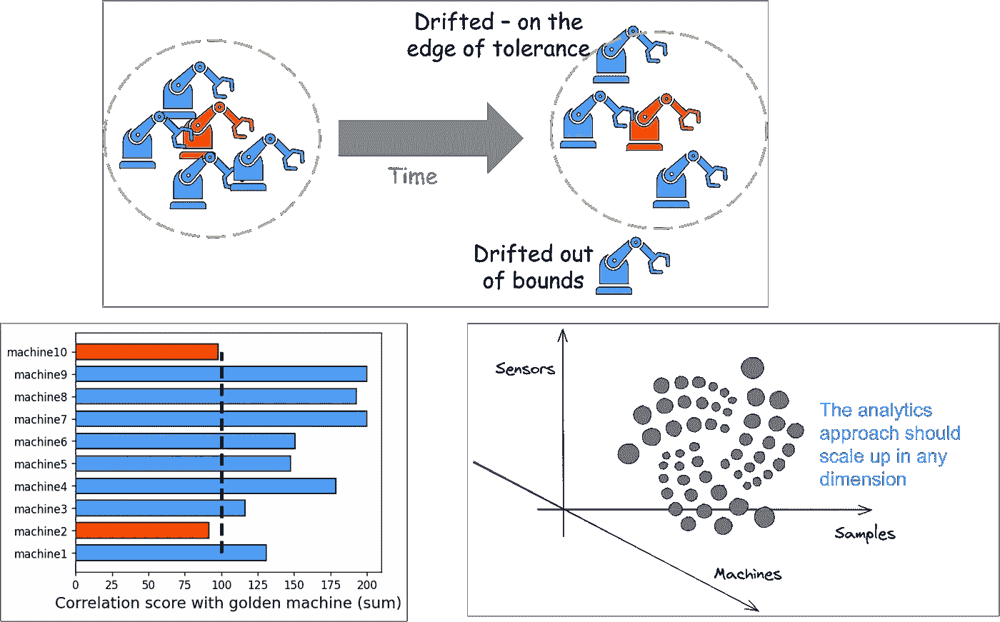

图片来源:作者创作

# 数据分析解决制造问题

在进入数据科学(DS)和机器学习(ML)职业生涯之前，我在硅谷的科技行业担任了十多年的半导体技术专家和设计师。我是拥有大量制造足迹的组织的一员——前端晶圆厂、后端组装厂等。

我们在推出高性能产品和开发新型技术节点方面取得了巨大成功。我们也有相当多的制造问题。我一直坚持认为**使用 DS 和 ML 的现代工具**可以更好地分析和解决这些问题。

当然，这不是我。许多聪明人也在谈论它。

<https://www.kdnuggets.com/2019/03/top-8-data-science-use-cases-manufacturing.html>  

很自然，在我进入数据科学领域后，我经常被要求举例说明**如何使用任何人都可以使用的快速编程工具和技术**来解决常见的制造分析问题。在这篇简短的文章中，我试图展示一个具体的例子——机器和测试人员的漂移问题。

# 机器/测试仪漂移问题

现代制造工厂使用非常复杂的机器和设备进行生产、包装、测试等。虽然设计的目的是为了高质量和稳定性，但没有一台机器能够避免漂移和变化。随着时间的推移，子组件的行为开始与它们在安装阶段的行为略有不同，并且整体特性会发生漂移。

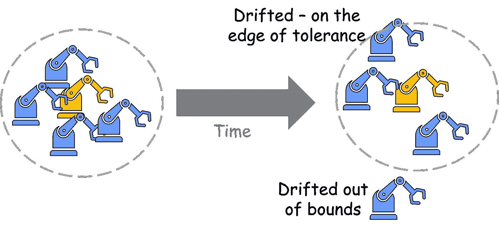

图片来源:作者创作

由于许多原因，检测这种漂移是重要的，

*   确定哪台机器(在一组机器中)可能需要维修和保养
*   通过软件或硬件干预来校正/重置漂移
*   将产品质量与机器漂移相关联
*   调查可能由机器漂移和偏差增加引起的产量问题或可靠性故障

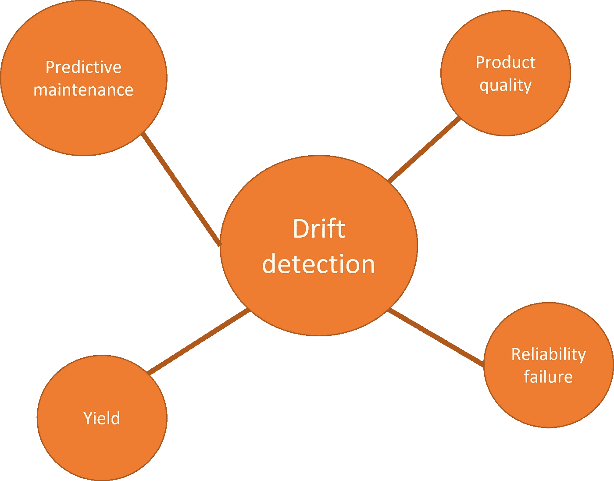

图片来源:作者创作

## 个体漂移检测

检测单个设备的漂移和变化是一个常见的制造问题。这可以使用各种方法来处理，特别是如果某种测试/传感器数据也是可用的。一些方法是，

*   寻找并计算过程中的异常情况—如果其密度超过阈值，则机器可能需要维修/维护
*   监控与机器相关的数据的统计分布(不一定是正态/高斯分布),并检测其变化
*   每天/每周执行某种简单的统计测试(例如，将平均值与金标准机器进行比较),并检测是否有显著变化

> 虽然设计的目的是为了高质量和稳定性，但没有一台机器能够避免漂移和变化。

## 哪些机器掉线最多？

通常，最谨慎的任务是(在一组相同的机器中)找出与黄金标准相比**偏差最大的机器。理想情况下，我们希望通过分配某种数值分数来对它们进行排序。**

这在现实生活中经常发生。为什么？因为以前的经验和数据分析可能已经表明，小的漂移不会影响产品质量或产量，只有漂移最大的机器才应该停下来进行干预和维护。

业务经理和制造副总裁会告诉你，干预是要花钱的，只有在不可避免的时候才应该这么做。他们期望，你的数据分析将引导他们解决最紧迫的问题，而不仅仅是扔给他们一般的统计分析和图表。

## 这不是一个微不足道的数据问题

围绕*工业 4.0* 、*数字化转型*和*智能制造*的所有宣传，你会惊讶地发现，在这种转型变革的道路上，最大的障碍仍然是基本的数据收集和摄取。

机器移动，操作执行，产品生成。但是，大多数情况下，它们并没有被数字化记录。如果它们没有被正确地记录下来(*及时*)，相关的数据就会丢失到宇宙中，导致[不断增加的熵](https://www.zmescience.com/science/what-is-entropy-and-why-is-it-always-increasing/)。它们对任何后续的数据驱动的分析管道都没有用。

> 通常，最谨慎的任务是(在一组相同的机器中)找出与黄金标准相比最偏离**的机器。**

这是一个全新的讨论，我们将把它放到另一篇未来的文章中。让我们假设我们可以在一组机器运行时捕获与它们相关的传感器/过程数据。此外，这些数据是结构良好和干净的。即便如此，漂移检测的解决方案也不简单。

比方说，

*   我们收集每台机器 200 个样品的测量值
*   有 10 个过程测量值(或传感器)——*A*、 *B* 、 *C* 等。
*   共有 10 台机器— *M* 1、 *M* 2、 *M* 3 等。
*   当然，有一台黄金机器，我们希望用它来对所有这 10 台机器进行基准测试并检测漂移

因此，我们有一个包含 20，000 个数据点的漂亮表格(加上黄金机器数据)。但是每种测量在本质上是不同的，并且彼此不相关。机器' *M* 1 '中传感器' *A* 的测量值与机器' *M* 2 '或机器' *M* 3 '中传感器' *A* 的测量值相互关联。下图说明了这个想法。

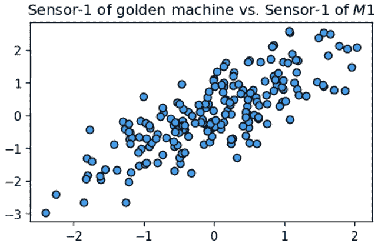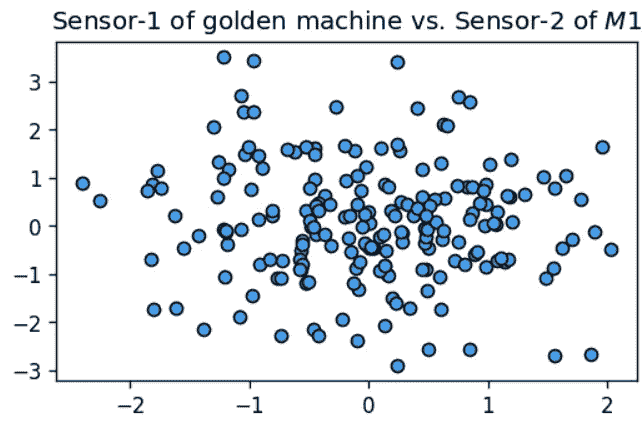

**图片来源**:作者创作

> 机器移动，操作执行，产品生成。但是，大多数情况下，它们并没有被数字化记录。如果它们没有被正确地记录下来(*及时*)，相关的数据就会丢失到宇宙中，导致熵不断增加。

## 也不是一个微不足道的认知负荷

分析仪表板在制造业中非常受欢迎，尤其是在工厂经理中。在许多情况下，它们有自己的用途，描绘生产过程健康状况的整体图景。

然而，在这种特殊情况下，如果您试图可视化每个传感器测量并找出相关程度，您将遇到迷宫般的图，并且没有任何有用的东西。

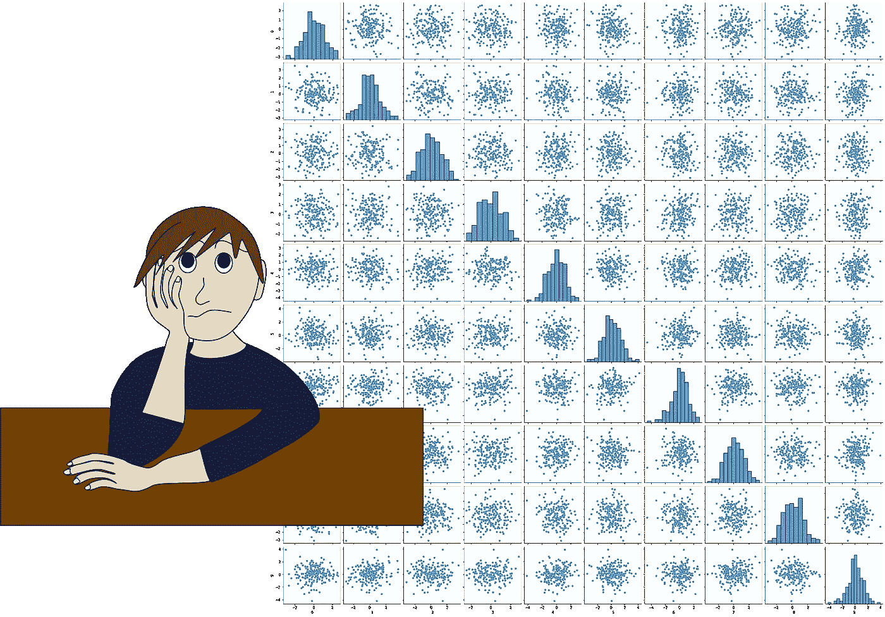

图片来源:作者用 [Pixabay 免费图片](https://pixabay.com/vectors/worried-bored-sad-boy-man-stress-2296975/)创建

**在这种情况下，暴力可视化会适得其反。**

想象一下，当 10 多台机器进入你的工厂时会发生什么？或者再增加 10 个传感器。

此时，你开始意识到更多的数据实际上没有帮助。这不是一个简单的 ML 问题，你有一个“机器漂移”的标签数据集。在这里，您必须仔细构建统计测试和度量，以检测漂移并基于该度量对机器进行排序。

同样，像任何其他数据驱动的问题解决案例一样，您有多种选择。

*   您可以从每个传感器数据栏中提取**描述性统计数据**并将**与其他机器中的**进行成对比较
*   您可以从黄金机器中为每台机器计算某种类型的**全局“距离分数”**(这里有一个距离度量列表，您可以使用 Scipy 包进行评估)
*   您可以计算个体数据分布之间复杂的**距离度量**(例如 [Mahalanobis 距离](https://en.wikipedia.org/wiki/Mahalanobis_distance))并基于它们进行排名

为了证明本文的命名是一个实践教程，让我向您展示一个非常简单的方法来提取成对相关分数(即，将黄金机器的传感器“A”数据与传感器“A”数据 *M* 1、 *M* 2、 *M* 3 等匹配，然后将黄金机器的传感器“B”数据与传感器“B”数据 *M* 1、 *M* 2、

# *简单的演示*

*样板代码可以在我的 Github repo 这里找到 [**。**](https://github.com/tirthajyoti/Stats-Maths-with-Python/blob/master/Manufacturing-drift-Pandas.ipynb)*

*有一个黄金数据帧`machine_golden`和代表 10 台机器的 10 个以上数据帧的字典，称为`machines`。每个数据帧有 200 行(样本)和 10 列(传感器测量)。*

*我们用代表从各种机器收集的数据集的合成数据来构建这些数据帧。基本上，我们将可变高斯噪声添加到黄金数据集，并为各种机器生成数据集。由于噪声的可变性质(高斯均值和方差因机器而异)，一些机器会比其他机器偏离黄金数据更多。*

*下面是实现这一点的示例代码，*

```
*machines = {'machine'+str(i):[] for i in range(1,11)}for i in range(1,11):
    loc = np.random.uniform(0,2)
    scale = np.random.uniform(0,2)
    df1 = machine_golden + pd.DataFrame(np.random.normal(loc=loc,scale=scale,size=(200,10)))
    machines['machine'+str(i)] = df1*
```

*现在，开始相关性分析。*

*我们可以通过对每一列数据进行切片并使用 Numpy 的关联例程来计算关联分数，从而编写手动代码。然而，对熊猫来说，有一种更好、更干净的方法。这是一种叫做`[**DataFrame.corrwith**](https://pandas.pydata.org/docs/reference/api/pandas.DataFrame.corrwith.html)`的方法，它只用一行代码就可以计算两个数据帧的列之间的[皮尔逊相关](https://en.wikipedia.org/wiki/Pearson_correlation_coefficient)分数*。**

*这是我的高效数据分析技巧。**寻找简洁明了的替代代码**。通常，它们非常适合您的问题，并且它们产生了干净且易于调试的代码库。这就引出了 [**生产性数据科学**](https://medium.com/productive-data-science/why-and-how-should-you-learn-productive-data-science-53377b473f37) 。*

*<https://medium.com/productive-data-science/why-and-how-should-you-learn-productive-data-science-53377b473f37>  

一行代码也打印出了相互关系，

```
for machine in machines:
    print(f"Correlation of {machine} with the golden tester:", round(**machine_golden.corrwith(machines[machine],axis=1).sum()**,2))
```

这里我们做的是列相关(`axis=1`)，然后对该行的分数求和(`.sum()`)(我们也可以取平均值，但是因为样本数是相同的，所以这无关紧要)。

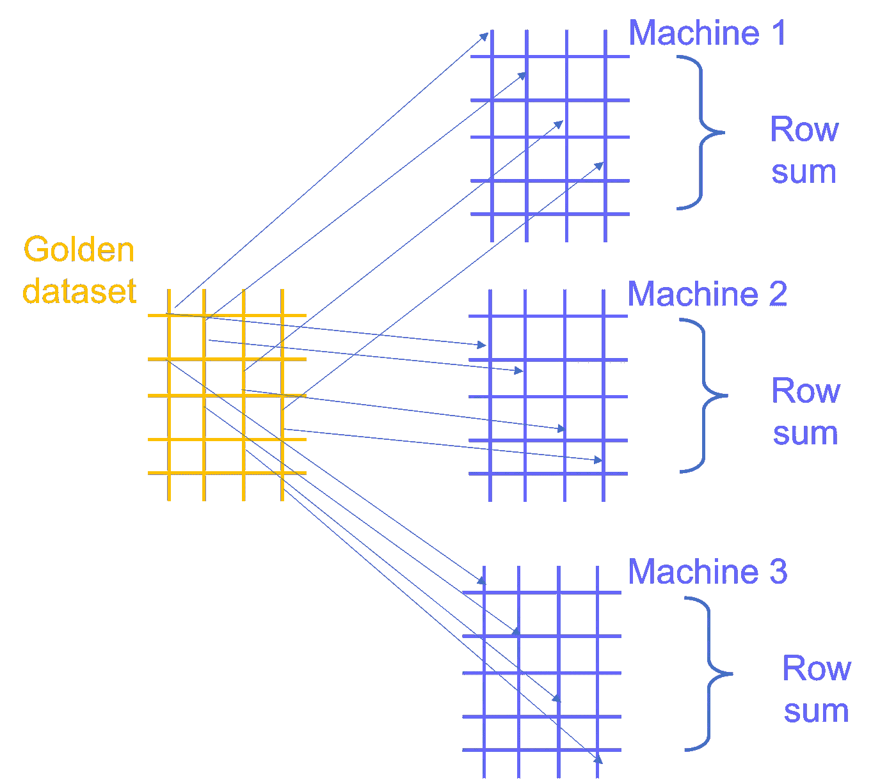

图片来源:作者创作

结果是这样的，

```
Correlation of machine1 with the golden tester: 130.67
Correlation of machine2 with the golden tester: 91.78
Correlation of machine3 with the golden tester: 116.57
Correlation of machine4 with the golden tester: 178.85
Correlation of machine5 with the golden tester: 147.76
Correlation of machine6 with the golden tester: 150.91
Correlation of machine7 with the golden tester: 199.94
Correlation of machine8 with the golden tester: 192.48
Correlation of machine9 with the golden tester: 199.73
Correlation of machine10 with the golden tester: 97.73
```

显然，机器 2 与黄金机器的相关性最小，而机器 7、8 和 9 的相关性最大。

视觉证明？如果我们在黄金机器和机器 2/机器 7 之间绘制一些传感器数据。

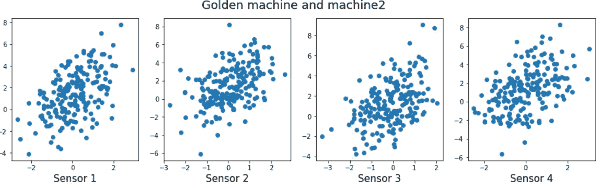

图片来源:作者创作

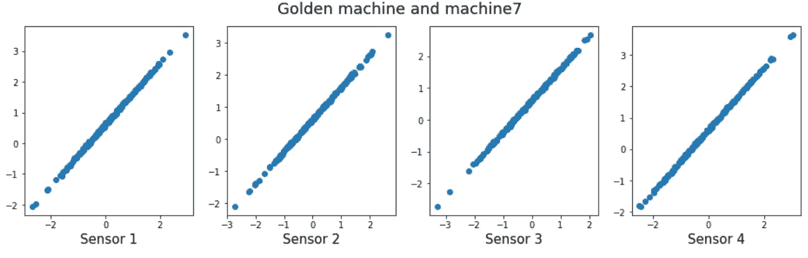

图片来源:作者创作

但是我们已经从之前的相关性分析中知道了这一点，并且可以挑选出像`machine2`和`machine10`这样相关性分数低于 100(只是一个任意的阈值)的机器进行干预。

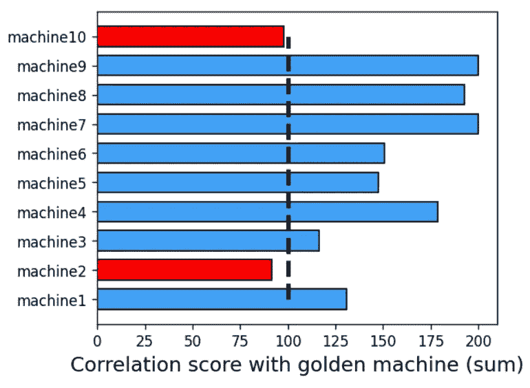

图片来源:作者创作

最好的部分是，漂移机器**的提取随着采样频率、传感器数量或机器数量**平滑缩放。观看每一个情节并决定干预什么，没有任何认知负荷。

下周，漂移模式可能会改变，另一台机器可能会开始比其他机器漂移更多。尽管如此，我们还是会用同样的分析方法抓住它。此外，我们可以调整这种方法来使用均值相关，这样它就可以**处理不同机器的样本数量不同的情况**(这是生产中相当常见的场景)。

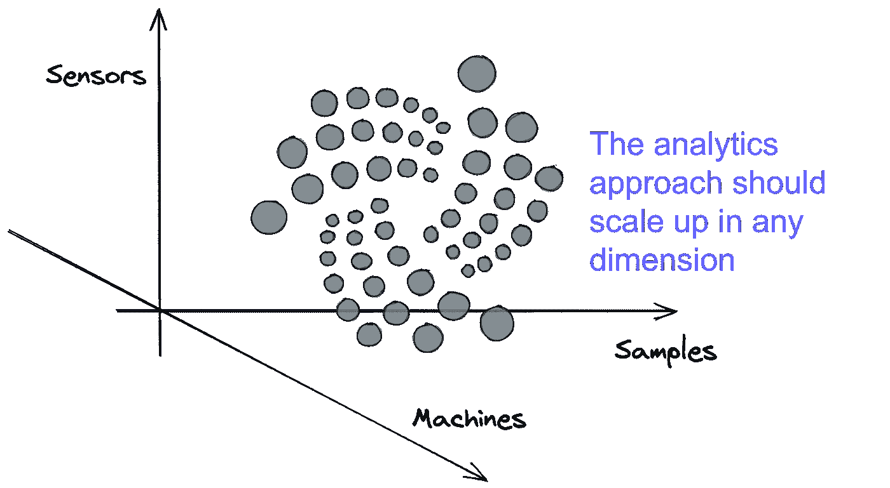

图片来源:作者创作

# 摘要

在本文中，我们展示了如何使用非常简单的 Python 分析工具来处理机器/测试人员漂移和基准测试的典型制造数据分析问题。

这个想法只是为了展示各种可能性，以便在制造业或工业 4.0 计划中工作的工程师能够超越盒子进行思考，并在其分析工作中采用数据科学工具和技术。* 

**喜欢这篇文章吗？成为* [***中等会员***](https://medium.com/@tirthajyoti/membership) *继续* ***无限制学习*** *。如果您使用下面的链接，* ***，我将收取您的一部分会员费，而不会对您产生额外费用*** *。**

*<https://medium.com/@tirthajyoti/membership> *