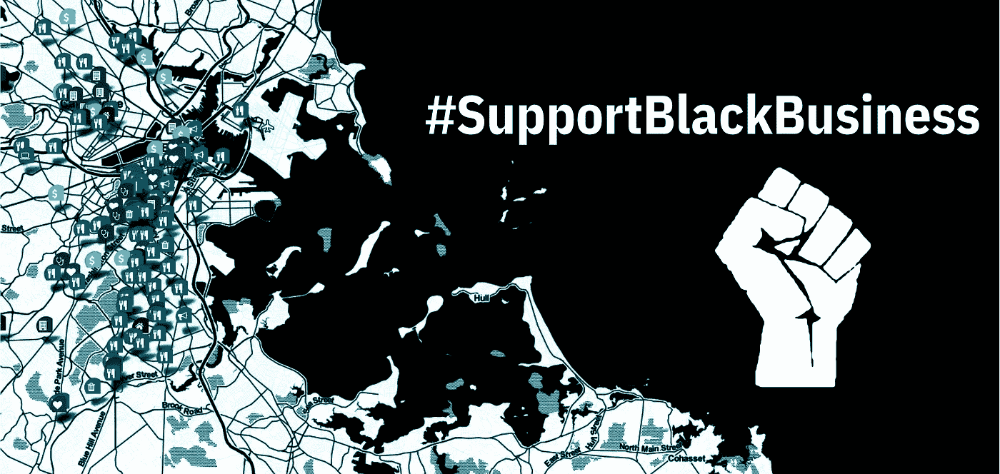
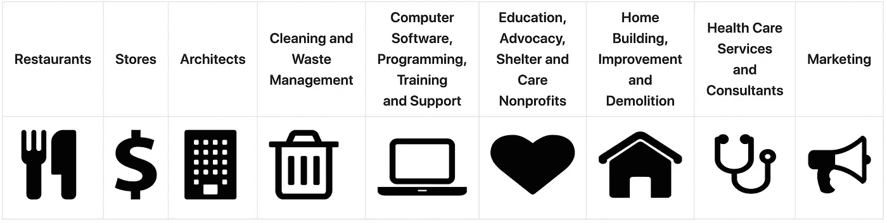
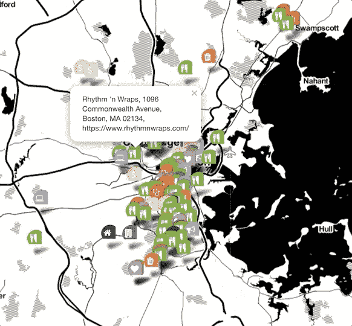

# 用 GeoPy 和 leav 绘制黑人拥有的企业

> 原文：<https://towardsdatascience.com/mapping-black-owned-businesses-with-geopy-and-folium-4416adc4c7cb?source=collection_archive---------51----------------------->

## 探索大波士顿地区黑人企业的公共交互式地图

图片作者。第一个图标来自于[维基共享资源](https://en.wikipedia.org/wiki/File:Fist.svg#filelinks)，一个免费使用的图片库。

## 介绍

新冠肺炎疫情对全美的小企业造成了严重的损失，黑人拥有的企业继续受到最严重的打击。在过去的一年里，许多人目睹了持续的经济和种族正义危机的升级与公共卫生危机的加剧。支持当地和黑人拥有的企业的呼吁很难开始完成结束这些同时发生的危机所需要的一切；然而，这样的呼吁可能是朝着缩小种族财富差距和修复地方经济的正确方向迈出的一小步。

本文中讨论的地图旨在为有兴趣探索大波士顿地区黑人企业的人以及希望为其他地区创建类似地图的人提供资源。该地图使用了来自波士顿地区黑人拥有的商店、餐馆和服务的众包电子表格的数据。应该注意的是，并不是电子表格中的每个条目都被确认为黑人所有的企业，所以地图可能包括已确认和未确认的条目。

## 清理数据

上述电子表格文档中的数据被读入三个独立的熊猫数据框:“餐馆”、“商店”和“服务”。数据框的列在必要时被重命名，以便每个数据框包含“名称”、“地址”和“网站”列。最终的服务数据框架还包含一个“类别”列，允许在映射阶段按服务类别进行简单的子集划分。

删除了重复的名称，这样就可以为每个企业在地图上添加一个标记。许多多服务业务在服务数据帧中有重复出现。仅保留每个企业的第一次出现，这意味着地图的一个局限性是其标记可能无法捕捉某些企业提供的各种服务。

对于餐馆和服务数据框，地址数据最初分布在多个列中。使用`**Series.str.cat()**` 方法将每个地址的组成部分连接成一列，如下例所示:

## 获取地理坐标

一旦为每个数据帧准备好完整的地址列，就可以使用 [GeoPy](https://pypi.org/project/geopy/) 获得地理坐标。GeoPy 客户端允许开发人员检索给定地址的坐标，反之亦然。下面的函数通过遍历整个列并将纬度和经度附加到“lat”和“lon”列表来获得整个地址列的坐标。客户端为无法获得坐标数据的某些地址返回了非类型对象。考虑到这些情况，函数中的 if/else 语句使得只获得一个`**geopy.location.location**`对象的坐标数据；对于非类型对象，“NA”将附加到列表中。

## 向地图添加标记

上面的函数在`**add_markers()**`中被用作辅助函数，它在 leav 中向地图添加标记。`**folium.map()**` 中的位置参数取一组地理坐标，标记地图默认的中心位置。 [tiles](https://deparkes.co.uk/2016/06/10/folium-map-tiles/) 参数影响地图背景的样式，zoom_start 参数指的是地图的初始缩放级别，其中较高的数字会创建更接近的缩放。

`**add_markers()**` 函数将带有“地址”列、标记颜色和标记图标的数据框作为参数。它检索带有`**get_lat_lon()**`的地址的坐标数据，并过滤掉缺少坐标数据的行。要添加到地图中的点及其相应的业务信息存储在一个 zip 对象列表中。每个对象(在 for 循环中别名为“p ”)都包含以下数据:

*   p[0]和 p[1]:分别是纬度和经度
*   p[2]:企业名称
*   p[3]:营业地址
*   p[4]:商务网站

如果电子表格中没有记录网站，则每个企业的 zip 对象中的最后一个元素网站可能包含空数据。在这些情况下，函数中的 if/else 语句仅将企业名称和地址添加到标记的弹出文本中；如果网站可用，它也会包含在弹出文本中。

在此函数中，`**icon**`参数对所有标记采用相同的尺寸。标记的颜色和图标将根据传递给`**add_markers()**`函数的内容而变化。地图中使用的图标是通过字体 Awesome 访问的，字体 Awesome 的`**prefix**`关键字参数是`**icon**`参数中的‘fa’。下表显示了已经添加到地图中的不同类型的标记及其对应的业务类别:

按作者分类的表格。图标 via [字体牛逼免费](https://github.com/FortAwesome/Font-Awesome)(免费开源)。

`**add_markers()**`函数用于餐馆和商店数据框，以及按类别分解的服务数据框的子集。在下面的例子中，对应于建筑服务的行进入了“建筑师”数据框。然后在数据框上调用该函数，标记被赋予一个学员蓝色的“建筑物”图标:

## 探索地图

以下是地图当前外观和导航方式的预览:

作者 GIF。

互动地图托管在[这里](https://avonleafisher.github.io/Mapping-Boston-Black-Owned-Businesses/)。通过放大您选择的邻域并单击商业标记查看其弹出信息，您可以随意探索它。

## 结论

这篇文章回顾了我创建波士顿地区黑人企业交互式地图的过程。要查看该项目的完整代码，请访问其 [GitHub 库](https://github.com/AvonleaFisher/Mapping-Boston-Black-Owned-Businesses)。

你也应该关注[支持黑人企业](https://www.backingblackbusiness.com/)，它的贡献者计划在互动地图上展示美国各地的黑人企业。在当前的网站上有一个选项，黑人企业主可以提交他们的企业信息，以便在地图推出后将其包含在地图中。

支持黑人拥有的企业不仅仅是创建易于发现的清单和地图。像这样的资源只有当它们真正被用来寻找黑人拥有的企业来用你的美元支持时才有真正的价值——无论是在这个特别困难的经济时期还是以后。