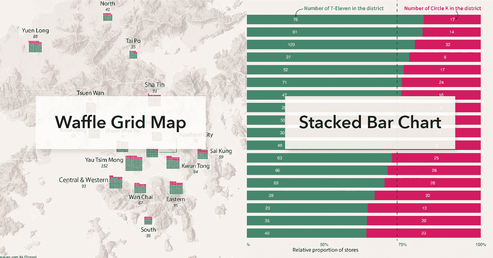
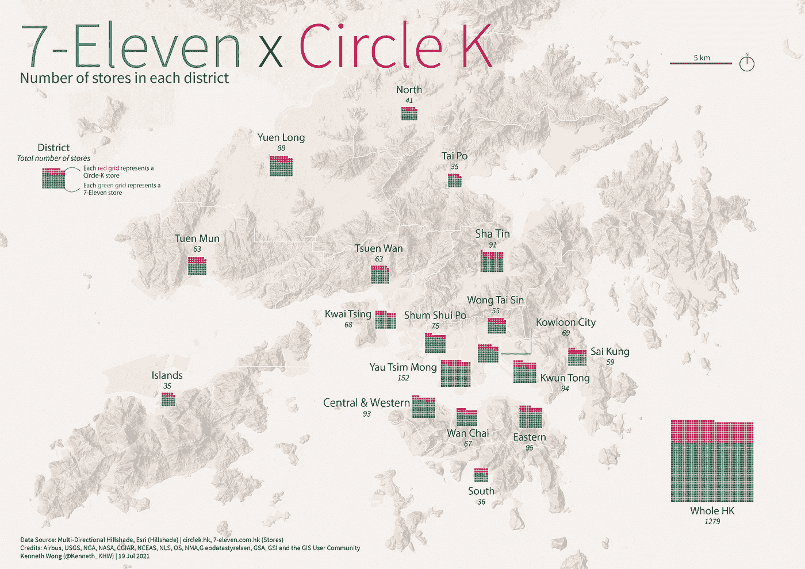
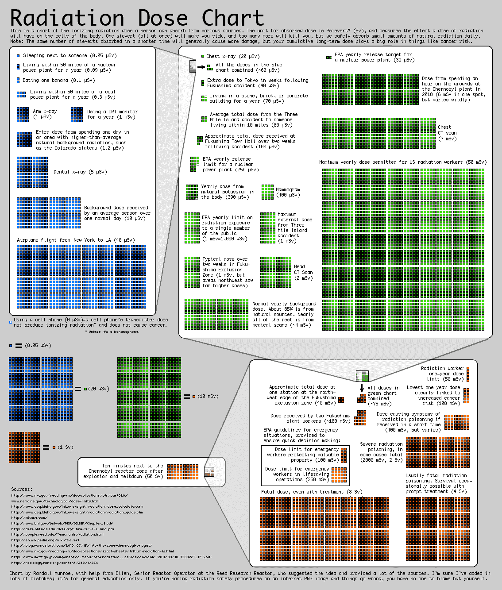
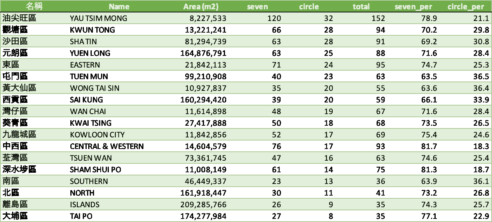
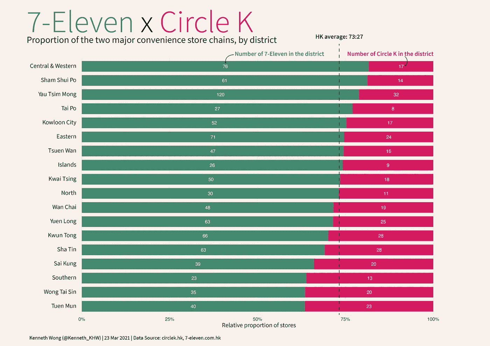
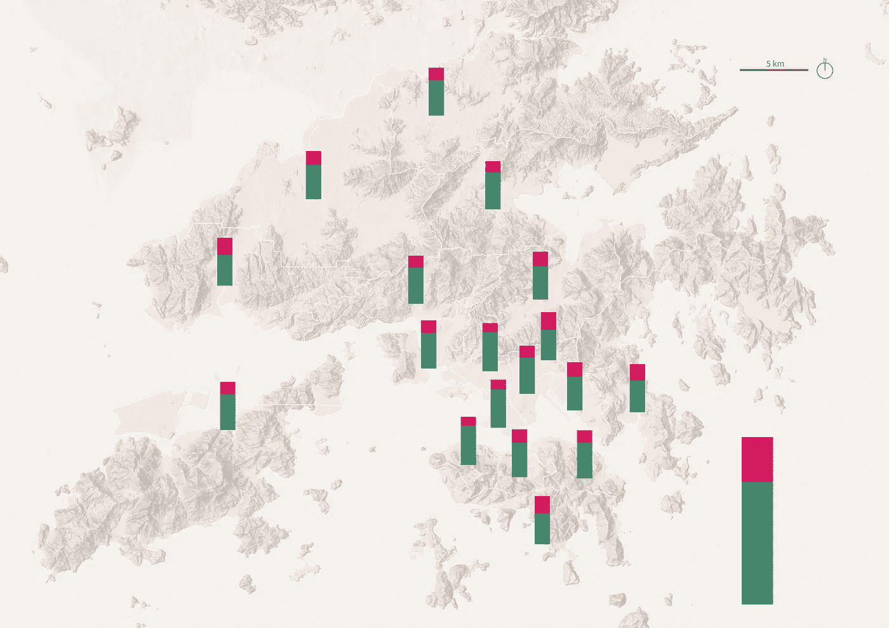
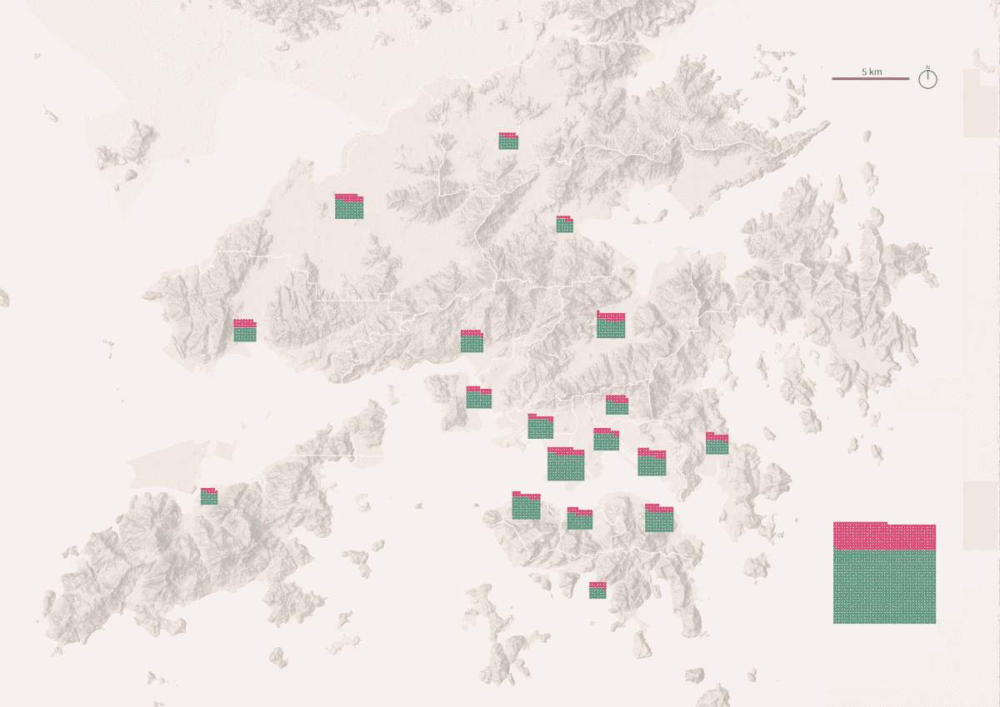
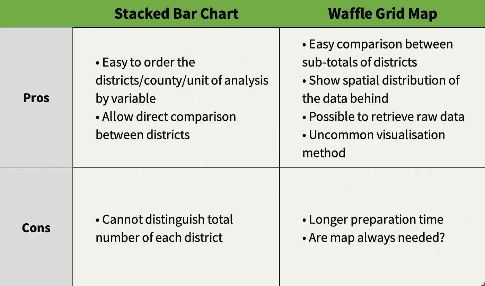

# 用华夫饼网格绘制便利店地图

> 原文：<https://towardsdatascience.com/mapping-convenience-stores-with-waffle-grids-d0196901418a?source=collection_archive---------39----------------------->

## 什么是华夫格网格图，并与堆积条形图进行比较

(图片由作者提供)

# TL；速度三角形定位法(dead reckoning)

什么是华夫饼图表？什么是地图上的华夫饼图表？什么时候应该使用这种类型的地图？本文使用香港便利店的数据集，对华夫格图和华夫格网格图进行了简单的介绍。*第一部分*解释了什么是华夫格图，而*第二部分*从数据可视化和制图的角度比较了使用华夫格网格图和堆叠条形图的利弊。

# 第一部分—华夫格网地图

这是一张华夫饼干网格图，显示了两个主要便利店(cv)的数量和比例，分别是 *7-Eleven* 和 *Circle K* 。这是一张地图上的华夫饼图表。

**注**:我的[上一篇文章](https://khwongk12.medium.com/7-eleven-vs-circle-k-5964b8f008e4?sk=b4ca93f101233d67ebb6280712e54161)简单介绍了这两大 CVS 链条。或者查一下维基百科关于香港 [7-Eleven](https://en.wikipedia.org/wiki/7-Eleven#Hong_Kong) 和 [Circle K](https://en.wikipedia.org/wiki/Circle_K) 的运营描述。

便利店华夫饼(图片由作者提供)

但是，首先，什么是华夫饼图表？

# 但是什么是华夫饼图表呢？

简而言之，华夫饼图是饼图的**平方版本。它把各种范畴的成分显示为一个整体的一部分。每个华夫饼干切片包括许多正方形。所有的方块一起形成一个网格，显示总量。**

华夫饼干图表可以很容易地解释为每一个正方形网格的一些东西。网格显示了构成一个整体的各种组的数量。

> 华夫格图显示朝着目标或完成百分比的进展。有一个由小单元格组成的网格，其中的彩色单元格代表数据。
> 
> 一个图表可以由一个类别或几个类别组成。多个华夫饼图表可以放在一起显示不同图表之间的比较。

*出自*[【datavizproject.com】T21](https://datavizproject.com/data-type/percentage-grid/)

> 方形饼图(也称为华夫格图)可用于传达分类数量的整体部分。为了模拟饼图的百分比视图，应该使用 10x10 的网格，每个正方形代表总数的 1%。华夫格图的现代用法不一定遵循这一规则，可以用任何矩形的网格来创建。

*摘自*[*R 华夫饼包的自述*](https://github.com/hrbrmstr/waffle)

华夫饼干图的用法示例见此处**[**此处**](https://www.one.org/making-the-connection/) 。另外，著名的 [**xkcd 辐射剂量图**](https://xkcd.com/radiation/) 也是华夫图！**

****

**辐射剂量图(来源: [xkcd](https://xkcd.com/radiation/)**

**华夫格图给读者留下深刻印象的一个原因是因为它的**重复**的性质——一个接一个地重复绘制相同颜色的网格。这样，对读者的视觉冲击是巨大的，人们会恢复每个网格的意思(或者说，他们会被洗脑)。网格的迭代使人们记住了数据编码，反过来也更容易阅读。**

# **但是什么是华夫饼网格地图呢？**

**很明显，华夫饼网格地图(或华夫饼地图，我在这里互换使用这两个术语)实际上是将华夫饼放在地图上。**

**当用于对每个观察值进行分组的**变量与空间相关时**(例如，按县、按区、按任何边界等)。)，你可以把每片华夫饼干放在地图上各自的位置，代表华夫饼干所指的区域。恭喜你，你立即将基本的华夫饼图表升级为华夫饼网格图！**

**Kenneth Field 的精彩文章展示了华夫饼干网格地图的使用。他创建的地图将每个国家的 COVID 数据的华夫格图放置在该国边界内的某处(或附近)。**

# **第二部分——地图上的图表:是否应该使用？**

# **华夫饼图与堆积条形图**

**你可能见过上面有图表的地图。华夫格地图应用了同样的原理——在每个空间变量上放一张图表。在大多数情况下，空间变量意味着国家或地区。在地图上放置图表从来都不是一种新的制图技术。历史地图集非常重视这种类型的数据可视化技术。**

**因此，华夫饼地图属于专题地图谱系树中的地图上的*图表*类别。这是否意味着我们可以用其他类型的图表替换每个地区的华夫饼图表？答案是——为什么不呢？**

**最后，这个华夫饼干网格图使用相同的数据集来创建堆积条形图。从本质上来说，堆叠的条形和华夫饼干网格源自每个地区的 7-Eleven 和 Circle-K 商店的数量。**

****

**图表背后的数据集(图片由作者提供)**

**作为一个快速的草图，我可以用我在上一篇文章中制作的[条形图中相应的条形替换华夫饼网格。还有哒哒，我们成功回收了旧的材料，做了新的专题地图。](https://khwongk12.medium.com/7-eleven-vs-circle-k-5964b8f008e4?sk=b4ca93f101233d67ebb6280712e54161)**

****

**上一篇文章中的堆积条形图(图片由作者提供)**

****

**将华夫饼网格替换为堆叠条形图(图片由作者提供)**

****

**相同的数据，不同的图表(图片由作者提供)**

# **我应该使用哪种方法？**

**多种观想方法带来的是一个棘手的问题:**

> ***那么，我应该选择哪种观想方法呢？***

**和每一种数据可视化一样，没有选择哪种方法是最好的通用规则。不过，列出利弊有助于决策。下表比较了堆积条形图和华夫饼网格图的优势和劣势。**

****

**比较两种数据可视化方法的汇总表(图片由作者提供)**

# **堆积条形图**

## **👍🏻优点:易于按变量排列分析的地区/县/单位**

**对于堆积条形图的数组，您可以根据可视化数据的目标对条形进行排序。在大多数情况下，条形按一个变量的值排序。在我创建的堆积条形图中，我按照 7-11 家商店占该地区所有 cv 的比例对它们进行了排序，以强调“**，在那里你可以找到一家连锁便利店比另一家**”的说法。这样，就可以直接看到哪个区的 7-11 比例最大/最小。**

## **👍🏻优点:允许地区之间的直接比较**

**制作堆积条形图意味着每个条形图的总和为 100%。使用百分比意味着每个地区(即分析单位)都有相同的“基数”,并允许不同群体之间进行直接比较。无论每个地区的商店总数是多少，都可以直接比较 7-11 家商店在该地区所有便利店中所占的百分比。**

**比如说，如果我们比较一下深水区(很多 cv)和离岛(很少 cv)的店铺分布。绝对数字无助于说明趋势(深水埗(152 家店)的简历比离岛(35 家店)多 4 倍左右)！).然而，使用百分比，我们可以忽略商店的绝对数量，允许直接比较。**

## **👎🏻缺点:不能区分每个地区的总数**

**百分比意味着原始总数被删除。有时，每一组的原始总数也说明了一个重要的信息。在这种情况下，便利店的总数可以显示出每个地区商店密度的差异。**

**如果总数对读者来说是一个重要的点，有必要添加一些脚注。一种方法是创建一个额外的列，指示每个地区的商店总数。**

# **华夫格地图**

## **👍🏻优点:地区小计之间的简单比较**

**华夫饼大小的差异会给读者带来强烈的视觉冲击。一个大的华夫饼干网格让读者立即知道该区有大量的商店。这种视觉元素比在汇总表中抛出一个总数要强大得多。**

## **👍🏻优点:显示数据背后的空间分布**

**当然，cv 的空间分布不是随机分布的——商店通常位于人口密集的区域。使用地图可以显示市中心、新城镇和乡村之间商店密度的差异。**

## **👍🏻优点:可以检索原始数据**

**原始数据并没有完全在华夫格图中显示出来——人们可以通过计算网格来计算 7-11 和 Circle-K 的数量(如果他们感到无聊的话)。**

## **👍🏻优点:不寻常的观想方法**

**说实话，有时我们会对条形图感到厌倦。尽管显示图表比抛出包含大量数字的表格要好，但是条形图是不够的。**

**Waffles 有助于在数据可视化中创造一个**“惊喜因素”**。这有助于读者从之前阅读过的成千上万的条形图中恢复过来。地图让读者赏心悦目。这些地图给故事增添了一点新鲜感。即使空间元素不是讲述故事的必要元素，但在后面添加县和地点会增加几分乐趣。**

## **👎🏻缺点:准备时间较长**

**制作一张能有效传达信息的地图需要时间。如果设计不当，背后的信息会被多余的 [**图表垃圾**](https://en.wikipedia.org/wiki/Chartjunk) 所阻碍。地图应该添加什么级别的空间细节才能有效地融合数据的非空间和空间部分，然后讲述故事？**

**将华夫图放在合适的位置是一项不简单的任务。不要忘记添加这些注释所需的时间。还是那句话，准备一张有效的地图需要时间。**

## **👎🏻缺点:地图总是需要的吗？**

> **[*竟然还要做地图？*](https://www.esri.com/arcgis-blog/products/arcgis-pro/mapping/mapping-with-purpose/)**

**数据中的地理元素重要吗？背后的地图有助于更清楚地传达信息吗？地图可能是一把双刃剑——如果趋势与空间相关，它可能会告诉你更多数据背后的故事**。如果趋势不是空间相关的，它也可能掩盖事实，阻碍你发现趋势(通过做出错误的感知)。****

**三思而后行，在映射之前多考虑两次。**

# **裂缝**

**这篇文章比较了华夫饼图和堆积条形图。从数据可视化和制图学的角度来看，你可以注意到每种数据可视化方法在哪些方面做得更好，在哪些方面做得不好。一般来说，选择数据可视化方法不是一个非黑即白的决定。没有万灵药，也没有一张图表可以显示数据背后的所有故事。同时，很难量化哪种方法绝对优于另一种方法。**

**不要忘记，我们是带着目的来制作图表和地图**。Waffle grid maps 是一个很好的工具，可以创建很好的地图，但是应该有合理的理由使用它。****

# **进一步阅读**

**https://datavizproject.com/data-type/percentage-grid/
项目数据**

****测绘冠状病毒华夫饼**
[https://www . ESRI . com/ArcGIS-blog/products/ArcGIS-pro/Mapping/Mapping-冠状病毒-华夫饼/](https://www.esri.com/arcgis-blog/products/arcgis-pro/mapping/mapping-coronavirus-waffles/)**

**如果我们使用图形方法的[语法将地图视为**几何图层**(经度和纬度分别为 x 和 y **美学**)之一，我们可以有四种图表类型(堆叠条形图、华夫饼图表、地图上的堆叠条形图、地图上的华夫饼网格)。但这可能会让整个故事变得过于复杂。这里，我只比较两种类型的“图表”,以使事情更简单。](https://ggplot2-book.org/introduction.html#what-is-the-grammar-of-graphics)**

**我将写一篇*幕后故事*来记下我在创建这张地图时的想法和实验。敬请期待！**