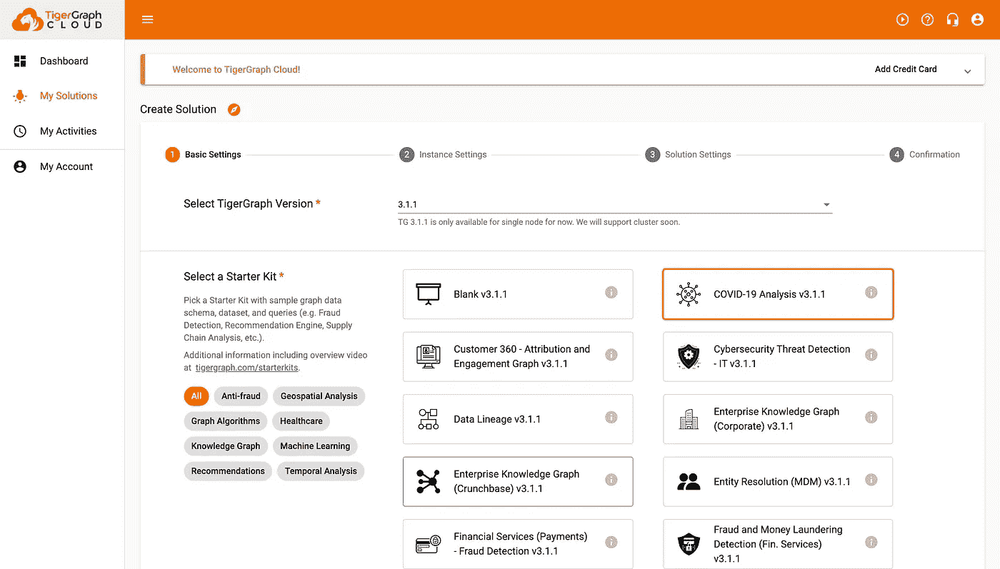

# 用 Plotly 和 TigerGraph 绘制新冠肺炎案例

> 原文：<https://towardsdatascience.com/mapping-covid-19-cases-with-plotly-and-tigergraph-f529f32c1a40?source=collection_archive---------30----------------------->

## 使用 Plotly Express、Plotly Dash 和 TigerGraph 创建交互式地图以可视化韩国新冠肺炎案例

# 概观

## 导言和目标

TigerGraph 的最新入门工具包之一是新冠肺炎分析工具包，它提供了韩国新冠肺炎数据的 33，000 多个顶点和 49，000 条边。我们不仅可以使用这个初学者工具包运行高级分析，还可以创建很酷的可视化效果。本博客将带您了解如何使用 Plotly Express 的地图功能和 TigerGraph 的新冠肺炎初学者工具包来创建展示南韩新冠肺炎病例的交互式地图。这将被放入仪表板使用 Plotly 破折号。

## 使用的工具

[tiger graph Cloud](https://tgcloud.io/):tiger graph Cloud 是我们创建解决方案和托管图形数据库的地方。这也将包含我们将使用的所有数据。

[Plotly Express](https://plotly.com/python/plotly-express/):Plotly Express 是 Plotly 下的一个高级库，可以轻松创建漂亮的可视化效果。有了它，我们将创建我们的地图视觉效果。

[Plotly Dash](https://plotly.com/dash/) : Plotly Dash 是 Plotly 的仪表板库，我们将使用它来展示我们创建的地图，并允许用户切换地图的不同设置。

# 第一部分:设置您的 TigerGraph 初学者工具包

首先，你需要设置你的 TigerGraph 初学者工具包。为此，请转到[https://tgcloud.io/](https://tgcloud.io/)，登录或创建一个帐户(如果您还没有)。


登录或注册

登录后，导航至“我的解决方案”,然后按蓝色的“创建解决方案”按钮。


点击“我的解决方案”,然后点击蓝色的“创建解决方案”按钮。

> 注意:要创建免费解决方案，TigerGraph 不需要您的信用卡。

在第一个屏幕上，点击“新冠肺炎分析”这将创建一个带有新冠肺炎图、模式、加载作业和查询的解决方案。按下一步。



点击“新冠肺炎分析”，然后按“下一步”

不要更改第二页上的任何内容。所有这些将会创建一个免费的解决方案。按下一步。


不要做任何更改，按“下一步”

在第三页上，根据您的解决方案和目的修改详细信息。一旦你更新了这些部分(记住你的子域和密码！)，按“下一步。”

> 注意:请记住您的子域和密码。子域必须是唯一的(两个人不能同时拥有同一个子域)。


根据您的目的修改信息，然后按“下一步”

最后，验证所有细节是否正确，然后点击“提交”解决方案需要几分钟的时间来调配。


确认一切正常，然后点击“提交”

完美！等到您的解决方案的状态为“就绪”，然后我们将准备我们的数据。


等待状态显示“就绪”，然后开始！

# 第二部分:在 GraphStudio 上准备您的 TigerGraph 解决方案

## 第一步:打开 Graph Studio

在“Actions”下，按下四个框(带有“Applications”的悬停标签)，并从下拉列表中选择“GraphStudio”


按下“应用程序”(四个框)并选择“GraphStudio”

你将被重定向到 TigerGraph 的 GraphStudio，这是一个用 TigerGraph 可视化创建图形数据库的平台。


TigerGraph 的 GraphStudio

点击“全局视图”，然后选择“我的图表”以查看新冠肺炎图表。


点击“全局视图”，然后选择“我的图表”

按“设计模式”查看图表的模式(将其视为数据映射)。如果将鼠标悬停在顶点或边上，可以查看其属性。


新冠肺炎图的模式

让我们现在准备我们的图表！

## 第二步:加载数据

接下来单击“加载数据”选项卡。你会注意到“总顶点”和“总边”都是零。让我们通过向上插入我们的数据(由文件图标表示)来改变这一点。


转到“加载数据”选项卡。

单击所有文件图标(shift 单击)，然后按下播放按钮(开始/恢复加载)。


选择所有文件，然后按播放。

接下来会提示您确认。在这里按“继续”。


确认上传数据。

状态将变为“正在运行”


CSV 加载运行

几秒钟后，您会看到状态为“已完成”


数据加载完成

按顶部的标签(你可能需要刷新)，然后你会注意到你的顶点和边向上插入。


所有的顶点和边都向上插入。

干得好！下一步将是安装查询。

## 步骤三:安装查询

我们现在将安装所有的查询。为此，导航到最后一个选项卡“编写查询”


导航到“编写查询”选项卡。

在“GSQL 查询”的左侧，按下带有向上箭头的矩形(带有“安装所有查询”的悬停数据)。


安装所有查询

你将再次被要求确认。按安装，然后等待安装完成。


确认安装查询

> 注意:安装可能需要几分钟时间。

一旦你完成了，恭喜你！您的图表现在已经完全设置好了！现在让我们转到 Google Colab 笔记本上来获取数据并将其可视化。

# 第三部分:准备你的图表

## 第一步:安装并导入 pyTigerGraph，并连接到您的 TigerGraph 解决方案

首先使用 pip 安装 pyTigerGraph。在 Colab 中，这个前面会有一个感叹号。

```
!pip install pyTigerGraph
```

安装后，您可以导入它。

```
import pyTigerGraph as tg
```

最后，连接到您刚刚创建的解决方案。为此，传递您在第一部分中创建解决方案时设置的子域名和密码。然后，我们将通过运行 getToken 并传递 createSecret 函数的值来生成 API 令牌。使用这个令牌，我们将能够运行查询。

```
conn = tg.TigerGraphConnection(host="https://SUBDOMAIN.i.tgcloud.io/", password="PASSWORD", graphname="MyGraph")conn.apiToken = conn.getToken(conn.createSecret())
```

> 注意:确保子域是您的子域，密码是您在第一部分的第三页上设置的密码。

## 第二步:编写查询

接下来，我们需要编写额外的查询来从图表中提取我们想要的值。我们将编写的第一个查询将提取带有详细信息的感染位置。我们将获取每个地点的纬度和经度以及感染病例

```
print(conn.gsql('''USE GRAPH MyGraph
DROP QUERY grabInfectionLocationDetailsCREATE QUERY grabInfectionLocationDetails() FOR GRAPH MyGraph SYNTAX v2 {TYPEDEF TUPLE <FLOAT lat, FLOAT lon, STRING infcase, STRING province, UINT num_confirmed_cases, UINT population, FLOAT area> INFO;
HeapAccum<INFO> (10000, num_confirmed_cases DESC, population DESC) @@information;Seed = {City.*};Res = SELECT tgt FROM Seed:c - (CASE_IN_CITY:e)- InfectionCase:i -(CASE_IN_PROVINCE:e2)-Province:tgt
      ACCUM @@information+=INFO(e.latitude, e.longitude, i.infection_case, tgt.province, i.confirmed, tgt.population, tgt.area);PRINT @@information;}INSTALL QUERY grabInfectionLocationDetails'''))
```

太好了！让我们把它分解一下。我们首先创建一个 TYPEDEF 元组，其中包含我们想要累积的所有内容(纬度、经度、感染病例、省份、确诊病例数、人口和面积)。然后，我们创建一个 HeapAccum，限制为 10000 个值，按照确诊病例数降序排列这些值，然后第二次检查是总体。要了解更多关于 HeapAccums 的信息，请查看这个博客。接下来，我们获取种子中所有的城市顶点。最后，我们将我们的值累积到 HeapAccum，从城市顶点开始，经过 CASE_IN_CITY 边，到 InfectionCase 结束，然后经过 CASE_IN_PROVINCE 边，最后到省顶点结束。最后，打印 HeapAccum。

现在我们有了我们需要的查询，让我们进入 Plotly Express 部分。

# 第四部分:用 Plotly Express 可视化你的图形

## 第一步:导入库

我们的数据已经准备好，我们有查询来获取我们想要的数据。现在是时候观想它了！让我们先安装并导入所有的 Plotly Express 和 Plotly Dash 库。

```
!pip install -q jupyter-dashimport pandas as pdimport plotly.express as pxfrom jupyter_dash import JupyterDash
import dash_core_components as dcc
import dash_html_components as html
from dash.dependencies import Input, Output
```

首先，我们引入熊猫来轻松创建数据框架。然后，我们导入 Plotly Express，这是一个高级库，可以轻松地创建可视化。最后，我们将导入 dash 库，包括在笔记本中创建和运行仪表板的 JupyterDash、在仪表板中创建图表的 Dash 核心组件、向仪表板添加 HTML 元素的 Dash HTML 组件，以及使仪表板具有交互性的最终输入和输出。

## 第二步:用确诊病例创建街道地图

现在，让我们用 Plotly Express 创建我们的第一张地图！让我们首先运行我们的查询，并将其转换为 DataFrame，这是一种易于 Plotly Express 读取的格式。

```
res = conn.runInstalledQuery("grabInfectionLocationDetails")[0]["@@information"]df = pd.DataFrame(res)
```

接下来，我们将使用 Plotly Express 的 scatter_mapbox 函数。我们将传递点的纬度和经度。大小是病例的数量，颜色是人群。最后，悬停名称将是感染案例，悬停数据将是区域。

```
fig = px.scatter_mapbox(df, lat="lat", lon="lon", size="num_confirmed_cases", hover_name="infcase", color="population", hover_data=["area"])
```

然后我们需要更新地图布局。我们将使用开放的街道地图，并确保地图在所有方向都没有空白。

```
fig.update_layout(mapbox_style="open-street-map")fig.update_layout(margin={"r":0,"t":0,"l":0,"b":0})
```

最后，我们可以显示我们的地图。

```
fig.show()
```


结果地图

厉害！您可以将鼠标悬停在某个值上以获取关于它的更多详细信息，并进行放大和缩小。


您可以将鼠标悬停在某个值上，以获得关于它的更多详细信息！

## 第二步:创建确诊病例的地理地图

让我们用不同的地图类型映射相同的数据:地理地图。这张地图和另一张地图的唯一区别是使用的布局。在这里，我们正在获取美国地质调查局的影像地理地图数据。

```
fig = px.scatter_mapbox(df, lat="lat", lon="lon", size="num_confirmed_cases", hover_name="infcase", color="population", hover_data=["area"])fig.update_layout(
   mapbox_style="white-bg",
   mapbox_layers=[
      {
         "below": 'traces',
         "sourcetype": "raster",
         "sourceattribution": "United States Geological Survey",
         "source": ["https://basemap.nationalmap.gov/arcgis/rest/services/USGSImageryOnly/MapServer/tile/{z}/{y}/{x}"] }
   ]
)fig.update_layout(margin={"r":0,"t":0,"l":0,"b":0})fig.show()
```


地理地图

瞧啊。您现在已经创建了一个地理地图！

## 第三步:创建条形图

接下来，我们将创建一个条形图。使用 Plotly Express，这与编写一行代码并显示每个感染病例的病例数一样简单。它将根据人口进行颜色编码。

```
bar = px.bar(df, x="infcase", y="num_confirmed_cases", color="population", barmode='overlay')bar.show()
```


条形图

## 第三步:创建 3D 散点图

太好了！让我们用 Plotly Express 创建最后一个可视化:一个 3D 散点图，显示确诊病例数、面积和人口。

```
bar = px.scatter_3d(df, "num_confirmed_cases", "population", "area")bar.show()
```


三维散点图

太棒了。现在，我们所有的可视化都已经创建好了，让我们把它们放在一个仪表板上。

# 第五部分:创建仪表板

## 步骤 1:创建仪表板的布局

让我们首先创建仪表板的布局。首先，我们将初始化应用程序。

```
app = JupyterDash(__name__)
```

接下来，我们将使用 HTML 标题和组件、下拉菜单和图表来创建仪表板的布局。

```
app.layout = html.Div([ html.H1("COVID-19 Dashboard Demo"), dcc.Dropdown(
      id = "map_type",
      options=[
         {"label": "Street Map", "value": "light"},
         {"label": "Geometric Map", "value": "dark"}
      ],
      value="light",
      clearable=False
   ), dcc.Graph(id="map_graph"), html.Br(), dcc.Dropdown(
      id = "graph_options",
      options=[
         {"label": "County vs. Number of Confirmed Cases", "value": "county_cases"},
         {"label": "Number of Confirmed Cases vs. Population vs. Area", "value": "3d_graph"}
      ],
      value="county_cases",
      clearable=False
   ), dcc.Graph(id="bar_graph"),])
```

在这里，我们从一个标题开始，大文本说新冠肺炎仪表板演示。接下来，我们有一个下拉菜单，有两个选项:街道地图和几何地图。接下来是 dcc。图表将是地图本身，一个 HTML 换行符，另一个条形图选项的下拉菜单，最后是条形图。

我们的下一步将是通过回调使仪表板具有交互性。

## 第二步:回调 I:更新地图图形

首先，让我们基于下拉菜单更新地图。我们将获取下拉列表的值(“亮”或“暗”)作为输入，然后创建并返回各自的地图(街道或地质)。唯一的区别是，我们将向地图添加一个 custom_data 参数，以便更容易地从地图中提取我们想要的数据。返回值将是地图的图形属性。

```
@app.callback(
   Output('map_graph', 'figure'),
   Input('map_type', 'value'),
)def update_graph(typ):if typ == "light":
      fig = px.scatter_mapbox(df, lat="lat", lon="lon", size="num_confirmed_cases", hover_name="infcase", color="population", hover_data=["area"], custom_data=["num_confirmed_cases", "population", "area"])
      fig.update_layout(mapbox_style="open-street-map")
      fig.update_layout(margin={"r":0,"t":0,"l":0,"b":0})else:
      fig = px.scatter_mapbox(df, lat="lat", lon="lon", size="num_confirmed_cases", hover_name="infcase", color="population", hover_data=["area"], custom_data=["num_confirmed_cases", "population", "area"])
      fig.update_layout(
         mapbox_style="white-bg",
         mapbox_layers=[{
            "below": 'traces',
            "sourcetype": "raster",
            "sourceattribution": "United States Geological Survey",
            "source": ["https://basemap.nationalmap.gov/arcgis/rest/services/USGSImageryOnly/MapServer/tile/{z}/{y}/{x}"]
      }])
      fig.update_layout(margin={"r":0,"t":0,"l":0,"b":0}) return fig
```

## 步骤三:回访二:更新图表

对于第二次也是最后一次回调，我们将更新图表。这将接受两个输入:从地图中选择的值和图表类型的下拉列表。这将是一系列的 if 语句。我们将从地图上获取选定的数据。如果存在，我们会将该数据格式化为数据帧，然后根据从下拉列表中选择的值绘制图表。如果我们没有选择任何数据，我们将显示所有数据。

```
@app.callback(
   Output('bar_graph', 'figure'),
   Input('map_graph', 'selectedData'),
   Input('graph_options', 'value'),
)def update_graph(data, graph_type): if data:
      if graph_type == "county_cases":
         df = pd.DataFrame({"num_confirmed_cases": [i["customdata"][0] for i in data["points"]], "place": [i["hovertext"] for i in data["points"]], "population": [i["customdata"][1] for i in data["points"]]})
         bar = px.bar(df, x="place", y="num_confirmed_cases", color="population", barmode='overlay')
         return bar elif graph_type == "3d_graph":
         df = pd.DataFrame({"num_confirmed_cases": [i["customdata"][0] for i in data["points"]], "population": [i["customdata"][1] for i in data["points"]], "area": [i["customdata"][2] for i in data["points"]]})
         bar = px.scatter_3d(df, "num_confirmed_cases", "population", "area")
         return bar else:
      res = conn.runInstalledQuery("grabInfectionLocationDetails")[0]["@@information"]
      df = pd.DataFrame(res)
      if graph_type == "county_cases":
         bar = px.bar(df, x="infcase", y="num_confirmed_cases", color="population", barmode='overlay')
         return bar elif graph_type == "3d_graph":
         bar = px.scatter_3d(df, "num_confirmed_cases", "population", "area")
         return bar
```

## 第四步:启动并探索应用程序

最后，通过一行代码，我们将启动这个应用程序。

```
app.run_server(mode='external')
```

当您运行这个命令时，您将得到一个带有链接的输出。点击它。


点击此链接

然后，哒哒，你会找到仪表板。


仪表盘

使用下拉菜单在地图和图形之间切换。对于地图，使用选择器工具之一(套索选择或框选)仅查看选定区域的数据。

查看运行中的仪表板:


仪表盘在工作！

# 第六部分:祝贺+资源

恭喜你。您已经创建了一个显示 TigerGraph 新冠肺炎数据的仪表板！好样的。

请在此处记下:

<https://colab.research.google.com/drive/1zKsgHHOi6RI4dCAjMKfxS0EO0CUAB6ST?usp=sharing>  

如果您在此过程中遇到任何错误，请在 TigerGraph Discord 或社区论坛中发布。

<https://discord.gg/gRHWBZNpxW>  <https://community.tigergraph.com/>  

最后，在接下来的日子里期待更多 Plotly + TigerGraph 内容！如果您想创建自己的 Plotly 和 TigerGraph 演示，请将它们放在一起并通过 TigerGraph 社区贡献计划提交，以获得您的条纹。

<https://www.tigergraph.com/community-contribution/>  

非常感谢你阅读这篇博客，下次再见！