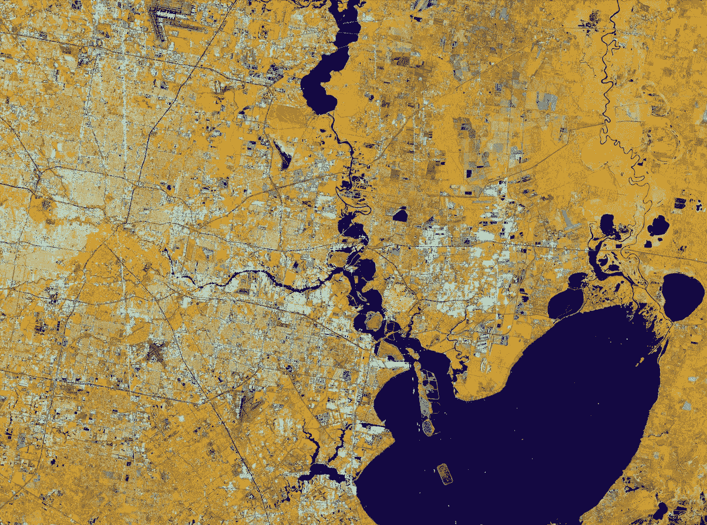
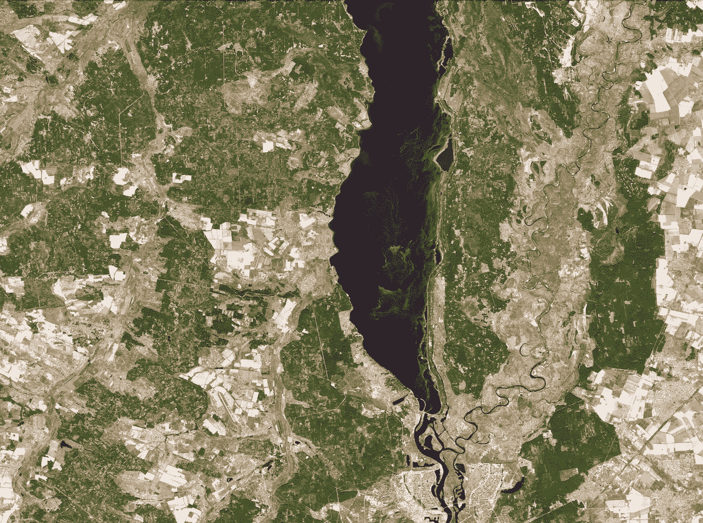
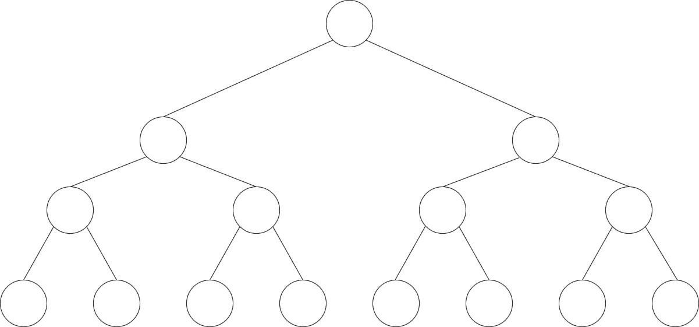
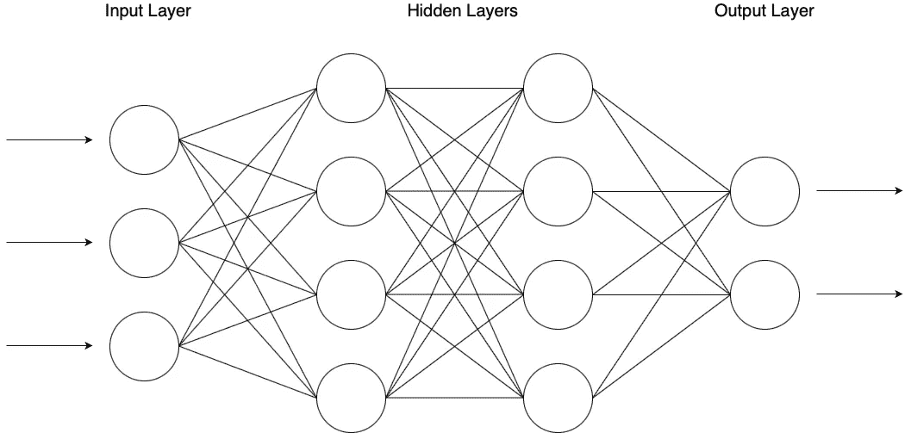
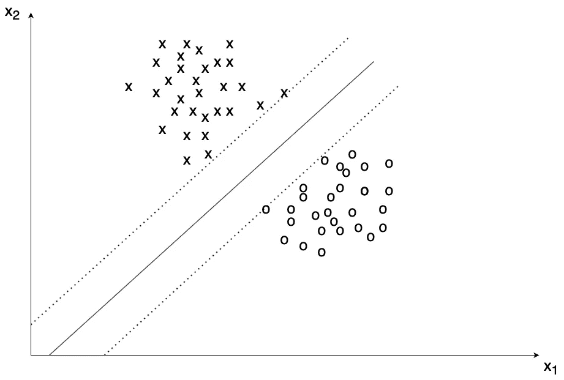

# 利用机器学习绘制入侵物种地图——第 1 部分

> 原文：<https://towardsdatascience.com/mapping-of-invasive-species-using-machine-learning-part-1-800848f72ff6?source=collection_archive---------18----------------------->

## [变更数据](https://towardsdatascience.com/tagged/data-for-change)

## 使用卫星图像进行环境传感和建模

图 1.1:美国得克萨斯州休斯顿，由 Sentinel-1 使用合成孔径雷达拍摄(包含修改的哥白尼 Sentinel 数据(2019)，由欧空局处理， [CC BY-SA 3.0 IGO](http://www.esa.int/spaceinvideos/Terms_and_Conditions) )。

这是一篇由 3 部分组成的文献综述，介绍了机器学习如何被用来绘制像桉树这样的入侵物种。此外，还研究了如何估计混交林中的树木种群。
第一部分是对主题的介绍，包括动机以及所需背景知识的简要概述。然后，在第二部分，可以找到不同方法的比较。第三部分是最后一部分，包括结果、结论和展望。

# 目录

1.  [简介](#15ff)
    一、[外来入侵植物物种](#c33a)
    二。[卫星任务](#6122)
    三。[合成孔径雷达](#4736)
    iv。[多光谱仪器](#cd71)
    v. [算法](#0b39)
2.  [方法](/mapping-of-invasive-species-using-machine-learning-part-2-faf331ecfada)混交林中的树木种群
3.  [结果](/mapping-of-invasive-species-using-machine-learning-part-3-8c9270f95258)
    一、入侵物种图谱
    二。混交林中的树木种群
4.  [展望&结论](/mapping-of-invasive-species-using-machine-learning-part-3-8c9270f95258)一、结论
    二。观点

# 介绍

## 入侵植物物种

入侵植物物种不是生态系统中的本地物种，会伤害当地的动植物。这包括对动物和人类的环境、经济甚至健康威胁。总的来说，入侵植物物种造成财政支出，特别是在农业部门[1]。这些急剧变化的环境的原因可以通过观察人类与这些生态系统的相互作用来找到。开发自然的影响和国际商品交换的增加导致了负面的副作用。入侵是由此产生的过程之一，科学家很难预测。因此，建立一个入侵植物物种发生模式的数据库对于进一步的研究以及空间动态的适当分析是必不可少的。

在观察中有大量不同的植物种类。尤其是种植在伊比利亚半岛以支持当地经济的桉树种群，正在失控。管理种植园外的树木会影响本地植物，甚至取代它们。桉树最初从澳大利亚进口到欧洲，因为它们的生长速度很快，可以提供廉价的建筑木材。但是目前，科学家们估计每年都有巨大的经济影响，这是由入侵物种造成的。总体而言，对环境和自然的潜在威胁仍然研究不足。因此，通过监测这些物种，可以为进一步的研究奠定基础[2]。

与欧洲一样，在亚洲和南美洲，桉树也是管理人工林中最常见的树种之一。林场的数量正在迅速增长，如果管理不当，它们会对环境产生负面影响。在一些研究人员的科学共识中，桉树对环境的影响主要是由于其糟糕的人工林管理。植物本身的生物学特性起着相当小的作用。因此，以大比例和足够的空间分辨率创建快速轮伐期桉树人工林的地图非常重要[3]。正如[4]所指出的，可持续森林管理至关重要，并提供了生物多样性的指标，例如森林认证计划所依赖的指标。因此，有必要通过遥感来确定不同的树种及其发生模式。参考数据通常是在树种数量有限的成熟森林中获取的，即使树叶在近红外光谱中提供高反射率，也要额外考虑其他波段。由于实地调查不适合大规模收集详细的树种信息，因此使用了适用于大面积应用的遥感工具。在最好的情况下，高空间和高光谱分辨率图像数据由卫星提供。此外，根据所采用的方法，提高时间分辨率也有好处[5]。

## 卫星任务

现代卫星是大规模地球观测的重要工具。欧洲航天局(ESA)最近免费提供了他们的哨兵卫星拍摄的图像。有两个哨兵任务，每个都有两颗卫星，它们的设备不同。

哨兵-1 包括卫星哨兵-1A 和哨兵-1B。两者都携带双极化合成孔径雷达(SAR)。由于合成孔径雷达和所应用的配置，哨兵-1 号卫星适合于植被测绘。此外，这些卫星提供空间分辨率为 5 米至 20 米的图像

Sentinel-1 SAR:从太空看地球，拉普兰(包含经修改的哥白尼 Sentinel 数据(2019 年)，由欧空局处理， [CC BY-SA 3.0 IGO](http://www.esa.int/spaceinvideos/Terms_and_Conditions) )

哨兵-2 任务包括哨兵-2A 和哨兵-2B 卫星。这两个携带多光谱仪器(MSI)的波长从 442 纳米到 2202 纳米。因此，来自全球的 MSI 图像具有足够的时间分辨率，并且是免费的。Sentinel-2 提供 10 米至 20 米的空间分辨率。与 Sentinel-2 任务相同，WorldView-2 也携带 MSI，并根据所用波段提供 0.5 米至 2.0 米的空间分辨率。虽然 WorldView-2 早在 2009 年就已经发射，但 Sentinel-2 是一个更年轻的任务，于 2017 年发射。除了欧空局提供的哨兵任务之外，美国航天局还为地球观测目的提供卫星数据。Landsat 8 配备了一台实用的陆地成像仪(OLI ),而 Aqua 和 Terra 卫星携带了中分辨率成像光谱辐射计。

一旦有了合适的卫星图像，谷歌地球引擎和专题开发平台就可以用来管理和分析大量的数据。

## 合成孔径雷达

合成孔径雷达(SAR)是一种常用的遥感工具，主要用在飞机或卫星上，用于绘制地球表面的二维图。为此，使用了电磁波。与光学传感器相比，它更少受到恶劣天气条件的影响，例如下雨或下雪。空间分辨率甚至可以低于一米。图 1.1 显示了休斯顿的摘录。这是一张由哨兵 1 号任务提供的图像，由合成孔径雷达拍摄。

## 多光谱仪器

多光谱仪器(MSI)收集多行图像数据。由于卫星向前移动，行数可以自动增加。三面镜子收集地球反射的光，而 12 个探测器用于观察更大的区域。

图 1.2:Sentinel-2 使用多光谱仪器拍摄的乌克兰基辅(包含修改的哥白尼 Sentinel 数据(2019)，由欧空局处理， [CC BY-SA 3.0 IGO](http://www.esa.int/spaceinvideos/Terms_and_Conditions) )。

Sentinel-2 任务中使用的 MSI 提供了几个波段(从 442 纳米到 2202 纳米)，允许探索不同的光谱特征。空间分辨率取决于所使用的波段，从 10 米到 60 米不等。图 1.2 显示了基辅的摘录。该图像由哨兵-2 任务提供，由 MSI 拍摄。

## 算法:简介

随机森林(RF)是决策树的集合。每个节点再拆分成两个节点，直到到达最后一个节点，再拆分就没有意义了。随机森林对噪声具有鲁棒性，并且不像神经网络那样需要大量参考数据。不过，过度拟合是一个更复杂的问题可以很快达到的问题。图 1.3 显示了一个有 8 个叶子的决策树的例子。

图 1.3:随机森林分类器的决策树的示例性结构(图片由作者提供)。

前馈神经网络(FNN)是一种受监督的机器学习方法，其中节点不形成循环，而是将信息从一层转发到下一层。FNN 是最简单的人工神经网络。通常，整个数据集被分成三个不同的部分。研究人员正在寻找，在开始时需要训练集和验证集来调整神经网络及其参数，而测试集则用于生成结果。与 RF 相比，FNN 需要更多的参考数据用于训练目的，并且通过增加更多的深度(即更深的隐藏层)来考虑更复杂的特征细节。那么，过度拟合的神经网络更有可能。图 1.4 显示了一个有两个隐藏层的 FNN 的例子。数据在图中从左向右流动。

图 1.4:由三个输入参数、一个隐藏层和两个输出组成的前馈神经网络的示例性结构(图片由作者提供)。

支持向量机(SVM)是一种有监督的机器学习方法。在给 SVM 提供一个参考数据集后，它能很快分辨出新的输入数据并标记出来，属于训练好的类别之一。内核技巧允许 SVM 有效地执行非线性分类。图 1.5 显示了一个 SVM 的例子，它使用一条直线边界将十字和圆分成两类。

图 1.5:通过最大化最近数据点和决策边界之间的间隔来划分两个类别的支持向量机的示例性结构(图片由作者提供)。

继续[第二部分](/mapping-of-invasive-species-using-machine-learning-part-2-faf331ecfada)或[第三部分](/mapping-of-invasive-species-using-machine-learning-part-3-8c9270f95258)。

## 文献学

[1] Teja Kattenborn、Javier Lopatin、Michael F orster、Andreas Christian Braun 和 Fabian Ewald Fassnacht。[基于 Sentinel-1 和 Sentinel-2 组合数据，无人机数据作为实地采样的替代方案，用于绘制木本入侵物种地图](https://www.sciencedirect.com/science/article/abs/pii/S0034425719301166)。环境遥感，227:61–73，2019。

[2]安德烈亚斯·福斯特迈尔、安基特·谢卡尔和陈佳。[使用 Sentinel 2 图像和人工神经网络绘制 Natura 2000 地区的桉树地图](https://www.researchgate.net/publication/342798644_Mapping_of_Eucalyptus_in_Natura_2000_Areas_Using_Sentinel_2_Imagery_and_Artificial_Neural_Networks)。遥感，12(14)，2020。

[3]邓新平、郭、孙、。[利用多卫星影像和云计算平台大规模识别短轮伐期桉树人工林](https://www.mdpi.com/2072-4292/12/13/2153)。遥感，12(13)，2020。

[4]马格努斯·佩尔森、伊娃·林德伯格和希瑟·里斯。[多时相 sentinel-2 数据的树种分类](https://www.mdpi.com/2072-4292/10/11/1794)。遥感，10(11)，2018。

5 Markus Immitzer、Clement Atzberger 和 Tatjana Koukal。[利用甚高空间分辨率 8 波段 worldview-2 卫星数据进行随机森林树种分类](https://www.mdpi.com/2072-4292/4/9/2661)。遥感，4(9):2661–2693，2012。

[6]作者截图:伊比利亚半岛树木种植园地图。【在线；访问于 2021 年 3 月 15 日]，网址:[https://www.globalforestwatch.org/map/.](https://www.globalforestwatch.org/map/.)

[7]作者使用福斯特迈尔等人在[2]中提供的图像创作的作品。伊比利亚半岛西部的桉树分布。

[8]作者截图:显示低生物多样性区域的欧洲地图。【在线；访问于 2021 年 3 月 15 日]，网址:[https://www.globalforestwatch.org/map/.](https://www.globalforestwatch.org/map/.)

[9]作者截图:Housten Texas，SAR，2019。【在线；2021 年 3 月 10 日访问】，网址:[https://www . esa . int/Applications/Observing _ the _ Earth/Copernicus/Sentinel-1](https://www.esa.int/Applications/Observing_the_Earth/Copernicus/Sentinel-1)。

[10]作者截图:乌克兰基辅，MSI，2020。【在线；2021 年 3 月 10 日访问】，网址:[https://www . esa . int/Applications/Observing _ the _ Earth/Copernicus/Sentinel-2](https://www.esa.int/Applications/Observing_the_Earth/Copernicus/Sentinel-2)。