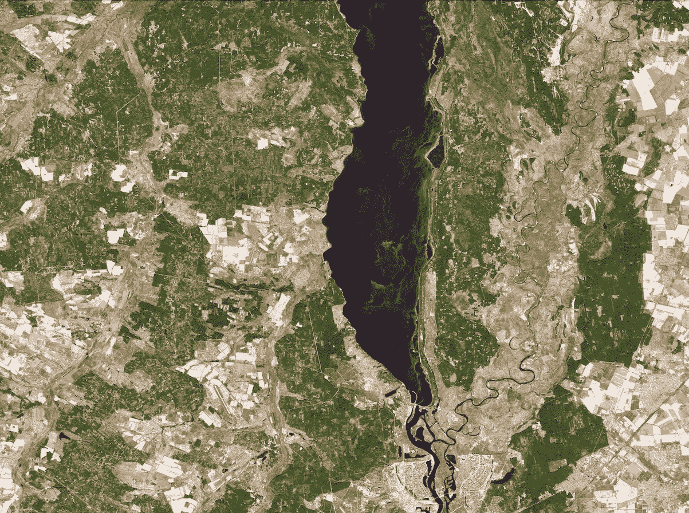
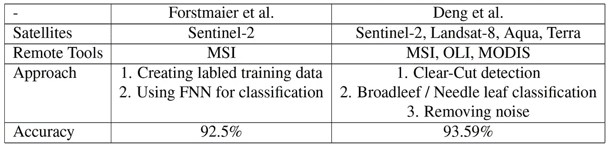

# 利用机器学习绘制入侵物种地图——第二部分

> 原文：<https://towardsdatascience.com/mapping-of-invasive-species-using-machine-learning-part-2-faf331ecfada?source=collection_archive---------25----------------------->

## 使用卫星图像进行环境传感和建模

图 1.2:Sentinel-2 使用多光谱仪器拍摄的乌克兰基辅(包含修改的哥白尼 Sentinel 数据(2019)，由欧空局处理， [CC BY-SA 3.0 IGO](http://www.esa.int/spaceinvideos/Terms_and_Conditions) )。

# 目录

1.  [引种](/mapping-of-invasive-species-using-machine-learning-part-1-800848f72ff6)
    一、外来入侵植物种类
    二。卫星任务
    iii。合成孔径雷达
    iv。多光谱仪器
    五、算法
2.  [方法](#cc21)
    一、[外来入侵物种图谱](#d253)
    二。[混交林中的乔木种群](#38e2)
3.  [结果](/mapping-of-invasive-species-using-machine-learning-part-3-8c9270f95258)
    一、入侵物种图谱
    二。混交林中的树木种群
4.  [展望&结论](/mapping-of-invasive-species-using-machine-learning-part-3-8c9270f95258)一、结论
    二。观点

# 方法

## 入侵物种地图

*用于分类和培训目的的数据收集*

为了监测入侵物种，科学家们选择了一种使用不同图像数据集的分类方法。为了评估绘图程序，有必要收集参考数据。因此，实地调查提供了一种收集某种实地真相的通用方法。但是它们带来了巨大的缺点。由于大量的非自动化工作和必要的劳动力，现场活动非常昂贵。此外，GNSS 位置测量精度可能变化并导致不准确的结果。此外，很难将数据集、卫星数据和实地活动数据联系起来。不同的视角(俯视图和地面视图)之间的关系并不简单，现场数据通常只提供离散的点观测，而卫星数据则覆盖整个区域[1]。另一个值得注意的方面是，如果不对大面积区域进行监测，在早期阶段发现小块入侵物种是不可能的。因此，需要找到不同的方法，不仅支持实地活动，而且减少实地活动。卫星图像似乎是最合适的方法。此外，欧空局的哨兵任务免费提供图像[2]。

出于训练目的，福斯特迈尔和他的团队使用高分辨率卫星图像结合实地调查来获得桉树发生的参考数据。尽管试验区提供了不同类型的桉树物种，但所有物种仅使用一个类别，即蓝桉。因此，可以应用二元分类方法。通过使用 Sentinel-2 卫星的 MSIs 的 13 个波段和从 442.7 nm 到 2202.4 nm 的中心波长，收集了四个不同时期的图像数据。每个波段的空间分辨率各不相同，从 10 米到 60 米不等[2]。

为了解决收集参考数据的问题，Kattenborn 建议使用无人机(UAV)作为替代来源。这可以极大地提高空间分辨率，同时具有成本效益。此外，无人机是一种多功能的数据收集工具，因为可以配备 RGB 相机或其他更复杂的传感器[1]。

使用无人机收集参考数据有四个优点:

*   可以提高收集参考数据的速度。
*   由于不再存在无法到达的地形，因此可以生成更具代表性的数据集。
*   UAV 数据提供了与卫星相同的视角，因此数据是可直接链接的。
*   数据收集本身可以以更有效的方式实现，包括自动描绘目标物种。

对于每一种入侵物种，研究小组用八轴飞行器进行了四次飞行。两次飞行记录了一个训练集，另外两次收集了独立验证的数据。该团队决定在智利进行第一次测试，测试区域由当地人推荐。octocopter 本身配备了两个传感器:一个 1840 万像素的 RGB 相机和一个超光谱成像帧相机。然后，飞行在地面以上 150 米处进行，以获得 3 厘米的 RGB 图像空间分辨率[1]。

另一方面，邓周围的小组通过收集 Landsat-8 提供的数据和 MODIS 数据以及 Sentinel-2 提供的 MSI 数据，研究了广西桉树人工林的变化。广西是中国最大的木材产地，具有相似的异质性植被类型。为了克服这一障碍，使用了三个步骤来创建分类程序:

*   创建增强型植被指数(EVI)时间序列
*   阔叶树和针叶树的分类
*   去除椒盐噪声的改进

为了训练分类器，使用了谷歌地球提供的高分辨率图像，同时考虑了不同的植物[3]。

Sentinel-2 MSI:从太空看地球，基辅(乌克兰)(包含修改后的哥白尼 Sentinel 数据(2019)，由欧空局处理， [CC BY-SA 3.0 IGO](http://www.esa.int/spaceinvideos/Terms_and_Conditions) )。

*车型描述*

Kattenborn 等人建议使用无人驾驶飞行器(UAV)来收集参考数据。对于每个无人机测绘区域，5000 个随机样本点按 80 比 20 的比例分成训练和验证数据，进行 5 次交叉验证和 100 次重复。为了实现半自动映射，使用了最大熵(MaxEnt)分类器。它允许只对一个成员感兴趣就预测植物入侵的覆盖范围。因此，其他类如本地物种或地面是不需要的。对于数据处理，收集了每个入侵物种的多时相 Sentinel-1 和 Sentinel-2 图像。然后，用无人机数据创建的分类图训练基于哨兵的模型。为了生成可比较的基于无人机的地图，随机森林回归被用于达到与基于哨兵的地图相似的分辨率[1]。

为了在卫星图像上对桉树种群进行分类，福斯特迈尔建议使用前馈神经网络(FNN)。模糊神经网络在遥感应用中很常见，因为与支持向量机、最近邻分类器或随机森林算法相比，它们提供了更高的分类精度。在这个实验中，团队使用了四个完全连接的隐藏层，层的大小逐渐减小。因此，网络的输入为 32 像素乘 32 像素，结果面积为 102，400 平方米(320 米乘 320 米)。选择这个大小是为了有足够的背景信息，同时避免过度拟合并保持较低的处理工作量。该模型是用 Python 中的 Keras 库实现的，并提供一个介于 0 和 1 之间的浮点值作为输出。输出数字表示每个像素上出现桉树的概率。通过在灰色调的浮现图上应用阈值，二进制黑白图显示估计的桉树和非桉树类。为了评估这种方法的性能，使用了预先收集的参考数据集[2]。

如一节所述，围绕邓的中国团队遵循三步走战略，以充分利用他们的数据集。然而，预先对 Landsat-8 OLI 图像进行预处理是必要的，使用 Landsat-8 地表反射代码和 CFmask 来过滤云、雪、水等。然后，应用清晰的检测。由于广西人工林中的大部分桉树用于木材生产，它们遵循一定的生长周期。在年轻的时候，它们生长相对缓慢，而一旦长出更强壮的根，它们每年的增长率为 150 万至 300 万。最后，树木被收割，种植园变成了光秃秃的土地。这一周期信息用于计算增强植被指数(EVI)。当查看几年的图像收集时，该团队能够区分桉树种植园与自然森林、果园和农田。

第二步的目的是建立一个阔叶树和针叶树的分类，在观察到的栽培树木区域，有三种不同的树种:松树、杉树、桉树。松树和冷杉是针叶植物，而桉树是唯一的阔叶树。因此，使用 Sentinel-2 图像进行二元分类是合适的。分类过程中最重要的属性是红边光谱带中的反射率值。然后，应用支持向量机(SVM)。在遥感领域，支持向量机是一种常见的选择，因为它们不依赖于大量的训练样本，并且具有良好的泛化能力。为了消除图像上的噪声和干扰，使用 Sentinal-2 图像生成中值复合图像。

第三步也是最后一步对于基于超像素的优化非常有用。基于像素的检测不会产生非常平滑的地图，但可能包含椒盐噪声。因此，原因是即使相邻像素可能属于同一类，像素也是独立处理的。由于图像分割是包含上下文信息的常用工具，作者使用了一种名为简单非迭代聚类(SNIC)的超像素分割算法[3]。表 2.1 比较了两种绘制入侵物种的尝试之间最重要的差异。

表 2.1:forsmaier 和 Deng 绘制入侵物种图方法的比较(表格由作者提供)。

## 混交林中的树木种群

*数据收集*

两种方法都使用多光谱图像数据进行常见树种分类。Persson 等人使用 Sentinel-2 图像，并侧重于多时相的尝试。为此，Sentinel-2 任务的 MSI 提供的 4 幅图像被用于随机森林分类器。这些图像拍摄于 2017 年春季(4 月 7 日和 5 月 27 日)、夏季(7 月 9 日)和秋季(10 月 19 日)，覆盖了瑞典的研究区域。结果表明，红边波段 2、3 和 NIR(近红外)波段 8a 以及 SWIR 波段非常重要，而春季和秋季的图像对于分类不同的树种最为有用。此外，作者还注意到图像上的云干扰很少，数据集由同一年的不同物候期组成。野外数据是在 2016 年至 2017 年期间收集的，数据处理包括两个步骤:首先计算树木的断面积，然后在第二步中，计算每个地块中每个树种的出现率[4]。

Immitzer 等人使用的研究地点位于奥地利东部，占地约 3000 公顷。奥地利的一片温带森林是本次实验中所关注的 10 个树种的家园。参考数据是使用林分地图创建的，以发现研究地点内的同类区域。此外，测试集是一个独立的数据集，不包括参考数据[5]。卫星图像由 WorldView-2 卫星使用 8 个波段提供。

*型号描述*

两个团队都提出了类似的方法，并使用随机森林分类器，因为它易于参数化，对于这种应用是准确的，并且对噪声是鲁棒的。Persson 等人通过将所有波段的光谱信息与实地数据合并来创建参考数据。不同图像数据的组合用于为随机森林算法获取各种参考数据集。

然后，使用 10 倍交叉验证方法来获得 RF 分类准确度[4]。Immitzer 等人区分了基于对象和基于像素的 RF 分类。除了改变观察到的树种数量，还测试了输入特征数量的变化(使用全部 8 个波段或仅使用 4 个标准波段)[5]。

继续[第 1 部分](/mapping-of-invasive-species-using-machine-learning-part-1-800848f72ff6)或[第 3 部分](/mapping-of-invasive-species-using-machine-learning-part-3-8c9270f95258)。

## 文献学

[1] Teja Kattenborn、Javier Lopatin、Michael F orster、Andreas Christian Braun 和 Fabian Ewald Fassnacht。[基于 Sentinel-1 和 Sentinel-2 组合数据，无人机数据作为实地采样的替代方案，用于绘制木本入侵物种地图](https://www.sciencedirect.com/science/article/abs/pii/S0034425719301166)。环境遥感，227:61–73，2019。

[2]安德烈亚斯·福斯特迈尔、安基特·谢卡尔和陈佳。[使用 Sentinel 2 图像和人工神经网络绘制 Natura 2000 地区的桉树地图](https://www.researchgate.net/publication/342798644_Mapping_of_Eucalyptus_in_Natura_2000_Areas_Using_Sentinel_2_Imagery_and_Artificial_Neural_Networks)。遥感，12(14)，2020。

[3]邓新平、郭、孙、。[利用多卫星影像和云计算平台大规模识别短轮伐期桉树人工林](https://www.mdpi.com/2072-4292/12/13/2153)。遥感，12(13)，2020。

[4]马格努斯·佩尔森、伊娃·林德伯格和希瑟·里斯。[多时相 sentinel-2 数据的树种分类](https://www.mdpi.com/2072-4292/10/11/1794)。遥感，10(11)，2018。

5 Markus Immitzer、Clement Atzberger 和 Tatjana Koukal。[利用甚高空间分辨率 8 波段 worldview-2 卫星数据对随机森林进行树种分类](https://www.mdpi.com/2072-4292/4/9/2661)。遥感，4(9):2661–2693，2012。

[6]作者截图:伊比利亚半岛树木种植园地图。【在线；访问于 2021 年 3 月 15 日]，网址:【https://www.globalforestwatch.org/map/. 

[7]作者使用福斯特迈尔等人在[2]中提供的图像创作的作品。伊比利亚半岛西部的桉树分布。

[8]作者截图:显示低生物多样性区域的欧洲地图。【在线；访问于 2021 年 3 月 15 日]，网址:【https://www.globalforestwatch.org/map/. 

[9]作者截图:Housten Texas，SAR，2019。【在线；2021 年 3 月 10 日访问】，网址:[https://www . esa . int/Applications/Observing _ the _ Earth/Copernicus/Sentinel-1](https://www.esa.int/Applications/Observing_the_Earth/Copernicus/Sentinel-1)。

[10]作者截图:乌克兰基辅，MSI，2020。【在线；2021 年 3 月 10 日访问】，网址:[https://www . esa . int/Applications/Observing _ the _ Earth/Copernicus/Sentinel-2](https://www.esa.int/Applications/Observing_the_Earth/Copernicus/Sentinel-2)。