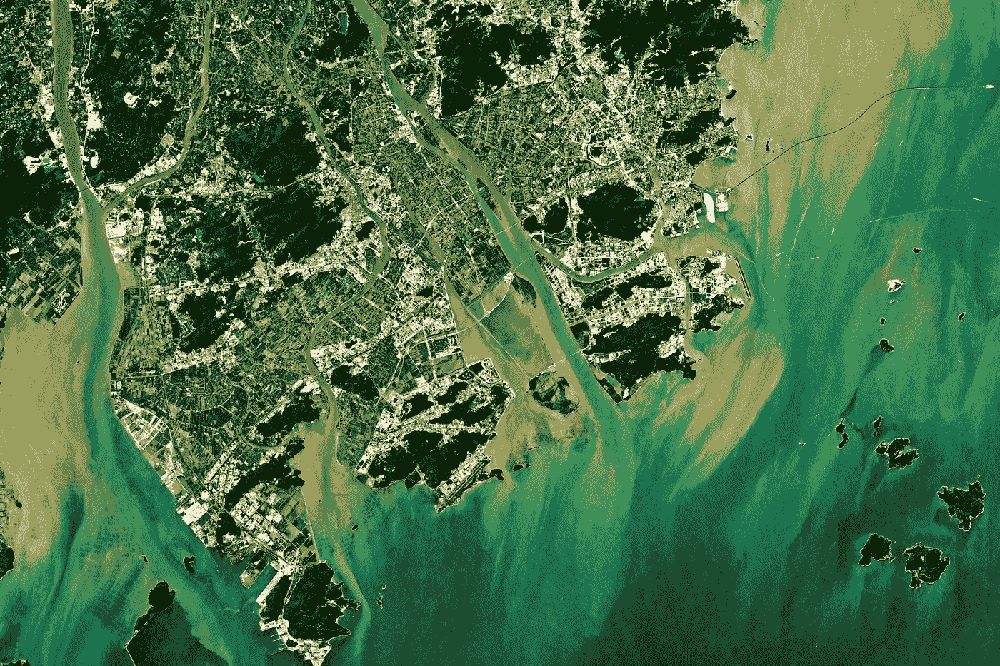
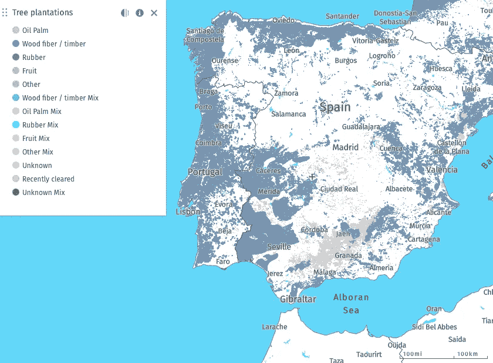
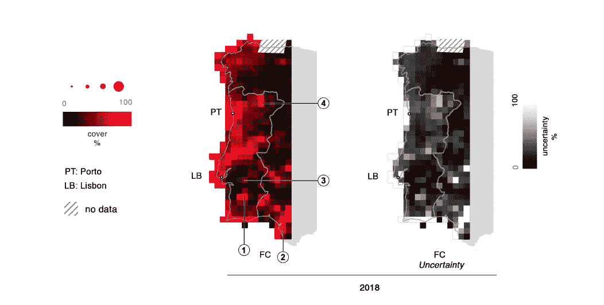
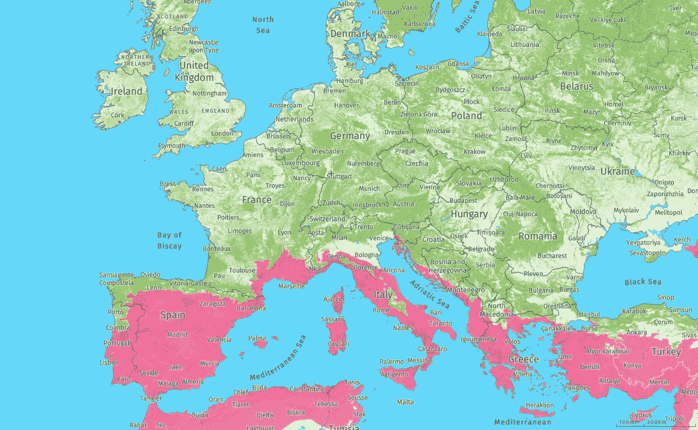

# 利用机器学习绘制入侵物种地图——第三部分

> 原文：<https://towardsdatascience.com/mapping-of-invasive-species-using-machine-learning-part-3-8c9270f95258?source=collection_archive---------27----------------------->

## 使用卫星图像进行环境传感和建模

图 1.3:陆地卫星拍摄的中国澳门。地球地球图片网拍摄的照片。

# 目录

1.  [引种](/mapping-of-invasive-species-using-machine-learning-part-1-800848f72ff6)
    一、外来入侵植物种类
    二。卫星任务
    iii。合成孔径雷达
    iv。多光谱仪器
    五、算法
2.  [方法](/mapping-of-invasive-species-using-machine-learning-part-2-faf331ecfada)
    一、入侵物种制图
    二。混交林中的树木种群
3.  [结果](#bb50)
    一、[外来入侵物种图谱](#f21a)
    二。[混交林中的乔木种群](#30de)
4.  [展望&结论](#ed39)
    一、[结论](#a4ab)
    二。[展望](#52a2)

# 结果

## 入侵物种地图

在 Kattenborn 使用无人机进行的实验中，高光谱数据为四种测试的入侵物种中的三种提供了最高的准确性。相反，第四种方法在使用高光谱数据和 RGB 数据时得到了类似的结果。一般来说，通过组合不同的预测器，准确性得到了提高。最佳组合是高光谱、纹理和 3D 结构，这提供了最高的准确性。当比较卫星数据时，Sentinel-2 及其多光谱图像比 Sentinel-1 及其合成孔径雷达数据提供了更多植被覆盖率的价值[1]。

在所有三篇论文中，卫星图像被用于数据收集，而 Kattenborn 进一步改进了训练过程，并决定不仅仅依赖实地调查或手工标记的卫星数据，而是使用无人机创建地面实况。当我们查看 Forstmaier 实现的分类结果时，结果是 92.5%的预测准确率。然而，值得注意的是，在所观察的区域中，灵敏度和特异性高度不同。此外，创建的二进制地图不能很好地代表较小的桉树片，因为在选择阈值时必须找到一个折衷方案[2]。邓和他的团队取得了稍好的结果，总体分类准确率为 93.59%。即使两个不同的来源被用来建立一个地面真相，作者担心，目前的方法是低估了桉树人工林造成的数据缺乏。作为参考数据，考虑了 2017 年的一次实地调查和高分辨率的谷歌地球数据。除了分类地图之外，由于收集的数据，该团队还能够创建一个日历，显示桉树每年的种植分区[3]。

图 2.1:伊比利亚半岛地图，显示了植树造林的情况。该地图是使用 Landsat、SPOT 或 RapidEye 卫星影像的监督分类和手动多边形描绘创建的。图像日期各不相同，但可以集中在 2015 年左右。分辨率也因国家而异[6]。

当查看伊比利亚半岛的树木种植地图时，可以发现与桉树的出现有很强的相关性。Globalforestwatch 免费提供森林图像数据，在选择感兴趣的区域时可以应用不同的数据层。因此，可以创建一个显示伊比利亚半岛上人工管理的树木分布的地图。

图 2.1 证明了伊比利亚半岛上大多数管理的树木种植园位于西部，用于生产木质纤维和木材。通过比较图 2.1 和图 2.2，我们可以看到这个结果与 Forstmaier 等人在[2]中显示的结果重叠，绘制了伊比利亚半岛西部的桉树分布图。

图 2.2:地图显示了 2010 年至 2018 年间伊比利亚半岛西部的桉树出现率占最大森林覆盖率(FC)的百分比[7]。

## 混交林中的树木种群

当我们比较树种分类方法的结果时，可以发现明显的差异。虽然 Persson 等人设法获得了 88.2%的总体分类准确率，但 Immitzer 和他的团队实现了 82.4%的总体准确率。两个团队都使用了整个可用的数据集来获得最佳结果，也使用了所有可用的光谱带。当以较少影像和较少使用的光谱波段的形式使用较少的输入数据时，他们都取得了良好的性能，但得出了相同的结论，即每增加一个波段都会改善结果，即使只是轻微的改善。Persson 等人指出，5 月拍摄的图像在仅依赖单一图像时提供了最佳结果(总体准确率为 80.5%)。最重要的波段是 3 个红边和 NIR 波段。使用这种波段提供的影像上的树种已经是高度可分的[4]。另一方面，Immitzer 等人在区分阔叶树和针叶树时取得了非常好的结果，没有一个错误分类。此外，使用 4 个标准波段而不是全部 8 个波段会导致精度稍差。虽然这项研究的结果高度依赖于观察到的树种，但不同的其他研究强调了这一说法，并指出树种的数量和树种本身起着主要作用。此外，作者建议使用基于对象的分类方法，因为基于像素的方法提供了明显较低的准确性。最重要的波段是绿色、近红外和蓝色。

此外，建议使用视觉照片判读来创建适当的图像数据集进行验证，因为实地调查(即从地面进行测量)可以提供自上而下视角之外的另一种结果。10 棵树的总体分类精度约为 82%(基于对象)，生产者的精度介于 33%(欧洲犀木)和 94%(欧洲山毛榉)之间。基于对象的方法比基于像素的方法提供了更好的结果，并且当使用全光谱分辨率而不是子集时，分类精度增加[5]。

总之，这两种遥感工具(Sentinel-2 和 WorldView-2)由于其空间和光谱特性，非常适合提供有关混交林树种分类任务的图像。

图 2.3 显示了南欧的生物多样性热点。国际保护组织的生物多样性热点用红色标出，通常位于南欧。该数据集收集于 2011 年，仅涵盖陆地上的濒危区域。国际保护组织的生物多样性热点必须满足以下标准:

*   至少有 1500 种维管植物(超过世界总数的 0.5%)是特有的。
*   至少 70%的原始自然植被已经消失。

另一方面，分辨率为 30m 30m 的绿色标记树木覆盖的区域。这些内容是在 2000 年和 2010 年使用 Landsat-7 和 MSI 拍摄的。

图 2.3:中欧和南欧生物多样性热点地图。红色区域标志着由于特有现象和人类威胁导致的低生物多样性区域，而绿色区域标志着树木覆盖密度[8]。

# 展望和结论

## 结论

总而言之，每篇论文都强调了监控入侵物种的重要性。用无人机收集图像的方法不仅提供了一种更快、成本更低的获取卫星分类参考数据的方法，而且质量更高。这导致更精确的卫星分类图。组合不同的信息图层(如光谱、纹理和结构)可提高地图精度。然而，制图质量也取决于植物种类及其特性(例如，植物出现在较小的斑块中)[1]。

检测像桉树这样的入侵物种并对其进行监控对于保持一个地区的高生物多样性至关重要。通过这样做，灵敏度和特异性很大程度上取决于所选择的参数。尽管 FNN 是一种相当简单的方法，但神经网络能够很好地解决不同的土地覆盖分类任务。分类精度很高，但仍然不是没有误差。因此，将 FNN 应用于 Sentinel-2 提供的多光谱图像被证明是监测入侵物种的合适方法。此外，该研究指出，葡萄牙的 9 个 Natura 2000 地区(保护区)受到桉树的严重影响[2]。

不利的一面是，卫星数据通常依赖于天气。频繁的云层会导致数据的缺乏，因为卫星只是偶尔绕地球的某些部分运行一次，所以很难补偿这种损失。哨兵-2 任务降低了这种风险，因为重复率更高。此外，合成孔径雷达(SAR)是减少对天气依赖的另一种方法，因为这种技术受使用不同波长的云的影响较小[3]。

短轮伐期人工林是世界不同地区的一种日益增长的现象。一些科学家提请注意生态系统可能面临的危险，但有必要对这些种植园进行大规模观察，以进一步了解影响。

当我们比较一下用卫星绘制桉树地图时，邓和福斯特迈尔能够绘制出非常精确的地图。尽管两个团队没有使用相同的测试集，但 Forstmaier 等人设法获得了与 Deng 几乎相同的结果，同时使用了更少输入数据的简单得多的方法。

通过观察混交林中树木种群的分类，两个团队都使用了多光谱卫星图像。Persson 等人使用所有波段和 4 幅图像中的每一幅图像获得了 88.2%的总体准确率。最重要的照片是在五月拍摄的。当不考虑其他 3 个因素时，它提供了 80.5%的总体分类准确率。然后，将其他月份相加，准确度依次提高。仅使用全部 40 个波长中的 13 个会略微降低结果(86.3%的总准确度)，最重要的波段是红边、窄 NIR 波段和大多数 SWIR 波段[4]。Immitzer 周围的团队在用 8 个光谱带对 10 种不同的树种进行分类时，总体准确率达到了 82%[5]。

与其他树种相比，一些树种的分类精度明显较低，作者建议提高时间分辨率以改善分类。

然而，当比较两种树种分类的尝试时，需要考虑重要的差异，这最终导致准确性的偏差。两个团队都检查了不同的树种和不同数量的树种，这极大地影响了整体结果。但是他们也使用不同的卫星任务。WorldView-2 任务不仅比 Sentinel-2 老 6 年，而且相机系统也各不相同。

## 观点

尽管方法不同，但他们有着相同的目标:改善地图绘制，特别是入侵物种的地图绘制，了解它们对环境的影响，并最终保护人类、动物和其他本地植物。虽然一些国家，尤其是岛屿，很久以前就已经禁止进口外来物种，但其他国家却试图开发某些外来植物。现在，他们不得不处理一些对当地环境的严重威胁，但总体程度仍不清楚。

提出了不同的方法来改进观察程序。收集参考数据的半自动方式是朝着正确方向迈出的第一步。当然，无人机不能覆盖像卫星图像那样大的区域。但是训练和验证数据对于改进分类任务的结果是必不可少的。

另一方面，目前的限制可以在卫星图像本身中找到。如果向研究人员提供分辨率更高的数据，甚至可以在减少工作量的同时获得更好的结果。更多的卫星将提高时间分辨率，而更好的仪器将提高空间分辨率。未来，欧空局将通过将更多的卫星送入轨道来扩展地球观测任务，这些卫星将携带不同的工具，有望改善对植被的监测。

为了进一步改进福斯特迈尔等人提出的 FNN 方法，可以扩展输入数据层。除了仅仅使用 Sentinel-2 和 MSI 收集的图像数据，还可以将其他任务和不同的遥感工具提供的数据结合起来。

当涉及到绘制植被甚至入侵植物物种时，依赖大的时间分辨率甚至扩展似乎是有问题的。尽管这适用于大规模轮伐期种植园，但自然发生模式会定期发生变化。因此，前一年的数据可能与实际数据有很大差异。此外，在收集具有较高时间分辨率的数据集时，会有明显的延迟。新引进的遥感工具提供的数据不能立即使用，但科学家们需要等到几个月或几年以后。

激光雷达可以是一个不同的数据图层，以进一步改善树木分类，尤其是在参考数据采集方面。随着制造商开始使用 MEMS 技术，同时价格大幅下降，激光雷达测量设备变得越来越可靠。无人机收集的激光雷达数据不仅可以提供树冠数据，还可以揭示下面的植被。

继续[第一部分](/mapping-of-invasive-species-using-machine-learning-part-1-800848f72ff6)或[第二部分](/mapping-of-invasive-species-using-machine-learning-part-2-faf331ecfada)。

## 文献学

[1] Teja Kattenborn、Javier Lopatin、Michael F orster、Andreas Christian Braun 和 Fabian Ewald Fassnacht。[基于 Sentinel-1 和 Sentinel-2 组合数据，无人机数据作为实地采样的替代方案，用于绘制木本入侵物种地图](https://www.sciencedirect.com/science/article/abs/pii/S0034425719301166)。环境遥感，227:61–73，2019。

[2]安德烈亚斯·福斯特迈尔、安基特·谢卡尔和陈佳。[使用 Sentinel 2 图像和人工神经网络绘制 Natura 2000 地区的桉树地图](https://www.researchgate.net/publication/342798644_Mapping_of_Eucalyptus_in_Natura_2000_Areas_Using_Sentinel_2_Imagery_and_Artificial_Neural_Networks)。遥感，12(14)，2020。

[3]邓新平、郭、孙、。[利用多卫星影像和云计算平台大规模识别短轮伐期桉树人工林](https://www.mdpi.com/2072-4292/12/13/2153)。遥感，12(13)，2020。

[4]马格努斯·佩尔森、伊娃·林德伯格和希瑟·里斯。利用多时相 sentinel-2 数据进行树种分类。遥感，10(11)，2018。

5 Markus Immitzer、Clement Atzberger 和 Tatjana Koukal。[利用甚高空间分辨率 8 波段 worldview-2 卫星数据对随机森林进行树种分类](https://www.mdpi.com/2072-4292/4/9/2661)。遥感，4(9):2661–2693，2012。

[6]作者截图:伊比利亚半岛树木种植园地图。【在线；访问于 2021 年 3 月 15 日]，网址:【https://www.globalforestwatch.org/map/. 

[7]作者使用福斯特迈尔等人在[2]中提供的图像创作的作品。伊比利亚半岛西部的桉树分布。

[8]作者截图:显示低生物多样性区域的欧洲地图。【在线；访问于 2021 年 3 月 15 日]，网址:[https://www.globalforestwatch.org/map/.](https://www.globalforestwatch.org/map/.)

[9]作者截图:Housten Texas，SAR，2019。【在线；2021 年 3 月 10 日访问】，网址:[https://www . esa . int/Applications/Observing _ the _ Earth/Copernicus/Sentinel-1](https://www.esa.int/Applications/Observing_the_Earth/Copernicus/Sentinel-1)。

[10]作者截图:乌克兰基辅，MSI，2020。【在线；2021 年 3 月 10 日访问】，网址:[https://www . esa . int/Applications/Observing _ the _ Earth/Copernicus/Sentinel-2](https://www.esa.int/Applications/Observing_the_Earth/Copernicus/Sentinel-2)。