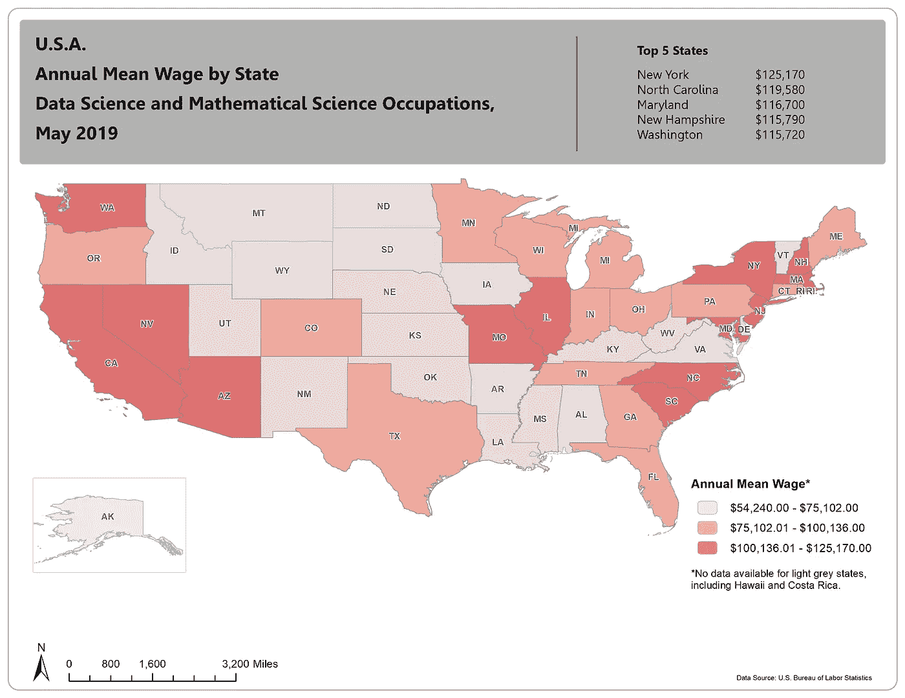
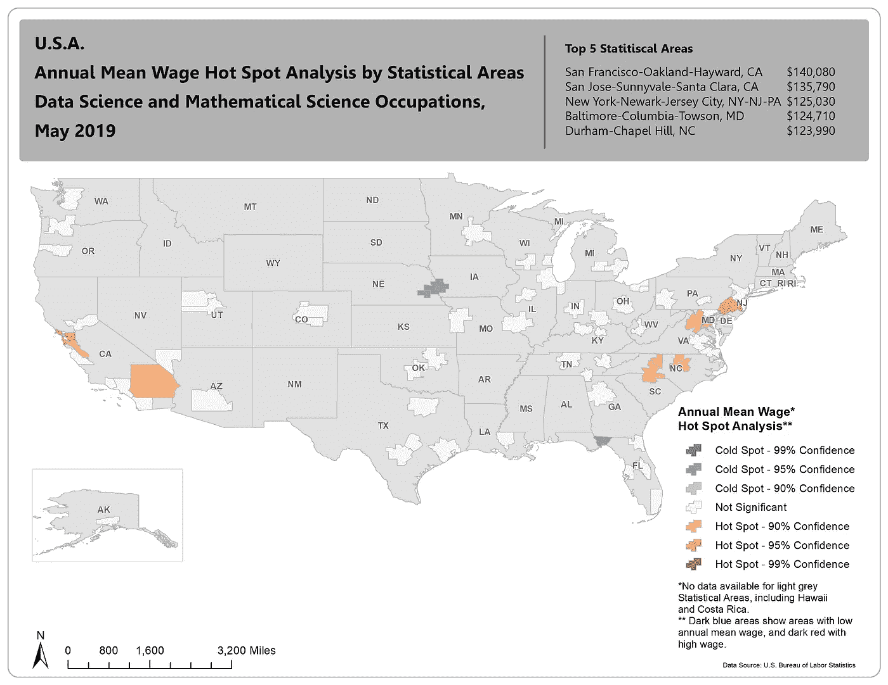
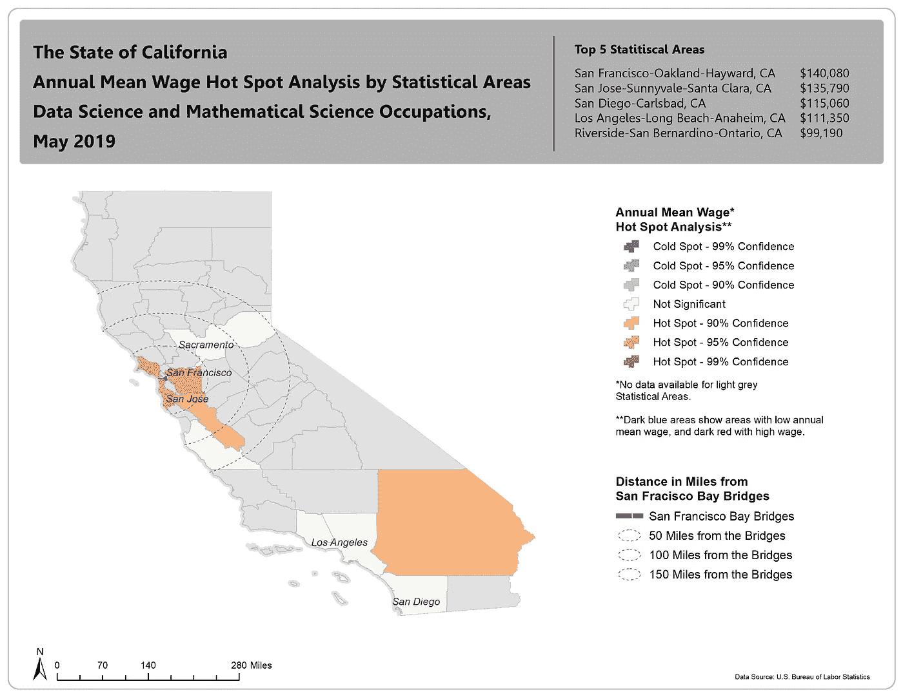

# 使用 ArcGIS 绘制数据科学家的年平均工资

> 原文：<https://towardsdatascience.com/mapping-the-annual-mean-wage-of-data-scientists-with-arcgis-8c0fa6aa8b24?source=collection_archive---------28----------------------->

图片由 Freepik 上的[用户 11628272](https://www.freepik.com/user11628272) 提供

## 哪个统计区域的年平均工资最高？

## 使用分析工具为地图增值。

本文将探索 ArcGIS，根据我们从美国劳工统计局收集的数据绘制地图。为了澄清，我们将在这里看到的*年平均工资*数据包含了“数据科学家和数学科学”职业。

数据从州一级进入统计领域。这些地区被美国联邦政府划分为大都市统计区(MSA)和小城市统计区(μSA)。它们可能与县甚至州重叠。

同样，MSA 也是一个类似城市的区域。它通常有很高的人口密度和经济中心。另一方面，μSA 通常不像大城市那样具有政治和经济上的重要性，但它们在大格局中仍然是重要的。由于我们的数据集的性质，我们可能会将重点放在 MSA 数字的分析上。

需要指出的另一件重要事情是，我们的数据集只有关于美国市场的数据。数据报告截至 2019 年 5 月。

现在我们已经完成了内务处理，让我们来看看我们将在这里涵盖的内容，以及我们希望您获得的预期结果和见解。

***1 —我们能制作的最基本的 ArcGIS 地图。***

***2-演示“热点分析”(这是 ArcGIS 中可用的聚类分析之一)。***

***3 —从国家级别向下钻取到州级别。另外，结合热点分析和缓冲区分析。***

***4-了解各州和统计领域的数据科学家的当前或预期薪资。***

## 但是，卢西亚诺，为什么选择 ArcGIS？

在某种程度上，我们确实可以使用其他解决方案，比如 Tableau 或 Power BI。但是，我喜欢 ArcGIS 的一点是，它是为处理多个图层而设计的。是的，您可以合并和组合大量不同的数据，并以有意义的方式排列它们。ArcGIS 中的控件基本上是无穷无尽的，这也是我选择它作为这个特定项目的原因。我是说 ArcGIS 是我们现有的最好的制图工具吗？是，也不是。这完全取决于项目的范围和你必须考虑的其他因素。最好的工具是你成功地用来表达你的观点的工具。

## 我们应该从一个问题开始这个项目吗？

绝对的！我们可能会提出以下问题之一，但不限于此:

*   哪些州的平均工资最高和最低？
*   哪个统计区域的年平均工资最高和最低？

我知道这些问题很简单。但是，如果你目前正在寻找一份数据科学家的工作，这篇文章将为你提供一些数据，以更好地协商你的工资。这不是很有用吗？接下来，我们开始绘制地图来回答这些问题，所以请系好安全带。

## 映射还是不映射

决定何时使用地图并不总是简单明了的。首先考虑你的观众是一个好习惯。然而，一个常见的问题是，关于信息的呈现，他们经常不知道自己想要什么，或者**需要**。这有时会令人沮丧，但你会去测试，看看什么对你有效——对他们有效。

对于本文，我们将跳过这个对话，并提出地图。我们相信它们是可视化数据的一种强有力的方式，尽管并不总是被推荐。您将看到如下三个不同的图:

1-基本 ArcGIS 地图。为了澄清并确保我们都在同一页上，这里的“基本”实际上是指显示计数或任何类型数据的地图。在我们的例子中，我们将看到一个显示各州年平均工资的地图。它没有任何花哨的分析工具。

2-在第二张地图中，我们将使用名为“热点分析”的 ArcGIS 工具。这是一种聚类分析。通过这种方法，我们可以看到年平均工资的热点和冷点在哪里。然而，我们不看州一级，而是看大都市的统计区域。这将为我们提供比查看州级别更详细的信息。

3 —最后但同样重要的是，我们将重点分析一个特定的状态。我们将继续在 MSA 级别利用热点分析。然而，我们将展示缓冲区分析如何帮助我们构建一些区域。

如果您有任何问题或意见，请随时联系我。

## 基本地图

下面我们看到了我们在这里绘制的最基本的地图。我们还在其顶部添加了“前 5 名”部分，以便于理解，并提供一些“正确的”见解。

图片 1(来自作者)。美国各州年平均工资地图。

我们上面看到的这张地图通常是我们做的第一张。这个想法是为了获得关于数据的高层次直觉。这里的问题是，你可能认为仅仅搬到，比方说，加州就可能付给你更高的工资。因为整个州都处于“红色”——意味着高年平均工资——你可能会被诱惑搬到加州的任何地方。因此，在下一张图中，我们试图获得更详细的信息。

## 热点分析地图

有了这张地图，我们可以更好地了解全国工资最高和最低的*。虽然我们没有很多数据点(观察值)，但这种类型的分析使我们能够专注于极端情况:低和高。现在你确切地知道去哪里或不去哪里。*

图片 2(来自作者)。美国大都市统计区年平均工资图。

## 热点和缓冲区分析图

现在，我们没有从东海岸到西海岸，而是选择了加利福尼亚来深化我们的分析。这里可以保持我们在以前的地图中使用的相同参数，但现在，我们在旧金山大桥周围添加了一个缓冲区。这有助于我们以英里为单位看到数据科学家在哪里赚了更多的钱——通过 MSA。

显然，我们都知道这是湾区。这不应该是一个惊喜，对不对！？但这里的重点是使用数据来证实我们的假设，并找到一种不容置疑的方式来展示我们的结果。我们希望这个练习能帮助你打开思维，激发你创造新的和令人敬畏的东西。

图片 3(来自作者)。加利福尼亚州大都市统计区年平均工资地图。

## 概括起来

在本文中，您了解了使用 ArcGIS 绘制数据的不同方法。现在，您已经知道 ArcGIS 有一个分析工具可以帮助您增强分析并推动决策制定。

此外，您还获得了有关数据科学专业的英特尔信息。希望你今天至少学到了一件新东西。

我们可以做的使这个项目更好的其他事情是合并不同的数据集，并添加与这些静态地图相反的交互式地图。这些都是很酷的特性，但是请记住，如果您已经学到了一些东西，我们就此打住。干杯！