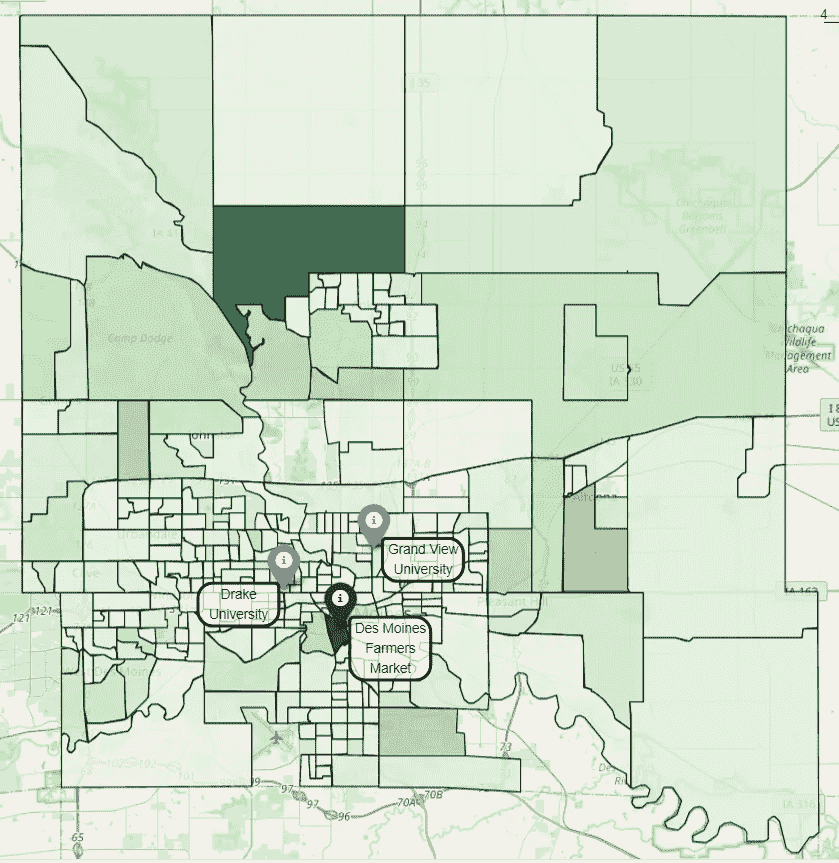
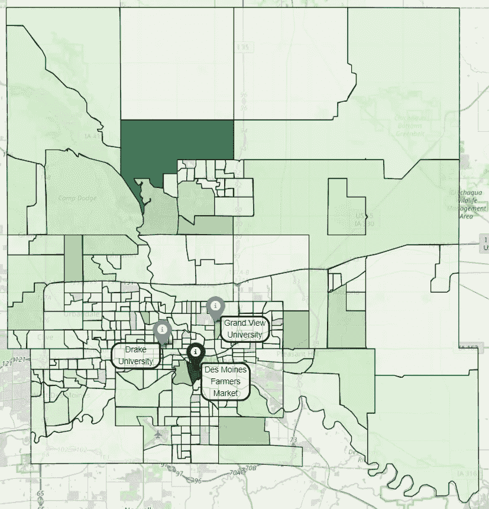
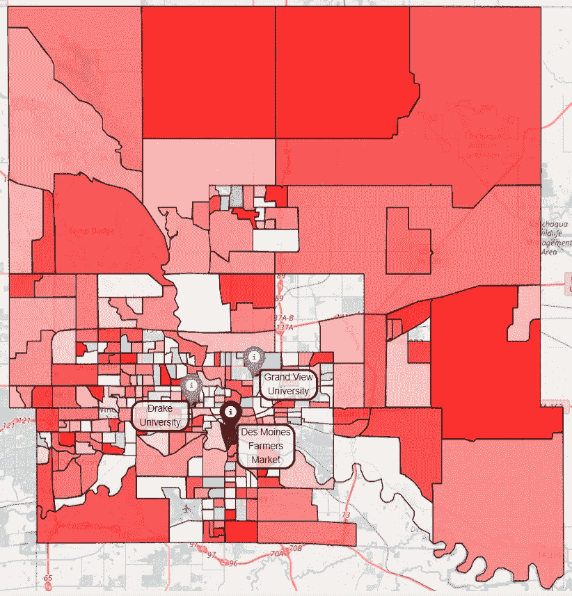
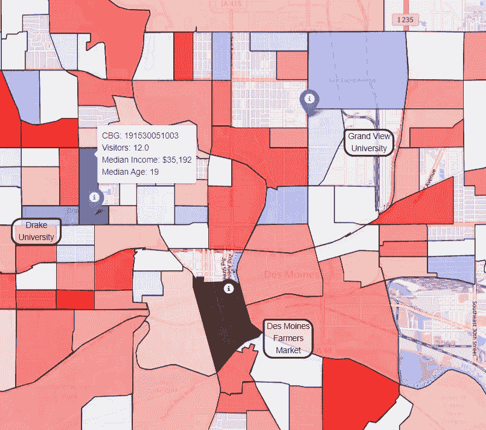
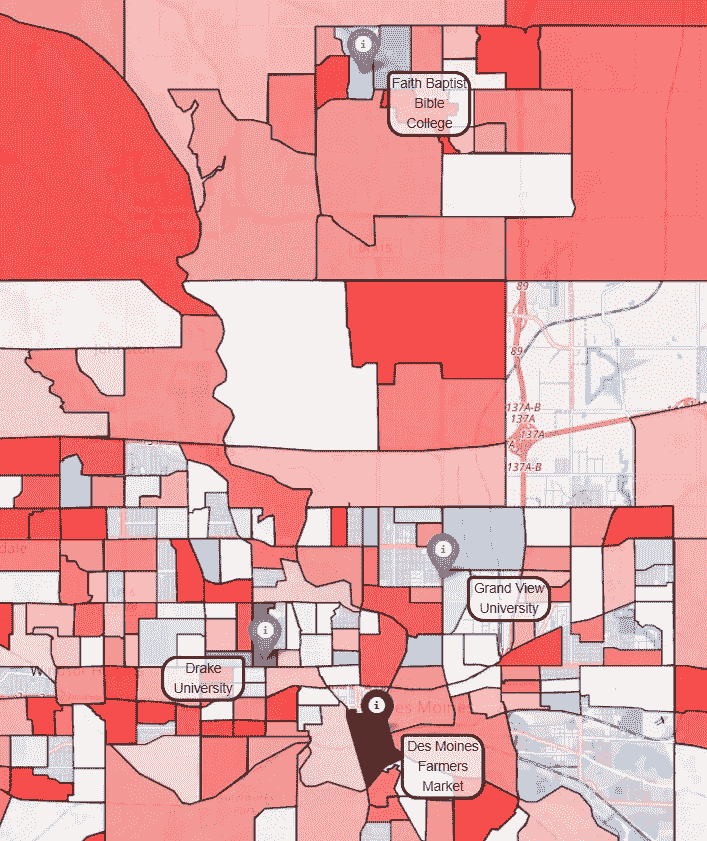

# 描绘得梅因农贸市场的游客

> 原文：<https://towardsdatascience.com/mapping-visitors-to-the-des-moines-farmers-market-4419c32a1459?source=collection_archive---------45----------------------->

## 秋季大学生的回归推动了人口结构的变化吗？

在 [Unsplash](https://unsplash.com?utm_source=medium&utm_medium=referral) 上由 [Toa Heftiba](https://unsplash.com/@heftiba?utm_source=medium&utm_medium=referral) 拍摄的照片

*本文是一个两部分系列文章的第二部分，该系列文章关注的是如何利用来自手机 pings 的客流量数据来分析游客人口统计数据。* [*第一部分:利用客流量数据对得梅因农贸市场进行人口统计分析*](/demographic-analysis-of-the-des-moines-farmers-market-with-foot-traffic-data-ca998e0786dc) *提供了指导本文的重要背景。请在任何社交媒体分享中标记 SafeGraph。*

人口统计分析推动零售商、大学、游乐园等的决策。理解你的消费者的重要性不能被夸大。

在上一篇文章中，我们发现得梅因农贸市场——爱荷华州得梅因市中心从 5 月到 10 月的大型每周活动——每年秋天游客的年龄和收入都会下降。**我们假设观察到的人口变化是由大学生返校驱动的。**虽然不是一个统计上严格的测试，但数据可视化通常具有现实世界的价值，映射也不例外。我们将通过绘制农贸市场游客的住宅区来检验我们的假设。

# 数据

第一部分已经介绍了设置，所以我们将简单介绍一下分析中使用的数据。我们使用 [SafeGraph 的邻域模式](https://docs.safegraph.com/docs/neighborhood-patterns)。从文档中:

> SafeGraph 的邻域模式数据集包含按人口普查区块组(CBG)聚合的客流量数据。了解 CBG 在一周中的哪一天最忙，CBG 在一天中的什么时间最忙，在早餐、午餐和晚餐期间停止的设备从哪里出发，以及工作日和周末的人口统计数据如何比较。

虽然我们在第一部分中查看了 2018 年和 2019 年，但本文的范围仅限于 2019 年。此外，我们只分析来自得梅因所在的波尔克县的游客。在继续之前，有一个重要术语:

> ***普查区块组(CBG):*** 同一普查区域内的一组区块。CBGs 通常包含 600 到 3000 人，是美国人口普查局使用的地理单位。

我们的可视化处于 CBG 水平，这是美国人口普查局发布人口统计数据的水平。

# 绘图

首先，我们来看一张 2019 年 7 月的地图。

2019 年 7 月:波尔克县 CBG 家居得梅因农贸市场的游客量。

得梅因农贸市场由黑色记号笔和深灰色 CBG 显示。德雷克大学和大观大学用蓝色标记表示。

现在，一张 2019 年 10 月的地图。

2019 年 10 月:波尔克县 CBG 家居得梅因农贸市场的游客量。

很难看出两者之间有什么大的区别。让我们结合各自的数据来看看从 7 月到 10 月游客的相对变化。为了做到这一点，我们为每个 CBG 取(10 月访问者的数量)/(7 月访问者的数量)。例如，如果给定的 CBG 在 7 月有 100 个访问者，在 10 月有 125 个访问者，相对变化是 125/100 = 1.25，相当于 125%。换句话说，CBG 10 月份的游客比 7 月份多了 25%。

在这张地图中，如果 CBGs 在 10 月份的访客比 7 月份多，我们将把它涂成蓝色。否则，它们将被涂成红色。白色表示每个月的访客数量接近相同。因此，如果我们的假设是正确的，我们预计会在两所大学周围看到一些蓝色(我们假设大多数学生住在校园内/附近)。

很难看到，所以让我们放大感兴趣的区域…

这是一张比前两张更有用的地图。看起来我们可能会有所发现！德雷克大学所在的 CBG 10 月份的游客数量是 7 月份的 12 倍。你也可以看到 CBG 的平均年龄是 19 岁，平均收入是 35192 美元。

此外，地图的大部分是红色，但每个大学周围都有一簇蓝色的 cbg。有趣的是，在缩小的地图上还有另一个无法解释的蓝色星团…在谷歌搜索后，我发现这个蓝色星团是 Faith Baptist 圣经学院的所在地，这进一步证实了我们的发现。

# 结论

重要的是要记住，相关性不是因果关系，我们的分析有许多潜在的混淆因素。例如，得梅因市中心地区是该市的夜生活热点之一；也许我们观察到的人口变化与市中心酒吧的关系比与农贸市场的关系更大。*(注意:我们可以通过使用 SafeGraph 的兴趣点步行交通数据、* [*SafeGraph 模式*](https://docs.safegraph.com/docs/monthly-patterns) *来纠正这一点，但这超出了本笔记本的范围)*。再者，SafeGraph 的数据只是整个人群的样本；我们使用原始计数，但最佳实践是将数据标准化，以努力纠正偏差。

然而，我们的发现看起来确实像是某种东西。它们有直观的意义，它们甚至可能有**现实世界的意义**，一个容易被遗忘的统计意义的表亲。应用到现实世界中，我们的发现具有实际的、可操作的洞察力，这并不像我们在数据科学中希望的那样普遍。例如，Greater Des Moines Partnership(DSM 农贸市场的生产者)可以利用这种类型的分析来优化农贸市场以适应人口变化。像学生折扣、校园班车、社交机会、庭院游戏和免费食物/饮料票这样的事情可以在每个周六早上最大限度地提高出席率。

***提问？***

我邀请你在 [SafeGraph 社区](https://www.safegraph.com/academics)的 **#safegraphdata** 频道问他们，这是一个面向数据爱好者的免费 Slack 社区。获得支持、共享您的工作或与 GIS 社区中的其他人联系。通过 SafeGraph 社区，学者们可以免费访问美国、英国和加拿大 700 多万家企业的数据。