# 马拉松训练:数据透视

> 原文：<https://towardsdatascience.com/marathon-training-a-data-perspective-ba2fc00c912b?source=collection_archive---------22----------------------->

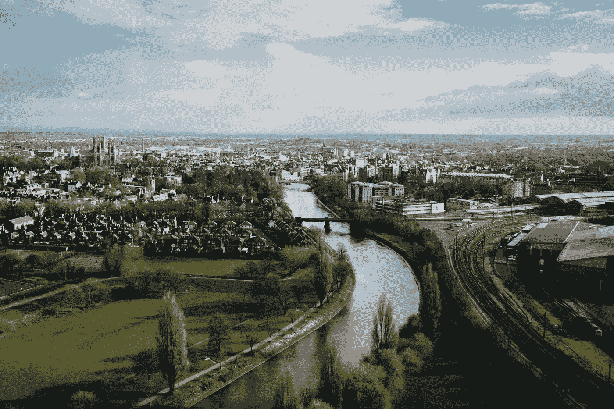

(上图)英国约克。卢克·波特在 [Unsplash](https://unsplash.com/) 上拍摄的照片

## 来自 Strava 的数据分析(通过其 API)

# 我的第一次马拉松

2018 年末，38 岁的我意识到，我在 20 多岁和 30 多岁时进行的中等水平的体育锻炼已经成为遥远的记忆。生活完全占据了我的业余时间，当我反复思考并不遥远的向 40 多岁的转变时，我知道机不可失，时不再来。

我对任何形式的运动都不感兴趣，并且非常讨厌学校的体育课。当我在 25 岁左右开始定期锻炼时，我认为 3 英里跑已经足够了，10 公里跑是值得筹集赞助费的活动。

现在的问题是:我能找到什么样的挑战来激发足够的兴奋和注意力？什么能把我从久坐不动的麻木状态中唤醒？当一个同事提到他们最近完成了约克郡的马拉松比赛，并且他们度过了一段美好的时光时，答案出现在我面前。

我立即进入。毕竟，还有将近一年的时间，这肯定是足够的时间来恢复身材。在通知我妻子后，我最初的动力感被第一反应“*你要死了*”所阻碍，但我还是坚持了下来。

为了提高我的生存几率，我加入了当地的一个跑步俱乐部，令我震惊的是，这个俱乐部对待 10 公里跑就像我对待休闲散步一样。但这种心态的转变正是我所需要的，几个月后，这样的距离已经成为了家常便饭。值得庆幸的是，我住在一个小村庄里，周围的路线都很宜人(见下图)，所以在夏季的几个月里，训练通常都很愉快。

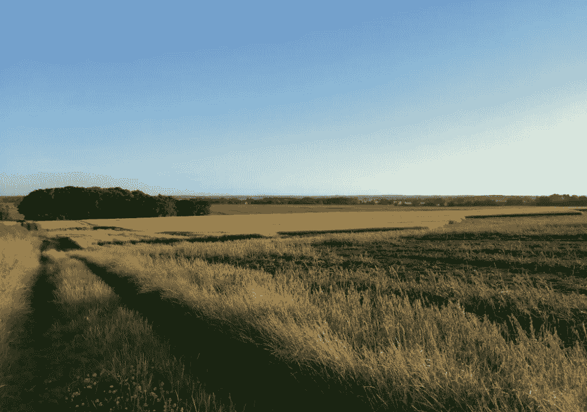

(上图)一次训练中的场景(图片由作者提供)

我花了 3 个月的时间准备马拉松，尽我所能训练。我画出路线，试图遵循一个基本的计划，尝试营养，穿破我的鞋子。我的配速完全是随意的，而且经常是快，因为在我的天真观点中，更快等于更健康！

在重要的一天，我设法绕过了全程，但它花了我比我希望的更长的时间(4 小时 35 分钟)，我不得不在最后的 4 或 5 英里慢下来步行 3 次。几个星期后，我决心做得更好，再次参赛。

由于新冠肺炎，2020 年的比赛变成了 2021 年的比赛，在这个大日子的 3 个月前，我的训练又开始了。这一次，我决定阅读耐力跑的科学知识，这让我想到了心率训练的概念。

# **心率区**

我读到的基本要点是，有 5 个不同的心率区，不同区域的锻炼适合不同类型的训练。这些是，

*   **1 区:**非常轻。最大值的 50–60%。心率
*   **二区:**光。最大值的 60–70%。心率
*   **第三区:**中度。最大值的 70–80%。心率
*   **4 区:**硬。最大值的 80–90%。心率
*   **第 5 区:**最大值。最大值的 90–100%。心率

你需要做的就是确定你的最大心率来计算出这些区域(或者像 Strava 这样的应用程序会帮你计算出来)。解决这个问题的近似公式是，

**最高。心率= 220 —年龄**

这使我的最高心率达到了 182。我将它插入到 Strava 中，并检查了我最近几次跑步的区域百分比。我完成的最后一次跑步是 10 公里，Strava 告诉我，我将在 5 区花费超过 90%的时间。这是不可能的(5 区是你最快的冲刺。想想被一群疯狗追着跑！).我还准备了一些批评上述公式的文章，所以我寻找一种替代技术。

相反，我所做的是找到一个跑步的地方，我在一个陡峭的山上冲刺，寻找我的峰值心率，结果是 200。然后我把它插入 Strava，我所有的区域突然变得有意义了(我的快速 10 公里现在大部分是第 4 区)。据我所知，这不是最科学的方法(特别是使用腕部心率监测器，而不是胸部心率监测器)，但这是我能做到的最好的方法，看起来差不多没问题。

对于马拉松训练，我找到的文章建议主要在 2 区训练，在这里和那里有少量的 4 区。对我来说，2 区是每分钟 120-140 次。我记得我第一次在 2 区跑步。我不得不走得很慢，感觉就像在走路一样。结果，我的跑步训练似乎要花很长时间，因为我试着一周跑 4 次，而两年前是一周 3 次(不够)，所以我很快就没时间了。

过了一段时间，我决定唯一能让我适应训练的方法就是跑得快一点(但还是比两年前慢)。那就只好这样了！

然后大日子又来了。问题是，由于我希望有更好的训练方法，我能更快地适应吗？我会不停地四处走动吗？还是我现在已经大了 2 岁的事实会让我退缩？我们来看数据！…

# **培训分析**

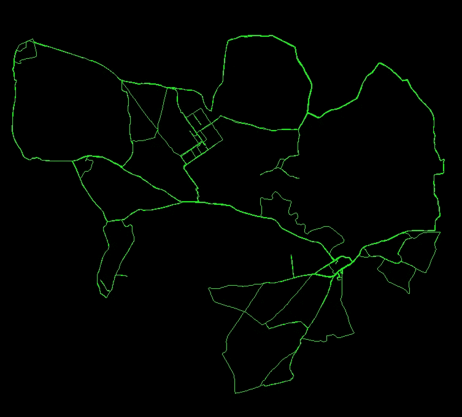

(上图)训练路线图(图片由作者提供)

首先，简单看一下马拉松前 3 个月的距离，

*   2019 年总训练距离:493 公里(306 英里)
*   2021 年总训练距离:559 公里(347 英里)

好的，那么在 2021 年再往前一点。出于兴趣，左边的图片显示了我在 2021 年训练期间的主要路线。

现在让我们更仔细地看看一些数据，从两个不同年份的每月运行次数开始，

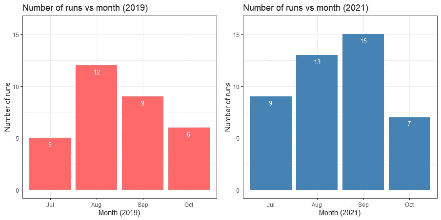

(上图)作者图片

注意，马拉松是在每年的十月中旬举行的。这里我们可以看到，2019 年，7 月到 8 月有一个大的跳跃，然后我实际上在 9 月份跑得更少了。相比之下，2021 年显示出在 10 月之前的 3 个月中逐渐增加。

心率呢？下图显示了我的心率在训练期间的重叠直方图，其中显示了平均心率(虚线)，

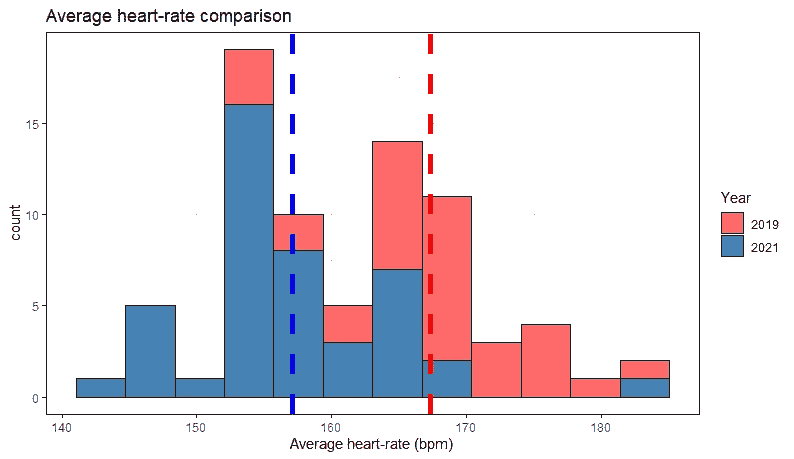

(上图)作者图片

按照计划，我的平均心率在 2021 年降低了。我每年运行超过 30 次(这是有效的 t 检验的近似经验法则最小值，[由于中心极限定理](https://www.ncbi.nlm.nih.gov/pmc/articles/PMC5370305/))，所以我对上述数据运行一次(特别是单尾测试，寻找 2019 年大于 2021 年)，

```
Welch Two Sample t-testdata:  marathon_all_training$average_heartrate[marathon_all_training$Year == "2019"] and marathon_all_training$average_heartrate[marathon_all_training$Year == "2021"]
t = 6.0937, df = 68.361, **p-value = 2.868e-08**
alternative hypothesis: true difference in means is greater than 0
95 percent confidence interval:
 7.420702      Inf
sample estimates:
mean of x mean of y 
 167.2844  157.0682
```

微不足道的 p 值！换句话说，如果零假设(均值之间没有差异)是真的，那么*极不可能看到这样的数据。*

这是分解心率数据的另一种方法，

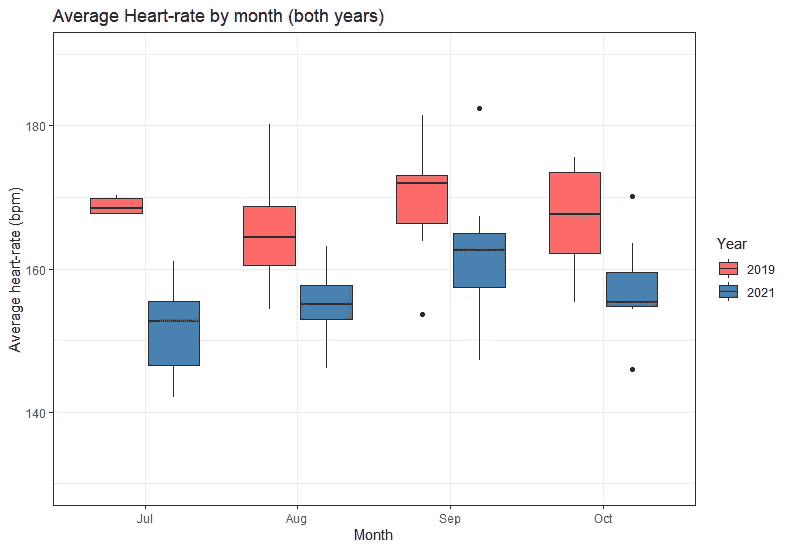

(上图)作者图片

有趣的是，2019 年的中值心率(盒须图中较粗的水平线)在整个训练期间没有真正的模式，在 2021 年，随着我开始休息，心率稳步上升，然后在 10 月份下降。这也可以从平均速度分解中看出，

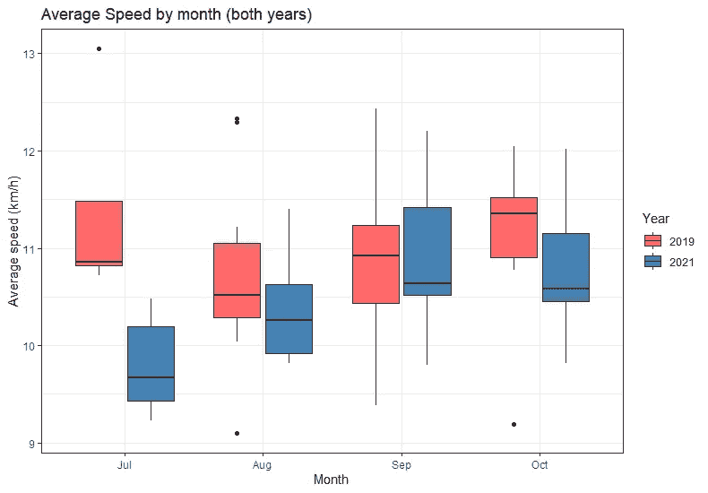

(上图)作者图片

这表明我的训练受到了更多的控制，并且我遵循了一个正确的计划！

上面我展示了我 2021 年的总距离比 2019 年多。我想知道这在长跑(我定义为超过 16.1 公里(10 英里)的任何东西)方面意味着什么。在下面的图中，彩色条表示长距离，灰色条表示小于该距离的距离。

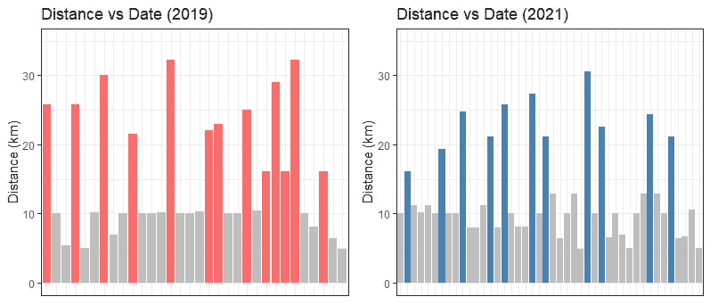

(上图)作者图片

2019 年 13 个，2021 年 11 个，所以实际上第一次会更多。然而，你可以在 2021 年看到更好的终点减量(即马拉松前的休息)，4 次更短的跑步，而 2019 年只有 2 次。

# 重要的日子

我两次马拉松的完成时间是，

*   2019 完成时间: **4 小时 35 分钟**
*   2021 完成时间: **3 小时 58 分钟**

我真的很高兴我用了不到 4 个小时的时间(我没想到会这样！).事后看来，看着上面的数据，我相信多一点距离，随着时间的推移控制和稳定地增加训练距离，再加上训练期间较慢的配速(因此平均心率较低)都是造成差异的原因。

这是我在约克郡马拉松比赛中的一张照片，

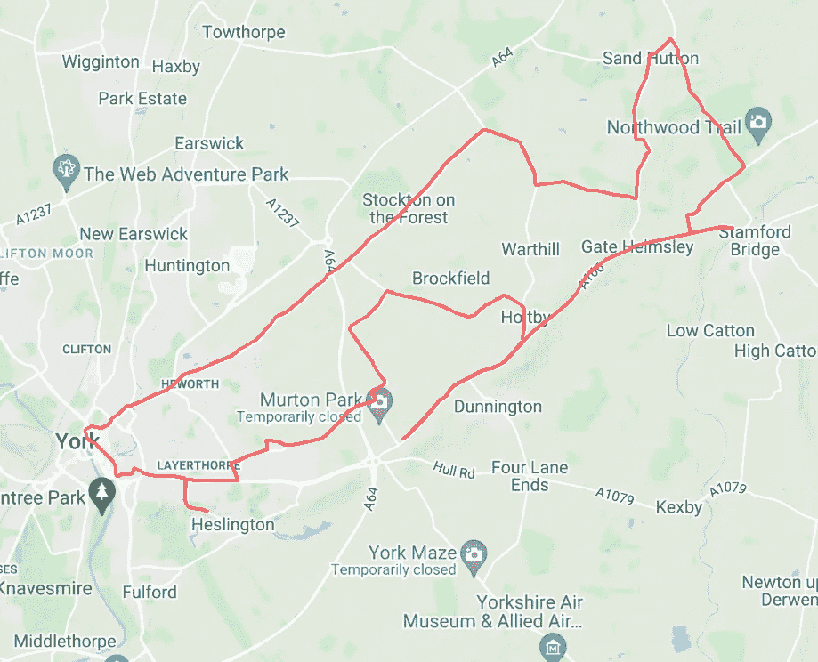

又一个情节。这是我每场马拉松比赛当天的心率。你可以看到 2019 年的 3 个点，我在那里短暂地放慢了脚步。我完全筋疲力尽了，尽管我的心率(和步速)比 2021 年还低。与此形成鲜明对比的是，在 2021 年，你可以看到更高的心率(因为我更舒适地推动自己)，接近尾声时没有下降。

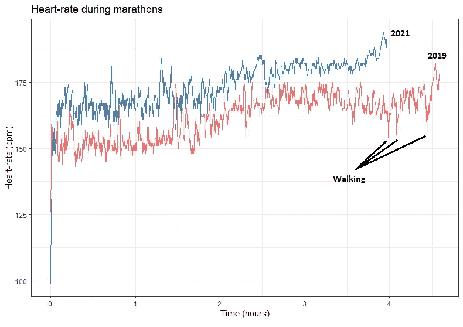

(上图)作者图片

如果这篇文章启发了任何人考虑马拉松，我可以强烈推荐约克郡的马拉松。它相对平坦，组织良好，人群很大，你可以跑过北欧第二大哥特式大教堂(约克大教堂)。请参见[此处的](https://www.runforall.com/events/marathon/yorkshire-marathon/)了解参赛详情和更多信息。

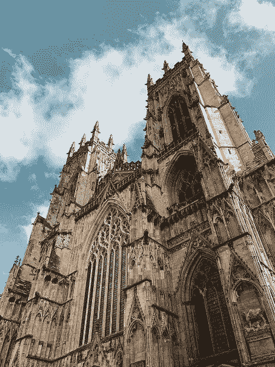

(上图)约克大教堂。由[理查德·格伦丹宁](https://unsplash.com/@richard_glendenning)在 [Unsplash](https://unsplash.com/) 上拍摄的照片

**附录—关键包和链接**

互联网最不需要的就是更多的代码向你展示如何用 R 语言创建一个情节，所以我在这篇博文中省略了细节。但是，请参见下面的一些说明和软件包的关键链接。我在这个分析中使用的主要工具是 rStrava。请随时给我发信息了解更多细节。

*   [在 Strava 中创建应用程序并获取 API 详细信息](https://developers.strava.com/docs/getting-started/)
*   [获得谷歌地图 API](https://developers.google.com/maps/gmp-get-started#create-project)
*   [rStrava 包](https://github.com/fawda123/rStrava)
*   [ggmap](https://github.com/dkahle/ggmap)