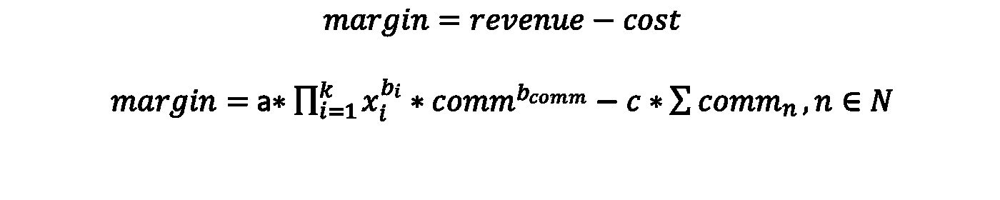
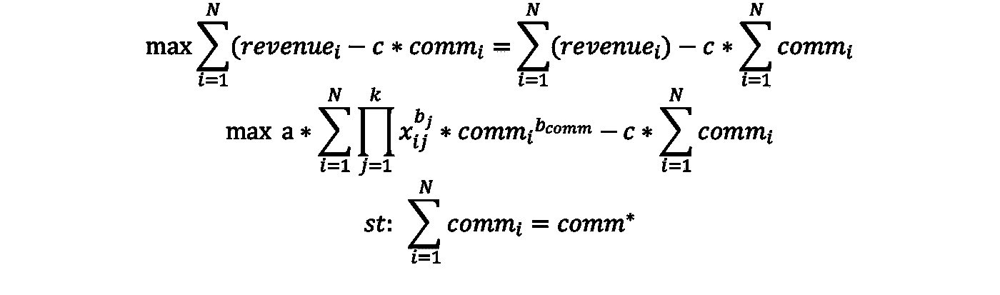
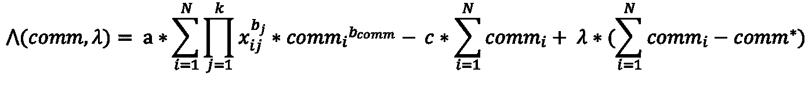
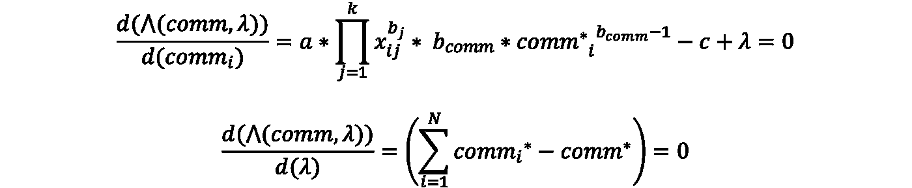

# 使用凸优化框架的利润最大化

> 原文：<https://towardsdatascience.com/margin-maximization-using-a-convex-optimization-framework-69824c4c1084?source=collection_archive---------40----------------------->

## 不需要计算能力的封闭方法

老实说，我是优化的忠实粉丝，每当我看到强大的优化器支持的新深度学习算法的出现，我的信念就变得更加坚定。但在这篇博客中，我不会触及任何随机优化过程，而是将重点放在简单而优雅的凸优化解决方案，可以在任何利润最大化问题中利用。这种方法的一个优点是其封闭形式的性质，不需要任何计算能力来解决甚至是大规模的问题。无论规模如何，您只需要一个计算器就可以在一分钟内实现这个解决方案。此外，该方法是领域不可知的，可以应用于大范围的优化问题。记住这一点，让我们开始吧。

**问题陈述**

假设我们想向客户发送关于个性化报价的信息。现在，我们可以根据我们的预算向每个人发送 n 次随机消息。但是，我们也希望收到基于我们发送的消息的最大响应。为了简单起见，我们不会在业务问题的复杂性上花费太多时间，而是开始简单地描述问题。

让我们假设我们有 *k* 个特征，这些特征通过这样的交流影响了客户产生的收入。如果我们开发一个乘法模型来捕捉响应曲线，它将如下所示:

这里 *comm* 是捕获历史发送的通信数量的特征， *b(comm)* 表示该特征的系数。

现在保证金可以定义为:

这里 c 是指每次通信的固定成本。

现在，如果我们试图计算发送给客户的最佳通信数量，以最大化利润，我们可以简单地进行一阶导数，得到以下结果:

现在，我们将得出最佳通信数量，如下所示:

这里的 comm*是发送给客户的最佳通信总数，以实现利润最大化。问题的第一部分到此结束。现在，我们必须计算要向单个客户发送多少信息。因此，如果我们总共有 N 个客户，并且每个客户都由 *i* 索引，那么在这种情况下最大化利润将如下所示:

我们需要解决上面的优化问题。现在如果我们能证明目标函数是凸的，这将使我们的工作更容易。可以证明，如果，

目标函数将是凸的。让我们努力实现上述问题的封闭形式的解决方案。

对于带有等式约束的凸函数，我们可以应用拉格朗日乘子来求解最优化问题。让我们写出拉格朗日函数:

为了解决这个问题，我们将采取如下方法。

如果我们求解上述方程，我们将得到以下结果:

闭合形态看起来有多美。事实上，它与一些直觉产生了共鸣。本质上是其他驱动因素对有个客户的*的收入的贡献与所有客户相比的比例。事实上，您可以使用上面的公式在简单的 excel 中计算最佳通信计数(当然，您需要在优化之前首先估计响应曲线的参数)。*

如果你看看到目前为止的公式，这里唯一重要的部分是确保我们的响应函数的凸性。公式的其余部分与业务问题的领域或上下文无关。现在不考虑任何领域，如果我们可以将利润最大化问题转化为上述形式的凸优化，我们将能够在任何用例中利用它的力量。

在我的下一篇文章中，我们将推广这种方法，并设计一种算法来解决大量的优化问题。