# 大麻消费:一个数据故事

> 原文：<https://towardsdatascience.com/marijuana-consumption-a-data-story-6ea73317027f?source=collection_archive---------30----------------------->

## 丹佛市的药房活动:总体趋势和季节性分析


[糖蜂](https://unsplash.com/@sugarbee?utm_source=unsplash&utm_medium=referral&utm_content=creditCopyText)在 [Unsplash](https://unsplash.com/s/photos/tree?utm_source=unsplash&utm_medium=referral&utm_content=creditCopyText) 上拍摄的照片

***注:*** *这是关于丹佛酒类商店和药房指标的系列文章中的第二篇。第一篇文章涵盖了丹佛酒类数据的总体、月度和季度分析，并得出结论，丹佛的酒类商店在夏季和春季更受欢迎。*

人类总是深入研究醉酒作为现代生活负担下的一种娱乐方式。自从酒精被发现以来，它就被当作一种休息和放松的工具，人类已经将饮酒作为一种社会联系的形式。在历史上，将大麻用于娱乐经常被看不起，但这种趋势现在正朝着对这种物质更积极的观点转变。2012 年，这两种主要的娱乐物质在丹佛市开始发挥作用，因为这一年大麻在科罗拉多州合法化。随着两种大型娱乐性药物在该市的出现以及自大麻合法化以来一百多家药房的兴起，分析丹佛市这些药物的消费趋势似乎是合乎逻辑的。这篇文章是一系列文章中的第二篇，旨在分析丹佛的酒和大麻流行情况，并且只涉及丹佛药房，对于丹佛酒类商店数据的趋势分析，请查看本系列的第一篇文章。

在我们的分析中，我们将使用 [Safegraph](http://safegraph.com) 模式数据以及来自丹佛市的数据。SafeGraph 是一家数据提供商，为数百家企业和类别提供 POI 数据。它向学术界免费提供数据。在这个特定的项目中，来自模式数据集的关于访问和流行度指标的数据将证明对我们的分析非常有帮助。模式数据的模式可以在这里找到:[模式信息](https://docs.safegraph.com/v4.0/docs/places-schema#section-patterns)

与烈酒数据一样，第一步是加载和可视化 SafeGraph 模式和丹佛药房数据

丹佛的药房数据是这样的:

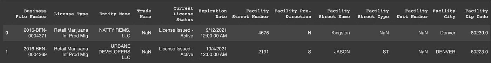

让我们分析许可证类型的价值计数，看看在美国哪些地点可以合法销售大麻:

```
print(dispo_df[‘License Type’].value_counts())plt.bar(dispo_df[‘License Type’].unique(), dispo_df[‘License Type’].value_counts())
```

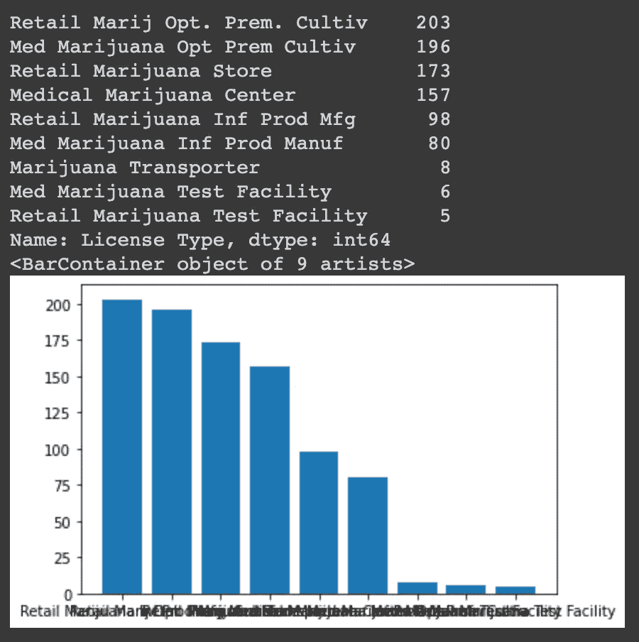

出于本文的目的，我们将只查看零售大麻商店类型的许可证。下一个片段将作为地址列的格式和扩展，以便在连接两个数据集时更好地满足我们的需求:

```
dispo_df = dispo_df.where(dispo_df[‘License Type’] == ‘Retail Marijuana Store’).dropna()dispo_df[‘index’] = range(1, len(dispo_df) + 1)dispo_df[‘Facility Street Number’] = dispo_df[‘Facility Street Number’].astype(int)dispo_df[‘Address’] = dispo_df[[‘Facility Street Number’, ‘Facility Street Name’,’Facility Street Type’]].apply(lambda x: ‘ ‘.join(x.dropna().astype(str)),axis=1)dispo_df.head(5)
```

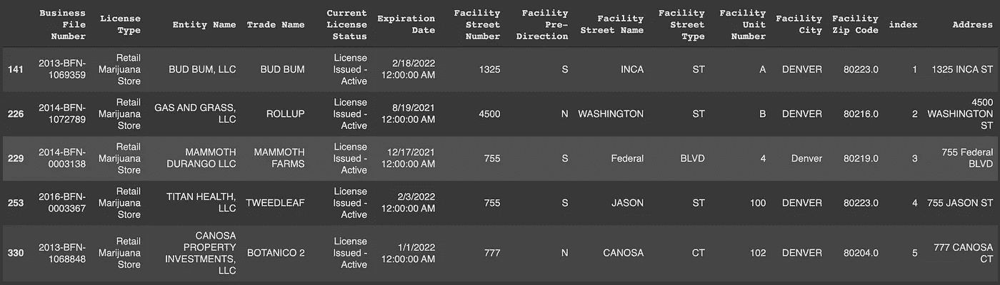

以下是安全图模式数据的外观:

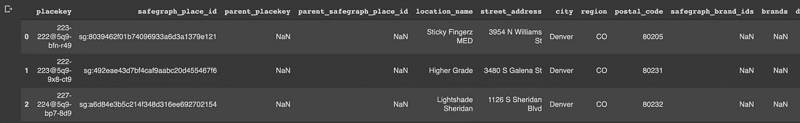

因此，现在我们有两个独立的数据集，一个来自官方城市丹佛，包含位置坐标和酒类许可证类型等信息，另一个来自 SafeGraph，包含关于访问和受欢迎程度的信息。问题是，我们如何连接这两个数据集。答案可以在 [Placekey](http://placekey.io/) 生成的概念中找到。

Placekey 通过为所有感兴趣的点生成唯一的标识符并将生成的值用作连接列，解决了地址匹配概念带来的许多问题。创建地点键的过程非常简单，在[这里](https://www.placekey.io/tutorials/joining-poi-and-non-poi-datasets-with-placekey)可以找到这个过程的详细步骤。

```
patterns_18_m_path = ‘/content/drive/MyDrive/UpWork/safeGraph/Data Projects/Project1/Patterns Data M/year sep/patterns_2018_m.csv’patterns18_m_df = pd.read_csv(patterns_18_m_path)#{‘city’, ‘iso_country_code’, ‘query_id’, ‘location_name’, ‘longitude’, ‘postal_code’, ‘region’, ‘latitude’, ‘street_address’}def get_df_for_api(df, column_map = {“index”: “query_id”, “Entity Name” : “location_name”,”Address” : “street_address”,“Facility City”: “city”, “region”: “region”, “Facility Zip Code”: “postal_code”}): df_for_api = df.rename(columns=column_map) cols = list(column_map.values()) df_for_api = df_for_api[cols] df_for_api[‘iso_country_code’] = ‘US’ return(df_for_api)dispo_df[‘index’] = dispo_df[‘index’].astype(str)dispo_df[‘region’] = ‘CO’df_for_api = get_df_for_api(dispo_df)df_for_api[‘postal_code’] = df_for_api[‘postal_code’].astype(int).astype(str)df_for_api
```

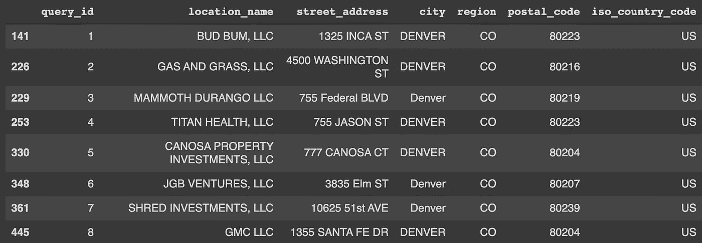

```
data_jsoned = json.loads(df_for_api.to_json(orient=”records”))print(“number of records: “, len(data_jsoned))print(“example record:”)data_jsoned[0]
```

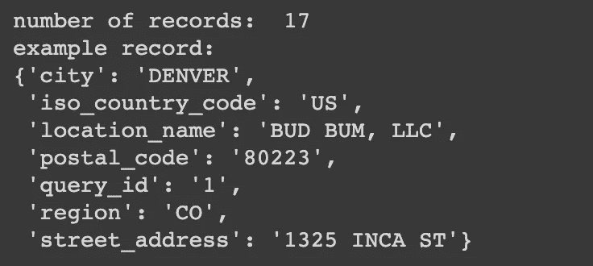

```
responses = pk_api.lookup_placekeys(data_jsoned, verbose=True)df_placekeys = pd.read_json(json.dumps(responses), dtype={‘query_id’:str})df_placekeys.head()
```

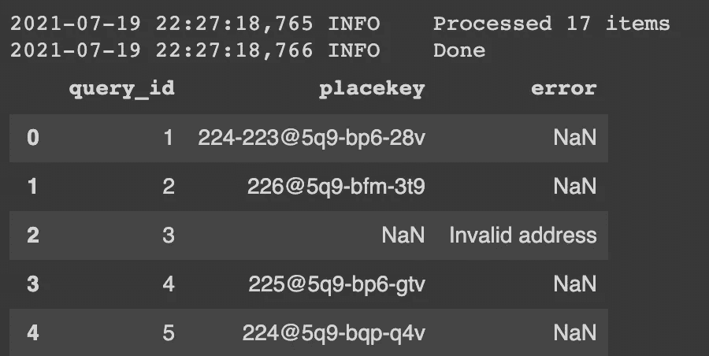

这个代码片段获取这些生成的 Placekeys 并将它们连接到丹佛药房数据:

```
def merge_and_format(loc_df, placekeys_df):   
    lr_placekey = pd.merge(loc_df, placekeys_df, left_on=”index”,
    right_on=”query_id”, how=’left’)    lr_placekey =
    lr_placekey.drop(‘error’, axis=1)
    lr_placekey[‘address_placekey’] = df_placekeys.placekey.str[:3]+
    df_placekeys.placekey.str[-12:]    
    lr_placekey = lr_placekey[[‘placekey’,‘address_placekey’]
    +list(loc_df.columns)]   
    return(lr_placekey)
loc_placekey=merge_and_format(liquor_df,df_placekeys)def merge_with_patterns(patterns_df, loc_res_placekey):
    patterns_df[‘address_placekey’] patterns_df.placekey.str[:3]+patterns_df.placekey.str[-12:]
    df = loc_res_placekey.merge(patterns_df.drop(‘placekey’,  axis=1), how=’inner’,on=’address_placekey’)
    df = df.reset_index().drop(‘index’,axis=1)
    return(df)df = merge_with_patterns(patterns18_df, loc_placekey)cols = list(df.columns)cols.pop(cols.index(‘address_placekey’))df = df[[‘address_placekey’] + cols]print(df.shape)liquor_GS_df = df
```

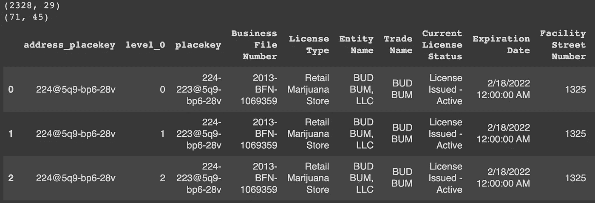

现在我们已经有了格式化的数据，我们可以开始分析它了。

# 丹佛药房:植物 2 的成功

当查看药房数据的总体平均受欢迎程度和访问量时，我们看到以下趋势:

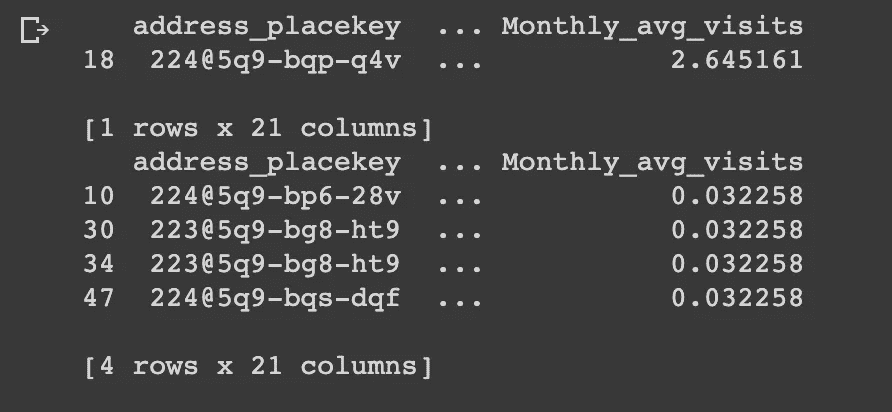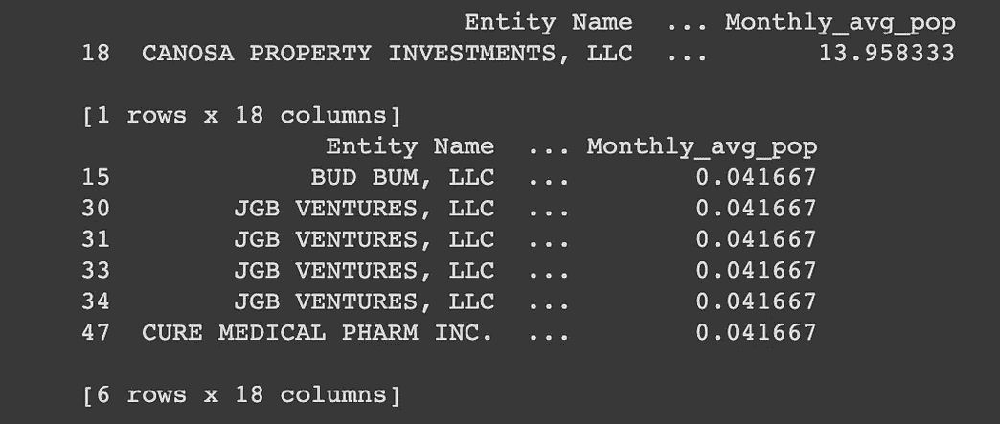

在这两种情况下，2018 年最受欢迎的药房记录对应于 Canosa Properties and Investments LLC，但如果你并排查看这些指标的箱线图，你会发现一个有趣的变化。

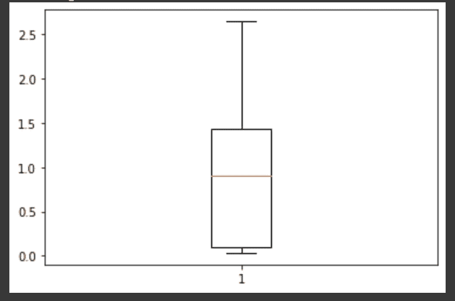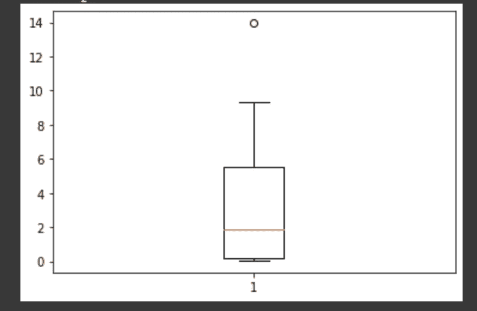

访问者指标没有将该记录的值显示为异常值，这与我们在之前的白酒分析中看到的数据有着奇怪的区别。在酒类分析过程中，如果一个记录是访问者指标的异常值，它也是流行指标的异常值。这是一个有趣的变化，我们可以继续寻找这个潜在的趋势，现在，让我们看看这个特定药房成功背后的原因。

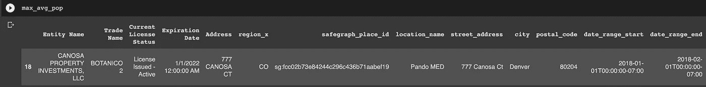

当在谷歌上对商标名 BOTANICO 2 进行快速搜索时，我们看到评级非常好，在 Weedmaps 上为 3.9，在 Leafly 上为 4.7。这可能是一个证据，说明这家药房做得这么好的原因是它提供了这么好的服务和高质量的产品。

这个特定药房的评级与同一邮政编码的其他药房的评级相比如何？

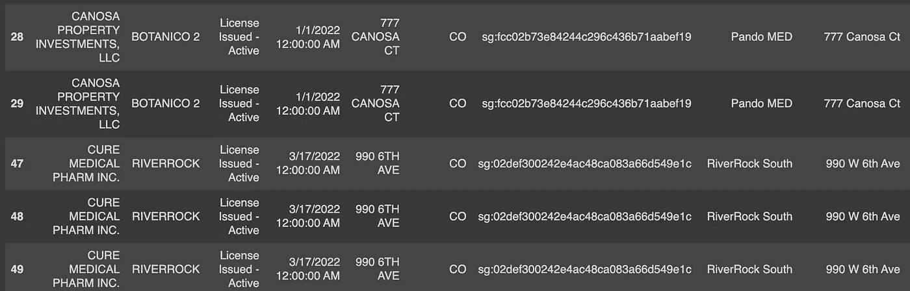

我们可以看到，在这个邮政编码有两个药房，只有 Botanico 有连续良好的受欢迎程度评分，另一个药房的评级不是很好，其他药房的低质量可以归因于 Botanico 2 的成功。

这种特定药房受欢迎的背后是否还有其他原因，比如它周围的当地商店？让我们检查一下与这些记录相关的本地品牌:

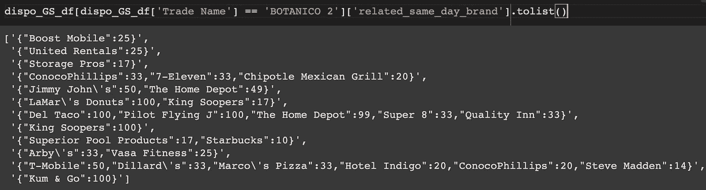

由此我们可以看出，没有品牌与药房的知名度相关联。这种相关性可能归因于大量与药房相关的食品品牌和杂货店，但这不会得到数据的很好支持，因为与酒店和五金店等位置的相关性高于与食品和杂货店的相关性。

让我们分析药房数据的每月数据，看看这是否有助于找到 BOTANICO 2 受欢迎的原因

# 丹佛药房数据的月度分析:寒冷的月份与药房更受欢迎相关吗

与之前的月度趋势分析一样，这里的代码块将比较 2018 年每个月的受欢迎程度和访问指标。在本节中，该代码将不包括在内，因为它重复了每月的白酒分析。要自己研究代码和处理数据，请不要犹豫，去看看[笔记本](https://colab.research.google.com/drive/18c_Ipl6zIUZUUeEAgHxdeaJ44of2sVi1)。

**一月:**

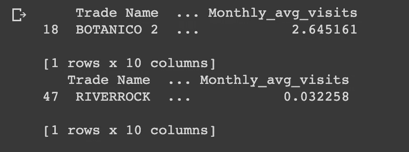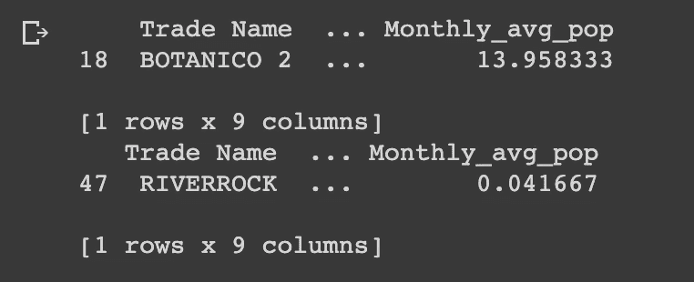

**二月:**

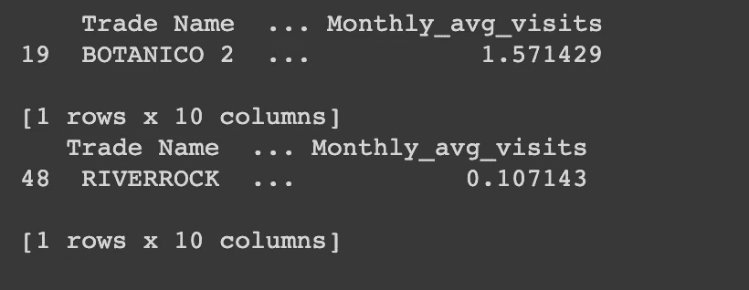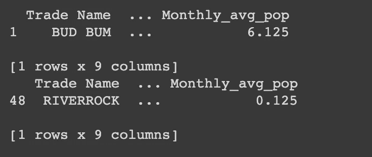

**三月:**

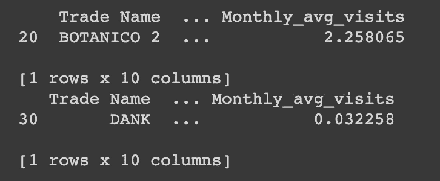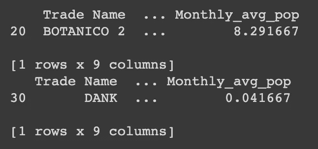

**四月:**

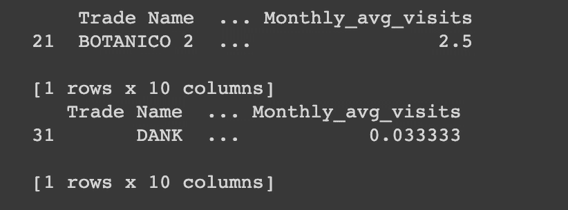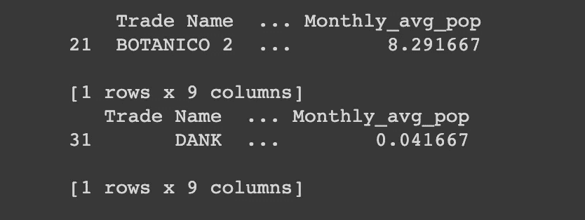

**五月:**

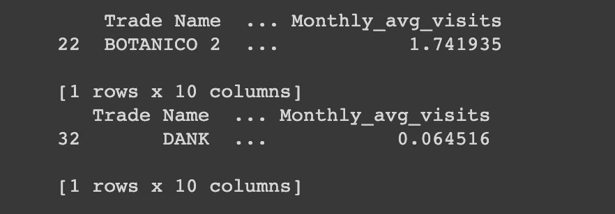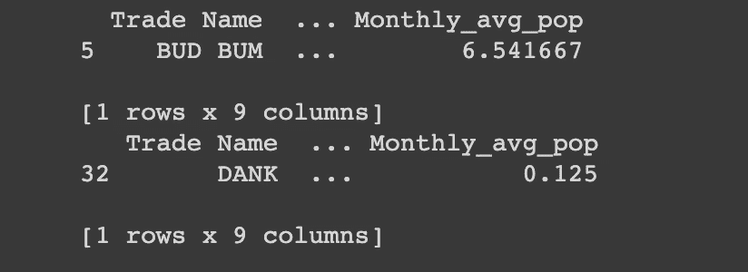

**6 月:**

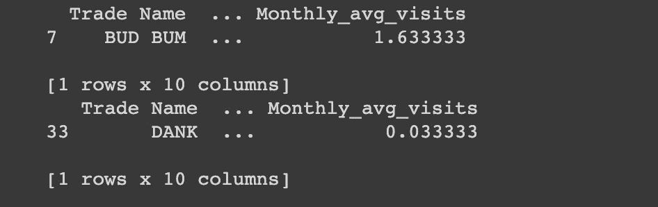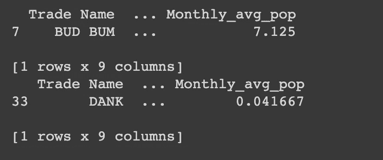

**七月:**

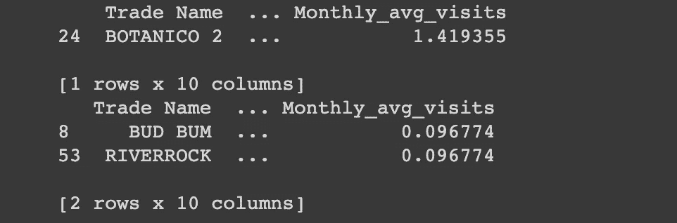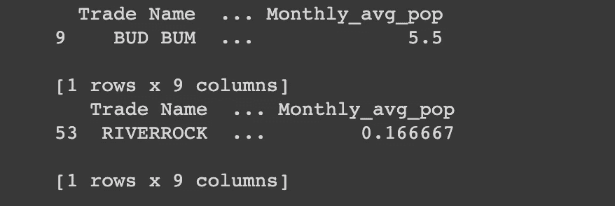

**八月:**

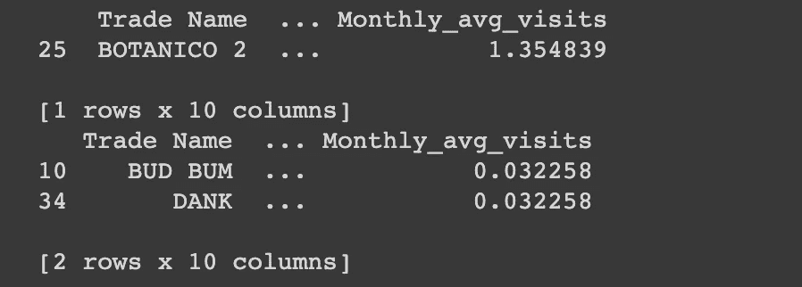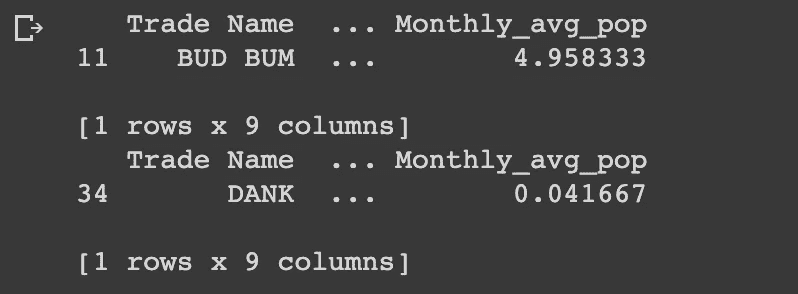

**九月:**

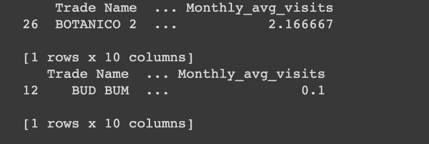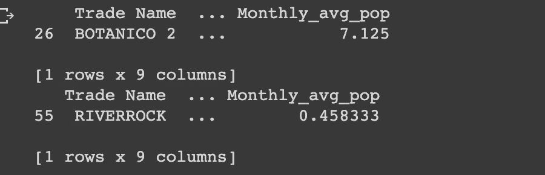

十月:

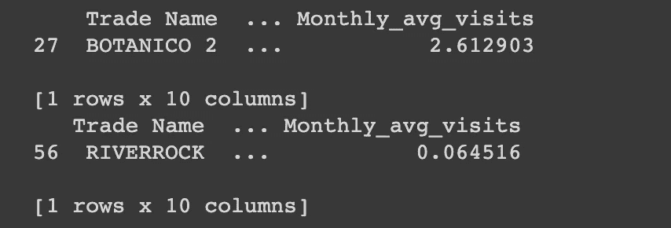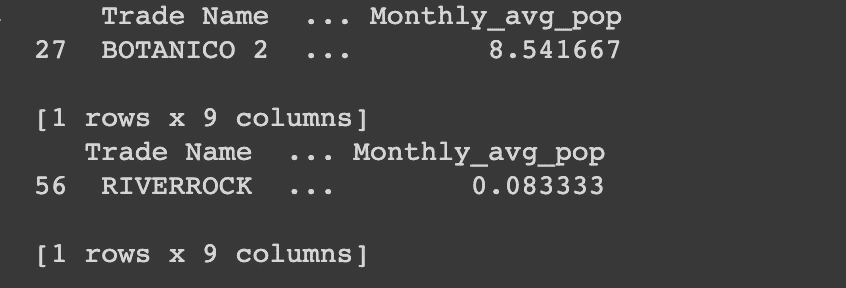

**十一月:**

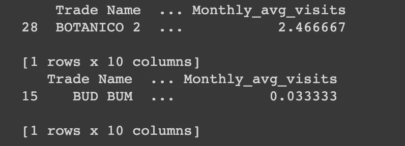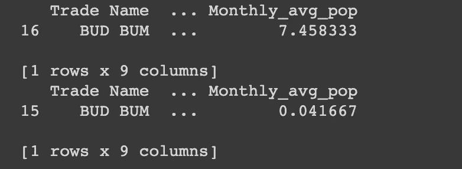

**十二月:**

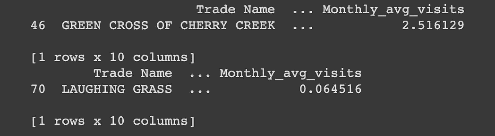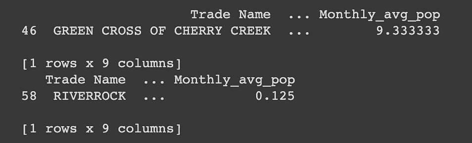

月度分析显示了一个有趣的模式。似乎随着天气越来越冷，2018 年丹佛的药房的受欢迎程度和访问指标都在增加。这当然与酒精消费量的见解形成了鲜明的对比——随着天气变暖，这些指标也会增加。这也与我个人的预期有点矛盾，四月份是这些药房受欢迎的月份。似乎就像节假日酒类销售增长对数据整体结果的最小影响一样，4 月 20 日的大麻销售对该月整体消费的影响非常小，因此 4 月份在该列表中的排名不是很高。现在让我们用季节分析来证实我们关于药房受欢迎程度的理论。

# 药房数据:季节性分析

这个代码片段将以前每月分析的数据汇编到一个表中，并添加了季节性信息:

```
Season_Df = pd.DataFrame(data = {‘Monthly_avg_visits’: [2.645161,1.571429,2.258065,2.5,1.741935,1.633333,1.419355,1.354839,2.166667,2.612903,2.466667,2.516129],’Monthly_avg_pop’: [13.958333,6.125,8.291667,8.291667,6.541667,7.125,5.5,4.958333,7.125,8.541667,7.458333,9.333333],‘Season’: [‘Winter’,’Winter’,’Spring’,’Spring’,’Spring’,’Summer’,’Summer’,’Summer’,’Fall’,’Fall’,’Fall’,’Winter’]})Season_Df.head()
```

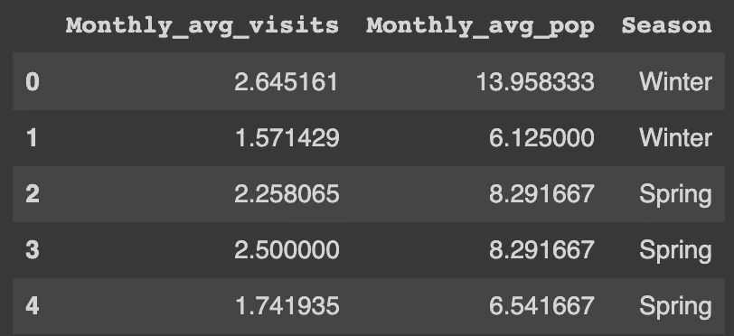

这些数据提供了以下图表:

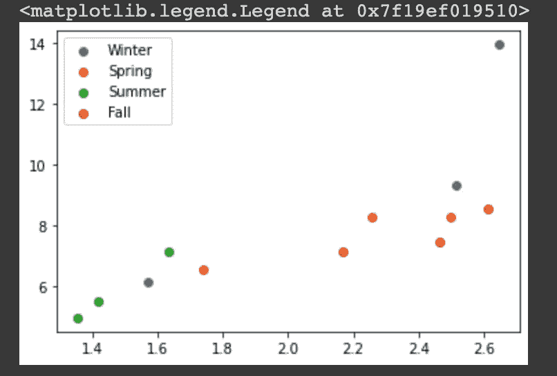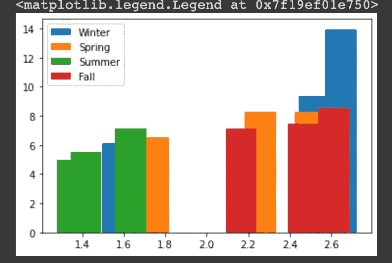

从这些图中，我们首先可以看到访问者和受欢迎程度指标之间的相关性是线性的，这一发现也与线性数据相同。仔细观察，我们可以发现冬季和秋季比其他月份更受欢迎。这与之前的酒类数据形成鲜明对比，之前的数据显示，在较温暖的月份，酒类商店的人气有所上升。让我们将同样的分析应用于整个数据集，而不仅仅是月平均值，看看趋势是否成立

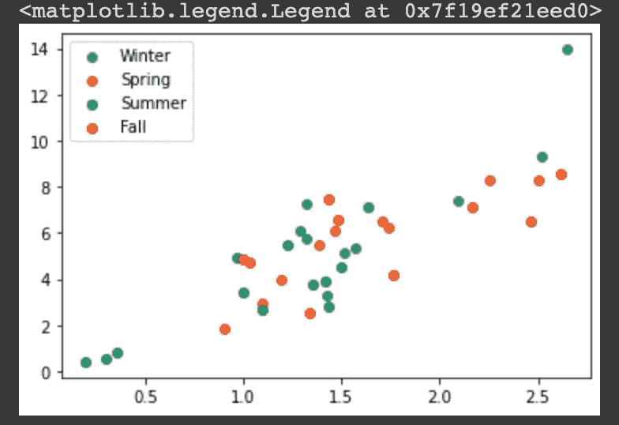

从这些趋势我们可以看出，当使用完整的数据时，受欢迎程度和访问之间的相关性仍然存在。此外，我们可以再次看到，显示最受欢迎的季节是冬季和秋季，从而支持我们的假设。

# 结论:

就来访者而言，按季节划分，诊所接待来访者最多的月份是 1 月、10 月、11 月、12 月和 3 月。这令人惊讶，因为随着 4 月 20 日的到来，大麻消费成为一个受欢迎的日子，4 月份成为最受欢迎的月份更有意义。但就像酒类数据一样，一个月中某一天产品受欢迎并不能抵消整个月的平均总访问量。目前的趋势是，随着天气变冷，诊所就诊人数增加。

至于受欢迎程度，药房最受欢迎的月份是一月、十二月、十月、三月、四月和十一月。这似乎很有趣，因为它与就诊的季节性趋势相关——较冷的月份往往显示药房受欢迎的程度增加。目前的一个趋势是，4 月份的受欢迎程度大幅上升。这很有趣，因为访问和流行趋势之间的变化。这可能是因为 BOTANICO 2 药房通过在线销售实现了大部分销售。这可能是受欢迎程度增加但访问量没有增加背后的原因。

***提问？***

我邀请你在 [SafeGraph 社区](https://www.safegraph.com/academics)的 **#safegraphdata** 频道问他们，这是一个面向数据爱好者的免费 Slack 社区。获得支持、共享您的工作或与 GIS 社区中的其他人联系。通过 SafeGraph 社区，学者们可以免费访问美国、英国和加拿大 700 多万家企业的数据。