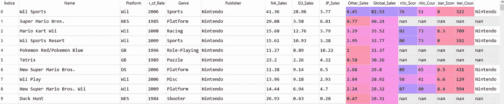
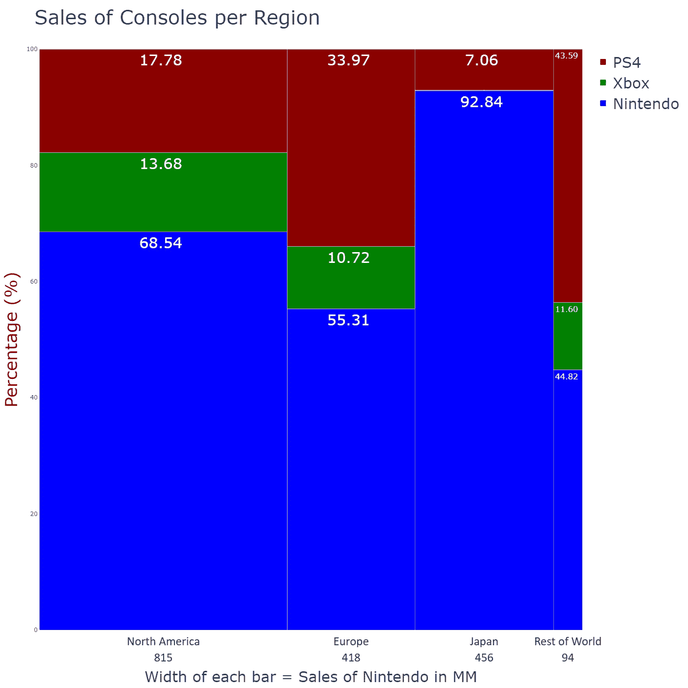
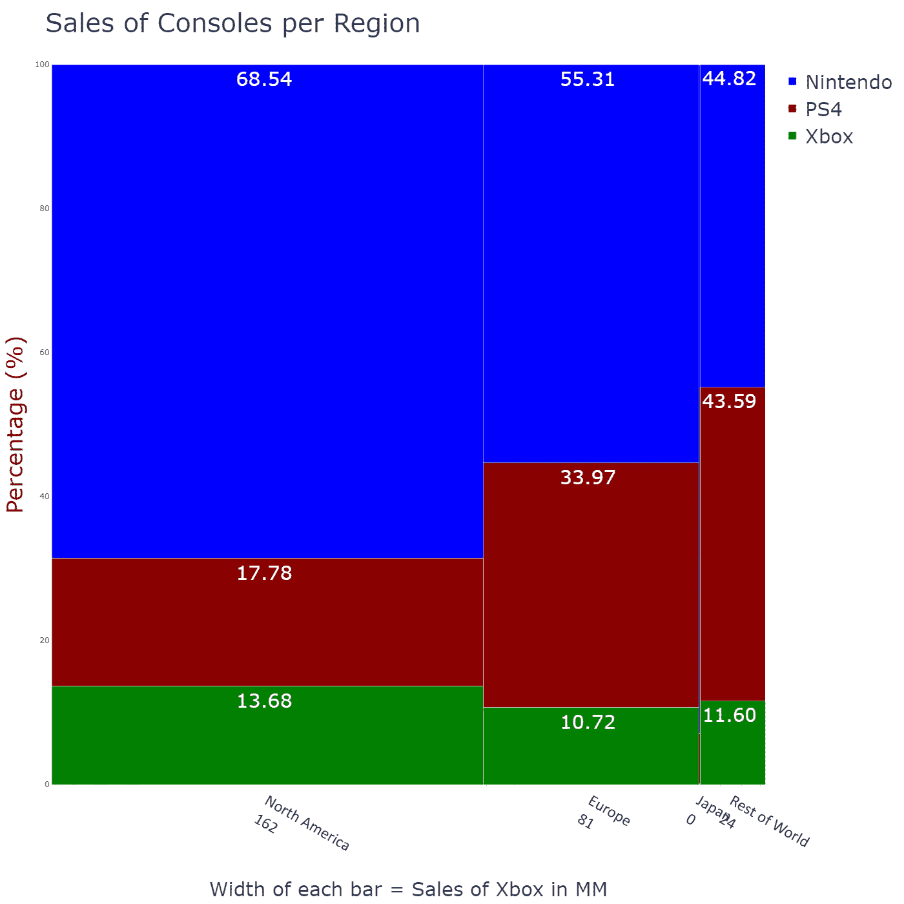
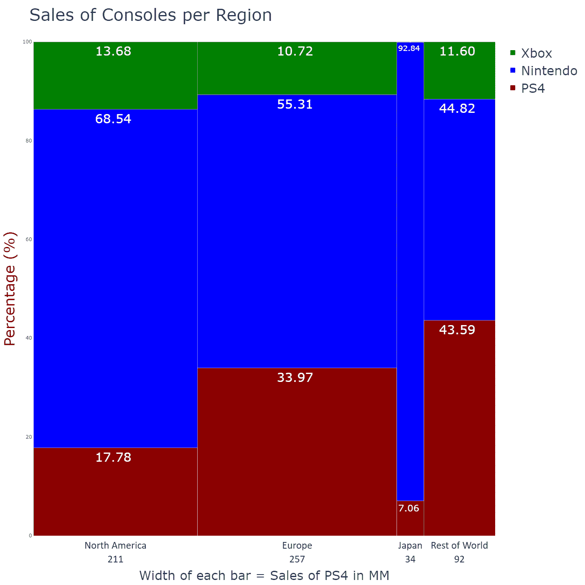

# 使用 Plotly Express 的 Marimekko 图表

> 原文：<https://towardsdatascience.com/marimekko-charts-with-plotly-express-you-can-also-lie-with-charts-4ee98a30ed66?source=collection_archive---------31----------------------->

# 你也可以用图表撒谎


由 Unsplash 放大的图像

# **数据可视化**

假设你参加了一个商业计划竞赛。你需要展示一个令人信服的商业案例，因为投资者会根据你的讲述做出决定。

你必须包括视觉上有趣的图形和图像。但是在这里**我们可能会犯双重错误** : 1)观众会看到我们的数字并立即理解我们展示的想法；2)即使在专业环境中，观众也可以接收到一系列重要的复杂可视化，并以我们选择的方式掌握趋势、模式、相关性、比例、分布。

记住:数据可视化是一种交流工具。所以，我们必须经常问自己:我表达清楚了吗？我是否使用了一种不容置疑的数字？如果我们使用可变宽度条形图，这些问题尤其重要。

# **可变宽度条形图**

有不同类型的**可变宽度条形图**，但有两种是最流行的:1)条形图；2) Marimekko 图(Marimekko 是芬兰的纺织品牌，有大而多样的形状图案，也有简单明亮的颜色和风格)。

它们在以下方面有所不同:一个**条形图** (BMc)类似于一个[“标准”条形图，](https://medium.com/@dar.wtz/bar-graphs-why-how-8c031c224c9f)但是它的条形宽度是可变的； **Marimekko 图** (Mc)类似于 1 [00%堆积条形图](/stacked-bar-charts-with-plotly-express-85885e91874f) t，但其条形宽度可变，它是一个条形宽度可变的标准化柱形图。

两个图表都用于**显示数据集中每个类别**的两个数值变量**；目标是**在类别**之间进行比较，而不是在数字变量之间进行比较。它们广泛用于仪表板或营销、销售和业务演示中。**

纵轴有一个数字刻度(在 Marimekko 图上为 100%)，代表一个定量变量。**横轴可以是数字，也可以是类别**。如果是数字**，每个矩形的宽度与第二个定量变量**的值成比例，有不同的颜色，并有一个图例来标识它。如果是分类的，每个条形的宽度也表示第二个定量变量的值。

与标准条形图不同的是，**在条形**之间没有留出空间(注意不要将麦可图与[直方图](https://medium.com/@dar.wtz/histograms-why-how-431a5cfbfcd5)混淆)。)在 BMc 和 Mc 两者中，**水平轴的整个宽度被占据**。

**Mekko 条形图**是传统条形图的替代产品，可让您减少商业演示中图表的数量。为了实现这一点，图表通过条形的高度对一个数字变量进行编码，通过条形的宽度对另一个数量变量进行编码。

**Marimekko 图表**是[簇状条形图](/clustered-overlapped-bar-charts-with-plotly-express-c752d2925cf1)(分组条形图)的替代物，允许减少其在商业展示中的数量:它们显示与主要类别内的子组或子类别相关的数字信息。

**不要混淆 Mcs 和 spineplots** 。根据其最严格的定义， **spineplot** 是一个一维的水平堆积条形图，用于显示[列联表](https://en.wikipedia.org/wiki/Contingency_table)中两个交叉分类的分类变量的频率、比例或百分比。这种混乱是因为一些 spineplots 可视化工具允许垂直方向，他们称之为**马赛克图**。这个术语也被错误地归因于 Marimekko 图表，但应该保留给那些允许**通过可变宽度矩形检查两个或更多分类变量**之间关系的图表。

# **带有 Plotly Express 的 Marimekko 图表**

总部位于加拿大蒙特利尔的计算公司 Plotly 开发了 plotly.py，这是一个用于 Python 的交互式开源可视化工具。2019 年，该公司发布了 Plotly 4.0，其中包括 **Plotly Express** ，这是一个与 Plotly 生态系统的其余部分**完全兼容的高级包装器。**

**Plotly** 提供了一组名为*的图形对象*的类，可以用来构造图形。 *plotly.graph_objects* 模块包含了 Python 类的层次结构。*图*是初级类。*图*有一个**数据属性**和一个**布局属性**。数据属性有 40 多个对象，每个对象引用一个特定类型的图表( **trace)** 及其相应的参数。布局属性指定图形的整体属性(轴、标题、形状、图例等。).

我们使用了从 Kaggle 下载的数据集。该数据集包含从 VzCharts 收集的与视频游戏销售和游戏评级数据相关的记录。我们特别选取了三个 csv 文件:1)索尼[1]关于 **Playstation 4** 平台上视频游戏销售的 1031 条记录；2) 422 条关于**微软 Xbox One** 主机【2】上视频游戏销售的记录；3) 11563 条关于来自不同发行商【3】的**视频游戏** **销售的记录。我们想知道不同平台的销售额在全球几个地区的分布情况。**

首先，我们导入 Plotly Express 为 *px，*模块 *plotly.graph_objects* 为 *go* ，库 Numpy & Pandas 分别为 *np* 和 *pd* 。

```
import plotly.graph_objects as goimport plotly.express as pximport numpy  as npimport pandas as pd
```

然后，我们使用 *read_csv* 函数将逗号分隔值( *csv* )文件读入它们对应的数据帧。

```
df1 = pd.read_csv(path + 'XboxOne_GameSales2.csv', 
                  index_col =False, header = 0, 
                  sep = ';',   engine='python')df2 = pd.read_csv(path + 'PS4_GamesSales2.csv', 
                  index_col = False, header = 0,
                  sep = ';', engine='python')df3 = pd.read_csv(path + 'Video_Games_Sales.csv', 
                  index_col = False, header = 0,
                  sep = ';', engine='python')
```

下面的截图显示了名为 *df1* 的数据集的前十条记录(对应 XboxOne):


名为 *df2* 的数据集具有与 *df1* 相同的列数和名称，但是*df3*(*Video _ Games _ Sales*)具有非常不同的布局:



对于我们的计算，我们只需要存储四个感兴趣地区(北美、欧洲、日本和世界其他地区)销售额的列。在 *df1* 和 *df2* 中，我们简单地选择相应的四列，但是 *df3 r* 需要预处理来均衡数据。预处理任务只包括选择 Nintendo sales 并重命名四个选定的列:

```
df1 = df1[['North America', 'Europe', 'Japan', 'Rest of World']]df2 = df2[['North America', 'Europe', 'Japan', 'Rest of World']]df3 = df3.drop(df3[(df3.Publisher != 'Nintendo')].index)df3 = df3[['NA_Sales', 'EU_Sales', 'JP_Sales', 'Other_Sales']]df3 = df3.rename(columns={'NA_Sales': 'North America', 
                          'EU_Sales': 'Europe',
                          'JP_Sales': 'Japan',
                          'Other_Sales' :'Rest of World'})
```

然后，我们将函数 *sum()* 应用于三个数据帧。记住函数 *sum()* 返回所请求的轴的值的总和。

同样，df3 需要预处理，因为在应用函数 *sum()* 之前，我们必须使用 *pd.to_numeric，errors = ' compete '将存储为 object 的列数据转换为数字。*选项*错误= '强制'*将非数值转换为 *NaN* 。

最后，我们将这三个文件连接起来，并在一个名为 *df4* 的新数据帧中计算各自的百分比。

```
sum_1 = df1.sum(axis = 0, skipna = True)sum_2 = df2.sum(axis = 0, skipna = True)df3 = df3.apply(pd.to_numeric, errors='coerce')sum_3 = df3.sum(axis = 0, skipna = True)list_df = [sum_1, sum_2, sum_3]df4 = pd.concat(list_df , axis = 1).reset_index()df4.columns = ['region', 'xbox', 'ps4', 'nint']df4['perc_xbox'] = (df4['xbox'] / ( df4['xbox'] + df4['ps4'] + 
                    df4['nint'])) * 100df4['perc_ps4']  = (df4['ps4']  / ( df4['xbox'] + df4['ps4'] + 
                    df4['nint'])) * 100df4['perc_nint'] = (df4['nint'] / ( df4['xbox'] + df4['ps4'] + 
                    df4['nint'])) * 100
```

为了绘制一个可变宽度条形图，我们使用一个名为 *data* 的字典进行堆栈排序，使用另一个名为 *colors* 的字典进行条形颜色排序，并使用一个系列(*width*和一个变量( *width_x* )来指定水平轴上条形的宽度:

```
data = {"Nintendo": df4['perc_nint'],
        "Xbox"    : df4['perc_xbox'],
        "PS4"     : df4['perc_ps4']
        }colors= {"Nintendo": 'blue',
         "Xbox"    : 'green',
         "PS4"     : 'darkred'
        }widths  = sum_3
x_width = sum_3.sum()
```

与 *plotly.graph_objects* 的概念思路是使用。 *add_trace(去。*(bar())创建图然后添加等方法。*更新 _ 布局()，。update_xaxes，。更新 _yaxes* 来操作图形。最后，我们用*导出图形。write_image()* 用*渲染。显示()。*

注意 *add_trace(go。Bar())* 根据我们在名为 data 的字典中决定的顺序，位于 for 循环内部。

我们用 *update.layout* 更新了图表:设置标题文本、标题字体和图例字体，并设置图形尺寸(宽度和高度)。 *barmode = 'stack'* 确定**条堆叠在另一条的顶部**。

然后我们更新了 x 轴和 y 轴(文本、字体、tickfont)。将 y 轴范围设置在 0 到 100%之间，将 x 轴范围设置在 0 到 x_width 之间。

```
fig = go.Figure()
for key in data:
fig.add_trace(go.Bar(name = key,
                     y = data[key],
                     x = np.cumsum(widths) - widths,
                     width = widths, offset = 0,
                     marker = {'color' : colors[key]},
                     customdata = data[key],
                     texttemplate = "%{y:.2f}",
                     textposition = "inside",
                     textangle = 0,textfont_color = "white",
                     textfont_size = 30))fig.update_layout(title_text ="Sales of Consoles per Region",
                  barmode = "stack",
                  title_font_size  = 40,legend_font_size = 30,
                  width = 1400, height = 1400)fig.update_xaxes(title_text=
                 'Width of each bar=Sales of Nintendo in MM',
                 range = [0, x_width],  
                 title_font_size = 30,                   
                 tickvals = np.cumsum(widths)-widths/2,
                 ticktext =["%s<br>%d"% l, w)for l,w 
                            in zip(labels, widths)],
                 tickfont = dict(family='Calibri', 
                                color='black', size=25))fig.update_yaxes(title_text = 'Percentage (%)',
                 range = [0,100],
                 title_font=dict(size=35,
                                 family='Verdana', color='darkred'))fig.write_image(path + "figmarimekko1.png")fig.show()
```



图 1:作者用 Plotly Express 制作的 Marimekko 图。

图 1 在一张图表中描述了任天堂视频游戏在不同地区的累计销售额，以及不同游戏机对应的百分比。可以看到 Marimekko 图的特征要素:一个矩形区域被分成宽度不同的小矩形；垂直堆叠的矩形；占据图表整个宽度的水平轴；带有百分比刻度的垂直轴；特定品牌(任天堂)的总销售额在较低的基线上；不同的条形宽度允许计算每个地区对总销售额的相对贡献。

但是堆叠顺序的选择完全是任意的。那么，如果我们改变顺序会发生什么呢？我们只需要对代码做一些简单的修改:

```
data = {"Xbox"    : df4['perc_xbox'],
        "PS4"     : df4['perc_ps4'],
        "Nintendo": df4['perc_nint']
        }
widths  = sum_1
x_width = sum_1.sum()
```



图 2:作者用 Plotly Express 制作的 Marimekko 图。

在图 2 中，不同宽度的矩形是由感兴趣地区的不同 XboxOne 销售情况给出的。虽然不同游戏机之间的销售百分比保持不变，但观众会收到非常不同的信息，尤其是在日本。

如果横轴按 PS4 控制台销售进行细分，情况也是如此:

```
data = {"PS4"     : df4['perc_ps4'],
        "Nintendo": df4['perc_nint'],
        "Xbox"    : df4['perc_xbox']
        }
widths  = sum_2
x_width = sum_2.sum()
```



图 3:作者用 Plotly Express 制作的 Marimekko 图。

这是 Marimekko 图表的主要缺点:它们不仅**难以阅读和解释**，因为它们是基于观众通过比较区域来解码数字信息的能力，而且它们还会**误导观众得出错误的结论**。

正如 Alberto Cairo 明智地指出的那样[4]: **“正如我们可以用统计数据撒谎一样，我们也可以用图表撒谎”**

如果你对这篇文章感兴趣，请阅读我以前的([https://medium.com/@dar.wtz](https://medium.com/@dar.wtz)):

带有 Plotly Express、趋势线和分面的散点图

</scatter-plots-with-plotly-express-1b7f5579919b>  

带有 Plotly Express、主题和模板的直方图

</histograms-with-plotly-express-e9e134ae37ad>  

**参考文献**

【1】:[https://www.kaggle.com/sidtwr/videogames-sales-dataset?select=PS4_GamesSales.csv](https://www.kaggle.com/sidtwr/videogames-sales-dataset?select=PS4_GamesSales.csv)

[2]:https://www.kaggle.com/sidtwr/videogames-sales-dataset?select = Xbox one _ gamesales . CSV

[3]:https://www.kaggle.com/sidtwr/videogames-sales-dataset?select = Video _ Games _ Sales _ as _ at _ 22 _ Dec _ 2016 . CSV

[4]:[http://albertocairo.com/](http://albertocairo.com/)