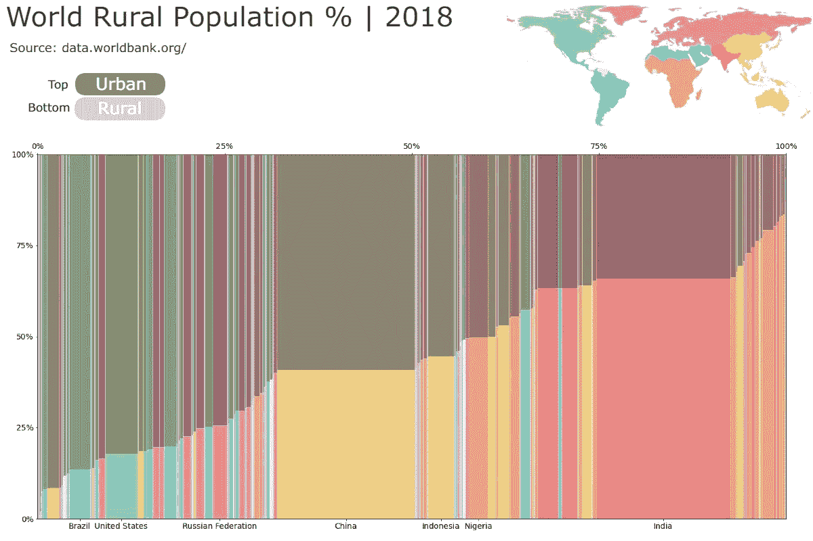

# 使用 Python 的 Matplotlib 制作 Marimekko 图表

> 原文：<https://towardsdatascience.com/marimekko-charts-with-pythons-matplotlib-6b9784ae73a1?source=collection_archive---------12----------------------->

## 可视化分组和分段比例的好方法


Marimekko 图表—图片由作者提供

通常被称为马赛克图，脊柱图，或只是 Mekko。在其他应用程序中，该图表通常用作市场地图，以可视化按客户类型、地区和许多其他变量划分的行业。

本质上，它们只是一个堆叠的条形图，其中的条形宽度用于显示另一个变量，通常是整个组占总数的比例。


Marimekko 图表—图片由作者提供

比例对于发现模式和比较不同规模的群体非常有用。本文将探讨如何用 Matplotlib 中的 Marimekko 图表来改进我们可视化它们的方式。

## 为什么要使用 Marimekko 图表

我们将通过一个 Marimekko 图表的快速示例来说明它们的可用性，最后，我们将看到如何更系统地绘制它们。

首先，我们将导入我们将使用的库。

```
import pandas as pd
import matplotlib.pyplot as plt
import numpy as np
```

在我们公司，部门 **A** 的 30 人和部门 **B** 的 20 人希望继续远程工作。

```
y = np.array([.3, .4, .7, .8]) * np.array([100., 50., 100., 300.])
x_label = ['a','b','c', 'd']
plt.bar(x_label, y)
plt.show()
```


条形图—作者提供的图片

光是这些信息是没有帮助的，而且可能会产生误导，因为我们不知道每个部门有多少人在工作。分析比例会更有见地。

```
y = [.3, .4, .7, .8]
x_label = ['a','b','c', 'd']plt.bar(x_label, y) # bottom bar
plt.bar(x_label, np.ones(len(y))-y, bottom=y) # top barplt.ylim(0,1)
plt.yticks([0, 0.25, 0.5, 0.75, 1], ['0%', '25%', '50%', '75%', '100%'])plt.show()
```


百分比堆积条形图—图片由作者提供

但是，假设我们也想把所有部门想象成一个整体。上面的图表可能也会误导我们。我们可以说这是一个整体“分裂”的意见；一半部门在 50%以上，另一半在 50%以下，这是不对的。

为了从整体上了解各个部门，我们需要多种可视化或不同的方法，如树状图和 **Marimekko 图表**。

```
fig, ax = plt.subplots(1)
y = [.3, .4, .7, .8]
x = [100, 50, 100, 300]
x_label = ['a','b','c', 'd']
width = [i/sum(x) for i in x]# calculate x coordinates based on the width of the previous bars
# same as: [0, width[0], width[0] + width[1], width[0] + width[1] + width[2]]
adjusted_x, temp = [0], 0
for i in width[:-1]:
    temp += i
    adjusted_x.append(temp)# Marimekko chart
plt.bar(adjusted_x, y, width=width, align='edge', edgecolor='black')
plt.bar(adjusted_x, np.ones(len(y))-y, bottom=y, width=width, align='edge', edgecolor='black')# x and y ticks (%)
ax.set_yticks([0, 0.25, 0.5, 0.75, 1])
ax.set_yticklabels(['0%', '25%', '50%', '75%', '100%'])
ax.set_xticks([0, 0.25, 0.5, 0.75, 1])
ax.set_xticklabels(['0%', '25%', '50%', '75%', '100%'])plt.ylim(0,1)
plt.xlim(0,1)# twin y-axis to draw x-ticks at the top
axy = ax.twiny()
axy.set_xticks([(width[i]/2)+ v for i, v in enumerate(adjusted_x)])
axy.set_xticklabels(x_label, fontsize=14)plt.show()
```


Mekko 图表—图片由作者提供

这种可视化帮助我们毫不费力地将部门内的比例以及每个部门占总数的比例可视化。

我们可以清楚地看到，我们公司的绝大多数人都希望继续远程工作，但我们仍然注意到，较小的部门似乎不太热衷于这一想法。

## 数据集

现在，为了更系统地使用 Marimekko 图表，让我们尝试使用 Pandas 数据框。这样，我们可以更容易地在列、行和数据集之间切换。

我将使用的数据集来自[世界银行公开数据](https://data.worldbank.org/)。我想将一些指标的比例形象化，如[农村人口](https://data.worldbank.org/indicator/SP.RUR.TOTL.ZS)、[用电](https://data.worldbank.org/indicator/EG.ELC.ACCS.ZS)和[识字率](https://data.worldbank.org/indicator/SE.ADT.LITR.ZS)。但我也想说明这些国家占总人口的比例。


人口数据框-图片由作者提供

世界银行数据集可能包含一些区域、次区域、社会经济群体等行，但我们希望将国家与其他国家进行比较。我们需要一些国家的列表来清理我们的数据框架，例如*所有国家*、*拉丁美洲&加勒比海*、*欧盟*等等。

我们还需要考虑，我们不会给每个国家贴标签；那就太杂乱了，所以我们还需要选择一些国家来突出显示。

由于这些内容广泛，我将在这里 留下这部分代码 [**的链接。**](https://gist.github.com/Thiagobc23/40054ae4a6e6b98a3abb982cfa645651)

现在，让我们创建一些字典，以便更容易地与所有这些列表和值进行交互。

```
var_dict = {'Rural Population':
             {'file':'API_SP.RUR.TOTL.ZS_DS2_en_csv_v2_2166125.csv',
              'label':'Rural Pop. (%)',
              'legend':['Rural Population', 'Urban Population'],
              'min_year':1960,
              'max_year':2019}, 

            'Access to Electricity':
             {'file':'API_EG.ELC.ACCS.ZS_DS2_en_csv_v2_2164123.csv',
              'label':'Access to Electricity (%)',
              'legend':['Access to Electricity', 
                        'No Access to Electricity'],
              'min_year':1990,
              'max_year':2018},

            'Literacy':
             {'file':'API_SE.ADT.LITR.ZS_DS2_en_csv_v2_2163525.csv',
              'label':'Literacy Rate (age +15)',
              'legend':['Literate Pop.', 'Illiterate Pop.'],
              'min_year':1970,
              'max_year':2018},

            'Unemployment':
             {'file':'API_SL.UEM.TOTL.ZS_DS2_en_csv_v2_2163385.csv',
              'label':'Unemployment (ILO Estimate)',
              'legend':['Unemployed', 'Employed'],
              'min_year':1991,
              'max_year':2019}}countries_dict = {"All":all_countries,
                  "European Union": eu, 
                  "Latin America & Caribbean": la_c,
                  "East Asia and Pacific": eap,
                  "Europe and Central Asia": eca,
                  "Middle East and North Africa": mena,
                  "North America": na,
                  "South Asia" : sa,
                  "Sub-Saharan Africa": ssa,
                  "Custom":False}highlights_dict = {"All":highlight_all,
                  "European Union": highlight_eu, 
                  "Latin America & Caribbean": highlight_la_c,
                  "East Asia and Pacific": [],
                  "Europe and Central Asia":[],
                  "Middle East and North Africa":[],
                  "North America":[],
                  "South Asia" : [],
                  "Sub-Saharan Africa":[],
                  "Custom":[]}
```

我们已经做好了一切准备，可以更有效地与数据集进行交互。现在让我们设置变量并开始清理。

```
year = 2018
countries_select = "All"
indicator = 'Rural Population'
countries = countries_dict[countries_select]
highlight = highlights_dict[countries_select]
```

无论我们绘制什么指标，人口数据框架都是一样的。尽管如此，指标数据框架将取决于我们从以前的代码中选择，在这种情况下，农村人口。

```
pop_file = 'API_SP.POP.TOTL_DS2_en_csv_v2_2163507.csv'df = pd.read_csv('../data/'+pop_file)
var_df = pd.read_csv('../data/'+var_dict[indicator]['file'])df = df.merge(var_df, 
              left_on='Country Name', 
              right_on='Country Name', 
              suffixes=['_pop', '_var_df'])
```


合并的数据框-作者提供的图片

合并后的数据框将为人口和变量指标的每一年提供一列。

## 清洁

我们将删除不在列表中的国家，删除没有值的行，并按指标值对行进行排序。

```
# remove non-countries
df = df[df['Country Name'].isin(countries)]# remove rows with empty values for the indicator or population
df = df[(df['{}_var_df'.format(year)].notna() & df['{}_pop'.format(year)].notna())]# sort rows by the indicator values 
df.sort_values('{}_var_df'.format(year), inplace=True)
```


经过清理和排序的数据框-图片由作者提供

## 准备数据

接下来，我们需要定义 Y，这是每个国家的指标值。

条形的宽度就是人口数量。X 是宽度的累积和。

```
# get y
y = df['{}_var_df'.format(year)]/100# get the width of the bars (population / 1mi)
width = df['{}_pop'.format(year)].values / 1000000# calculate the x position of each country
# x is the cummulative sum of all previous widths
x = [0]
temp = 0
for i in width[:-1]:
    temp += i
    x.append(temp)
```

我们将定义的最后一个变量与 x 记号和国家标签相关。我们将使用高亮列表来绘制记号，获取国家的 X 和一半宽度来定位标签。

```
# create lists with the x ticks positions and labels
# based on a list of countries we want to highlight
xticks_pos = []
xticks_labels = [] 
for i, v in enumerate(df['Country Name']):
    if v in highlight:
        xticks_pos.append(width[i]/2 + x[i])
        xticks_labels.append(v)
```

厉害了，我们有 **X** 、 **Y** 、**宽度**、 **x 刻度位置**和**标签**。

## 绘制 Marimekko 图表

我们完成了函数的第一部分。现在我们可以开始绘制条形图，并使用变量来绘制 Marimekko 图。

默认情况下，Matplotlib 在 x 位置的中心对齐条形，我们需要它们在边缘。我们还需要给每个条形添加一个轮廓，这样我们就可以区分它们。

```
fig, ax = plt.subplots(1, figsize=(24,12))# plot proportions
plt.bar(x, y, 
        width=width, 
        align='edge', 
        edgecolor='w', 
        linewidth=0.5, 
        color='#559A65')# plot ones - proportions at the top
plt.bar(x, np.ones(len(y))-y, bottom=y, 
        width=width, 
        align='edge', 
        edgecolor='w', 
        linewidth = 0.5, 
        color='#477C91')
```


Marimekko 图表—图片由作者提供

接下来，我们需要修改 x 和 y 的限制来删除空白，并用一些适当的值替换 x 和 y 记号。

要在 x 轴上绘制百分比和标签，我们需要写第一个，设置一个双 y 轴，然后写另一个。

```
fig, ax = plt.subplots(1, figsize=(24,12))plt.bar(x, y, 
        width=width, 
        align='edge', 
        edgecolor='w', 
        linewidth=0.5, 
        color='#559A65')plt.bar(x, np.ones(len(y))-y, bottom=y, 
        width=width, 
        align='edge', 
        edgecolor='w', 
        linewidth = 0.5, 
        color='#477C91')# xy limits
plt.xlim(0, x[-1]+width[-1])
plt.ylim(0,1)# xy ticks
plt.xticks(xticks_pos, xticks_labels, fontsize=14)
plt.yticks(np.arange(0,1.1,0.25), 
          ['{:.0f}%'.format(i*100) for i in np.arange(0,1.1,0.25)],
          fontsize=14)# twin y-axis to draw x-ticks at the top
axy = ax.twiny()# max value on the x axis
max_x = (x[-1] + width[-1])# get the values for 0%, 25%, 50%, 75%, and 100%
x_ticks_percent = np.arange(0, max_x+1, max_x/4)# set ticks and labels
axy.set_xticks(x_ticks_percent)
axy.set_xticklabels(['{:.0f}%'.format(i*100) for i in x_ticks_percent/max_x],fontsize=14)plt.show()
```


Marimekko 图表—图片由作者提供

就是这样。我们需要添加一个图例，标题，一些注释，并在一个函数中获得所有这些代码，以方便地切换指标和国家。

```
def marimekko(countries_select, indicator, 
              year, countries, highlight): ##################
    ###### DATA ######
    ##################
    pop_file = 'API_SP.POP.TOTL_DS2_en_csv_v2_2163507.csv'
    df = pd.read_csv('../data/'+pop_file)
    var_df = pd.read_csv('../data/'+var_dict[indicator]['file'])
    df = df.merge(var_df, 
                  left_on='Country Name', 
                  right_on='Country Name', 
                  suffixes=['_pop', '_var_df'])

    # remove non-countries
    df = df[df['Country Name'].isin(countries)] # remove rows with empty values for the indicator or population
    df = df[(df['{}_var_df'.format(year)].notna() & df['{}_pop'.format(year)].notna())] # sort rows by the indicator values 
    df.sort_values('{}_var_df'.format(year), inplace=True) # get y
    y = df['{}_var_df'.format(year)]/100 # get the width of the bars (population / 1mi)
    width = df['{}_pop'.format(year)].values / 1000000 # calculate the x position of each country
    # x is the cummulative sum of all previous widths
    x = [0]
    temp = 0
    for i in width[:-1]:
        temp += i
        x.append(temp) # create lists with the x ticks positions and labels
    # based on a list of countries we want to highlight
    xticks_pos = []
    xticks_labels = [] 
    for i, v in enumerate(df['Country Name']):
        if v in highlight:
            xticks_pos.append(width[i]/2 + x[i])
            xticks_labels.append(v)

    ##########################
    ########## PLOT ##########
    ##########################
    # define figure and axis
    fig, ax = plt.subplots(1, figsize=(24,12)) # bars
    plt.bar(x, y, align='edge', 
            width=width, edgecolor='w', 
            linewidth = 0.5, color='#559A65')
    plt.bar(x, np.ones(len(y))-y, bottom=y, 
            align='edge', width=width, edgecolor='w', 
            linewidth = 0.5, color='#477C91')

    # Add notes (Total population and Year)
    total_pop = df['{}_pop'.format(year)].sum()
    if total_pop > 1000000000:
        total_pop = '{:.2f} bi'.format(total_pop/1000000000)
    elif total_pop > 1000000:
        total_pop = '{:.2f} mi'.format(total_pop/1000000)
    else:
        total_pop = '{:.2f}'.format(total_pop) notes = 'Total population: {} | Year: {}'.format(total_pop,
                                                     year)
    plt.text(x[-1], 1.07, notes, ha='right', fontsize=20) # title and legend
    plt.legend(var_dict[indicator]['legend'], 
               ncol=2, loc='upper left', fontsize=20,
               frameon=False, bbox_to_anchor=(0,1.11))
    plt.title('{} by Country\n\n'.format(var_dict[indicator]['label']), 
              loc='left', fontsize=24)

    # xy limits
    plt.xlim(0, x[-1]+width[-1])
    plt.ylim(0,1) # xy ticks
    plt.xticks(xticks_pos, xticks_labels, fontsize=14)
    plt.yticks(np.arange(0,1.1,0.25), 
              ['{:.0f}%'.format(i*100) for i in np.arange(0,1.1,0.25)],
              fontsize=14)
    # twin y-axis to draw x-ticks at the top
    axy = ax.twiny()
    # max value on the x axis
    max_x = (x[-1] + width[-1])
    # get the values for 0%, 25%, 50%, 75%, and 100%
    x_ticks_percent = np.arange(0, max_x+1, max_x/4)
    # set ticks and labels
    axy.set_xticks(x_ticks_percent)
    axy.set_xticklabels(['{:.0f}%'.format(i*100) for i in x_ticks_percent/max_x], 
                        fontsize=14) plt.savefig('chart.png')
```

太棒了，让我们试试我们的新功能。

```
year = 2018
countries_select = "All"
indicator = 'Rural Population'
countries = countries_dict[countries_select]
highlight = highlights_dict[countries_select]marimekko(countries_select, indicator, year, countries, highlight)
```


Marimekko 图表—图片由作者提供

```
year = 2000
countries_select = "European Union"
indicator = 'Unemployment'
countries = countries_dict[countries_select]
highlight = ['Belgium', 'Czech Republic', 'France', 'Germany', 
             'Italy', 'Poland', 'Portugal', 'Spain', 'Sweden']marimekko(countries_select, indicator, year, countries, highlight)
```


Marimekko 图表—图片由作者提供

太好了！我们有一个很好的可视化工具，可以让我们检查国家的比例和整体的比例。所有这些都在一个函数中，因此我们可以轻松地在不同的指标和国家组之间切换。

现在就看你的了。您可以改进设计，增加交互性，或者在笔记本或脚本中使用它。



用 Python 生成并用 [Pixlr](http://pixlr.com) 编辑的元素—图片由作者提供


用 [Streamlit](https://streamlit.io/) 打造的数据探索 app 图片由作者提供

上述例子的代码可以在[这里](https://github.com/Thiagobc23/Marimekko-charts)找到。

[更多 Python DataViz 教程](https://linktr.ee/admin/settings#Settings--SocialLinks)。

感谢阅读我的文章。希望对你有帮助！