# 降价:从描述性到规定性

> 原文：<https://towardsdatascience.com/markdowns-from-descriptive-to-prescriptive-ec729c4cce82?source=collection_archive---------10----------------------->

## [商业科学](https://medium.com/tag/business-science)

## 3 种分析方法来回收价值和防止浪费

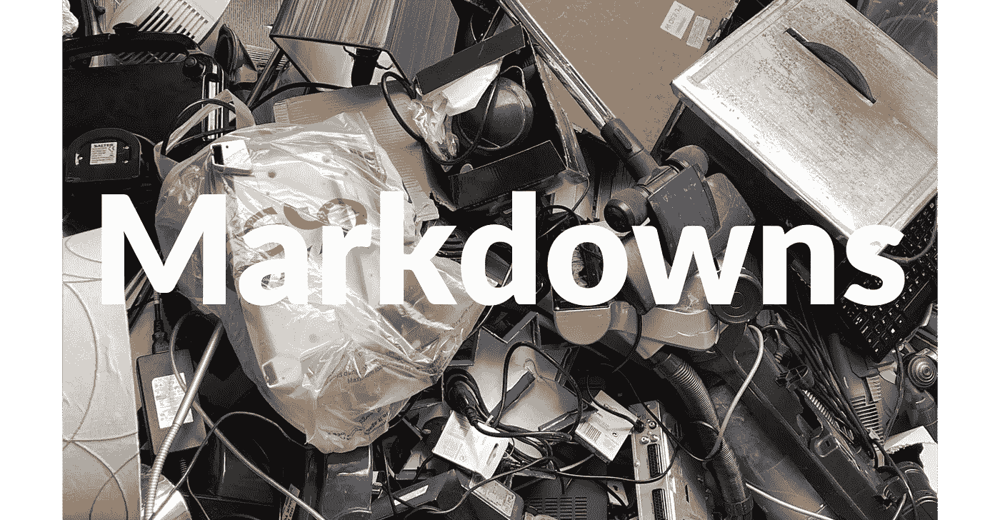

**降价和浪费。**照片由[约翰·卡梅隆](https://unsplash.com/@john_cameron?utm_source=medium&utm_medium=referral)在 [Unsplash](https://unsplash.com?utm_source=medium&utm_medium=referral) 拍摄

> 描述性的、预测性的和规范性的:这三种方法你可以用分析来解决任何商业问题。例如降价。

降价幅度很大:如何处理过剩的库存？

我最近的[文章](/to-forecast-or-not-to-forecast-that-is-the-supply-chain-question-439e0eb47b61)中的一些统计数据:仅在美国**就有超过 2 万亿**的库存——20，400 亿美元——每销售 1 美元就有 1.43 美元的库存。那么，当这 43%的过剩库存达到报废时，该如何处理呢？

当一个产品用尽了销售的可能性，降低它的价格是一个合理的方法，试图清理剩余库存:残值，防止浪费。

降价有 3 种主要方法，展示了**三种主要的分析策略:描述性、预测性和规范性**。在进入细节之前，先了解一下背景。

# 背景:产品金字塔

像任何以产品为中心的分析问题一样，降价需要浏览复杂的产品层级，并在每个层级使用适当的方法。

产品金字塔的一个例子可能如下所示，以名为 [Event Network](https://www.eventnetwork.com/) 的公司为例，该公司是北美体验式零售的领先运营商:遍布美国和加拿大的标志性文化景点和生活方式场所的商店*，例如博物馆、动物园、水族馆。*

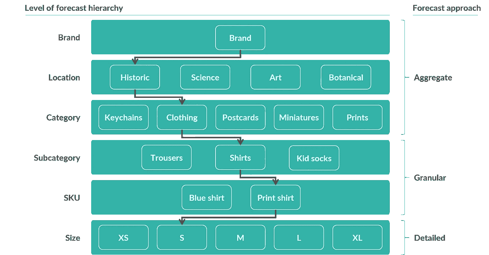

**产品金字塔**。图片来源: [Evo 定价](https://evopricing.com/) (CC 带归属)

> 产品金字塔的不同层次需要不同的预测方法。

例如，在最底层的是特定产品，或称[库存单位](https://en.wikipedia.org/wiki/Stock_keeping_unit)(简而言之，SKU):一件印有黄色三藩市图案的 S 码绿色 t 恤。我知道，这是一个奇怪的调色板，也许去另一个 SKU？蓝色印花的中号灰色连帽衫。好了，你明白了。

在这种粒度级别，销售相对较少，因此有必要进行详细的预测。沿着产品金字塔向上，汇总销售更频繁，因此可以应用汇总预测方法。

最后，所有的方法必须匹配，这样各部分的总和与总数相符，例如*预测总和必须与*预测总和相匹配。

请参见以下视觉摘要以供参考:

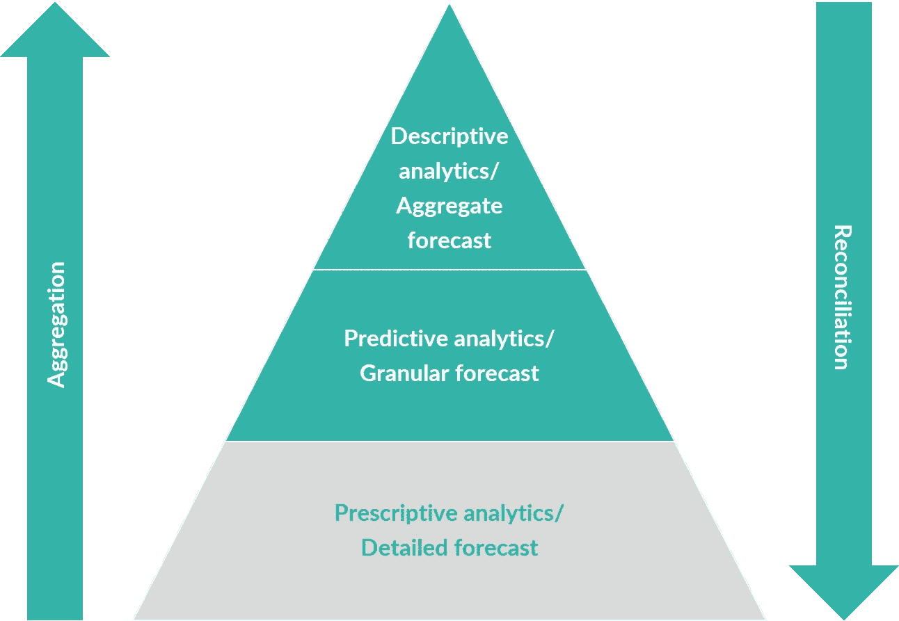

**降价临近**。图片来源: [Evo 定价](https://evopricing.com/) (CC 带归属)

# 降价的三种方法

在浏览产品金字塔的复杂性时，您可以使用三种方法来设置最佳降价，使用不同数量和类型的数据:

*   **描述性**:仅使用历史数据
*   **预测**:使用价格弹性数据
*   **规定性**:使用尽可能多的数据。

每种方法都需要不同数量的数据、业务流程，当然还有分析策略。

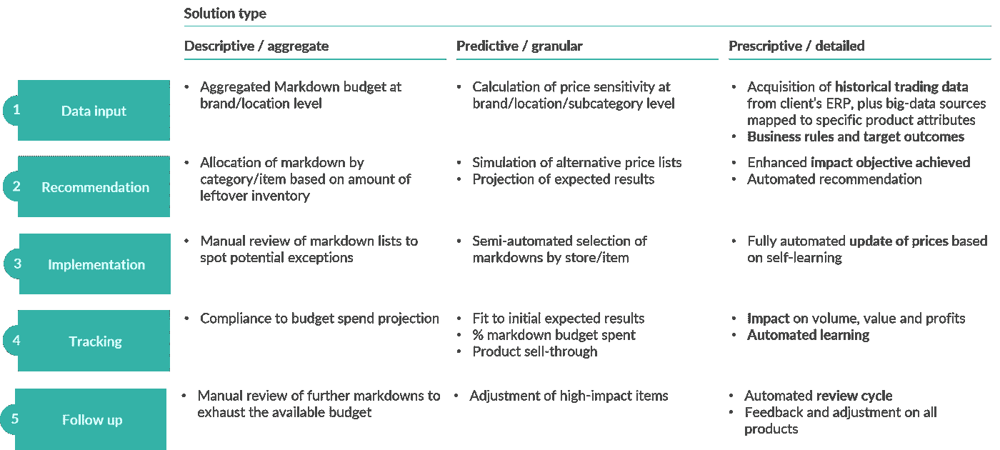

**降价过程取决于方法**。图片来源: [Evo 定价](https://evopricing.com/) (CC 带归属)

**描述性**方法的构建和维护相对简单，它只需要很少的数据。毫不奇怪，这种方法只允许自上而下的推荐，因此效率相对较低，下面我会进一步说明。

另一方面，**规范的**方法相对更难构建和维护，并且需要更大的数据集。然而，这种方法允许做出完全[自下而上](https://en.wikipedia.org/wiki/Top-down_and_bottom-up_design)的建议，并且可以提供显著的财务收益。

描述性方法介于两者之间，我将在后面介绍。

所以让我先从*基线*方法开始:描述性的！

# 方法 1:描述性降价

第一种也是最直接的方法是选择降价的产品，它依赖于一个简单的经验法则:

> 库存比销售额多的折扣产品。

直觉是用覆盖率，或 [*天的库存*](https://en.wikipedia.org/wiki/Days_in_inventory) ，作为问题大小的代理。计算步骤:

1.  **某产品的历史销量**:比如一个月 100 件
2.  **现有库存**:比如 1000 件
3.  **覆盖率**比率，例如，在本例中为 10 个月:1，000/100 →如果销售继续保持历史平均水平，则需要 10 个月才能将当前库存销售一空
4.  **每件产品花费的降价预算**=*额外%折扣 X 库存单位成本 X 现有库存件数。*阅读下面的例子。
5.  **SKU 排名**:从最高覆盖率往下。

在这一点上，挑选前 N 个产品，直到所有可用的降价预算都花完！

一种产品降价预算的简单示例:

*   打八折；现在要打五折，所以额外打三折
*   10 美元的单位库存成本
*   1 万件现有库存

→花费的 30k 美元降价预算= 30% x 10k 美元。

明白这是怎么回事了吗？

按降序排列 SKU，您可以轻松挑选:根据降价百分比和可用预算，您可以轻松确定降价的 SKU(覆盖率最高的那些)。

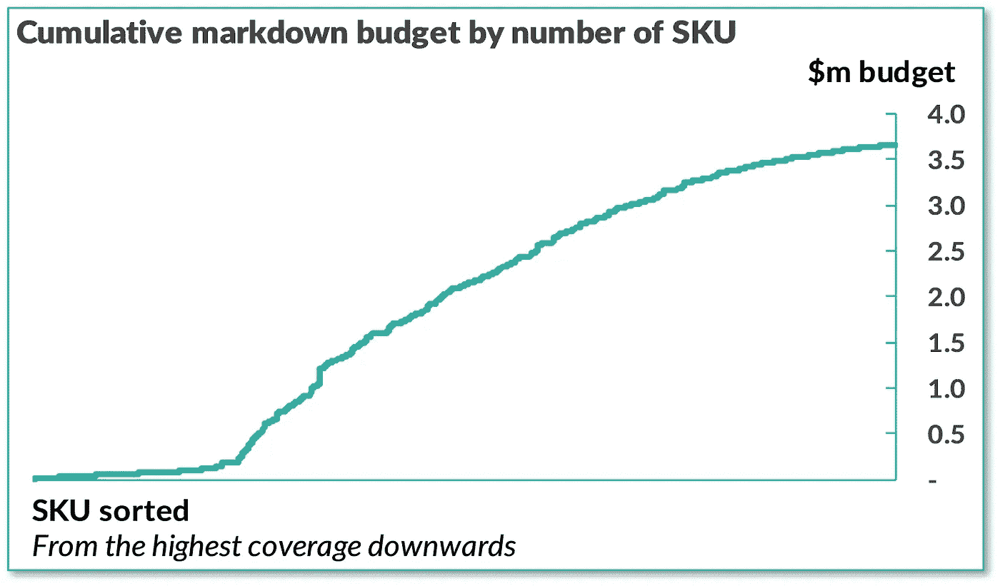

**描述性降价**。图片来源: [Evo 定价](https://evopricing.com/) (CC 带归属)

**优势**:

*   简单的笔和纸的方法，可以做 100%在一个电子表格，如微软 Excel
*   让首席财务官的生活变得轻松，因为对花费的预算有 100%的把握，事实上这是他们一开始的决定！
*   植根于任何人都容易理解的关于库存和销售的简单客观事实。

**缺点**:

*   完全无视结果:无法保证影响、销售加速或投资回报，因为产品可能对价格不敏感
*   不清楚如何验证预算水平的选择，因为没有迹象表明对多少产品(或多大程度)进行折扣是合适的
*   最终，[推动](https://en.wikipedia.org/wiki/Push%E2%80%93pull_strategy)决策的原型是经理驱动的，而不是客户驱动的([拉动](https://en.wikipedia.org/wiki/Push%E2%80%93pull_strategy))。

简而言之，100%推送决策，Excel 友好。描述性降价没有错，但也没那么好。让他们成为我们的基准模型。

第一个，几乎是显而易见的，尚未回答的问题是:产品对价格有多敏感？当我把它们标下来的时候，我能期待什么样的加速度？

输入预测降价中使用的价格弹性概念。

# 方法 2:预测性降价

价格的变化，比如降价，会对销售产生什么样的预期影响？

常规答案是使用价格弹性:相关的 [Wikipedia](https://en.wikipedia.org/wiki/Price_elasticity_of_demand) 文章对此解释得相对较好，因此我不会在此重复所有内容。

卡罗教授和加林在 2010 年写了一篇优秀的免费可得的[科学论文](http://faculty.london.edu/jgallien/CaroGallien_ClearancePricingOptimizationForFastFashion.pdf)，详细介绍了快时尚零售商 [Zara](https://www.zara.com/) 使用回归技术进行弹性降价的方法。

> 价格弹性高的折扣产品。

什么是价格弹性？长话短说，从价格的某个%的变化中，我能期望销售额有什么%的变化？例如，如果我的“价格弹性”是-2，那么-10%的价格变化(负号:这是折扣/降价)预计将产生+20%的销售量增长(-10% X -2 = +20%)。诸如此类。

为了计算这个系数，一种传统的方法是在适当的粒度级别上对历史价格运行历史销售量的回归。例如:按类别按商店按周。

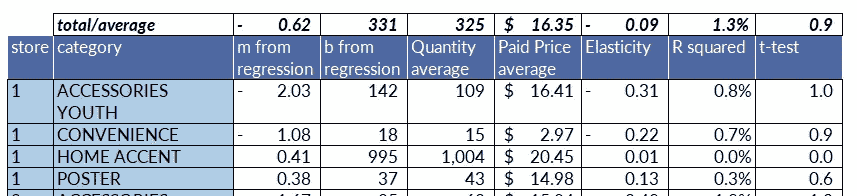

**弹性计算示例**。图片来源: [Evo 定价](https://evopricing.com/) (CC 带归属)

> 基于弹性，你现在可以通过应用任何降价百分比或价格变化来计算预期回报。

好处？例如，如果价格降低 10%，弹性系数为-2，你的销售量就会增加 20%。因此，如果我们以每件 10 美元的价格销售 100 件产品，收入为 1，000 美元，那么现在你将以每件 9 美元的价格销售 120 件产品(+20%)(-10%)。因此，您的新收入将为 1，080 美元，正收益+8%。

遍历弹性为-2 的所有可能组合的数学:

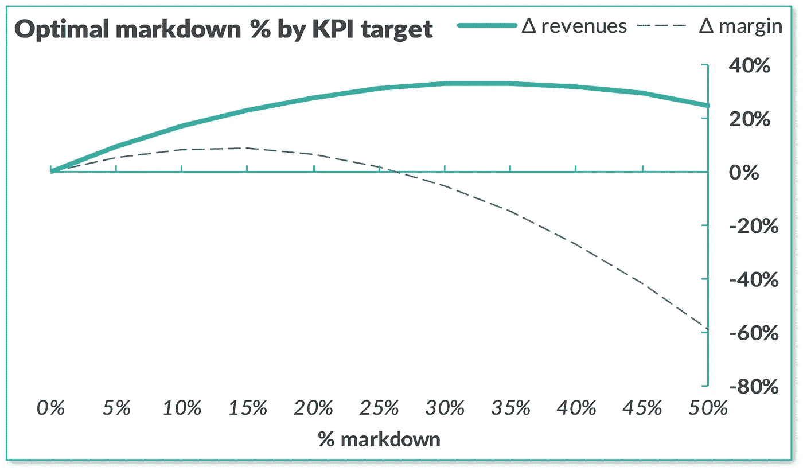

**预测降价，弹性= -2 的例子**。图片来源: [Evo 定价](https://evopricing.com/) (CC 带归属)

这张图表简单地展示了如何根据预期影响选择*最佳降价*。

*   如果你想要最大的收益，那么-35%的降价是最佳选择
*   如果你想要最大的利润，那么-15%的降价是最理想的
*   如果你想两者兼得，那么降价 15%到 35%是最佳选择，这取决于收入和利润目标的相对重要性。

这种方法的问题是，虽然系数的 t 值相当好(价格确实影响销售)，但模型的 R 平方并不太好。

当销售量很高时，所得到的价格弹性收敛到 0:**量价关系的一维回归非常嘈杂。**

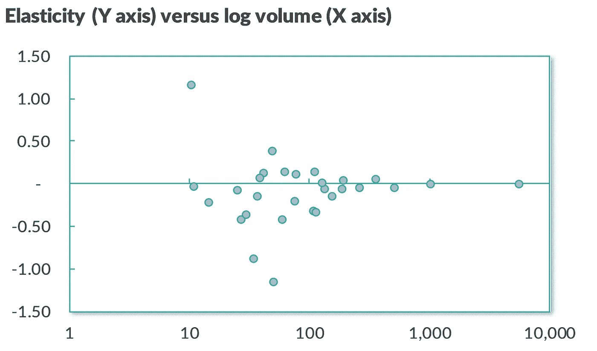

**弹性计算**。图片来源: [Evo 定价](https://evopricing.com/) (CC 带归属)

因此，与描述性模型相比，这种方法既有一些优点，也有一些明显的缺点。

**优点**:

*   相对简单的方法，至少它的简单版本可以在像 Microsoft Excel 这样的电子表格中部分完成
*   根据历史价格弹性，就降价投资的预算水平和预期影响提供指导
*   植根于需求的价格敏感性数据，这增加了以客户为中心的流程的数量。

**缺点**:

*   预测能力差:这些方法的 R 平方相对较差，因此该模型不完全符合目的
*   预测仅在中间聚集级别可行，如商店/类别，因为项目级别的弹性通常无法确定
*   有限的输入信号，因为价格不是影响销售的唯一因素，并且产品价格具有相互关联的影响，例如由于同类相食。

简而言之，50–50%的推动决策，对 Excel 有些友好。比描述性降价好得多，但在指导决策的能力方面仍然有限。

此时，下一个需要回答的问题是:如何考虑更复杂的输入信号？如何建立一个具有更大影响潜力的系统？

输入机器学习和说明性降价。

# 方法 3:指令性降价

由于价格不是影响销售的唯一因素，基于价格弹性的传统预测模型无法通过准确性测试。

向问题扔更多的数据怎么样？规定方法需要使用更先进的技术，如[机器学习](https://en.wikipedia.org/wiki/Machine_learning)和自动化[优化](https://en.wikipedia.org/wiki/Mathematical_optimization)。

> 在合适的时间给合适的产品打折。

当添加数据集时，回归和时间序列等传统方法在最初的几个数据集上表现出初步的性能提升，但当添加更多数据集时，它们会遇到共线性和噪声等问题，使它们越来越不适合使用。

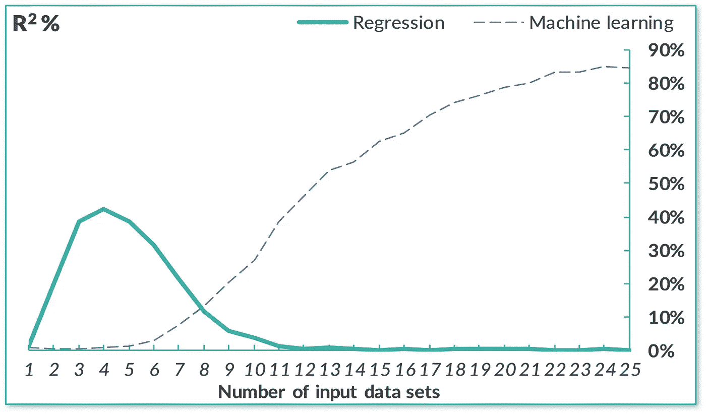

**R 的平方来自降价中的数据使用**。图片来源: [Evo 定价](https://evopricing.com/) (CC 带归属)

具体来说，在多达 7 个变量的情况下，回归模型的表现优于机器学习。

> 当数据的数量和种类增加时，机器学习胜过回归，实现更大的粒度和准确性。

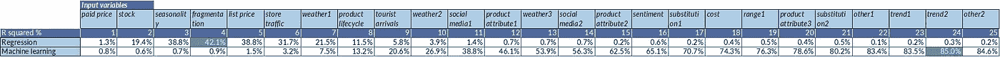

**附加输入数据集的增量贡献**。图片来源: [Evo 定价](https://evopricing.com/) (CC 带归属)

在降价方面，使用机器学习方法时的%预测误差，以及因此更大的数据集，明显更低。

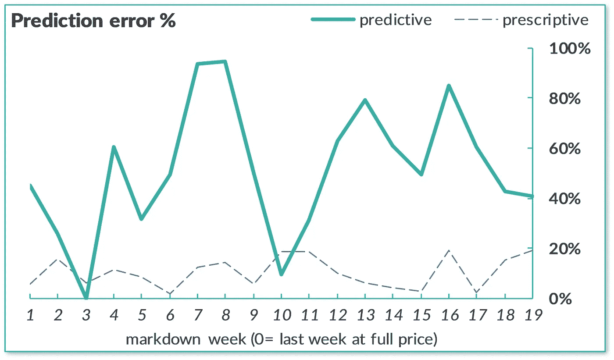

**规定降价的误差**。图片来源: [Evo 定价](https://evopricing.com/) (CC 带归属)

与总是简单的描述性方法的基线模型相比，这反过来释放了显著的财务收益。

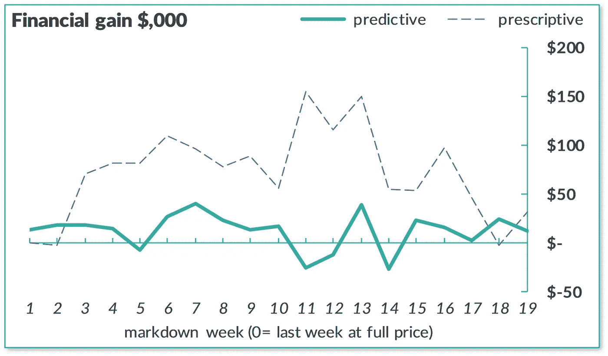

**规定降价的影响**。图片来源: [Evo 定价](https://evopricing.com/) (CC 带归属)

因此，与其他两种方法相比，这种方法提供了最多的优点，但也有一些缺点。

**优点**:

*   更好的性能:更大的经济效益、准确性、输入信号的广度
*   自学系统降低运营风险，在市场偏离预期时自动调整未来建议
*   SKU/商店级别的推荐粒度，有机会根据需要集成自定义规则和人工输入。

**缺点**:

*   相对复杂的设置:需要更多的数据和专业知识来使用更先进的技术
*   需要非常大的数据资产，以便能够自学和快速响应市场情况
*   最终，一个先进的模型，在跨其他过程的更广泛的能力的背景下有意义，而不仅仅是降价。

简而言之，一个 0%的推，纯拉的决定；一点都不 Excel 友好。比描述性和说明性降价都好得多，即使只适用于注重分析的组织。

# **通过数据以客户为中心**

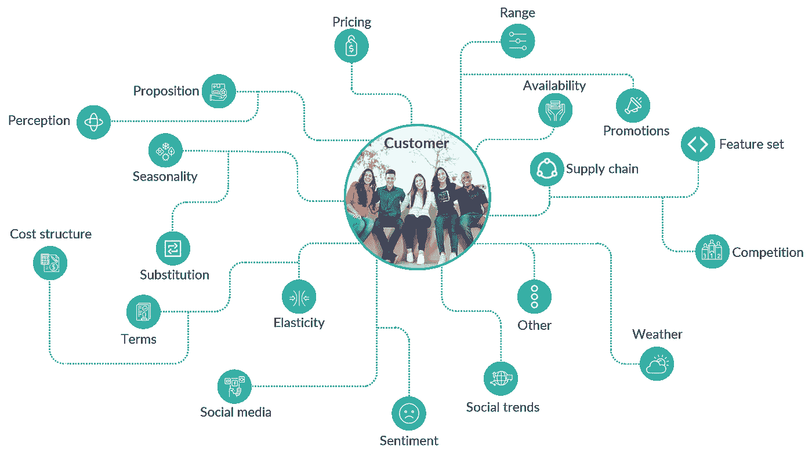

**通过数据以客户为中心**。图片来源: [Evo 定价](https://evopricing.com/) (CC 带归属)

归根结底，任何数据都是关于客户的。无论是直接的，如客户年龄、性别等数据，还是间接的，如天气、竞争等数据。

> 数据将客户注入到日常管理决策中。

使用的数据越多，管理决策就越以客户为中心。规范方法利用机器学习，以尽可能最好的方式使用最多的数据。

# 总结:三种方法

现在，您已经看到了使用数据的三种不同方法:描述性的、预测性的、规范性的。

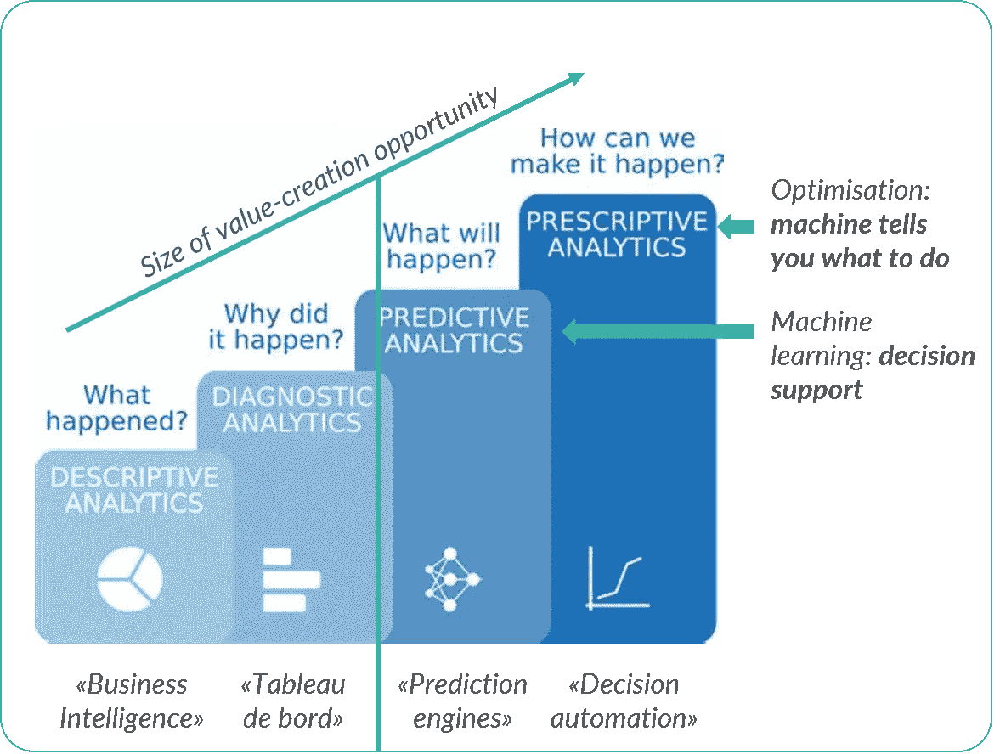

**分析方法的演变**。图片来源: [Evo 定价](https://evopricing.com/)和【neuraldesigner.com】T4(CC 带归属)

发展您的分析方法需要勤奋和良好的以客户为中心，但最终可能价值数百万美元的日常影响。

快乐大减价！

PS 更多[商业科学](https://medium.com/tag/business-science)来自我的写作:

[](/94-perfect-the-surprising-solution-to-the-200-billion-inventory-problem-b6ba0bc1417a) [## 94%完美:2000 亿美元库存问题的惊人解决方案

### 机器学习和人类经理一起修复供应链

towardsdatascience.com](/94-perfect-the-surprising-solution-to-the-200-billion-inventory-problem-b6ba0bc1417a) [](/fashion-is-broken-science-is-fixing-it-b771b1ab5b59) [## 时尚被打破了。科学正在修复它

### 转变 5 个核心时尚流程

towardsdatascience.com](/fashion-is-broken-science-is-fixing-it-b771b1ab5b59) 

```
Monthly Business Science in your inbox, new software, and University-level learning:[**Free access**](https://evouser.com/register)Questions? Please reach out on [Linkedin](https://www.linkedin.com/in/fabrizio-fantini/)
```