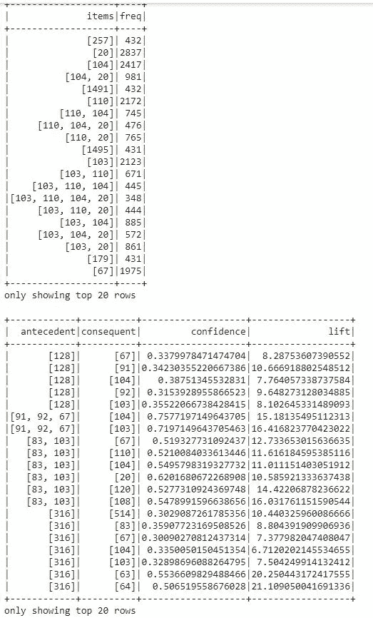

# 使用 PySpark 的购物篮分析

> 原文：<https://towardsdatascience.com/market-basket-analysis-using-pysparks-fpgrowth-55c37ebd95c0?source=collection_archive---------5----------------------->

## 用 PySpark 的 FPGrowth 进行数据挖掘


由克莱姆·奥诺杰胡在 T2 拍摄

**动机:**

你想学习如何分析顾客购物篮中经常一起购买的商品吗？如果你愿意和 PySpark 的 FPGrowth 一起工作，就别再找了。

**解决方案:**

首先，让我们看看我们的数据框架(数据存储在我的 [github 库](https://github.com/DAR-DatenanalyseRehberg/DDDD_Data-Driven-Dealings-Development))。如果你想使用谷歌的 Colab，你首先需要安装你的谷歌硬盘:

```
# To be able to use your data stored in your Google Drive you first need to mount your Google Drive so you can load and save files to it.from google.colab import drive
drive.mount('/content/gdrive')#You'll need to put in a token which Google will generate for you as soon as you click on the link.
```


输入令牌后，您的 Google Drive 就安装好了。

现在，我们将数据加载到我们的数据框架中，并查看:

```
import pandas as pd
import numpy as np
data = pd.read_excel(‘/content/gdrive/MyDrive/DDDDFolder/DDDD.xlsx’) 
data.head()
```


这就是我们的数据帧最初的样子。

因此，我们得到的是每个销售日的销售额、客户(例如，客户代码 0 是一个特定的客户)、销售项目(类似于客户，销售项目 0 是一个特定的销售项目)和销售交易 ID。

我们将分析与每个销售交易 id 的销售项目相关的市场篮。其他列对我们的数据挖掘不感兴趣。

要在 Colab 中安装 PySpark，我们必须使用我们的超级用户权限:

```
%%capture!sudo apt-get update --fix-missing!apt-get install openjdk-8-jdk-headless -qq > /dev/null!wget -q https://archive.apache.org/dist/spark/spark-3.0.0/spark-3.0.0-bin-hadoop3.2.tgz#!wget -q https://downloads.apache.org/spark/spark-3.0.0/spark-3.0.0-bin-hadoop3.2.tgz!mv spark-3.0.0-bin-hadoop3.2.tgz sparkkk!tar xf sparkkk!pip install -q findspark
```

之后，我们可以开始我们的 Spark 会话:

```
import osos.environ["JAVA_HOME"] = "/usr/lib/jvm/java-8-openjdk-amd64"os.environ["SPARK_HOME"] = "/content/spark-3.0.0-bin-hadoop3.2"import findsparkfindspark.init()from pyspark.sql import SparkSessionspark = SparkSession.builder.master("local[*]").getOrCreate()spark = SparkSession \.builder \.appName('fpgrowth') \.getOrCreate()spark
```


当一切正常运行时，您会看到这条消息。

与熊猫不同，在 Spark 中创建数据帧，我们必须使用 Spark 的 CreateDataFrame:

```
from pyspark.sql import functions as F
from pyspark.ml.fpm import FPGrowth
import pandas
sparkdata = spark.createDataFrame(data)
```

对于我们的购物篮数据挖掘，我们必须将销售交易 ID 转换为行，因此每一行代表一个销售交易 ID，包括购买的销售项目。首先，我们确保每个销售事务 ID 对于其销售项目是唯一的(这就是为什么要删除重复项)。然后，我们按销售交易 ID 分组，并使用聚合函数的 collect_list 接收每个销售交易 ID(行)的所有销售项目:

```
basketdata = sparkdata.dropDuplicates(['SalesTransactionID', 'SalesItem']).sort('SalesTransactionID')basketdata = basketdata.groupBy("SalesTransactionID").agg(F.collect_list("SalesItem")).sort('SalesTransactionID')
```

结果现在看起来像这样，并且已经准备好供 FPGrowth 的算法使用:


现在，我们将计算市场篮子指标，如支持、提升和信心。请注意，MinSupport 等参数设置是非常具体的数据:

```
#Frequent Pattern Growth – FP Growth is a method of mining frequent itemsets using support, lift, and confidence.fpGrowth = FPGrowth(itemsCol="collect_list(SalesItem)", minSupport=0.006, minConfidence=0.006)model = fpGrowth.fit(basketdata)# Display frequent itemsets.model.freqItemsets.show()items = model.freqItemsets# Display generated association rules.model.associationRules.show()rules = model.associationRules# transform examines the input items against all the association rules and summarize the consequents as predictionmodel.transform(basketdata).show()transformed = model.transform(basketdata)
```



结果看起来就是这样。

这已经是我们的 FPGrowth 结果了。如果您想将其导出为 Excel 文件，您可以这样做:

```
# Convert the Spark DataFrame back to a Pandas DataFrame using Arrowresult_pdf = items.select("*").toPandas()
result_pdf.head()
```


```
result_pdf.to_excel('result_pdfItemsFreq.xlsx')
```

规则也类似:

```
rules_pdf = rules.select("*").toPandas()
rules_pdf.head()
```


```
rules_pdf.to_excel('rules_pdfAnteConseConfLift.xlsx')
transformed_pdf = transformed.select("*").toPandas()
transformed_pdf.head()
```


```
transformed_pdf.to_excel('transformed_pdfSalesTransactionIDCollectListPred.xlsx')
```

恭喜你，你已经成功地使用 FPGrowth 进行了数据挖掘技术！也许你已经发现了上一个截图中的列预测？这个“预测”为推荐系统搭建了一个非常好的桥梁。如果你有兴趣，请阅读我的相关文章。

非常感谢您的阅读！希望这篇文章对你有帮助。请随时在 [LinkedIn](https://de.linkedin.com/in/jesko-rehberg-40653883) 、 [Twitter](https://twitter.com/DAR_Analytics) 或[工作室](https://jesko-rehberg.medium.com/virtual-reality-vr-for-education-a532aa5b6272)与我联系。

[](https://jesko-rehberg.medium.com/membership) [## 通过我的推荐链接加入 Medium-Jesko Rehberg

### 阅读杰斯科·雷伯格(以及媒体上成千上万的其他作家)的每一个故事。您的会员费直接支持…

jesko-rehberg.medium.com](https://jesko-rehberg.medium.com/membership) 

最初发表在我的网站 [DAR-Analytics](https://www.dar-analytics.de/AboutUs.html) 。我的 Github 存储库中也有 Jupyter 笔记本和数据文件:[https://Github . com/DAR-DatenanalyseRehberg/DDDD _ Data-Driven-deadlines-Development/blob/main/Market _ Basket _ DDDD . ipynb](https://github.com/DAR-DatenanalyseRehberg/DDDD_Data-Driven-Dealings-Development/blob/main/Market_Basket_DDDD.ipynb)