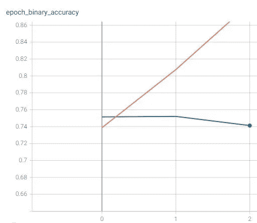
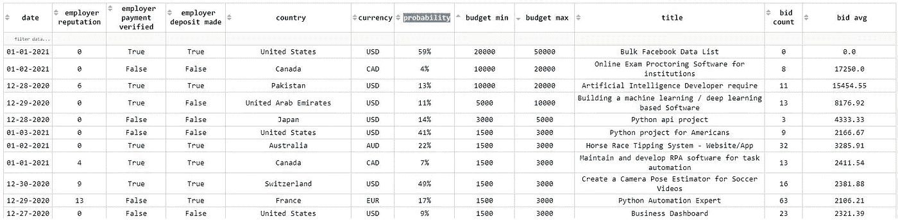

# 由深度学习驱动的市场情报

> 原文：<https://towardsdatascience.com/market-intelligence-powered-by-deep-learning-bb63dae49481?source=collection_archive---------72----------------------->

## 【tensorflow 能增加自由职业者赢得项目的几率吗？


由[克里斯托弗·高尔](https://unsplash.com/@cgower?utm_source=medium&utm_medium=referral)在 [Unsplash](https://unsplash.com?utm_source=medium&utm_medium=referral) 上拍摄的照片

根据最近的一份报告，美国有 5900 万自由职业者。自由职业者是全球性的，竞争非常激烈；人才供给高于工作需求。您可以在此[财务业绩报告](https://www.freelancer.com/about/investor-pdf.php?id=117150509&name=20200720%201H20%20Freelancer%20Limited%20Financial%20Results)中了解更多关于不断变化的全球市场和 covid 影响的信息。

自由职业者面临多重挑战，其中两个挑战是:

*   研究对他们技能/服务的需求
*   寻找和赢得项目的难度

Freelancer.com 有一个优秀的 API，可以用来提取项目细节。它是一个丰富的数据集，有着令人尊敬的历史(超过 5 年)；它既包含竞赛，也包含项目，虽然我只会涉及后者。

上述报告包含大量有用的信息(自由职业者简介、每个项目的平均出价、市场总量趋势等)。).在这篇文章中，我将尝试回答以下问题:一个项目被授予的概率能被准确地确定吗？

鉴于广泛的模式，我一直关注 2 个主要组件:

*   项目详情
*   用户详细信息

诚然，深度学习被视为解决当前许多问题的灵丹妙药，但围绕它有很多宣传。还有一种倾向(我也有这种倾向)是关注工具。在这篇文章中，我将重点关注深度学习可以增加的价值；具体来说，深度学习能否准确地帮助一个自由职业者只专注于那些将被授予的项目？最终，这不仅会节省自由职业者的时间，还会节省金钱，因为出价不是免费的；浪费在未中标项目上的投标将不予退还。

此时，您可能会问自己:在发布的所有项目中，有多少项目获得了奖励(我称之为项目奖励率)。根据我的计算(并在本分析的背景下考虑这一点)，项目奖励率约为 30%。这看起来很有希望，但这个市场竞争非常激烈，因为每个项目平均有 45 个投标。因此，专注于将被授予的 30%的项目将节省时间和精力。当然，深度学习模型将为你提供一种可能性，这仍然是一种强大的洞察力。

所以我建立了一个 tensorflow 模型来预测一个项目是否会获奖。我只提取了 16 个工作/技能的项目和用户细节；一些例子:

*   机器学习
*   数据挖掘
*   数据科学
*   深度学习

以下是关于如何开发模型的一些高级步骤:

*   提取和拆分数据
*   使用 tensorflow keras [预处理](https://www.tensorflow.org/guide/keras/preprocessing_layers)归一化输入。例如，下面是货币的代码片段。在这种情况下，ds_train 是训练[数据集](https://www.tensorflow.org/api_docs/python/tf/data/Dataset)

```
def get_category_encoding_layer(name, dataset, dtype, max_tokens=200): index = preprocessing.StringLookup(max_tokens=max_tokens) feature_ds = dataset.map(lambda x, y: x[name]) index.adapt(feature_ds) encoder = preprocessing.CategoryEncoding(output_mode=”binary”, max_tokens=max_tokens) feature_ds = feature_ds.map(index) encoder.adapt(feature_ds) return lambda feature: encoder(index(feature))currency_norm = get_category_encoding_layer(“currency”, ds_train, ‘string’, max_tokens=25)
```

*   在模型中包括预处理。连接所有层和输入。我只有两个深层次的单位基于超参数调谐与[keras-调谐器](https://www.tensorflow.org/tutorials/keras/keras_tuner)

```
currency_input = tf.keras.Input(shape=(None,), name=”currency”, dtype=’string’)currency_layer = currency_norm(currency_input)all_layers = tf.keras.layers.concatenate([ currency_layer, # rest of layers …])dense_layer_1 = tf.keras.layers.Dense(units=hp.Int(‘dense_layer_1’, min_value=2014, max_value=8048, step=64), name=”dense_layer_1", activation=’elu’)(all_layers )dense_layer_2 = tf.keras.layers.Dense(units=hp.Int(‘dense_layer_2’, min_value=1024, max_value=1024, step=32), name=”dense_layer_2", activation=’elu’)(dense_layer_1)award_pred = tf.keras.layers.Dense(1, name=”award”)(dense_layer_2)
```

*   培训和测试
*   将预测(概率)整合到图表中

```
app.layout = html.Div([dash_table.DataTable(columns=[{"name": i, "id": i} for i in df.columns],style_header={ 'backgroundColor': 'white','fontWeight': 'bold'},data=df.to_dict('records'),fixed_rows={'headers': True},filter_action="native",sort_action="native",sort_mode="multi",style_table={'height': '900px'},style_cell_conditional=[{'if': {'column_id': 'currency'}, 'width': '40px'},# rest of columns
]),html.Div(id='datatable-interactivity-container')])
```

除了上面详述的货币列，我还有以下变量作为输入(请注意，我包括数字、分类和文本):

*   工作/技能类别(例如工程和科学)
*   项目名称
*   项目描述
*   项目类型(每小时或固定)
*   预算(最低和最高)
*   平均出价
*   投标计数
*   雇主国家
*   雇主历史/整体声誉
*   雇主评论
*   付款已验证
*   存款已存入

以上是一小部分，自由职业者 API 提供了更多的细节。

训练数据集并不庞大(只有关闭状态的项目)。大约是 90K 记录。

我们通过为 1 个时期训练模型来回答这个问题:75%的准确度。



下面你有几个活跃的项目例子以及预测的概率。



如何提高模型 75%的准确率？几个领域:

1.  添加所有项目(有 14M 个项目；我只用了 90K 左右)
2.  添加更多变量(尤其是获奖者的详细信息)
3.  调整模型架构

总而言之，这种模式的附加值可能是:

*   自由职业者可以节省时间和金钱，因为他们可以专注于那些很有可能中标的项目
*   启用**平台公司**(如自由职业者、upwork 等。)到:

1.  确定并支持那些拥有高预算项目且中标概率较低的雇主

2.在高级会员计划中包含这些类型的见解

让我知道你的想法。