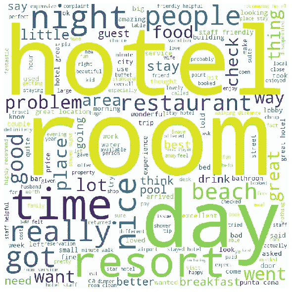
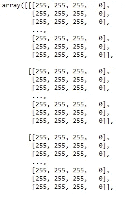
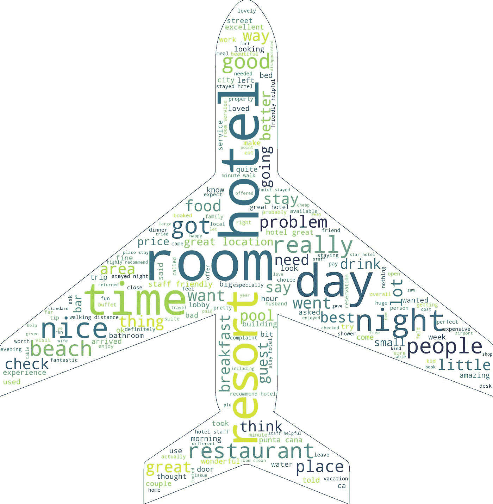
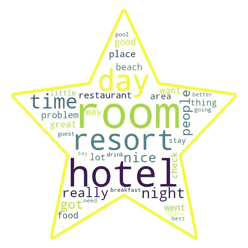
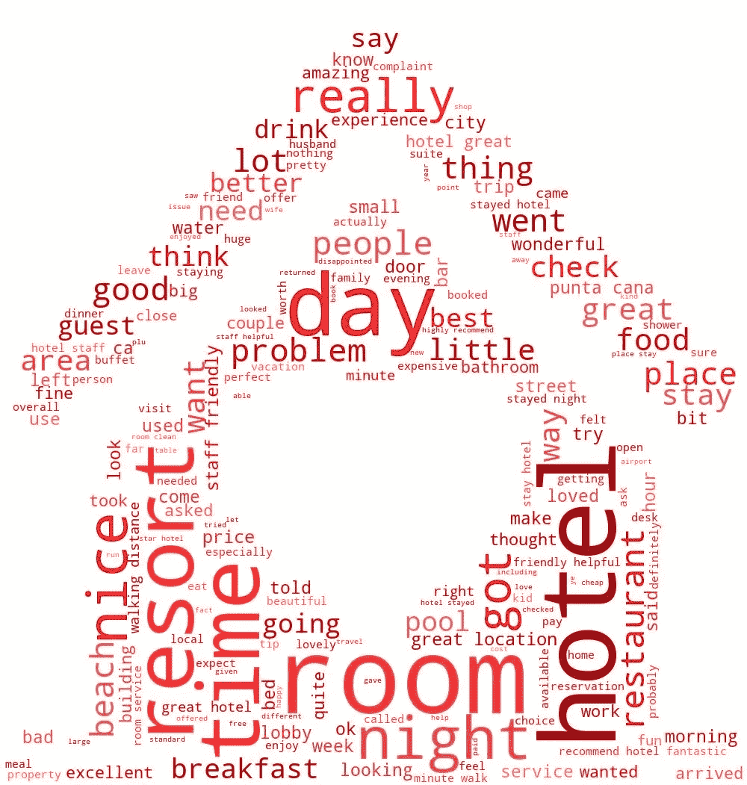

# 营销分析可视化— WordCloud

> 原文：<https://towardsdatascience.com/marketing-analytics-visualization-wordcloud-c32bec445cae?source=collection_archive---------30----------------------->

## PYTHON。数据可视化。分析。营销。

## 通过 Python 生成 WordCloud 可视化


作者图片

WordCloud 显示文本中使用最频繁的单词，其中文本的大小与其在文本中的使用频率成比例；字体越大，该单词在文档中出现的次数就越多。

因此，对于探索性的数据分析，WordCloud 可能会提供一些有趣的见解来跟进或调查

在这个练习中，让我们试试 [Tripadvisor_Hotel_Review 数据集](https://www.kaggle.com/andrewmvd/trip-advisor-hotel-reviews)。这个可以从 Kaggle 下载或访问。

# **预赛**

如果你还没有安装 WordCloud 软件包，你可以打开你的终端，输入:

```
pip install wordcloud
```

以下是我们的准备工作:

```
#Preliminaries
from wordcloud import WordCloud, STOPWORDS#For Data Manipulation
import pandas as pd#For cleaning the texts
import re#For the Mask
from PIL import Image
import numpy as np
import urllib
import requests#For Visualization
import matplotlib.pyplot as plt
%matplotlib inline
```

# 输入数据

```
df = pd.read_csv('data/tripadvisor_hotel_reviews.csv')
print(f'The row and column sizes, respectively of the table are {df.shape}')
df.head()
```

请注意，在本练习中，我们将只使用 review 列。

# **数据预处理**

为了处理我们能产生的最好的词云，下面是我们在预处理阶段需要做的步骤:

*   将所有文本组合成一个字符串
*   将所有文本转为小写(不同大小写字母的计数不同)
*   删除停用词

## 预处理—合并文本并转换为小写

这可以用一段简单的代码来完成:

```
text = df['Review'].str.cat(sep=', ').lower()
```

## 预处理—停用词

WordCloud 提供了一个不错的停用词列表，我们已经可以使用了。这包括经常使用的词，如“the”、“a”、“or”等，这些词可能会使我们的词云变得混乱

有一些方法可以发现比预期出现频率更高的潜在单词，我们可以随时将它们添加到我们的词云排除的停用词列表中。

虽然人们可以拆分文本并进行数值计算，但我选择先简单地生成 WordCloud，并简单地删除那些我们不想成为图像一部分的内容。

因为我已经看到了输出，所以我只想删除一个词:“n，t”。

```
# Adding to the list of stopwords
stopwords = list(set(STOPWORDS)) + ["n't"]
```

# 形象化

WordCloud 包的使用非常简单，参数也很简单。

```
wordcloud = WordCloud(width = 800, height = 800,
                background_color ='white',
                stopwords = stopwords,
                min_font_size = 10).generate(text)#After generating the WordCloud object, enter this to a plotting function# plot the WordCloud image                       
plt.figure(figsize = (8, 8), facecolor = None)
plt.imshow(wordcloud)
plt.axis("off")
plt.tight_layout(pad = 0)

plt.show()
```



*作者图片*

这就是我们的基本词云。

## 可视化—屏蔽

对于那些想通过添加一些遮罩来改善这一点的人，我们可以通过选择 PNG 图像来实现。我对酒店图标不太满意，所以让我们选择一架飞机，因为它也是一个与酒店和旅游业相关的图标。

在选择蒙版时，选择带有白色背景的 png 或 jpeg 图像。计算机将彩色背景视为独立的对象，因此它可能无法捕捉到我们想要的形状。

我们可以得到一个免费使用的面具或图标。现在，在遮罩功能中，图像的白色部分的值应该是“255”，而不是 0。值 255 与白色相关联是更常见的(而黑色是 1)，但为了以防万一，人们应该查看“遮罩”对象以防万一。阵列中的数字代表像素的强度。

```
mask = np.array(Image.open(requests.get('[https://www.freeiconspng.com/uploads/airplane-icon-image-gallery-1.png'](https://www.freeiconspng.com/uploads/airplane-icon-image-gallery-1.png'), stream=True).raw))
```

让我们选择一架飞机作为我们的图标，因为酒店住宿通常与旅行联系在一起。

目测遮罩对象:



图片由作者提供；像素值数组

因为我们的蒙版似乎用 255 作为白色值，我想我们可以用这个。

关于遮罩的注意:不是所有的东西都工作良好，你需要检查遮罩是否产生了我们想要使用的容器的预期形状。这个问题对于 3D 比 2D 更普遍。

## 可视化-将 2D 和 3D 遮罩从 0 转换为 255 的功能

如果您选择的掩码是 2D，并且您想将 0 值转换为 255，您可以使用以下函数:

```
def transform_format(val):
    if val == 0:#000080
        return 255
    else:
        return val# Transform your mask into a new one that will work with the function:
transformed_mask = np.ndarray((mask.shape[0],mask.shape[1]), np.int32)for i in range(len(mask)):
    transformed_mask[i] = list(map(transform_format, mask[i])
```

对于 3D 遮罩:

```
# Transform your mask into a new one that will work with the function:
transformed_mask = np.ndarray((mask.shape[0],mask.shape[1]), np.int32)for i in range(len(mask)):
    for y in range(len(mask[i])):
        transformed_mask[i][y] = list(map(transform_format, mask[i][y]))
```

## 带遮罩的 WORDCLOUD

处理完掩码后，我们现在可以将它用作 WordCloud 函数的参数输入:

```
wordcloud = WordCloud(background_color ='white',
                mask=mask,   
                stopwords = stopwords,
                min_font_size = 10,
                width=mask.shape[1],
                height=mask.shape[0],
                contour_width=1, 
                contour_color='#000080').generate(text)plt.figure(figsize = (8, 8), facecolor = None)
plt.imshow(wordcloud)
plt.axis("off")
plt.tight_layout(pad = 0)

plt.show()
```



作者图片

理想情况下，我们选择的面具与我们视觉化的主题有关。另一个我们可以尝试的是星级面具，因为酒店是以星级的形式来评定的:



作者图片

# 单词云的颜色功能

单词云的一个有趣的输入是颜色函数。color function 参数接受一个函数，然后根据每个单词的特征输出一种特定的或不同的颜色(方案)。

去这个网站挑选你想要的颜色组合:[https://hslpicker.com/](https://hslpicker.com/)。

少数专业人士更喜欢使用单调的颜色，而不是绘图软件的默认配色方案。因此，我们可以编写一个函数来完成这个任务:

```
def one_color_func(word=None, font_size=None, position=None, orientation=None, font_path=None, random_state=None):
    h = 204 #0-360
    s = 100 #0-100
    l = random_state.randint(30, 70) #0-100 As we want to randomize it per color, let's randomize this

    return f"hsl({h},{s}%, {l}%)"
```

使用此函数作为输入:

```
wordcloud = WordCloud(background_color ='white',
                mask=mask,   
                stopwords = stopwords,
                min_font_size = 10,
                width=mask.shape[1],
                height=mask.shape[0],
                color_func=color_func,
                contour_width=1, 
                contour_color='#000080').generate(text)plt.figure(figsize = (8, 8), facecolor = None)
    plt.imshow(wordcloud)
    plt.axis("off")
    plt.tight_layout(pad = 0)plt.show()
```


作者图片

用我们所知道的再玩一点，让我们尝试一个红色函数和一个心形的家用面具:

```
def red_color_func(word=None, font_size=None, position=None, orientation=None, font_path=None, random_state=None):
    h = 0 #0-360
    s = 100 #0-100
    l = random_state.randint(30, 70) #0-100 As we want to randomize it per color, let's randomize this

    return f"hsl({h},{s}%, {l}%)"
```



作者图片

# 结束语

WordCloud 是一个优秀的数据探索工具，用于查看文本对象中最常用的单词。因此，它们是营销分析和情感分析的绝佳工具。

作为一个 EDA 工具，人们应该尝试探索可能从生成的可视化中产生的问题和见解。

最后，有许多方法可以定制，并使观众的视觉效果更加强大。数据科学家应该始终努力使用可视化工具，同时兼顾细心和创造力。

让我知道你的想法！

# 参考

[https://www . data camp . com/community/tutorials/word cloud-python](https://www.datacamp.com/community/tutorials/wordcloud-python)

[https://towards data science . com/create-word-cloud-into-any-shape-you-want-using-python-d0b 88834 BC 32](/create-word-cloud-into-any-shape-you-want-using-python-d0b88834bc32)