# 营销自动化:客户流失预测

> 原文：<https://towardsdatascience.com/marketing-automation-customer-churn-prediction-6001cf91d8ae?source=collection_archive---------18----------------------->

## 防止客户流失的最好方法是预测他们是否会离开你。这些分析和预测技术可能有助于防止或尽量减少客户流失。

由[内森·杜姆劳](https://unsplash.com/@nate_dumlao?utm_source=medium&utm_medium=referral)在 [Unsplash](https://unsplash.com?utm_source=medium&utm_medium=referral) 上拍摄的照片

客户流失是企业需要追踪的最重要的数据点之一。客户流失分析有助于您识别客户旅程中人们流失的关键阶段，让您能够精确定位特定策略，以改善他们与您的品牌的互动，并提高品牌忠诚度。

## 什么是客户流失？

客户流失率是客户离开你公司的比率。这可能是由多种原因造成的，例如转向竞争对手，由于糟糕的客户服务而取消订阅，由于接触点太少而停止与某个品牌的所有联系，等等。客户流失分析非常重要，原因显而易见:**客户流失意味着收入的直接损失。**为了了解业务损失的数量，我们可以使用流失率指标。

## **什么是流失率，如何计算？**

**流失率**是一项业务指标，计算在给定时间内离开产品的客户数量除以剩余客户总数。了解客户流失对企业的健康和粘性至关重要，但实际计算它可能会不必要的复杂。

流失率公式的计算方法是，流失率除以客户总数:

**客户流失数量/客户总数**

其中，流失客户的数量是指在这段时间内，你拥有的客户总数中有多少人离开了你的服务。

## 如何定义**的**流失？

正如您在这里看到的，我们可能会遇到一个问题，即如何定义客户。

对于有订阅的企业来说，这非常容易—我们只需要那些没有续订订阅的客户，我们可以将这些客户定义为流失客户。当然，可能会出现这样的情况，一些客户在结束后没有立即续订，或者由于使用的具体情况而在一段时间后续订，但一般来说这是很清楚的。

如何定义零售中的流失？对我来说，有点难。我们不能将客户定义为“不良者”,因为他们停止购买我们的产品已经有一段时间了。他们可能会因为不同的原因停止购买:

*   季节性的
*   产品的使用时间
*   …

对于这种情况，我们可以像前面的情况一样使用一些业务规则。例如，我们可以使用频率指标(客户购买/使用我们产品的频率，以天/周/月为单位)。那么，怎么用呢？

首先，我们需要计算某段时间内的频率度量，而不是交易量。这很简单，公式如下:

1.  选择测量频率的时间长度。
2.  用事件发生的次数除以时间长度。

下一步，我们需要定义业务规则——必须跳过多少“频率”,我们才能将客户定义为流失。

例如:

*顾客* ***A*** *每周购买一次我们的产品。我们定义，如果跳过 2 个频率，客户就会被搅动。在我们的例子中，这意味着，如果我们的客户* ***A*** *连续两周没有购买，我们会将其定义为流失客户。*

这个方法很简单，但他只是陈述了客户流失的情况。

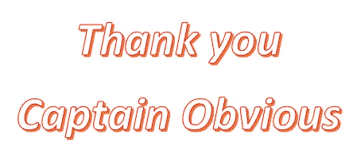

不幸的是，原创迷因需要许可证(图片由作者提供)

我们可以计算一下我们的损失，然后试着退回一部分。这种策略比留住客户的成本更高。客户保留是指公司将客户转化为回头客并防止他们流失的能力。

以下是我们从数据中获得的信息示例(参见[之前的分析](/marketing-automation-customer-segmentation-5924b45556b5)):

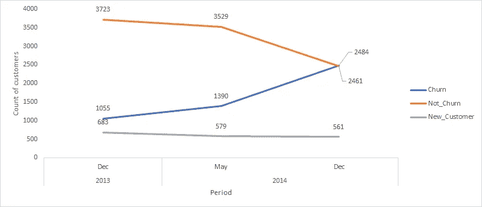

基于规则的客户流失分析(图片由作者提供)

我们也可以计算平均货币损失。要做到这一点，我只需将平均购买量乘以他们必须购买的时间。

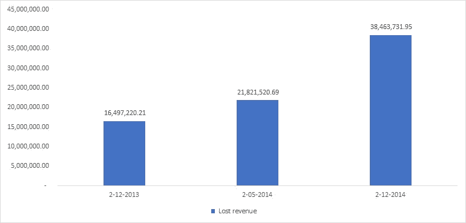

规则库收入损失(作者图片)

要使用这种策略，我们需要定义有流失风险的客户，在这种情况下，我们需要预测未来一段时间的流失概率。这样的策略让我们有时间对有风险的客户采取一些行动，以防止他们流失。

## **数据科学的时代到了。**

第一种方法，我想称之为**买到死**。

购买到死(BTYD)类统计模型旨在捕捉非合同客户的行为特征，或者当公司无法直接观察到客户何时不再是某个品牌的客户时。目标通常是对客户流失和客户终身价值进行建模和预测。

BTYD 模型共同模拟两个过程:

1.  重复购买过程，解释了客户在“活着”时购买的频率；
2.  流失过程，模拟客户在任何给定时间段内流失的可能性。

BTYD 模型的常见版本包括:

*   帕累托/NBD 模型，将退出过程建模为[帕累托二型分布](https://en.wikipedia.org/wiki/Lomax_distribution)，将购买频率过程建模为[负二项分布](https://en.wikipedia.org/wiki/Negative_binomial_distribution)
*   贝塔-几何/贝塔-二项式模型将退出过程建模为具有[贝塔](https://en.wikipedia.org/wiki/Beta_distribution)混合分布的[几何分布](https://en.wikipedia.org/wiki/Geometric_distribution)，并将客户是否在一段时间内购买建模为具有[贝塔](https://en.wikipedia.org/wiki/Beta_distribution)混合分布的[二项式分布](https://en.wikipedia.org/wiki/Binomial_distribution)。

在我的实验中，我将使用 [lifetime 的](https://pypi.org/project/Lifetimes/)包。

我将训练 BG/NBD 模型来估计给定时间段内的预期销售额，例如未来半年(180 天)。

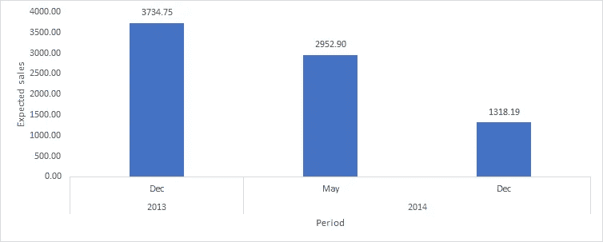

未来 6 个月的预期购买数量(图片由作者提供)

因此，我们可以看到未来 6 个月预期销售额的下降趋势。我们来分析一下每个时间段的存活(流失)概率。

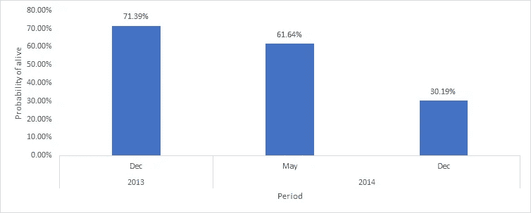

活着的概率(图片由作者提供)

同样的情况——我们的客户存活的可能性在下降。这个指标在动态分析中非常有用，因为在两个时间段之后，我们可以找到这个指标下降的地方，并开始采取一些措施来保持客户端。

比如我们拿两个客户来做这样的分析。

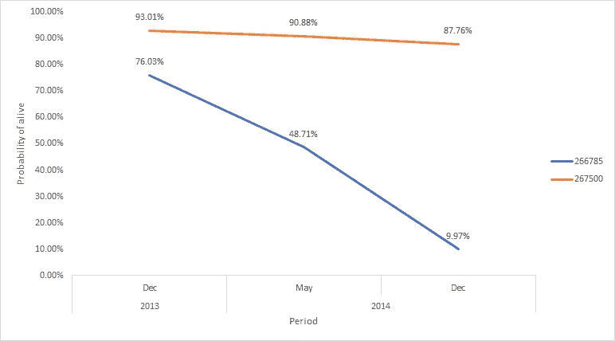

两个不同客户的存活概率(图片由作者提供)

橙色顾客存活的概率会略微下降，但蓝色顾客存活的概率会大幅下降。我们可以对 CRM 中的每个客户进行这样的分析，并配置一个触发器，在降幅巨大时向我们发出信号。

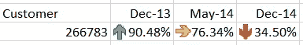

CRM 中的 Alam 示例(图片由作者提供)

更重要的是 CLTV。顾客终身价值是指顾客作为付费顾客的整个过程中会给你的品牌带来多少钱。一目了然，CLTV 告诉你一个客户对你的品牌有多大价值，并让你洞察他们的整体价值。从那以后，你会更好地理解你应该在留住客户上投资多少。

客户终身价值提示你是否可以期望某些客户成为回头客。如果他们的客户终身价值很高，他们很可能是你品牌的粉丝，会继续购买你的产品。如果没有，他们可能只是一个被动的客户，只购买了一次，需要付出额外的努力才能再次参与进来。

让我们分析一下 CLTV 分布。

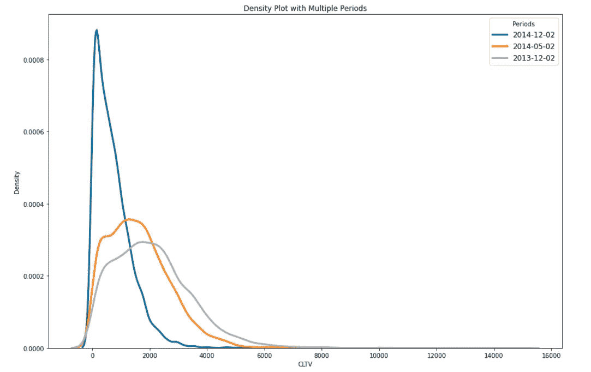

CLTV 各时期的密度图(图片由作者提供)

我们可以看到，我们失去了 CLTV，这意味着我们失去了他们对我们品牌/商店的忠诚度。

我们可以为每个客户分析同样的事情:

客户的 CLTV 分析(图片由作者提供)

正如你所看到的，BTYD 算法非常好，它可以提供基于新近性、频率和货币的广泛的客户分析，但这也是这种方法的弱点。

让我们使用一些机器学习算法来预测未来 6 个月的客户流失。在这个实验中，我将使用 sci-kit-learn 中的 XGBoost。

因此，我可以分析变量的重要性，这将有助于我确定为什么客户想要离开。

我有在客户细分期间准备的所有数据，这将是我的特征，1- P(活跃)将是我的标签。以下是我在模型训练期间使用数据以避免数据泄漏的策略。

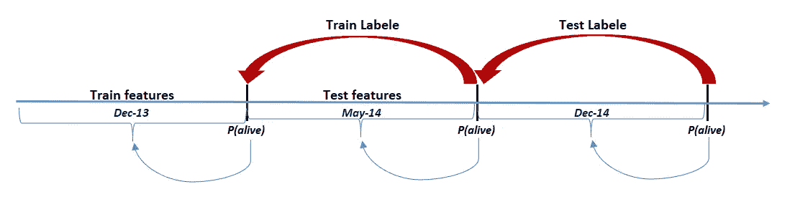

用于训练的数据(图片由作者提供)

同样，让我们检查我们的特征和目标之间的相关性。我将展示直接和间接相关的 10 大特征。

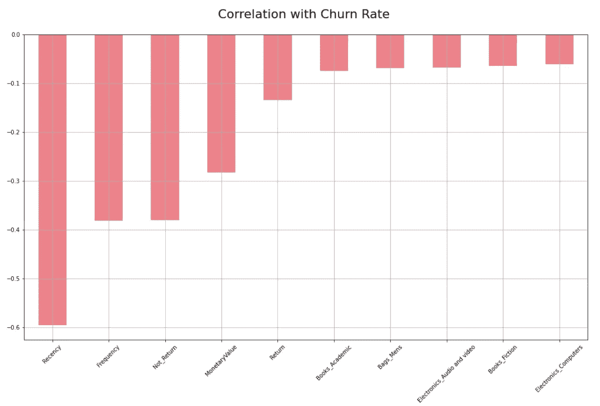

间接相关(图片由作者提供)

这些特征告诉我们，这些特征越大，我们流失的可能性就越小。这只是线性依赖，但有时很有趣。

例如，在这张图表上，你可以看到顾客在每个男包上花费的金额越大，流失的可能性就越小。

让我们分析同样的，但直接相关。

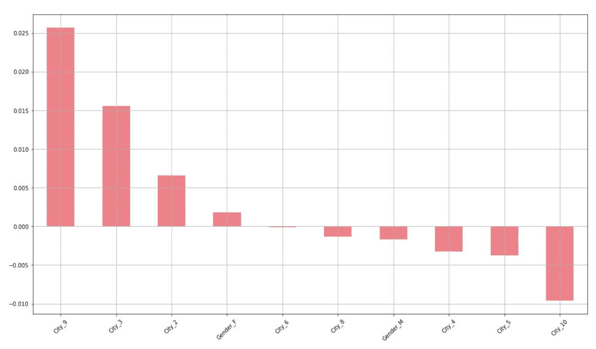

直接相关(图片由作者提供)

最有趣的是，在我们的案例中，只有一些城市与客户流失有直接关联。

好了，让我们建立模型并分析特征的重要性。

我将训练 XGBoost 回归模型来预测下一期的流失概率。这将是一个非常简单的模型，只显示功能和最有趣的特性的重要性。

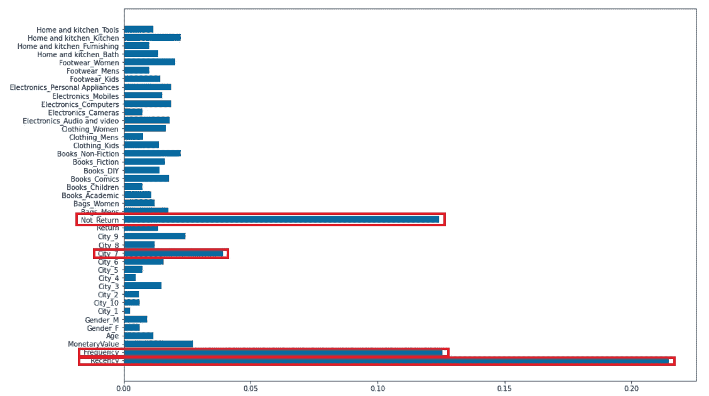

XGBoost 功能重要性(图片由作者提供)

通常，重要性提供了一个分数，该分数指示每个特征在模型内的增强决策树的构造中有多有用或有价值。在决策树中，一个属性被用来做关键决策的次数越多，它的相对重要性就越高。

一个更有趣的方法是用 SHAP 值计算重要性。

在 Xgboost 中计算特性重要性的方法是使用 [SHAP](https://github.com/slundberg/shap) 包。它与模型无关，并使用博弈论中的 Shapley 值来估计每个特征对预测的贡献。

对模型输出幅度的平均影响(图片由作者提供)

这将获取整个数据集的 SHAP 值的平均值，并将其绘制为一个简单的条形图。

让我们继续，让 SHAP 总结剧情。

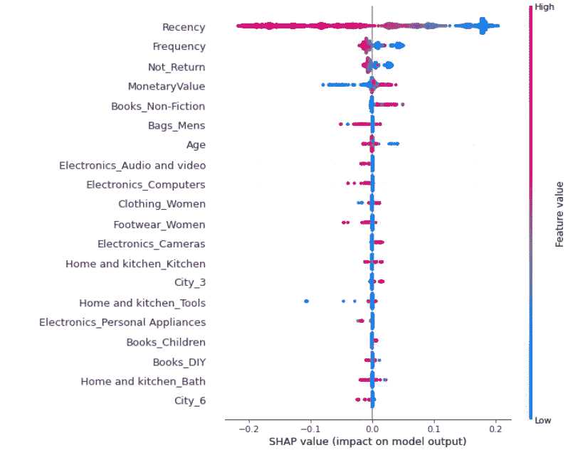

SHAP 摘要图(图片由作者提供)

我们没有使用典型的要素重要性条形图，而是使用每个要素的 SHAP 值的密度散点图来确定每个要素对验证数据集中个体的模型输出的影响程度。要素按所有样本的 SHAP 量值总和排序。有趣的是，关系特征比资本收益特征具有更大的总体模型影响，但是对于那些资本收益很重要的样本来说，它比年龄具有更大的影响。换句话说，资本收益对少数预测的影响很大，而年龄对所有预测的影响较小。

请注意，当散点不在一条线上时，它们会堆积起来以显示密度，每个点的颜色代表该个体的特征值。

此外，我想绘制 SHAP 瀑布。

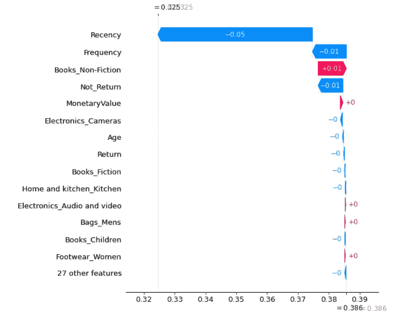

SHAP 瀑布(作者图片)

瀑布图旨在直观地显示每个特征的 SHAP 值(证据)如何将模型输出从背景数据分布下的先前预期移动到给定所有特征证据的最终模型预测。当模型中的要素数量超过 max_display 参数时，要素按其 SHAP 值的大小排序，最小大小的要素组合在一起，位于图的底部。

好的，正如你所看到的，我的模型非常简单，所以很少有关于特征重要性的见解。为了使这种分析更有趣，我们需要一个更复杂的模型和更广泛的特性。

# 结论

因此，正如你所看到的，这些方法是一个强大的工具，可以帮助你预测客户流失，并且解释为什么你的客户流失。

识别对提供的解决方案不满意的客户的能力使企业能够了解产品或定价计划的弱点、运营问题以及客户的偏好和期望，从而主动减少客户流失的原因。

最后，再一次说明客户流失的重要性:

首先，一个被激怒的顾客很可能是一个不快乐的顾客。除了损失他们的消费，你还可能受到负面口碑、差评的影响，从而损害你的整体品牌价值。仅仅因为这个原因，就有必要联系那些处于危险中的客户，尝试修复关系。

其次，人们常说，保持现有客户比获得新客户成本更低，价值更高。关于这一点的统计数据和数字各不相同，有些人认为客户终身价值比获得或保留等单一成本维度更重要，但无论从哪个角度看，维持现有关系通常比放弃并从头开始更有意义。

你能在 Git 仓库中找到的所有代码— [链接](https://github.com/AndriiShchur/Marketing-automation)。